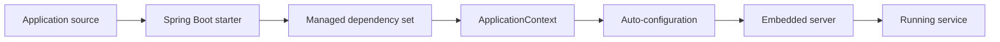
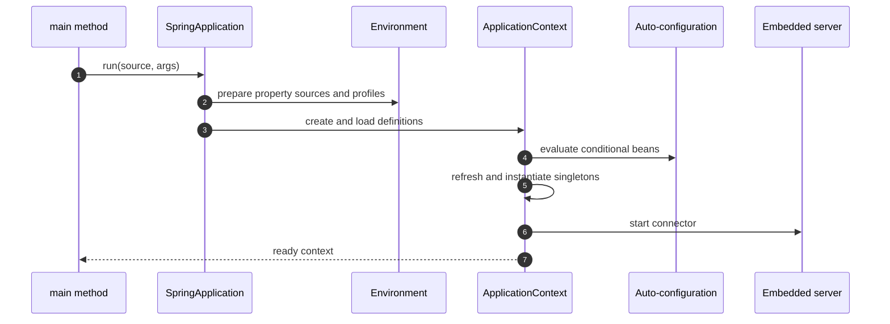
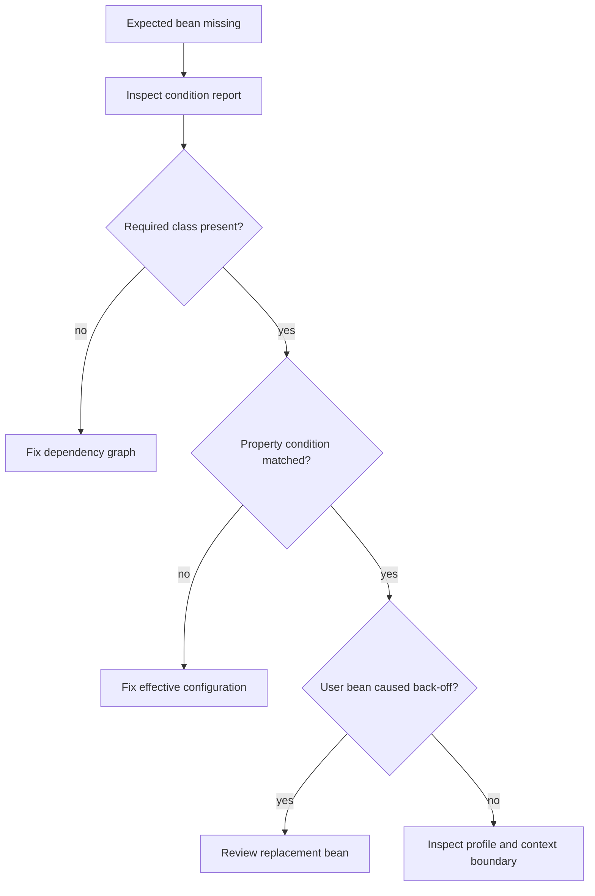

# Spring Boot Internals, Auto-Configuration, and Production Configuration

Spring Boot turns a Spring application from a manually assembled container into an executable, convention-driven service.
It does not replace Spring: it chooses sensible defaults, connects infrastructure through conditional configuration, and gives the application an operational lifecycle.
Interviewers ask about Boot internals because production failures often sit behind a convenient annotation or property.

---

## 🟢 Beginner Level

### Spring Framework versus Spring Boot

The Spring Framework supplies dependency injection, application contexts, transactions, web frameworks, data access, and integration abstractions.

Spring Boot adds an opinionated assembly layer around those capabilities.

It selects compatible dependency versions, discovers configuration, starts an embedded server, and exposes operational hooks.

Boot reduces setup work; it does not remove the need to understand the container.

| Concern | Spring Framework | Spring Boot |
|---|---|---|
| Dependency injection | Core capability | Uses the same container |
| Dependency versions | Application chooses | Dependency management supplies a tested set |
| Web server | Often deployed separately | Embedded server supported by default |
| Configuration | Explicit bean definitions | Explicit beans plus conditional defaults |
| Operations | Separate integration | Actuator and externalized configuration conventions |

The useful mental model is “Spring plus an executable application bootstrap and a set of conditional recipes.”



### Starters are curated dependency entry points

A starter is a small dependency descriptor for a capability such as web, validation, data JPA, or security.

`spring-boot-starter-web` brings the MVC stack, JSON support, logging integration, and an embedded servlet container.

The starter does not contain the entire framework.

It points Maven or Gradle at a compatible dependency graph.

Spring Boot's dependency management controls versions so libraries are tested together.

Applications can override a version, but then they own the compatibility risk.

```xml
<dependency>
    <groupId>org.springframework.boot</groupId>
    <artifactId>spring-boot-starter-web</artifactId>
</dependency>
```

Choose starters by capability, not by copying every starter from another service.

An unnecessary starter can activate classpath conditions, expand the attack surface, and increase startup work.

### `@SpringBootApplication` is a composed annotation

`@SpringBootApplication` combines three ideas:

The SpringBootApplication marker is therefore the conventional root of a Boot service.

- `@SpringBootConfiguration`, which marks the primary configuration class.
- `@EnableAutoConfiguration`, which imports Boot's conditional configuration mechanism.
- `@ComponentScan`, which discovers components below the application's package.

```java
@SpringBootApplication
public class BillingApplication {
    public static void main(String[] args) {
        SpringApplication.run(BillingApplication.class, args);
    }
}
```

Place this class in a root package above controllers, services, repositories, and configuration.

Putting it in a narrow child package can make component scanning miss beans.

Broad scanning from a common corporate root can discover unrelated test or library components.

Explicit scan boundaries make large modular applications easier to reason about.

### Externalized configuration

Configuration changes behavior without rebuilding the application artifact.

Spring Boot reads property sources with a defined precedence.

Typical sources include packaged defaults, profile files, environment variables, system properties, and command-line arguments.

Later, higher-precedence sources can override earlier values.

```yaml
server:
  port: 8080
payment:
  timeout: 750ms
  retry-limit: 2
```

Properties files express the same keys in dotted form.

YAML is convenient for hierarchy, while `.properties` makes every complete key visible.

Neither format is inherently safer.

Secrets should come from a secret manager or protected runtime injection, not a committed configuration file.

---

## 🟡 Intermediate Level

### Spring Boot startup, auto-configuration, and profiles

`SpringApplication.run` first determines the application type, prepares bootstrap listeners, and constructs an environment.

It then creates the appropriate `ApplicationContext`, loads bean definitions, refreshes the context, and invokes runners.

For a servlet application, refresh starts the embedded server as part of context initialization.



Startup events allow infrastructure to observe phases, but application logic should usually live in beans rather than listeners.

`ApplicationRunner` and `CommandLineRunner` execute after the context is ready.

Long runner work delays readiness and can cause orchestrators to restart a healthy process.

### How auto-configuration makes decisions

Auto-configuration classes declare ordinary Spring beans guarded by conditions.

Common conditions test whether a class is present, a bean is absent, a property has a value, or the application is a web application.

The “back off” rule is central: a default bean is commonly created only when the application has not supplied one.

```java
@Configuration(proxyBeanMethods = false)
@ConditionalOnClass(DataSource.class)
@ConditionalOnMissingBean(DataSource.class)
class ExampleDataSourceAutoConfiguration {
    @Bean
    DataSource dataSource(DatabaseProperties properties) {
        return properties.createDataSource();
    }
}
```

This is why defining an application bean can replace a Boot default without disabling the entire subsystem.

`@EnableAutoConfiguration` imports candidate configurations listed in Boot metadata.

Conditions are evaluated and recorded in a condition evaluation report.

Run with debug logging or inspect Actuator conditions when a bean appears or disappears unexpectedly.

### Component scanning and configuration classes

Component scanning finds stereotype-annotated classes such as `@Component`, `@Service`, `@Repository`, and `@Controller`.

`@Configuration` classes contribute explicit `@Bean` methods.

Explicit bean methods are appropriate when creating third-party types or when construction needs application decisions.

Constructor injection makes required dependencies visible and testable.

Avoid using field injection as a shortcut for unclear ownership.

`proxyBeanMethods = false` avoids subclass interception when configuration methods do not call one another to obtain managed singletons.

Full configuration proxying is useful only when inter-bean method calls require container semantics.

### Embedded server lifecycle

The servlet web application context locates a `ServletWebServerFactory`.

The default web starter commonly supplies a Tomcat factory, while dependencies can select Jetty or Undertow.

Boot creates the server, registers the servlet context, starts network connectors, and publishes the effective port.

The server is part of the application lifecycle rather than a separately deployed container.

This simplifies packaging but makes graceful shutdown and thread ownership application concerns.

On shutdown, readiness should fail first, new traffic should stop, active requests should drain, and resources should close.

An embedded server is still a real server with accept queues, worker threads, connection limits, and timeouts.

### Type-safe configuration properties

`@ConfigurationProperties` binds related properties into a typed object.

It centralizes validation and avoids scattering string keys across `@Value` fields.

```java
@ConfigurationProperties("payment")
@Validated
public record PaymentProperties(
        @NotNull Duration timeout,
        @Min(0) int retryLimit) {}
```

Registration can use configuration-properties scanning or `@EnableConfigurationProperties`.

Binding reports invalid values during startup instead of allowing a failure on the first request.

Use duration and data-size types so units are explicit.

Do not store mutable credentials in a widely shared configuration object.

### Profiles select environments, not arbitrary feature logic

A profile activates profile-specific property documents and may guard bean definitions with `@Profile`.

Profiles work well for broad environment differences such as local infrastructure versus production integration.

They become difficult to reason about when every feature combination creates another profile name.

Prefer normal properties and conditional configuration for independent feature switches.

The active profile is itself external configuration.

Never rely on a profile name as an authorization boundary.

### Worked startup budget

Assume a service has a 6-second readiness budget.

Environment preparation takes 180 ms, classpath scanning 420 ms, bean creation 1,650 ms, database validation 900 ms, server startup 350 ms, and an `ApplicationRunner` import takes 3,100 ms.

The total is:

$$180 + 420 + 1650 + 900 + 350 + 3100 = 6600\text{ ms}$$

The service misses readiness by 600 ms even though the container itself starts in 3,500 ms.

Moving the import to an asynchronous, observable job reduces initial readiness to 3,500 ms.

The trade-off is that endpoints depending on imported data must expose an explicit “not ready for this operation” state.

Measure startup phases before disabling validation or lazy-initializing every bean.

---

## 🔴 Expert Level

### Conditional configuration failure analysis

Classpath, property, bean, and environment conditions interact.

A missing auto-configured bean is usually not fixed by adding `@Bean` blindly.

First inspect the condition report, effective properties, active profiles, and user-defined replacement beans.



Test auto-configuration with a small context runner so each condition is deterministic.

Avoid depending on accidental classpath order.

### Configuration precedence and deployment safety

Operators need to know which source won, but logs must not reveal secrets.

Expose sanitized configuration metadata and record the configuration version or deployment revision.

Environment variables are convenient in containers but flatten names and can be difficult to audit.

Mounted configuration files preserve structure but need atomic replacement and reload semantics.

Central configuration services introduce network and bootstrap dependencies.

Fail fast for missing required properties.

Choose safe defaults only when the default cannot weaken security or durability.

### Startup, readiness, and failure containment

Liveness answers whether the process should be restarted.

Readiness answers whether it should receive traffic.

A temporary downstream outage should often remove readiness without forcing a restart loop.

Startup probes protect slow initialization from premature liveness failures.

Graceful shutdown needs a time budget greater than the longest accepted request or job checkpoint.

Background executors must participate in shutdown rather than keeping non-daemon threads alive.

### Native images and AOT awareness

Ahead-of-time processing shifts some classpath analysis from runtime to build time.

Reflection, dynamic resources, serialization, and proxies may require generated hints.

Native images can improve startup time and memory footprint.

They also change build complexity, peak throughput characteristics, and debugging workflows.

Choose AOT because measured deployment constraints justify it, not because startup speed is fashionable.

### Common Misconceptions

- **“Spring Boot is a different framework from Spring.”** Boot assembles and configures Spring Framework capabilities; the same container and bean lifecycle remain underneath.

- **“Auto-configuration always overrides application beans.”** Most defaults use missing-bean conditions and deliberately back off when the application supplies a replacement.

- **“A starter is a code generator.”** A starter primarily declares a curated dependency set; auto-configuration reacts to the resulting classpath and properties.

- **“Profiles are a security mechanism.”** Profiles select configuration and beans. Authorization must still be enforced by security controls.

- **“Embedded means lightweight or unlimited.”** Embedded Tomcat, Jetty, or Undertow has real thread, queue, connection, and timeout constraints.

### Interview Questions

**Q1. What problem does Spring Boot solve beyond the Spring Framework?** `[easy]`

Spring Boot supplies executable bootstrap conventions, managed dependencies, auto-configuration, and operational integration around Spring. It reduces repetitive assembly while retaining the same IoC container and framework APIs. The trade-off is that developers must understand conditional defaults when production behavior differs from expectations.

**Q2. What does `@SpringBootApplication` combine?** `[easy]`

It combines Boot configuration, auto-configuration enablement, and component scanning. Those roles establish the primary source, import conditional defaults, and discover application components. Its package location therefore affects what the application can see.

**Q3. What is a Spring Boot starter?** `[easy]`

A starter is a curated dependency entry point for a capability such as web or data access. Boot dependency management supplies compatible versions for the graph it brings in. Adding a starter can also activate auto-configuration, so unused starters have behavioral and security costs.

**Q4. Why prefer `@ConfigurationProperties` over many `@Value` fields?** `[easy]`

Configuration properties group related settings into a typed, validated contract. Binding errors can stop startup with a precise message instead of failing during a request. `@Value` remains useful for isolated values, but scattered keys are harder to discover and test.

**Q5. How does auto-configuration decide whether to create a bean?** `[medium]`

It evaluates conditions over the classpath, existing beans, properties, application type, and other environment facts. Defaults commonly use a missing-bean condition so application configuration can replace them. The condition evaluation report explains which condition matched or failed.

**Q6. Why can component scanning miss a controller?** `[medium]`

The default scan begins at the package containing the application configuration class and descends into child packages. A controller in a sibling or parent package is therefore outside the boundary. Moving the application class, importing configuration explicitly, or defining deliberate scan packages resolves the ownership issue.

**Q7. Describe the embedded server startup lifecycle.** `[medium]`

Boot creates a web application context, obtains a server factory, registers web components, and starts network connectors during context refresh. The server then shares application lifecycle, configuration, metrics, and shutdown behavior. Failures in web bean creation can prevent the connector from becoming ready even when the process exists.

**Q8. How should profiles be used?** `[medium]`

Profiles are appropriate for coherent environment-level configuration differences. Independent features are usually clearer as named properties with conditional beans. A large matrix of profile combinations makes effective configuration difficult to predict and test.

**Q9. A production bean is missing although its starter is installed. What do you inspect?** `[medium]`

Inspect the condition evaluation report, active profiles, effective properties, required classes, and existing beans that may trigger back-off. Confirm the bean lives in the expected application context and that exclusions did not disable its auto-configuration. Adding a manual bean before finding the failed condition can hide a dependency or configuration defect.

**Q10. How does property precedence affect incident diagnosis?** `[medium]`

The same key can exist in packaged defaults, profile files, environment variables, system properties, and command-line arguments. The highest-precedence source wins, so reading only `application.yml` may show the wrong value. Diagnostics should expose the winning source safely while sanitizing credentials and tokens.

**Q11. A service repeatedly fails Kubernetes liveness while its database is briefly unavailable. What is wrong?** `[hard]`

The application has likely treated a dependency-readiness failure as proof that the process is dead. Database health should normally affect readiness, while liveness should detect an unrecoverable process state. Separating probes prevents restarts from amplifying a temporary downstream outage.

**Q12. Why can an `ApplicationRunner` be dangerous?** `[hard]`

Runners execute after context creation but still delay the completion observed by deployment tooling. Long imports or remote calls can exceed startup budgets and create restart loops. Move durable work to a restartable job or expose explicit readiness for data-dependent operations.

**Q13. When would you disable an auto-configuration?** `[hard]`

Disable it when the capability is intentionally absent or the application owns a complete alternative that cannot coexist safely. Prefer a targeted exclusion and document the replacement rather than disabling broad groups. Verify that transitive starters do not reintroduce a second competing configuration path.

**Q14. What trade-offs come with Spring AOT and native images?** `[hard]`

AOT can reduce runtime discovery work, while native images can improve startup time and footprint. Closed-world analysis requires reflection, proxy, serialization, and resource metadata to be known at build time. The correct choice depends on measured cold-start, memory, throughput, build-time, and observability requirements.

### Further Reading

- [Spring Boot reference: using auto-configuration](https://docs.spring.io/spring-boot/reference/using/auto-configuration.html)
- [Spring Boot reference: externalized configuration](https://docs.spring.io/spring-boot/reference/features/external-config.html)
- [Spring Boot reference: embedded web servers](https://docs.spring.io/spring-boot/reference/web/servlet.html#web.servlet.embedded-container)
- [Spring Boot API: `SpringApplication`](https://docs.spring.io/spring-boot/api/java/org/springframework/boot/SpringApplication.html)
