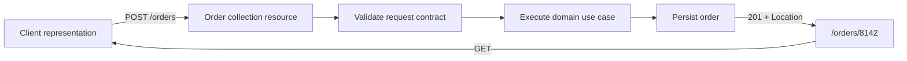
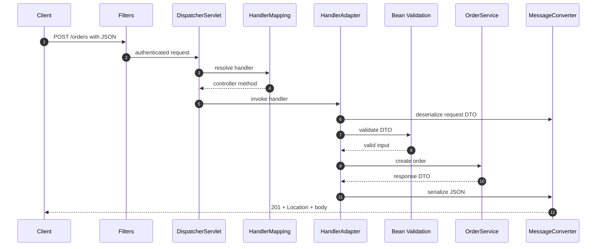
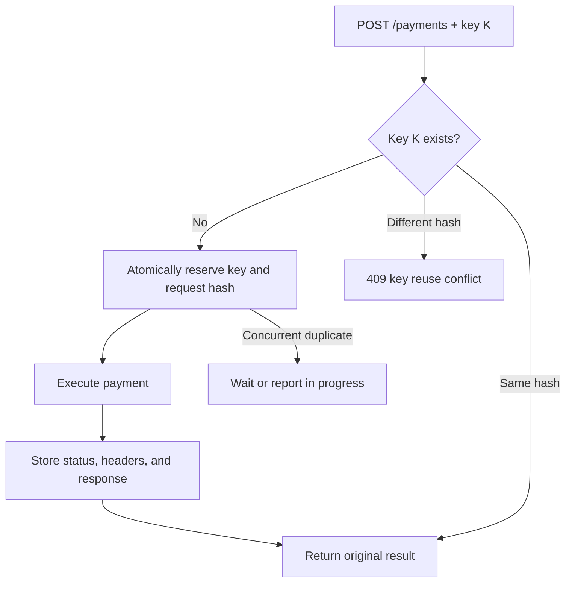
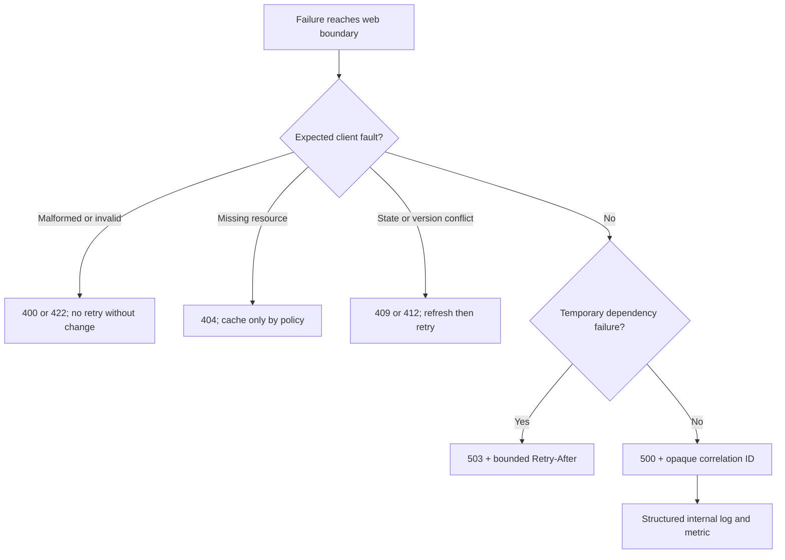

# Spring REST API Design, Validation & Error Contracts

A REST API turns domain capabilities into stable HTTP resource contracts that clients can understand without sharing the server's implementation. In a Spring Boot service, that contract spans URI and method design, Spring MVC argument binding, validation, status codes, pagination, and predictable failure responses. Interviewers use this topic to distinguish annotation familiarity from the engineering judgement required to evolve production APIs safely.

---

## 🟢 Beginner Level

### REST API design, validation, and error contracts

**Representational State Transfer (REST)** is an architectural style for networked systems. A REST API models business concepts as **resources**, identifies them with URIs, transfers representations such as JSON, and uses HTTP semantics instead of inventing a new verb vocabulary.

For an ordering domain, useful resources include:

- `/orders` — the order collection.
- `/orders/8142` — one order identified by `8142`.
- `/orders/8142/items` — items belonging to that order.
- `/customers/93/orders` — a scoped view of a customer's orders.

Resource names are normally plural nouns. A command-shaped URI such as `/createOrder` duplicates semantics that HTTP POST already supplies, while `/orders` gives clients a durable domain identity independent of a controller method name.

REST does not mean "JSON over HTTP" alone. Its constraints include a client-server boundary, stateless requests, cacheable responses where appropriate, a uniform interface, and a layered system. A client request must therefore carry all information needed to process it; conversational server state should not be hidden between unrelated requests.



The contract includes success and failure shapes. Validation rejects structurally valid JSON that violates input rules, while a stable error contract tells every client how to locate the failure, identify its type, and decide whether retrying is safe.

### Resources, representations, and URI boundaries

A **resource** is the conceptual entity exposed by the API; a **representation** is one serialized view of it. The database row, JPA entity, and JSON response are not necessarily identical because each serves a different boundary.

Suppose an internal `Order` entity contains a fraud score, supplier cost, row version, and audit timestamps. Returning that entity directly accidentally publishes sensitive fields and couples clients to persistence decisions. A response DTO can expose `id`, `status`, `items`, and `total` while the entity evolves independently.

Good URI design follows several rules:

1. Use identifiers, not mutable display names: `/users/248`, not `/users/alice-smith`.
2. Keep nesting shallow; `/customers/93/orders/8142/items/7/options` signals that separate top-level resources may be clearer.
3. Use query parameters for views of a collection: `/orders?status=PAID&sort=-createdAt`.
4. Do not encode response formats or implementation classes in a URI.
5. Treat a URI as a long-lived public identifier once external clients adopt it.

A nested URI expresses context, not database ownership. `/customers/93/orders/8142` should verify that order `8142` belongs to customer `93`; otherwise the extra path segment is misleading.

### HTTP methods and their intended semantics

HTTP methods describe the requested operation on a resource. Choosing the correct method lets browsers, gateways, caches, retries, and monitoring tools reason about traffic.

| Method | Typical resource action | Safe | Idempotent | Common success |
|---|---|---:|---:|---|
| GET | Read one resource or collection | Yes | Yes | `200 OK` |
| POST | Create a child or submit a non-idempotent command | No | No by default | `201 Created` or `202 Accepted` |
| PUT | Replace a resource at a known URI | No | Yes | `200 OK` or `204 No Content` |
| PATCH | Apply a partial modification | No | Depends on patch document | `200 OK` or `204 No Content` |
| DELETE | Remove the current representation | No | Yes | `204 No Content` |

A **safe** method is intended not to change server state. Logging and metrics may still change, but GET must not charge a card or delete an account because link prefetchers and crawlers can issue it automatically.

An **idempotent** operation has the same intended server effect when repeated. Two identical PUT requests should leave one final representation, and repeated DELETE requests leave the resource absent even if later responses differ between `204` and `404`. POST needs an explicit idempotency strategy when clients may retry after a timeout.

PATCH semantics depend on the media type. A JSON Merge Patch that sets `status` to `CANCELLED` can be idempotent, whereas a custom patch that increments `quantity` is not.

### Spring MVC controllers and request mapping

Spring MVC routes HTTP requests through the DispatcherServlet to a matching controller method. The RestController stereotype combines controller discovery with response-body serialization, while RequestMapping establishes a shared path or media-type contract.

```java
@RestController
@RequestMapping(path = "/api/v1/orders", produces = MediaType.APPLICATION_JSON_VALUE)
class OrderController {
    private final OrderService orderService;

    OrderController(OrderService orderService) {
        this.orderService = orderService;
    }

    @GetMapping("/{orderId}")
    ResponseEntity<OrderResponse> find(@PathVariable long orderId) {
        return ResponseEntity.ok(orderService.find(orderId));
    }

    @PostMapping(consumes = MediaType.APPLICATION_JSON_VALUE)
    ResponseEntity<OrderResponse> create(
            @Valid @RequestBody CreateOrderRequest request) {
        OrderResponse created = orderService.create(request);
        URI location = URI.create("/api/v1/orders/" + created.id());
        return ResponseEntity.created(location).body(created);
    }
}
```

The focused mapping annotations are GetMapping, PostMapping, PutMapping, PatchMapping, and DeleteMapping. They are specializations of RequestMapping and make each endpoint's HTTP intent visible during review.

The controller should translate transport input into an application use case, not implement pricing rules or database transactions. Keeping it thin makes HTTP tests focused and allows the same service use case to be called from messaging or batch adapters.

### Binding path, query, header, and body input

Spring binds different parts of a request with distinct annotations:

- **PathVariable** binds identity encoded in the URI, such as `orderId`.
- **RequestParam** binds optional collection controls such as `page`, `size`, or `status`.
- **RequestHeader** binds protocol metadata such as `If-Match` or an idempotency key.
- **RequestBody** delegates JSON deserialization to an HTTP message converter.
- **ResponseEntity** lets the controller control status, headers, and the response DTO together.

```java
@GetMapping
ResponseEntity<PageResponse<OrderSummary>> search(
        @RequestParam(defaultValue = "0") int page,
        @RequestParam(defaultValue = "20") int size,
        @RequestParam(required = false) OrderStatus status,
        @RequestParam(defaultValue = "createdAt,desc") String sort) {
    return ResponseEntity.ok(orderService.search(page, size, status, sort));
}
```

Do not use RequestBody on GET merely to carry a complex filter. Some clients, proxies, and caches do not support GET bodies consistently; query parameters or a documented POST search resource are more interoperable.

---

## 🟡 Intermediate Level

### DTOs and boundary validation

A **Data Transfer Object (DTO)** defines input or output at the HTTP boundary. Separate request and response DTOs make mutability and ownership explicit: a create request has client-settable fields, while a response adds server-generated identity and timestamps.

```java
public record CreateOrderRequest(
        @NotNull Long customerId,
        @NotEmpty List<@Valid OrderItemRequest> items,
        @Size(max = 500) String note) {
}

public record OrderItemRequest(
        @NotNull Long productId,
        @Min(1) @Max(100) int quantity) {
}

public record OrderResponse(
        long id,
        String status,
        BigDecimal total,
        Instant createdAt) {
}
```

Jakarta Bean Validation provides declarative structural checks. Valid on the controller argument triggers recursive validation before the method body runs, and Valid on nested collection elements applies rules inside each item.

Validation belongs at more than one layer:

| Concern | Correct boundary | Example |
|---|---|---|
| JSON shape and scalar limits | Request DTO validation | Quantity must be from 1 through 100 |
| Cross-field request rule | Class-level validator | `startAt` must precede `endAt` |
| Current business state | Domain/service | Product must be orderable now |
| Referential and uniqueness safety | Database constraint | Idempotency key must be unique |
| Authorization | Security/application boundary | Caller may access customer 93 |

Bean Validation cannot safely decide whether inventory exists because that requires mutable external state. Such a check belongs in the use case and must be protected against a race by a transaction, constraint, or atomic update.

Never echo rejected values containing passwords, tokens, or personal data in an error response. Validation messages should identify the field and rule without leaking confidential input.

### Request execution and response negotiation

Spring MVC performs a deterministic pipeline around the controller:



Content negotiation uses request headers and mapping metadata. `Content-Type` describes the request body's representation, while `Accept` describes response formats the client can consume. A server may return `415 Unsupported Media Type` for an unacceptable request body and `406 Not Acceptable` when it cannot produce any requested representation.

ResponseEntity is useful when status or headers vary. A plain DTO is sufficient for an invariant `200` response, but creation needs `201 Created` and a `Location` header, conditional updates need `ETag`, and asynchronous work needs `202 Accepted` plus a status URI.

### Status codes as part of the contract

Status codes are machine-readable outcome categories, not decorative labels:

- `200 OK` — successful read or update with a representation.
- `201 Created` — a new resource exists; include its `Location`.
- `202 Accepted` — work was queued but is not complete.
- `204 No Content` — success with deliberately no response body.
- `400 Bad Request` — malformed syntax or invalid request values.
- `401 Unauthorized` — authentication is missing or invalid.
- `403 Forbidden` — identity is known but lacks permission.
- `404 Not Found` — resource is absent or intentionally concealed.
- `409 Conflict` — request conflicts with current resource state.
- `412 Precondition Failed` — an `If-Match` version condition failed.
- `422 Unprocessable Content` — syntax is valid but domain semantics fail, if chosen consistently.
- `429 Too Many Requests` — rate limit exceeded; `Retry-After` can guide retry.
- `500 Internal Server Error` — an unexpected server defect, not a client mistake.
- `503 Service Unavailable` — temporary inability to serve, often safe to retry with backoff.

Do not always return `200` with `{ "success": false }`. That hides failure from HTTP clients, monitoring, caches, and retry middleware, forcing every consumer to understand a proprietary envelope.

### Pagination, sorting, and filtering

Unbounded collection endpoints create unpredictable memory, database, serialization, and network costs. A page contract should state its indexing convention, maximum size, sort syntax, default ordering, and stability guarantees.

**Offset pagination** uses page/size or offset/limit. It is easy to expose and supports jumping to page 20, but large offsets make the database scan and discard rows, and concurrent inserts can shift results between requests.

**Cursor pagination** uses a stable ordered key from the last item, such as `(createdAt, id)`. It scales well and resists shifting, but cannot jump directly to an arbitrary page and requires an opaque cursor contract.

| Property | Offset pagination | Cursor pagination |
|---|---|---|
| Request | `?page=4&size=25` | `?after=encoded-cursor&limit=25` |
| Random page access | Straightforward | Not natural |
| Deep-page database cost | Often grows with offset | Approximately constant with index |
| Concurrent insert stability | May duplicate or skip rows | Stable with deterministic keyset |
| Required order | Recommended | Mandatory and unique |

Allow-list sortable and filterable fields instead of copying arbitrary query text into SQL. A request such as `sort=customer.passwordHash` can expose data semantics, and unsanitized dynamic field names can become injection vectors.

Always add a deterministic tie-breaker. Sorting only by `createdAt` is unstable when several rows share the same timestamp; sorting by `createdAt DESC, id DESC` yields a total order.

### Worked example: page cost and response metadata

Assume an order table contains 1,000,000 rows, a client asks for page 40 with `size=25`, and page numbering starts at zero.

The first requested row is:

$$
\text{offset} = \text{page} \times \text{size} = 40 \times 25 = 1{,}000
$$

The final zero-based row index examined for that page is $1{,}000 + 25 - 1 = 1{,}024$. If a count query reports 1,000,000 matching rows, total pages are:

$$
\left\lceil \frac{1{,}000{,}000}{25} \right\rceil = 40{,}000
$$

A response can publish the calculation without exposing Spring Data's internal `Page` type:

```json
{
  "items": [
    { "id": 8142, "status": "PAID", "total": 129.50 }
  ],
  "page": 40,
  "size": 25,
  "totalElements": 1000000,
  "totalPages": 40000,
  "sort": ["createdAt,desc", "id,desc"]
}
```

Now compare a deep request at page 30,000. Its offset is $30{,}000 \times 25 = 750{,}000$, so even an index scan may walk past three quarters of a million entries before returning 25. A cursor query using `WHERE (created_at, id) < (:time, :id) ORDER BY created_at DESC, id DESC LIMIT 25` seeks into the composite index and reads roughly the next 25 entries.

Counting can also dominate latency. If clients only need to know whether another page exists, fetch `size + 1` rows and return `hasNext`; avoid an expensive exact count over a complicated filter.

### PUT, PATCH, idempotency keys, and concurrency

PUT conventionally replaces the complete resource representation at a known URI. PATCH applies a partial change, but omitted fields must be distinguished from explicit `null`; otherwise the server cannot tell "leave unchanged" from "clear this value."

Payment and order creation requests are often retried because the client cannot know whether a timed-out response was processed. An `Idempotency-Key` header lets the server associate the caller and key with the first request fingerprint and stored result.



The reservation and business write must have a reliable consistency strategy. An in-memory map fails across replicas and restarts; a database uniqueness constraint or durable idempotency store prevents two nodes from processing the same key.

For lost-update protection, expose an entity version as an `ETag`. A client sends `If-Match: "7"`; the server updates only version 7, increments to 8, and returns `412` if another writer already changed it.

### Versioning and compatible evolution

The cheapest version is the one an API does not need. Additive response fields are usually backward compatible when clients ignore unknown properties, while removing or renaming a field, changing its meaning, narrowing accepted values, or altering error semantics is breaking.

Common versioning strategies include:

| Strategy | Example | Strength | Cost |
|---|---|---|---|
| URI | `/api/v2/orders` | Visible and easy to route | Resource identity includes version |
| Header | `Api-Version: 2` | Stable URI | Less visible in links and tools |
| Media type | `Accept: application/vnd.shop.v2+json` | Uses negotiation semantics | Operationally more complex |
| Query | `/orders?version=2` | Easy to call | Pollutes cache keys and resource URI |

Choose one approach and apply it consistently. Document a deprecation window, emit deprecation and sunset metadata where useful, measure old-version traffic, and remove a version only after known clients migrate.

Consumer-driven contract tests can prove that a provider still satisfies important client expectations. They complement, rather than replace, published schemas and end-to-end tests.

---

## 🔴 Expert Level

### Global exception handling and stable error responses

Throwing an exception is an internal control-flow choice; publishing an error is an external protocol decision. A RestControllerAdvice applies controller advice semantics across REST controllers, while ExceptionHandler methods map known exception families to deliberate HTTP responses.

Spring Framework supports RFC 9457 **Problem Details** through `ProblemDetail`. Its standard members include `type`, `title`, `status`, `detail`, and `instance`, and applications can add stable extension properties such as an error code, correlation ID, or validation errors.

```java
@RestControllerAdvice
class ApiExceptionHandler {
    @ExceptionHandler(OrderNotFoundException.class)
    ResponseEntity<ProblemDetail> handleNotFound(
            OrderNotFoundException ex, HttpServletRequest request) {
        ProblemDetail problem = ProblemDetail.forStatus(HttpStatus.NOT_FOUND);
        problem.setTitle("Order not found");
        problem.setDetail("No order exists for the supplied identifier.");
        problem.setType(URI.create("https://api.example.com/problems/order-not-found"));
        problem.setInstance(URI.create(request.getRequestURI()));
        problem.setProperty("code", "ORDER_NOT_FOUND");
        return ResponseEntity.status(problem.getStatus()).body(problem);
    }
}
```

The public detail must be safe and useful. Do not serialize stack traces, SQL text, class names, or raw exception messages; log those internally with a correlation ID and return a controlled description.

A stable application code such as `ORDER_NOT_FOUND` is easier for clients to branch on than human prose. Keep that code stable even if the localized `title` or `detail` changes.

### Validation errors as field-level contracts

MethodArgumentNotValidException represents request-body validation failure. The handler can translate every field error into a deterministic list rather than returning only the first failure.

```json
{
  "type": "https://api.example.com/problems/validation-failed",
  "title": "Request validation failed",
  "status": 400,
  "detail": "Two request fields are invalid.",
  "instance": "/api/v1/orders",
  "code": "VALIDATION_FAILED",
  "correlationId": "01J7ZK8PFX3T6A",
  "errors": [
    { "field": "items[0].quantity", "code": "Min", "message": "must be at least 1" },
    { "field": "customerId", "code": "NotNull", "message": "must be provided" }
  ]
}
```

Preserve array indices and nested paths so clients can attach feedback to the right control. Prefer stable rule codes alongside display messages, and define how object-level errors are represented when no single field owns the problem.

Malformed JSON is not the same as a semantically invalid DTO. The former may fail in the message converter before validation runs; handle both paths under the same top-level problem contract while retaining distinct error codes.

### Failure taxonomy, observability, and retry safety

A production handler should classify failures instead of catching `Exception` and calling everything a bad request:



Client errors are generally not retried until the request changes. Temporary server errors may be retried with exponential backoff, jitter, a deadline, and idempotency protection. Blind retries of POST can multiply side effects and turn an overloaded dependency into a cascading failure.

Log one authoritative event at the boundary with request correlation, route template, outcome code, and latency. Avoid logging the same stack trace at controller, service, and repository layers because duplicate logs obscure the causal signal.

Metrics should group by bounded route templates such as `/orders/{orderId}`, never raw identifiers that create unbounded cardinality. Error code, method, normalized route, and status class are useful dimensions; customer ID and exception message are not.

### API boundaries, security, and data exposure

Mass assignment occurs when a client-supplied JSON object binds directly to an entity containing fields the client must not control. Dedicated DTOs prevent a caller from setting `role=ADMIN`, `approved=true`, an internal price, or a row version simply because those properties exist on the persistence model.

Validation does not replace authorization. A syntactically valid customer ID can still refer to another tenant; the application must scope lookup and mutation to the authenticated principal's permissions.

Return only fields needed by the use case. Sparse responses reduce exposure, payload size, and future compatibility obligations. If a sensitive resource's existence itself is confidential, a consistent `404` may reveal less than distinguishing `403` from absent.

Rate limits should produce `429` and can advertise a retry delay. Place request size, header size, parsing depth, and collection-size limits before expensive business work to defend the service from accidental or malicious resource exhaustion.

### Production trade-offs and design review checklist

Before releasing an endpoint, review the contract from the client's failure perspective:

1. Is the resource identity stable and noun-oriented?
2. Do method, safety, and idempotency semantics match the operation?
3. Are request and response DTOs independent of persistence entities?
4. Are scalar, nested, cross-field, domain, and database rules enforced at the correct boundaries?
5. Does every outcome have an accurate status and documented body?
6. Are retries safe after a timeout with an unknown outcome?
7. Is collection size bounded with deterministic ordering?
8. Can the API evolve additively without breaking tolerant clients?
9. Are error codes stable, details safe, and correlation IDs observable?
10. Do integration and contract tests cover both successful and failed exchanges?

An OpenAPI description can document schemas and generate clients, but it cannot rescue a confused resource model. Treat the specification as an executable description of design decisions, not a substitute for making them.

### Common Misconceptions

1. **"REST means every endpoint must map one-to-one to a database table."**
   *Correction*: REST models externally meaningful resources, which may aggregate multiple tables or represent a workflow result. Exposing table structure couples clients to storage and often leaks fields they should never control.
2. **"PUT and PATCH are interchangeable update verbs."**
   *Correction*: PUT conventionally replaces the representation at a known URI and is idempotent, while PATCH applies a described partial change whose idempotency depends on its operation. Their null, omitted-field, and retry semantics must be documented separately.
3. **"Bean Validation guarantees that a request is safe to execute."**
   *Correction*: Bean Validation checks request constraints, not current inventory, permissions, uniqueness races, or transaction invariants. Domain rules and database constraints must still protect mutable shared state.
4. **"Returning HTTP 200 for every response simplifies clients."**
   *Correction*: It disables standard client, cache, proxy, monitoring, and retry behavior based on status classes. Clients then need proprietary parsing for outcomes HTTP already represents.
5. **"Offset pagination is constant-time because the query uses LIMIT."**
   *Correction*: A database may still scan or walk past every preceding offset entry before it can return the limited rows. Deep, frequently changing collections usually benefit from indexed cursor pagination.

### Interview Questions

**Q1. What is the difference between a REST resource and its representation?** `[easy]`

A resource is the conceptual entity identified by a URI, while a representation is a serialized view of its current state, commonly JSON. One resource can have multiple representations selected through content negotiation, and its internal entity need not match any of them. Separating the concepts prevents persistence fields and implementation details from becoming accidental API commitments.

**Q2. What do safe and idempotent mean for HTTP methods?** `[easy]`

A safe method is intended not to change application state, so GET and HEAD can be fetched speculatively. An idempotent method has the same intended server effect when the same request is repeated, which applies to PUT and DELETE even when repeated response statuses differ. Safety is about side effects, while idempotency is about repetition and therefore retry behaviour.

**Q3. When should an API return 201 rather than 200?** `[easy]`

Return `201 Created` when the request successfully creates a new resource. The response should identify that resource with a `Location` header and may include its representation. Use `200 OK` when returning a normal successful representation but no creation semantics need to be communicated.

**Q4. Why use separate request and response DTOs instead of exposing JPA entities?** `[easy]`

DTOs define the public contract independently of persistence mapping and lifecycle. They prevent mass assignment, lazy-loading surprises, recursive relationship serialization, and leakage of internal fields. The extra mapping is deliberate boundary work that allows database and API models to evolve at different speeds.

**Q5. How do PathVariable, RequestParam, RequestBody, and ResponseEntity differ?** `[medium]`

PathVariable binds an identity or hierarchy segment, RequestParam binds optional view controls, and RequestBody deserializes a representation through an HTTP message converter. ResponseEntity constructs the outbound status, headers, and body together. Choosing among them communicates which values identify the resource, shape the query, or represent state.

**Q6. How would you design a stable pagination contract?** `[medium]`

Define a maximum size, deterministic default sort, tie-breaking unique key, and explicit metadata or cursor semantics. Offset pagination is convenient for shallow random access, while cursor pagination gives more stable and efficient traversal of large changing data sets. The contract should also say whether totals are exact, approximate, or omitted because an exact count may be more expensive than the page itself.

**Q7. Why is POST not idempotent by default, and how can a payment API make it retry-safe?** `[medium]`

Repeated POST requests normally create or trigger another side effect, so a timeout leaves the client uncertain whether retrying will duplicate work. A payment API can require an idempotency key, atomically reserve it with a request fingerprint, and persist the original outcome for replays. The store must be durable and shared by replicas, and reusing a key with different request data should fail rather than return an unrelated result.

**Q8. When would you choose 409, 412, and 422?** `[medium]`

Use `409 Conflict` when a request conflicts with current resource state, such as an illegal order transition or duplicate business key. Use `412 Precondition Failed` when a protocol precondition such as `If-Match` does not hold, and use `422 Unprocessable Content` for a syntactically valid representation that violates documented semantic rules if that distinction is part of the API convention. Consistency across endpoints is more useful to clients than debating a status in isolation.

**Q9. How should RestControllerAdvice handle unexpected exceptions?** `[medium]`

It should map the failure to a generic `500` Problem Detail with a safe message and opaque correlation ID. The full exception belongs in structured internal logs and observability tooling, not in the client response. Known domain and protocol exceptions should have specific handlers so the generic path remains evidence of an unexpected defect.

**Q10. What breaks when a controller returns persistence entities directly?** `[medium]`

Serialization can trigger lazy queries after the intended transaction, producing N+1 traffic or a lazy-initialization failure. Bidirectional relationships can recurse, and future entity fields can silently become public or writable. Direct exposure also binds clients to internal names and relationship shapes, making later schema refactoring a breaking API change.

**Q11. Scenario: clients report duplicate orders after retrying requests that timed out. What would you inspect and change?** `[hard]`

First inspect whether POST retries reuse an idempotency key and whether the server reserves that key atomically before creating the order. Correlate gateway timeouts with order creation records to determine whether work completed after clients disconnected, and check whether replicas use a shared durable deduplication store. Then require scoped keys, store a request fingerprint and original response, and protect uniqueness with a database constraint or equivalent atomic primitive.

**Q12. Why can accepting arbitrary sort and filter field names be dangerous?** `[hard]`

Dynamic field names can expose internal schema, trigger unindexed full scans, inflate query-plan combinations, or become injection vectors when concatenated into SQL. Map a small public vocabulary to approved typed expressions and enforce maximum filter complexity. This allow-list also keeps renamed database columns from becoming accidental client-breaking changes.

**Q13. Scenario: page two sometimes repeats an order from page one during heavy writes. Why, and how do you fix it?** `[hard]`

Offset pagination operates on a moving ordered set, so an insertion ahead of the current offset shifts rows between requests. First make ordering total with a unique tie-breaker, then use a cursor containing the last `(createdAt, id)` values so the next query continues after a stable boundary. Snapshotting the whole result is another option but carries state and storage costs that cursor pagination usually avoids.

**Q14. How would you evolve a widely used API without breaking existing clients?** `[hard]`

Prefer additive optional fields and preserve the meaning and types of existing fields, statuses, and error codes. For an unavoidable breaking change, publish a parallel version, provide migration guidance and a sunset window, observe old-version traffic, and test provider changes against important consumer contracts. Removing the old version before usage reaches an agreed threshold turns a technical rollout into an avoidable client outage.

### Further Reading

- [RFC 9110: HTTP Semantics](https://www.rfc-editor.org/rfc/rfc9110) defines methods, status codes, safety, idempotency, and content negotiation.
- [RFC 9457: Problem Details for HTTP APIs](https://www.rfc-editor.org/rfc/rfc9457) specifies the standard machine-readable error representation used by Spring.
- [Spring Framework reference: annotated controllers](https://docs.spring.io/spring-framework/reference/web/webmvc/mvc-controller.html) documents request mapping, argument binding, return values, and exception handling.
- [Jakarta Bean Validation specification](https://jakarta.ee/specifications/bean-validation/) defines constraint declaration and validation semantics.
