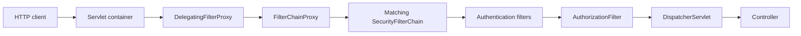
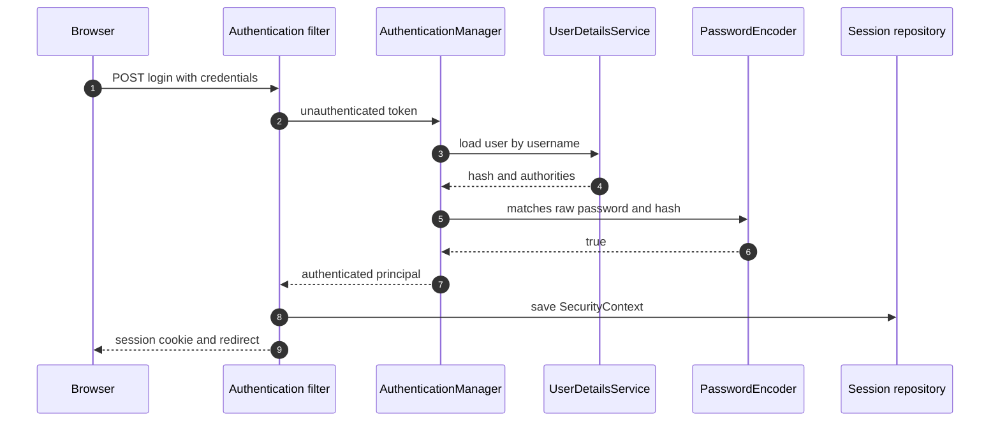
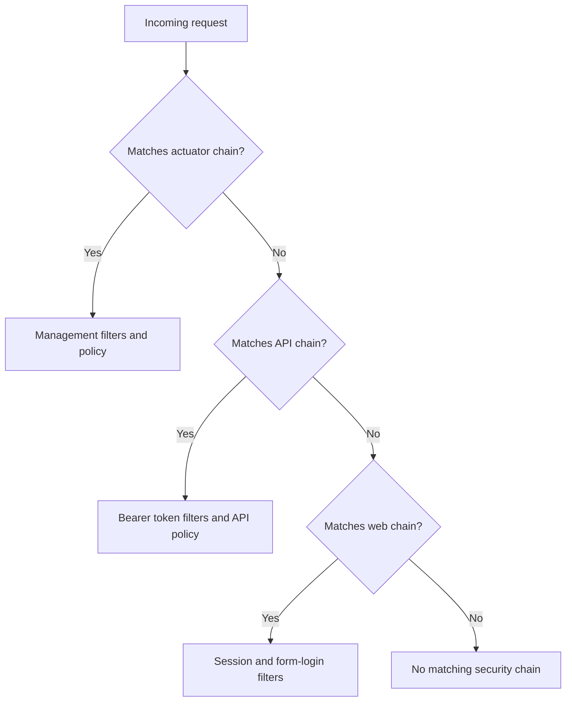
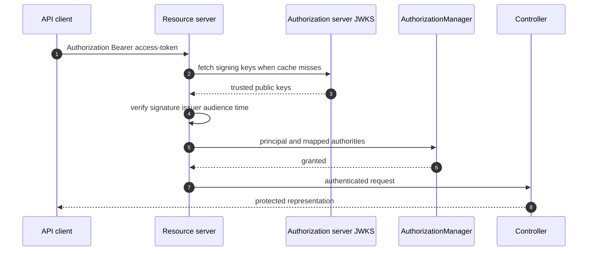
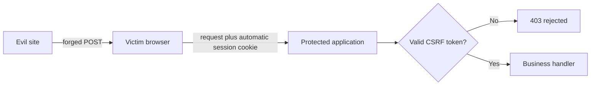
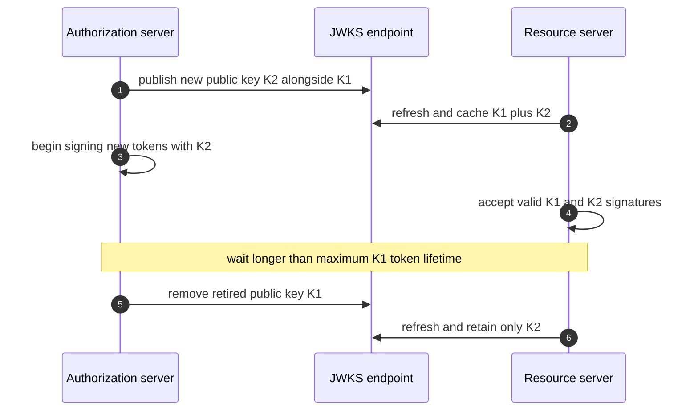

# Spring Security: Authentication, Authorization & Production Hardening

Spring Security is the servlet and reactive security framework used to establish identity, enforce access policy, and defend request boundaries in Spring applications. It sits in front of application controllers as an ordered filter chain, then carries the authenticated principal through the request so URL rules and method rules can make consistent decisions. Interviewers ask about it because a secure API depends less on memorising annotations than on understanding filters, credentials, sessions, tokens, browser threats, and failure behaviour as one system.

---

## 🟢 Beginner Level

### Authentication, authorization, and the security filter chain

**Authentication** answers, "Who is making this request?" A successful authentication produces an `Authentication` object containing a principal, credentials or credential status, and granted authorities. A failed authentication never establishes a trusted identity.

**Authorization** answers, "May this authenticated identity perform this action?" It evaluates authorities and request context against a rule such as "only an order owner or support agent may refund this order." Authentication normally happens first, but anonymous requests can still be authorized for explicitly public resources.

Spring Security implements these decisions through the `SecurityFilterChain`. In a servlet application, security filters run before Spring MVC's `DispatcherServlet`, so rejected traffic does not reach controllers.



`DelegatingFilterProxy` bridges the servlet container to a Spring-managed bean. `FilterChainProxy` selects the first configured chain whose security matcher accepts the request. Filters in that chain load or establish security context, apply exploit protection, authenticate credentials, translate exceptions, and authorize access.

### A principal and its authorities

A **principal** represents the current identity, often a username or domain-specific user object. An **authority** is a fine-grained permission string such as `invoice:read` or `order:refund`. A **role** is a naming convention for a broader job function, commonly represented as an authority with the `ROLE_` prefix.

For example, `hasRole("ADMIN")` checks for `ROLE_ADMIN`, while `hasAuthority("ADMIN")` checks for exactly `ADMIN`. Mixing the two conventions silently denies valid users, so teams should choose a clear authority vocabulary and test it.

| Concept | Question answered | Example | Typical source |
|---|---|---|---|
| Principal | Who is the caller? | `alice@example.com` | Session or verified token |
| Authority | What precise operation is allowed? | `invoice:write` | User store or token claim |
| Role | What organisational function applies? | `ROLE_FINANCE` | Directory group mapping |
| Ownership | Does the resource belong to the caller? | `invoice.ownerId == principal.id` | Domain data |

URL rules are useful for coarse boundaries. Method security is useful when access depends on method arguments, returned objects, or domain ownership.

### The basic login journey

A form-login flow accepts a username and password, delegates verification, and stores the resulting authenticated context. The password itself must never be stored in plaintext or logged.



`AuthenticationManager` normally delegates to one or more `AuthenticationProvider` implementations. A `DaoAuthenticationProvider` loads a user and asks a `PasswordEncoder` to compare the submitted password with the stored adaptive hash. On success, Spring replaces the unauthenticated request token with an authenticated object.

### A minimal Spring Security 6 configuration

Modern Spring Security uses beans and lambdas rather than extending the removed `WebSecurityConfigurerAdapter`.

```java
@Configuration
@EnableMethodSecurity
class SecurityConfiguration {

    @Bean
    SecurityFilterChain apiSecurity(HttpSecurity http) throws Exception {
        return http
            .authorizeHttpRequests(auth -> auth
                .requestMatchers("/actuator/health", "/public/**").permitAll()
                .requestMatchers(HttpMethod.POST, "/api/orders/**")
                    .hasAuthority("order:write")
                .anyRequest().authenticated())
            .httpBasic(Customizer.withDefaults())
            .build();
    }

    @Bean
    PasswordEncoder passwordEncoder() {
        return PasswordEncoderFactories.createDelegatingPasswordEncoder();
    }
}
```

Rules are evaluated in declaration order, so specific matchers must appear before broad matchers. `permitAll` preserves Spring Security's headers and other protections, whereas ignoring a path removes it from the security chain entirely.

### Sessions and bearer tokens

Two common ways to carry identity between requests are server-side sessions and bearer access tokens.

| Property | Server-side session | JWT bearer access token |
|---|---|---|
| Client carries | Opaque session identifier | Signed claims and metadata |
| Server lookup | Usually session store | Often signature/key validation only |
| Immediate revocation | Delete or invalidate session | Requires short TTL, deny-list, or introspection |
| Browser transport | Secure cookie | Cookie or `Authorization` header |
| Horizontal scaling | Shared store or sticky routing | Any verifier with keys can validate |
| Leakage impact | Attacker gets session identity | Attacker gets token privileges until expiry/revocation |

A JSON Web Token is a compact, signed claim set; it is not encrypted by default. Anyone holding a bearer token can use it, so TLS, short lifetimes, restricted audiences, and safe client storage matter more than the token's readability.

---

## 🟡 Intermediate Level

### How Spring chooses and executes a filter chain

An application may define separate chains for an API, browser pages, and management endpoints. `FilterChainProxy` tests them in order and executes only the first matching chain. A broad `/**` matcher declared first can therefore shadow every later chain.



Within a selected chain, filter order is also semantic. A bearer token must be authenticated before `AuthorizationFilter` checks authorities. `ExceptionTranslationFilter` converts authentication and authorization exceptions into an entry-point response or access-denied response rather than letting framework exceptions leak as HTTP 500 errors.

Custom filters should normally be inserted relative to a known framework filter:

```java
http.addFilterBefore(correlationFilter, BearerTokenAuthenticationFilter.class);
```

Do not manually instantiate a second copy of a filter that is also registered as a servlet filter. Double registration causes duplicate execution and surprising context or response mutations.

### Session security and persistence

For session-based authentication, the browser usually receives an opaque cookie such as `JSESSIONID`. The server maps that identifier to a stored `SecurityContext`; the cookie must use `Secure`, `HttpOnly`, and an appropriate `SameSite` policy.

Session fixation protection changes the session identifier after login so an attacker cannot preselect a victim's authenticated session ID. Spring Security enables fixation protection by default for form login. Logout must invalidate the server session and clear the browser cookie.

Distributed deployments commonly use Spring Session backed by Redis. This avoids routing every user to one instance, but makes Redis availability and TTL policy part of the authentication path. A session should expire after inactivity and may also have an absolute maximum lifetime for higher-risk systems.

Session concurrency controls can limit how many active logins one account owns. They require a reliable session registry and clear product behaviour when an older session is expired.

### JWT validation, not merely decoding

A resource server must validate a bearer token before trusting any claim. Correct JWT validation includes:

1. Verify the signature using an allowed algorithm and trusted key.
2. Reject expired tokens using `exp` and tokens used before `nbf`.
3. Verify the expected issuer in `iss`.
4. Verify the resource server's audience in `aud`.
5. Map only approved claims to authorities.
6. Apply a small, explicit clock-skew allowance.



Decoding Base64URL sections proves nothing: attackers can create their own payload. Algorithm confusion, accepting `none`, using an ID token as an API access token, or omitting audience validation can turn syntactically valid tokens into authorization bypasses.

Spring's resource server support centralises validation:

```java
@Bean
SecurityFilterChain resourceServer(HttpSecurity http) throws Exception {
    return http
        .sessionManagement(session -> session
            .sessionCreationPolicy(SessionCreationPolicy.STATELESS))
        .authorizeHttpRequests(auth -> auth
            .requestMatchers("/api/reports/**").hasAuthority("SCOPE_reports.read")
            .anyRequest().authenticated())
        .oauth2ResourceServer(oauth -> oauth.jwt(Customizer.withDefaults()))
        .build();
}
```

`STATELESS` prevents the security context from being persisted as a session; it does not make the whole application stateless if other filters or controllers create sessions.

### OAuth 2.0 and OpenID Connect boundaries

OAuth 2.0 is an authorization framework for delegated access. The resource owner grants a client limited access, the authorization server issues an access token, and the resource server validates that token. OAuth itself does not define end-user authentication.

OpenID Connect adds an identity layer and an ID token for the client. An ID token tells the client about a completed authentication; an access token authorizes calls to a resource server. Sending an ID token to an unrelated API confuses these audiences and must be rejected.

For browser and mobile clients, Authorization Code with PKCE is the standard interactive flow. The client generates a high-entropy verifier, sends its challenge in the authorization request, and later proves possession of the verifier at the token endpoint. PKCE prevents an intercepted authorization code from being redeemed by an attacker.

Client Credentials is appropriate for machine-to-machine calls where no end user is involved. The client itself is the subject, so propagating that token as though it represented a user creates misleading audit records.

### Password hashing and BCrypt cost

Passwords require one-way, salted, adaptive hashing. Encryption is reversible and fast general-purpose hashes such as SHA-256 are cheap enough for attackers to test billions of guesses, so neither is an appropriate password storage primitive.

BCrypt embeds its version, cost, salt, and hash in one encoded string. A cost of 12 means the expensive key setup runs approximately $2^{12} = 4{,}096$ iterations; increasing the cost to 13 approximately doubles verification work to $2^{13} = 8{,}192$ iterations.

#### Worked capacity example

Suppose production measurements show one BCrypt cost-12 verification takes 90 ms on an application CPU core. A single saturated core can complete approximately:

$$
\frac{1{,}000\ \text{ms/second}}{90\ \text{ms/check}} \approx 11.1\ \text{checks/second}
$$

An 8-core instance reserving at most 50% of CPU for login hashing has 4 effective cores, so its rough steady limit is $4 \times 11.1 \approx 44$ verifications per second. If a login burst reaches 220 attempts per second, five such instances are needed just for hashing, before headroom: $220 / 44 = 5$.

Raising the cost to 13 roughly halves the per-instance capacity to 22 checks per second, requiring about 10 instances. This is why cost must be benchmarked on deployment hardware and paired with rate limiting: a deliberately expensive defensive operation can itself become a denial-of-service target.

`DelegatingPasswordEncoder` prefixes stored hashes, such as `{bcrypt}`, allowing gradual migration. On successful login, `upgradeEncoding` can detect an obsolete cost or algorithm and rehash the password without forcing every user through a reset at once.

### CORS and CSRF solve different browser problems

**Cross-Origin Resource Sharing (CORS)** controls whether browser JavaScript from one origin may read or send selected cross-origin requests. It is enforced by browsers, not by command-line clients or malicious servers. CORS is therefore not authentication and cannot protect a public API from non-browser callers.

**Cross-Site Request Forgery (CSRF)** exploits credentials the browser attaches automatically, especially cookies. A malicious site causes a victim's browser to send a state-changing request to a trusted site, and the trusted site sees the victim's valid cookie. A random anti-CSRF token proves the request originated from a page that could read trusted-site state.



A bearer token supplied explicitly in an `Authorization` header is not automatically attached by the browser, so classic CSRF risk is lower. If the same token is stored in a cookie, CSRF protection is needed again. Disabling CSRF merely because an application returns JSON is unsafe; credential transport determines the threat.

Configure CORS before Spring Security because a preflight `OPTIONS` request generally has no cookies. Use exact trusted origins when credentials are allowed; the wildcard origin cannot be combined safely with credentialed browser requests.

### URL authorization and method security

Request rules guard routes before controller invocation:

```java
http.authorizeHttpRequests(auth -> auth
    .requestMatchers(HttpMethod.GET, "/api/catalog/**").permitAll()
    .requestMatchers(HttpMethod.POST, "/api/catalog/**").hasAuthority("catalog:write")
    .requestMatchers("/api/admin/**").hasRole("ADMIN")
    .anyRequest().denyAll());
```

Method security protects service operations even when they are called from another controller, message listener, or GraphQL resolver:

```java
@PreAuthorize("hasAuthority('invoice:read') and #customerId == authentication.name")
public Invoice getInvoice(String customerId, long invoiceId) {
    return repository.findRequired(invoiceId);
}
```

Use method rules for domain-sensitive checks, but avoid expressions that trigger uncontrolled database queries. Complex authorization belongs in a testable policy component invoked from the expression or service.

---

## 🔴 Expert Level

### SecurityContext lifecycle and async boundaries

The `SecurityContextHolder` exposes the current request's context, using a `ThreadLocal` strategy by default in servlet applications. Security filters populate it before application code and clear it after the request. Clearing is essential because container threads are pooled and reused for unrelated users.

Async execution moves work to another thread, where the original thread-local context is absent. `DelegatingSecurityContextExecutor`, Spring's security-aware async support, or explicit identity parameters can propagate the required context. Blind inheritable thread locals are risky with pools because thread creation and request execution do not align.

The authenticated principal is request evidence, not a mutable domain aggregate. Copy a stable subject identifier into audit events rather than serialising an entire user object that may contain credentials or stale permissions.

### Authentication failure and access-denied contracts

An unauthenticated request that needs identity should produce HTTP 401 through an `AuthenticationEntryPoint`. An authenticated principal lacking permission should produce HTTP 403 through an `AccessDeniedHandler`. Returning 404 can deliberately conceal resource existence, but that policy must be consistent to avoid an enumeration oracle.

API error bodies should be stable and non-sensitive:

```json
{
  "type": "https://example.com/problems/forbidden",
  "title": "Access denied",
  "status": 403,
  "requestId": "01J9R8B4X8THM8ZJ97K6D3TV7P"
}
```

Never reveal whether a username exists through different messages or materially different response timing. Log the internal reason with a correlation ID, but do not log passwords, raw tokens, session identifiers, authorization codes, or reset links.

### Production hardening and key rotation

A production security design layers controls rather than relying on one token check:

1. Terminate TLS securely and reject clear-text credential traffic.
2. Minimise token scopes, audiences, lifetime, and accepted algorithms.
3. Cache JSON Web Key Sets, but refresh safely when an unknown key ID appears.
4. Rotate signing keys with an overlap period: publish the new public key before issuing tokens with it, and retain the old public key until all old tokens expire.
5. Rate-limit login, password reset, token issuance, and expensive verification paths by several signals, not only IP address.
6. Require multi-factor authentication or step-up authentication for high-impact actions.
7. Record successful and denied security events without exposing secrets.
8. Keep framework versions patched and expose the smallest possible attack surface.



If the authorization server or JWKS endpoint is temporarily unavailable, cached unexpired keys should permit validation. A resource server that fetches keys on every request converts an identity-system slowdown into a complete API outage.

### Common attack and failure modes

**Broken object-level authorization** occurs when an endpoint checks that the caller is logged in but never checks ownership of the requested identifier. `/accounts/123` must not become readable merely because the caller can change `123` to `124`.

**Privilege drift** occurs when long-lived sessions or tokens retain authorities after an administrator revokes them. Short token TTLs, introspection for high-risk operations, session invalidation, and policy checks against current domain state reduce the window.

**Login amplification** occurs when BCrypt work, database lookup, audit publishing, and external identity calls happen before throttling. Apply cheap rejection controls early while avoiding rules that let attackers lock out arbitrary victims.

**Open redirects** occur when a saved request or post-login redirect accepts an untrusted absolute URL. Validate destinations against local paths or an explicit allow-list.

**Proxy trust mistakes** occur when the application trusts spoofable forwarding headers. Incorrect scheme detection can remove `Secure` from cookies or generate clear-text redirects, so accept forwarded headers only from controlled reverse proxies.

**Overbroad CORS** exposes authenticated responses to hostile origins when credentials and reflected origins are combined. Validate an exact origin list and include CORS configuration in automated security tests.

### Choosing sessions, JWT, or opaque OAuth tokens

The choice is an operational trade-off, not a maturity ladder.

| Requirement | Preferred starting point | Reason | Watch for |
|---|---|---|---|
| Server-rendered web app | Session cookie | Simple logout and revocation | Shared session availability |
| First-party stateless API | Short-lived JWT access token | Local verification and scaling | Key rotation and stale claims |
| High-risk immediate revocation | Opaque token with introspection | Central active-state decision | Authorization-server latency |
| Browser-facing backend-for-frontend | Session or secure token cookie | Keeps bearer token out of JavaScript | CSRF protection required |
| Service-to-service call | OAuth Client Credentials | Scoped machine identity | Do not claim it is an end user |

An architecture may combine them: a browser uses a hardened session with a backend-for-frontend, while that server exchanges or relays short-lived access tokens to downstream APIs. The important boundary is that each component validates the credential intended for its own audience.

### Testing security as policy

Security configuration deserves unit, MVC-slice, and integration tests. Cover every public endpoint, role or authority boundary, ownership rule, CSRF behaviour, CORS preflight, expired token, wrong issuer, wrong audience, and unauthenticated response contract.

```java
@Test
void refundRequiresRefundAuthority() throws Exception {
    mvc.perform(post("/api/orders/42/refund")
            .with(jwt().authorities(new SimpleGrantedAuthority("order:read")))
            .with(csrf()))
        .andExpect(status().isForbidden());
}

@Test
void anonymousRequestReceivesUnauthorizedContract() throws Exception {
    mvc.perform(get("/api/profile"))
        .andExpect(status().isUnauthorized())
        .andExpect(jsonPath("$.status").value(401));
}
```

Test denials as deliberately as grants. A test suite that asserts only successful administrator requests cannot detect a missing `anyRequest().denyAll()` or an overly broad matcher.

### Common Misconceptions

1. **"JWT makes an application more secure than sessions."**
   A JWT changes where identity state is stored and how it is verified; it does not prevent token theft, excessive privileges, or broken authorization. Its decentralised validation makes immediate revocation harder, so short lifetimes and key operations are essential.
2. **"CORS blocks requests from attackers."**
   CORS is a browser read-and-send policy and is not enforced by servers, scripts, mobile apps, or command-line tools. Authentication and authorization must reject unwanted callers independently of CORS.
3. **"A REST API can always disable CSRF."**
   CSRF depends on whether credentials are attached automatically, not on whether responses contain HTML or JSON. An API authenticated by cookies still needs CSRF protection or a carefully designed same-site boundary.
4. **"Roles and authorities are interchangeable strings."**
   Spring's `hasRole("ADMIN")` convention checks for `ROLE_ADMIN`, whereas `hasAuthority("ADMIN")` checks the literal value. Mixing them produces accidental denial or, if compensating rules become broad, accidental access.
5. **"Decoding a JWT validates it."**
   Decoding only reveals attacker-controlled bytes. Trust begins after signature, algorithm, issuer, audience, and time validation all succeed.

### Interview Questions

**Q1. What is the difference between authentication and authorization?** `[easy]`

Authentication establishes who the caller is and produces a trusted principal with authorities. Authorization evaluates whether that principal may perform a requested operation on a particular resource. A correctly authenticated user can still receive HTTP 403 when policy denies the action.

**Q2. What does `SecurityFilterChain` do in a Spring servlet application?** `[easy]`

It defines the ordered security filters and authorization rules applied to matching HTTP requests. `FilterChainProxy` selects the first matching chain and runs it before Spring MVC's dispatcher reaches a controller. Incorrect matcher or filter order can bypass an intended rule or reject traffic before the correct authentication mechanism runs.

**Q3. Why should passwords be hashed with BCrypt rather than encrypted or hashed with SHA-256?** `[easy]`

BCrypt is salted, one-way, and deliberately expensive, which raises the cost of each offline password guess. Encryption is reversible when its key is stolen, while SHA-256 is fast enough for massive cracking throughput. BCrypt's configurable cost can be increased as hardware improves, although applications must rate-limit verification to prevent CPU exhaustion.

**Q4. Why does Spring distinguish HTTP 401 from HTTP 403?** `[easy]`

HTTP 401 means the request lacks acceptable authentication and should be handled by an authentication entry point. HTTP 403 means Spring knows the principal but an authorization decision denied the operation. Conflating them harms clients and can also leak inconsistent resource-existence information.

**Q5. How do roles differ from authorities in Spring Security?** `[medium]`

Authorities are exact permission strings carried by an authenticated principal, while roles are a convention for grouping permissions or job functions. `hasRole("ADMIN")` checks for the authority `ROLE_ADMIN`, but `hasAuthority("ADMIN")` checks for the unprefixed literal string. A team should define one mapping policy because inconsistent prefixes produce silent access failures.

**Q6. When should CSRF protection remain enabled for an API?** `[medium]`

It should remain enabled whenever the browser automatically attaches authentication credentials, especially session or token cookies, to state-changing requests. Returning JSON does not eliminate the forged-request mechanism. An API using only explicit bearer headers may not need classic CSRF tokens, but XSS and token leakage remain separate threats.

**Q7. What must a resource server validate in a JWT?** `[medium]`

It must validate the signature with a trusted allowed algorithm, token time bounds, expected issuer, and its own audience before using claims. It must then map only controlled claims to authorities and tolerate no untrusted algorithm substitution. Merely decoding the token or checking expiration lets attacker-created or wrongly targeted tokens through.

**Q8. Why is Authorization Code with PKCE preferred for browser and mobile OAuth clients?** `[medium]`

PKCE binds the authorization request to a high-entropy verifier retained by the initiating client. An attacker who intercepts the short-lived authorization code cannot redeem it without that verifier. It mitigates code interception but does not replace redirect URI validation, state checks, nonce checks for OpenID Connect, or secure token handling.

**Q9. When is method security preferable to URL authorization?** `[medium]`

Method security is preferable when the decision depends on arguments, return values, resource ownership, or an operation reachable through several transports. It protects the service boundary even if a new controller or listener calls the same method. Complex expressions can become opaque or trigger expensive lookups, so domain policy should live in a focused, testable component.

**Q10. How should signing-key rotation work without breaking valid JWTs?** `[medium]`

The authorization server first publishes the new public key alongside the old one, and resource servers refresh their caches. It then starts signing with the new private key while verifiers accept tokens signed by either current key. The old public key is removed only after every token signed with it has expired, otherwise healthy requests fail during the rotation window.

**Q11. Scenario: Every API request starts failing when the identity provider's JWKS endpoint has a brief outage. What would you change?** `[hard]`

The resource server is probably fetching signing keys synchronously for every request or has no resilient cache. It should cache trusted keys according to appropriate freshness rules, refresh on rotation or unknown key identifiers, and continue validating with cached unexpired keys during a short upstream outage. Cache duration must still support emergency key retirement, so operations need an explicit refresh and revocation procedure.

**Q12. Scenario: A logged-in customer can retrieve another customer's invoice by changing the numeric ID in the URL. What failed?** `[hard]`

Authentication succeeded, but object-level authorization was never enforced for the requested invoice. The service must compare ownership or a privileged authority against the loaded domain object, preferably at the service boundary rather than trusting a client-supplied owner ID. Tests should attempt cross-account identifiers because role-only happy-path tests will miss this insecure direct object reference.

**Q13. Scenario: Raising BCrypt from cost 12 to cost 14 causes login latency and CPU saturation during a credential-stuffing attack. How do you respond?** `[hard]`

Cost 14 performs roughly four times the work of cost 12, so the change reduced verification capacity while the attack increased demand. Apply rate limiting and bot or risk controls before expensive hashing, cap queues, measure verification latency, and scale only after cheap rejection is effective. Choose the highest cost that meets the production latency budget and use `DelegatingPasswordEncoder` to migrate hashes gradually on successful logins.

**Q14. Scenario: A stateless API accepts a valid token issued for a different internal service. What validation is missing?** `[hard]`

The API is probably checking signature and expiration but not the `aud` audience claim. A valid signature proves which issuer created the token, not that the token was intended for this resource server. Configure an exact expected audience and issuer, reject ambiguous tokens, and test tokens minted for neighbouring services as negative cases.

### Further Reading

- [Spring Security reference: servlet architecture](https://docs.spring.io/spring-security/reference/servlet/architecture.html) explains `FilterChainProxy`, chain matching, and filter ordering.
- [Spring Security reference: OAuth 2.0 resource server JWT](https://docs.spring.io/spring-security/reference/servlet/oauth2/resource-server/jwt.html) documents validation, key discovery, and authority mapping.
- [OAuth 2.0 Security Best Current Practice, RFC 9700](https://www.rfc-editor.org/rfc/rfc9700.html) consolidates current deployment guidance and deprecates unsafe patterns.
- [OWASP Password Storage Cheat Sheet](https://cheatsheetseries.owasp.org/cheatsheets/Password_Storage_Cheat_Sheet.html) provides maintained guidance on adaptive hashing and work-factor upgrades.
