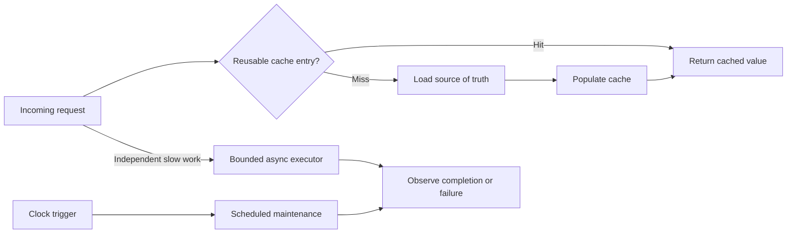
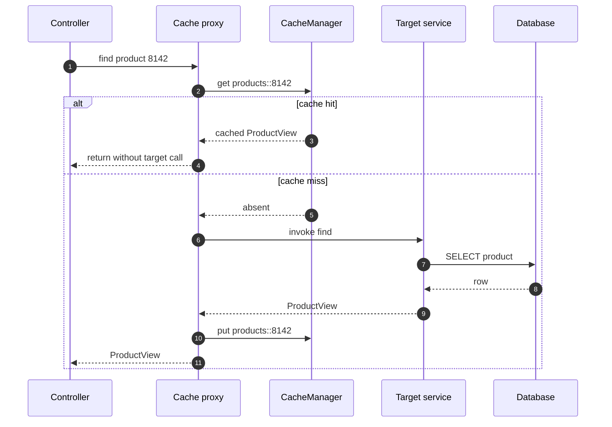
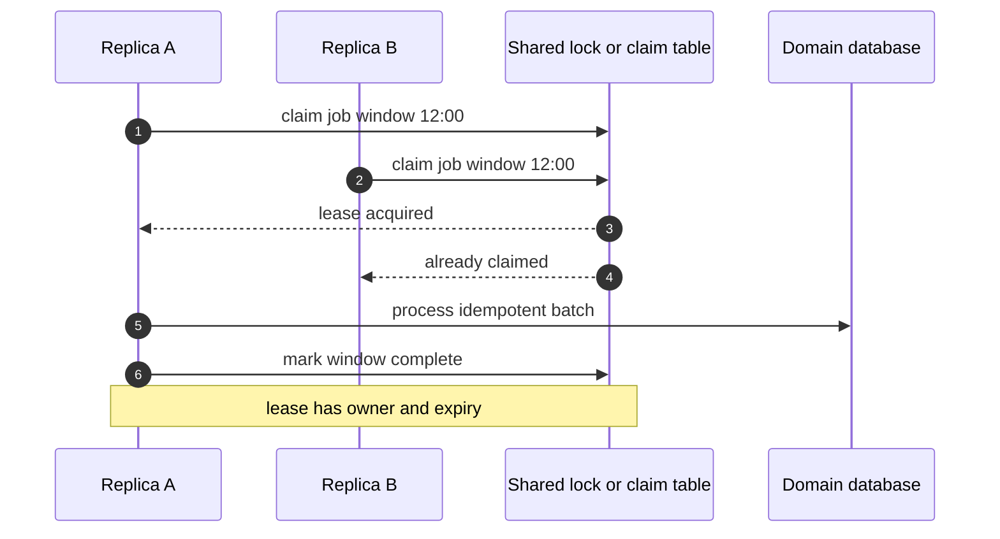

# Spring Caching, Asynchronous Work & Scheduling

Caching, asynchronous execution, and scheduling all move work away from the immediate request path, but they solve different problems and introduce different consistency boundaries. Spring offers convenient annotations for each, yet production correctness depends on cache ownership, executor capacity, failure visibility, and multi-instance coordination. Interviewers probe these mechanisms because a one-line annotation can hide stale data, lost exceptions, thread starvation, or duplicated jobs.

---

## 🟢 Beginner Level

### Caching, asynchronous work, and scheduled execution

A **cache** stores a reusable result closer to the caller so later requests avoid repeating expensive database, network, or computation work. Spring's Cacheable annotation reads through a cache abstraction, while CachePut and CacheEvict deliberately update or remove entries after writes.

An **asynchronous** method submits work to an executor so the caller does not occupy its current thread until completion. Spring's Async annotation applies this boundary through a proxy and can return a CompletableFuture when the caller needs a result or failure signal later.

A **scheduled** method starts work according to time rather than an incoming request. Spring's Scheduled annotation supports fixed delay, fixed rate, and cron triggers for in-process jobs such as refreshing reference data or cleaning temporary records.

These tools are not interchangeable:

| Tool | Primary question answered | Typical benefit | New risk |
|---|---|---|---|
| Cache | "Can I reuse a previous result?" | Lower latency and backend load | Stale or inconsistent data |
| Async executor | "Can this work finish outside this call stack?" | Shorter request occupancy and concurrency | Queue saturation and hidden failure |
| Scheduler | "Should this work start at a time or interval?" | Automated recurring maintenance | Duplicate execution across replicas |

All three create a boundary between the caller's moment and the work's source of truth. Designing that boundary explicitly matters more than adding the annotation.



### The cache-aside mental model

**Cache-aside** is the most common application caching pattern:

1. Read the cache using a deterministic key.
2. On a hit, return the cached value.
3. On a miss, read the source of truth.
4. Store the result with a time to live.
5. Return the value.

Redis is frequently used as a shared remote cache because every application replica can access the same keys and expirations. An in-process cache avoids network cost but every replica owns a different copy, and all entries disappear when that process restarts.

```java
@Service
class ProductQueryService {
    @Cacheable(cacheNames = "products", key = "#productId")
    public ProductView find(long productId) {
        return repository.findById(productId)
                .map(mapper::toView)
                .orElseThrow(() -> new ProductNotFoundException(productId));
    }
}
```

On a hit, Spring skips the method body and returns the stored value. On a miss, it invokes the method and asks the configured cache manager to store the successful result.

A cache is not authoritative storage. Redis eviction, expiry, restart, or network failure must not destroy the only copy of important business data.

### Keys, values, and time to live

A cache key must capture every input that changes the result. If product prices differ by product, currency, customer tier, and locale, using only `productId` leaks the wrong representation across callers.

A namespaced key might be conceptualized as:

```text
product:v3:8142:EUR:GOLD:en-GB
```

The version segment allows a coordinated schema migration. The value should be a stable cache DTO rather than a live JPA entity because lazy proxies and persistence context state do not survive serialization safely.

**TTL**, or time to live, sets an upper bound on passive staleness and memory retention. A 10-minute TTL does not promise that data is fresh for 10 minutes; it promises an entry can remain stale for *up to* roughly 10 minutes unless actively invalidated.

TTL selection depends on business tolerance:

- Country codes may tolerate hours.
- Product descriptions may tolerate minutes.
- Inventory may tolerate seconds or require no cache at all.
- Permission revocation may require immediate invalidation.

Add small random TTL jitter to large groups of related keys so they do not all expire at the same instant.

### Cacheable, CachePut, and CacheEvict

Spring's caching operations express different write intentions:

- **Cacheable** checks the cache before method execution and usually skips execution on a hit.
- **CachePut** always executes the method and stores its returned value.
- **CacheEvict** removes one key or a whole named cache.

```java
@CachePut(cacheNames = "products", key = "#result.id")
public ProductView update(long productId, UpdateProductCommand command) {
    return mapper.toView(repository.update(productId, command));
}

@CacheEvict(cacheNames = "products", key = "#productId")
public void delete(long productId) {
    repository.deleteById(productId);
}
```

Putting and evicting both require a consistency decision. Updating the database and then the cache creates a brief stale window; updating the cache first can publish a value for a database transaction that later rolls back.

Evicting after a successful commit is often safer because the next read repopulates from authoritative state. It costs an extra miss but avoids duplicating mapping logic between the write and read paths.

### Async execution and futures

Spring asynchronous execution is enabled with EnableAsync and usually backed by a named ThreadPoolTaskExecutor. Calling an Async method through its Spring proxy submits the invocation to that executor and returns control to the caller.

```java
@Async("emailExecutor")
public CompletableFuture<DeliveryReceipt> sendReceipt(OrderReceipt receipt) {
    DeliveryReceipt result = mailGateway.send(receipt);
    return CompletableFuture.completedFuture(result);
}
```

A void-returning asynchronous method gives the caller no composable failure channel. Prefer CompletableFuture for work whose outcome matters, or use durable messaging when the task must survive a process crash.

Asynchronous does not mean faster. It changes which thread waits and can improve concurrency when work is independent and mostly blocked on I/O, but CPU time, downstream capacity, and total latency still exist.

### Scheduled execution basics

Spring scheduling is enabled with EnableScheduling. A scheduled method should have no arguments and should return quickly enough for its configured scheduling model.

```java
@Scheduled(fixedDelayString = "${cleanup.delay:PT5M}")
public void removeExpiredUploads() {
    uploadService.removeExpiredBatch(500);
}
```

With **fixed delay**, the next run is measured after the prior run completes. With **fixed rate**, starts are measured from scheduled start times and can bunch up when work is slower than the interval. A **cron** expression targets calendar times and requires an explicit time zone when local-time interpretation matters.

In a deployment with four application replicas, each replica normally schedules the same method. Use a distributed lock, leader election, a database claim, or an external scheduler if only one global execution is allowed.

---

## 🟡 Intermediate Level

### Spring cache interception and proxy boundaries

EnableCaching registers infrastructure that detects cache annotations and wraps eligible beans in proxies. A call through the proxy enters a cache interceptor before the target method.



Self-invocation bypasses the proxy. If one method calls another Cacheable or Async method on `this`, no interceptor sees the call, so caching or thread handoff does not occur. Move the intercepted method to a collaborating bean or redesign the public boundary rather than injecting a bean into itself.

Private and final method behaviour depends on proxy strategy and cannot be treated as a reliable interception boundary. Put annotations on externally invoked service methods with clear contracts.

Cache condition can decide whether an invocation is eligible before execution, while unless can reject a result after execution. Avoid caching null or transient error-like responses unless negative caching is deliberate and short-lived.

### Invalidation and transaction ordering

Cache invalidation is hard because the source of truth and remote cache are usually not one atomic transaction. Consider database-first cache eviction:

1. Begin database transaction.
2. Update product price.
3. Commit the transaction.
4. Evict the product cache key.

If the process crashes after step 3 but before step 4, stale data remains until TTL. If eviction occurs before commit, a concurrent reader can miss, reload the old database value, and repopulate stale data before the commit completes.

Useful strategies include:

| Strategy | Consistency strength | Operational trade-off |
|---|---|---|
| Short TTL only | Eventual, bounded by expiry | Simple but stale until TTL |
| Evict after commit | Usually fresh after write | Crash gap between commit and eviction |
| Transactional outbox invalidation | Durable eventual invalidation | More components and delivery lag |
| Versioned keys | Readers switch generations | Old keys consume memory until expiry |
| Write-through cache | Cache updated during write | Dual-write failure handling required |

A transaction synchronization can delay local eviction until the database commits, preventing rollback from invalidating a still-valid entry. It does not eliminate the post-commit crash gap; an outbox event can close that gap durably.

For high-risk correctness data, bypass caching or include a version check against authoritative state. Faster wrong answers are still wrong.

### Cache stampede, penetration, and avalanche

A **cache stampede** occurs when many requests miss the same popular key and all load the source simultaneously. A database that normally sees one refresh per minute may suddenly receive thousands of identical queries.

Mitigations include:

- Per-key request coalescing so one loader runs and others wait.
- A short distributed lock with lease expiry and bounded waiting.
- Refresh-ahead before a hot entry expires.
- Stale-while-revalidate, where callers briefly receive stale data while one refresh runs.
- TTL jitter so related entries do not expire together.

**Cache penetration** means repeatedly requesting values that do not exist. Short-lived negative caching, input validation, rate limiting, or probabilistic membership filters can protect the database.

**Cache avalanche** means many unrelated keys expire or disappear together, often after a Redis restart or synchronized TTL. Jitter, warm-up, capacity planning, and graceful fallback reduce the synchronized load spike.

Spring's `sync=true` on Cacheable may coalesce concurrent loads in a provider-specific local context. It is not automatically a cluster-wide distributed lock across application replicas.

### Worked example: hit ratio and stampede load

Assume a product endpoint receives 2,000 requests per second. A database read takes 20 ms, a Redis read takes 1 ms, and the steady cache hit ratio is 95%.

Requests reaching the database each second are:

$$
2{,}000 \times (1 - 0.95) = 100
$$

Average lookup latency, ignoring network overlap and queueing, is:

$$
(0.95 \times 1\text{ ms}) + (0.05 \times (1 + 20)\text{ ms}) = 2.0\text{ ms}
$$

Without the cache, the same traffic requires 2,000 database reads per second at about 20 ms each. The cache therefore removes 95% of those reads and reduces the simple average latency by about 90%.

Now the single hottest key, responsible for 600 requests per second, expires. During one 20 ms database load window, expected concurrent misses are:

$$
600\text{ requests/s} \times 0.020\text{ s} = 12\text{ duplicate loads}
$$

Across eight replicas without cross-node coalescing, timing and queueing can amplify that burst further. A single-flight mechanism turns approximately 12 duplicate loads into one load plus waiting readers, trading bounded waiting for database protection.

Hit ratio alone can mislead. Track cache request latency, miss load latency, eviction rate, memory pressure, stale-serving count, key cardinality, and the database load avoided.

### Executor configuration and queue behaviour

An executor has three capacity controls: worker threads, queue capacity, and rejection policy. An unbounded queue prevents rejection until memory is exhausted but lets latency grow invisibly; a bounded queue makes overload explicit.

```java
@Bean("emailExecutor")
ThreadPoolTaskExecutor emailExecutor() {
    ThreadPoolTaskExecutor executor = new ThreadPoolTaskExecutor();
    executor.setCorePoolSize(8);
    executor.setMaxPoolSize(16);
    executor.setQueueCapacity(200);
    executor.setThreadNamePrefix("email-");
    executor.setRejectedExecutionHandler(new ThreadPoolExecutor.CallerRunsPolicy());
    executor.initialize();
    return executor;
}
```

ThreadPoolExecutor generally creates core workers first, then queues tasks, and only grows beyond the core after the queue fills. Setting a high maximum with a large queue may therefore never create the expected extra workers.

Caller-runs rejection provides backpressure by making the submitting thread execute rejected work. Abort rejection fails fast. Silent discard policies are dangerous for business tasks because accepted-looking work can vanish.

Use separate executors for workloads with different latency and failure characteristics. Slow email calls should not occupy every thread needed for fraud checks or cache refresh.

### Worked example: sizing an I/O-bound executor

Suppose an asynchronous integration receives 80 tasks per second. Each task uses 10 ms of CPU and waits 90 ms for a remote service, so average service time is 100 ms.

Little's Law estimates concurrent tasks needed just to sustain arrival rate:

$$
L = \lambda W = 80\text{ tasks/s} \times 0.100\text{ s} = 8\text{ tasks}
$$

Eight continuously available workers cover the mean load. A common I/O-bound estimate using four cores is:

$$
N = 4 \times \left(1 + \frac{90}{10}\right) = 40\text{ threads}
$$

The formulas answer different questions. Eight is the mean concurrency demanded by observed throughput, while 40 is an upper sizing heuristic based on CPU utilisation; downstream connection limits and tail latency may require a much smaller cap.

If the dependency allows only 12 concurrent requests, configuring 40 threads merely moves the queue into sockets or the dependency. Start near 8 to 12 workers, use a bounded queue sized for a short burst, measure p95 queue wait, and load-test the complete path.

At 80 tasks per second, a 200-item queue represents about $200 / 80 = 2.5$ seconds of arrival backlog before accounting for active workers. If the request deadline is one second, that queue is already too deep because many tasks will begin after their value has expired.

### CompletableFuture composition and exception handling

CompletableFuture supports non-blocking composition when independent operations can run concurrently:

```java
CompletableFuture<Customer> customer = customerClient.fetch(order.customerId());
CompletableFuture<Inventory> inventory = inventoryClient.fetch(order.items());

return customer.thenCombine(inventory, OrderContext::new)
        .orTimeout(800, TimeUnit.MILLISECONDS)
        .exceptionally(ex -> fallbackFor(ex));
```

Use `thenCompose` when one asynchronous result determines the next asynchronous operation, and `thenCombine` when two independent results can be joined. Calling `join` or `get` immediately after submission removes much of the concurrency benefit and can deadlock when tasks wait on work queued to the same saturated executor.

Define timeouts at every remote boundary and an overall request deadline. Cancellation of a CompletableFuture does not guarantee that an already-running blocking I/O call stops; the client library must support interruption or its own timeout.

Void Async failures are delivered to an AsyncUncaughtExceptionHandler rather than the caller. That handler must log and emit metrics, but durable business processing should usually use a queue with acknowledgement, retry, and dead-letter semantics.

### Fixed delay, fixed rate, and cron semantics

Scheduling choice expresses the desired time model:

| Mode | Next trigger measured from | Best fit | Failure risk |
|---|---|---|---|
| Fixed delay | Previous completion | Cleanup where overlap is unwanted | Drift when runs are slow |
| Fixed rate | Previous scheduled start | Frequent sampling | Backlog or bunching |
| Cron | Calendar expression | Daily business process | Time-zone and daylight-saving surprises |

Externalize schedules and specify `zone` for cron expressions. A job intended for 02:30 in a region with daylight-saving transitions can be skipped or duplicated on clock-change days; UTC avoids ambiguity when business requirements permit it.

The default scheduler may have limited concurrency. A long task can delay unrelated scheduled work, so configure a dedicated TaskScheduler or hand off bounded work to a purpose-specific executor.

Do not create unbounded catch-up. If a service was offline for two hours, decide whether it should process every missed interval, process one aggregate window, or resume from now.

---

## 🔴 Expert Level

### Multi-instance consistency and ownership

Local annotations execute independently in every application instance. With six replicas, a Scheduled reconciliation method runs six times unless coordination establishes one owner.



A distributed lease needs a unique owner token, expiry, and compare-and-release semantics. Releasing by key alone can delete a newer owner's lease after the first worker pauses beyond expiry.

Locks provide at-most-one concurrent attempt, not exactly-once business effects. The job itself should claim records atomically, record progress, and make writes idempotent so recovery after a crash can resume safely.

For durable or operationally critical schedules, Quartz, a platform scheduler, or a workflow engine offers persistent triggers, misfire policy, retries, and execution history beyond basic Scheduled methods.

### Cache consistency under concurrency

The most dangerous cache race is stale repopulation:

1. Reader misses key `P` and starts a slow database read of version 7.
2. Writer commits version 8 and evicts key `P`.
3. Reader completes with version 7 and puts it back after the eviction.

The cache is now stale until another invalidation or TTL. Versioned values can reject older writes, a delayed second eviction can reduce the race window, and change-data-capture or outbox events can reassert the current version.

Caching a list is harder than caching one entity. Updating product `8142` may invalidate detail keys, category pages, search results, counts, and recommendation fragments. Broad eviction is correct but expensive; targeted invalidation needs an explicit dependency model.

Avoid shared mutable cached objects in local caches. If callers mutate a returned list or DTO, later callers may observe changes that never reached the database; use immutable values or defensive copies.

### Context propagation, transactions, and async boundaries

Thread-local context does not automatically become durable application context. Security identity, logging correlation, locale, diagnostic context, and transaction state may be absent on executor threads unless explicitly captured and restored.

Spring transaction context is thread-bound. An Async method starts on another thread after the caller returns, so it does not participate in the caller's transaction merely because the caller was transactional. It may observe data before commit or never run if the process stops immediately after commit.

Publish after-commit work deliberately. For lightweight best-effort work, a transaction event listener can submit only after successful commit; for required work, store an outbox record in the same transaction and let a durable dispatcher deliver it.

Use a TaskDecorator to propagate bounded diagnostic context, and clear it in a `finally` block so pooled threads do not leak one request's identity into another. Do not blindly copy large request objects or secrets into long-lived tasks.

### Overload, shutdown, and production observability

Executor metrics should include active threads, pool size, queue depth, task wait time, execution time, completed count, rejected count, and failure count. Queue depth without task age can look healthy while old work violates its deadline.

On graceful shutdown, stop accepting new work, allow a bounded interval for important tasks, and then terminate. Waiting forever prevents deployment; stopping immediately loses best-effort work. Tasks that must survive shutdown belong in durable infrastructure rather than process memory.

Cache metrics need hit and miss counts per logical cache, load duration, load failure, eviction, memory usage, and Redis command latency. Do not tag metrics by raw key because millions of unique identifiers create cardinality and monitoring cost.

Scheduled jobs should record last start, last success, duration, processed item count, and failure reason. An annotation proves only that a trigger was configured; a freshness alert proves the business job is still succeeding.

### Production decision guide

Use these mechanisms according to the reliability contract:

- Use a local cache for tiny read-mostly reference data where per-instance inconsistency is acceptable.
- Use Redis when replicas need shared cached values, but preserve source-of-truth fallback and failure isolation.
- Use Async for bounded, best-effort in-process concurrency with observable futures.
- Use durable messaging for work that must survive restart or be retried reliably.
- Use Scheduled for simple single-process maintenance or idempotent replicated triggers.
- Use a persistent scheduler or workflow engine for durable calendars, retries, dependencies, and audit history.

Every optimisation should have an escape hatch. A cache can be bypassed during corruption, an executor can reject early during overload, and a scheduled job can be disabled or manually replayed with a known window.

### Common Misconceptions

1. **"A cache with a TTL is always fresh enough."**
   *Correction*: TTL only bounds passive retention; a value can be stale immediately after the source changes. Correctness-sensitive data needs active invalidation, versioning, or an authoritative read.
2. **"Async makes a method execute faster."**
   *Correction*: Async moves execution to another thread and may improve caller responsiveness or overlap I/O. Total work and dependency latency remain, while queueing can make completion slower.
3. **"A large unbounded executor queue prevents overload failures."**
   *Correction*: It converts visible rejection into growing memory consumption and queue latency. Bounded capacity and explicit rejection make overload controllable.
4. **"A Scheduled method runs once for the whole service."**
   *Correction*: Every application replica normally owns its own scheduler and invokes the method. Global uniqueness requires distributed coordination, and business idempotency is still necessary after lock loss or retry.
5. **"Evicting the cache inside a transaction keeps cache and database atomic."**
   *Correction*: The remote cache does not participate in the database transaction and readers can repopulate stale data before commit. Post-commit invalidation plus a durable outbox or version strategy narrows the failure window.

### Interview Questions

**Q1. What does Cacheable do on a cache hit and miss?** `[easy]`

On a hit, the cache interceptor returns the stored value and normally skips the target method. On a miss, it invokes the method and stores the successful result using the selected cache and key. The method therefore needs to be reached through the Spring proxy for interception to occur.

**Q2. How do CachePut and CacheEvict differ?** `[easy]`

CachePut always invokes the method and stores its returned value under the computed key. CacheEvict removes an entry, often after a successful write, so a later read reloads authoritative state. Put avoids the next miss but duplicates representation logic, while eviction is simpler and accepts one reload.

**Q3. What is the difference between fixed delay and fixed rate scheduling?** `[easy]`

Fixed delay measures the next interval after the previous invocation completes. Fixed rate measures starts from the schedule and aims to maintain a frequency even when work duration varies. Fixed rate can create bunching or overlap pressure, whereas fixed delay drifts but naturally spaces completed runs.

**Q4. Why prefer CompletableFuture over void for important Async work?** `[easy]`

CompletableFuture gives the caller a value and an explicit completion or exception channel. It can be composed, timed out, and observed without relying only on background logs. A void method routes failures to an uncaught-exception handler and cannot tell the original caller that required work failed.

**Q5. Why does a Cacheable or Async self-invocation not work as expected?** `[medium]`

Spring commonly implements both features with a proxy that intercepts calls entering the bean. A call from one method to another on `this` goes directly to the target object, bypassing that proxy and its cache or executor interceptor. Moving the operation to another bean creates a real boundary and also makes its semantics clearer.

**Q6. How would you choose a cache key and TTL?** `[medium]`

The key must include every input that changes the result, including tenant, locale, permission scope, or representation version when relevant. TTL should reflect the maximum acceptable staleness, source update frequency, miss cost, and memory budget. Add jitter for large populations and use active invalidation when expiry alone cannot meet correctness needs.

**Q7. What is a cache stampede and how can it be controlled?** `[medium]`

A stampede occurs when many callers miss the same hot key and simultaneously load the source of truth. Per-key coalescing, distributed leases, refresh-ahead, stale-while-revalidate, and TTL jitter reduce synchronized work. Locking must have bounded waits and expiry because a failed loader must not block the key forever.

**Q8. Why can an unbounded executor queue be dangerous?** `[medium]`

It accepts work faster than workers can complete it, so queue age and memory consumption grow without immediate rejection. Requests may time out while their background tasks still wait, wasting downstream capacity when they eventually run. A bounded queue, rejection policy, and admission limit turn invisible overload into a measurable control decision.

**Q9. How should you size a pool for I/O-bound tasks?** `[medium]`

Estimate observed concurrency with arrival rate times service time, then compare it with CPU wait-to-compute heuristics. Bound the result by downstream connections, rate limits, memory, and latency deadlines rather than treating a formula as a final answer. Load-test queue wait and rejection behaviour because averages hide bursts and slow-tail calls.

**Q10. How do Async and database transactions interact?** `[medium]`

Spring transaction state is normally bound to the caller thread and does not propagate to an executor thread. An asynchronous method may start its own transaction, race the caller's uncommitted data, or never run after a process crash. Required after-commit work should use a deliberate transaction event or, more reliably, a durable outbox.

**Q11. Scenario: database load spikes every five minutes although cache hit ratio is normally high. What do you investigate?** `[hard]`

Check whether a large set of keys shares the same five-minute TTL, producing an expiration avalanche, and whether hot-key misses are coalesced. Correlate Redis eviction, restart, command latency, and application miss-load metrics with the database spike. Add TTL jitter, refresh hot entries early, bound fallback concurrency, and confirm Redis has enough memory for the intended working set.

**Q12. Scenario: a scheduled invoice job runs four times for each customer after scaling the service. Why?** `[hard]`

Each of the four application replicas owns a scheduler and independently fires the same Scheduled method. Use an external scheduler, leader election, or a shared claim with lease semantics to choose one worker for each execution window. Make invoice creation idempotent with a unique business key because coordination failures and retries can still produce another attempt.

**Q13. How can stale data be repopulated immediately after a writer evicts a cache key?** `[hard]`

A reader can miss before the write, load the old database version slowly, and put it after the writer commits and evicts. The eviction then occurs too early to remove the late stale value. Version-aware puts, outbox invalidation, delayed re-eviction, or a consistency-sensitive authoritative read can address the race with different cost and complexity.

**Q14. When should you replace Async or Scheduled with durable infrastructure?** `[hard]`

Use durable messaging when accepted work must survive process termination, support reliable retry, or preserve an audit trail. Use a persistent scheduler or workflow engine when calendars, misfire recovery, dependencies, distributed ownership, and operator replay matter. In-process annotations remain excellent for bounded best-effort tasks, but they cannot offer durability that the process itself does not possess.

### Further Reading

- [Spring Framework reference: cache abstraction](https://docs.spring.io/spring-framework/reference/integration/cache.html) documents cache interception, annotations, key generation, and provider integration.
- [Spring Framework reference: task execution and scheduling](https://docs.spring.io/spring-framework/reference/integration/scheduling.html) covers Async, executors, scheduling modes, and annotation processing.
- [Java CompletableFuture API](https://docs.oracle.com/en/java/javase/17/docs/api/java.base/java/util/concurrent/CompletableFuture.html) defines completion, composition, timeout, and exception stages.
- [Redis documentation: key expiration](https://redis.io/docs/latest/develop/data-types/strings/) explains expiration behaviour used to implement cache TTL policies.
