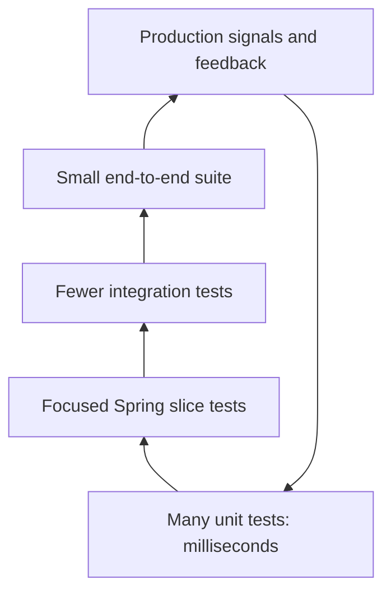
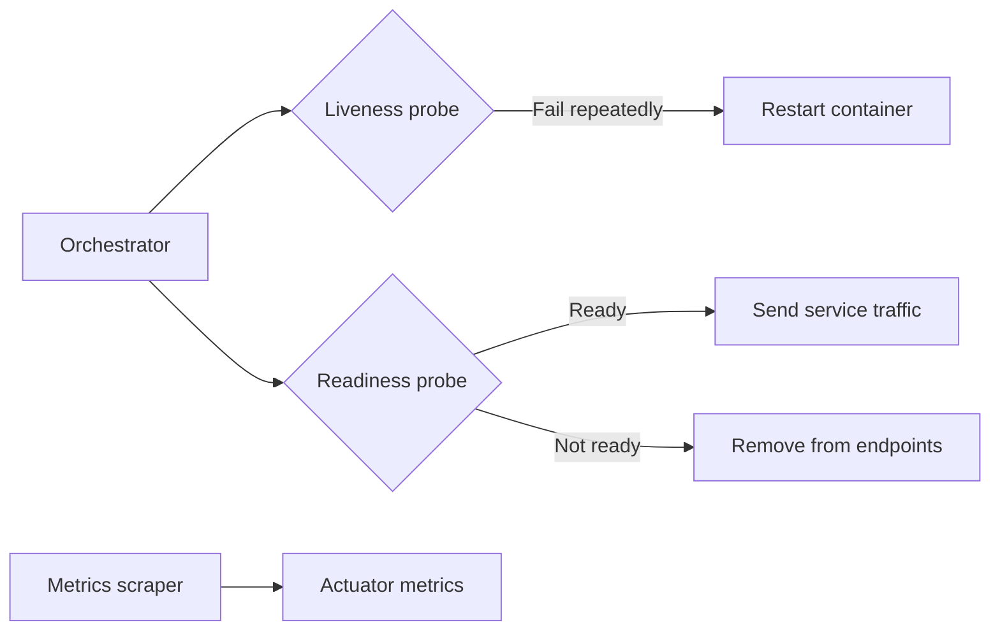
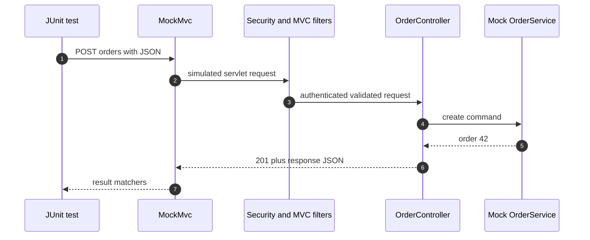
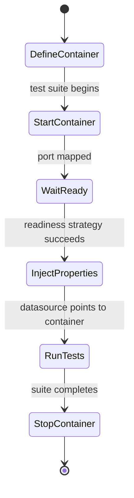
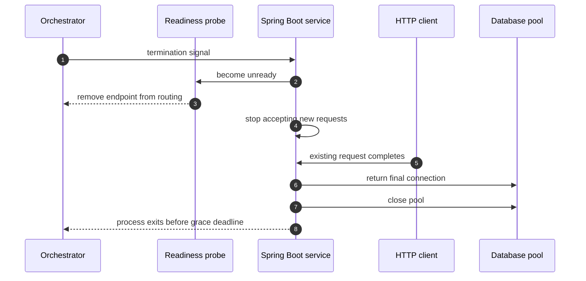

# Spring Testing & Production Operations

A Spring Boot service is not production-ready merely because its controller returns the expected JSON on a developer laptop. Reliable delivery requires a deliberately layered test suite, observable runtime behaviour, bounded resource pools, safe configuration, and a shutdown path that preserves in-flight work. Interviewers connect these topics because testing proves assumptions before release while production operations reveal whether those assumptions remain true under concurrency, failures, and container limits.

---

## 🟢 Beginner Level

### Spring testing and production operations

Testing and operations form one feedback loop. A unit test checks a small decision quickly, an integration test checks real boundaries, and production telemetry checks the running system under traffic that no test suite reproduces perfectly.



The broad base should be deterministic and fast. Tests become fewer as they include more infrastructure because runtime, failure modes, and diagnosis cost increase.

Production readiness adds a second set of questions:

- Can an orchestrator tell whether the process is alive and ready for traffic?
- Can operators correlate one failed request across logs, metrics, and downstream calls?
- Do database connections and request threads have explicit bounds?
- Can the service stop without dropping accepted work?
- Are secrets supplied without being committed or printed?
- Does the JVM respect the container's memory budget?

### JUnit 5 fundamentals

JUnit Jupiter is the programming and extension model commonly called JUnit 5. A test class groups executable examples, and each `@Test` should make one behaviour easy to understand when it fails.

```java
class PriceCalculatorTest {

    private PriceCalculator calculator;

    @BeforeEach
    void setUp() {
        calculator = new PriceCalculator();
    }

    @Test
    void appliesTenPercentDiscountForGoldCustomer() {
        Money result = calculator.price(Money.of(100), CustomerTier.GOLD);

        assertEquals(Money.of(90), result);
    }
}
```

The **arrange-act-assert** shape makes intent visible: establish inputs, invoke one behaviour, and verify the observable result. A good test name describes the rule rather than the implementation method it happened to call.

Useful Jupiter features include:

- `@BeforeEach` and `@AfterEach` for per-test lifecycle work.
- `@BeforeAll` and `@AfterAll` for expensive class-level fixtures.
- `@ParameterizedTest` for applying one rule to many input cases.
- `assertAll` for related assertions that should all be evaluated.
- `assertThrows` for an expected failure contract.
- `@Nested` for grouping scenarios without creating vague mega-tests.
- Extensions through `@ExtendWith`, such as Mockito's extension.

Tests should not depend on execution order or mutable static state. Parallel execution and retries expose hidden coupling that sequential local runs conceal.

### Mockito: mocks, spies, and injection annotations

A **mock** is a generated test double with no real behaviour unless configured. A **spy** wraps a real object, so unstubbed methods execute real code. Spies are useful at legacy seams, but they can hide a design that mixes too many responsibilities.

| Tool | What it creates | Spring context? | Best use | Main risk |
|---|---|---:|---|---|
| `mock(Type.class)` | Mockito mock | No | Explicit small unit test | Boilerplate |
| `@Mock` | Mockito mock | No | Unit test with extension | Confused with a Spring bean |
| `@Spy` | Partial real object | No | Controlled legacy seam | Real side effects run |
| `@InjectMocks` | Real subject with mock injection | No | Constructor-based unit | Injection surprises with complex subjects |
| `@MockBean` | Mock replacing/adding an application bean | Yes | Spring Boot slice/context test | Slow context used for unit logic |

```java
@ExtendWith(MockitoExtension.class)
class OrderServiceTest {

    @Mock OrderRepository repository;
    @Mock PaymentGateway gateway;
    @InjectMocks OrderService service;

    @Test
    void doesNotChargeWhenOrderIsMissing() {
        when(repository.findById(42L)).thenReturn(Optional.empty());

        assertThrows(OrderNotFoundException.class, () -> service.pay(42L));
        verifyNoInteractions(gateway);
    }
}
```

Prefer verifying outcomes and important collaborator boundaries over every internal call. Overspecified interaction tests break during harmless refactoring while failing to prove the business result.

### Unit, slice, integration, and end-to-end tests

Each test type answers a different question.

| Test type | Loads | Typical speed | Proves | Does not prove |
|---|---|---:|---|---|
| Unit | Plain objects | 1–10 ms | Branches and domain rules | Spring wiring or serialization |
| MVC slice | Web layer subset | 100–800 ms | Routing, validation, JSON, security | Real database behaviour |
| Integration | Application plus real dependencies | Seconds | Wiring, SQL, transactions, protocols | Full user journey |
| End-to-end | Deployed system | Seconds to minutes | Critical workflow | Every edge case cheaply |

Do not replace a missing unit-test layer with hundreds of full-context tests. The suite will become slow, and developers will run it less often.

### The first production signals

Spring Boot Actuator exposes operational endpoints such as health, metrics, info, loggers, and mappings when enabled. Exposure must be intentional because some endpoints reveal configuration or permit runtime changes.

**Liveness** answers whether the process is stuck and should be restarted. **Readiness** answers whether it can currently accept traffic. A temporary database failure should usually make a service unready, not necessarily dead; restarting every replica can amplify the outage.



Metrics reveal rates and distributions: request count, error rate, latency percentiles, JVM memory, garbage collection pauses, connection-pool pressure, and executor queues. Logs explain individual events; metrics show how frequently the events occur.

---

## 🟡 Intermediate Level

### MVC slice tests with WebMvcTest and MockMvc

`@WebMvcTest` loads a focused MVC application context containing controllers, MVC configuration, converters, validation, and relevant security infrastructure. Collaborating service beans are replaced with test doubles, commonly through `@MockBean` in Spring Boot versions that provide it.

`MockMvc` invokes the servlet stack without opening a network socket. It verifies request mapping, argument binding, validation, filters, exception handling, status, headers, and rendered response bodies.



```java
@WebMvcTest(OrderController.class)
class OrderControllerTest {

    @Autowired MockMvc mvc;
    @MockBean OrderService service;

    @Test
    @WithMockUser(authorities = "order:write")
    void createsValidOrder() throws Exception {
        when(service.create(any())).thenReturn(new OrderView(42L, "CREATED"));

        mvc.perform(post("/api/orders")
                .with(csrf())
                .contentType(MediaType.APPLICATION_JSON)
                .content("""{"sku":"BOOK-1","quantity":2}"""))
            .andExpect(status().isCreated())
            .andExpect(header().string("Location", "/api/orders/42"))
            .andExpect(jsonPath("$.status").value("CREATED"));
    }
}
```

Also test malformed JSON, invalid fields, missing authentication, insufficient authority, exception mappings, and content negotiation. A controller test containing only a successful administrator request leaves most of the HTTP contract unverified.

### Full integration with SpringBootTest

`@SpringBootTest` discovers the main configuration and creates a broad application context. Its `webEnvironment` controls whether a servlet environment is mocked, absent, or served on a real defined or random port.

- `MOCK` loads a web context without a real server and works with separately configured `MockMvc`.
- `RANDOM_PORT` starts the embedded server on an available port for real HTTP client tests.
- `DEFINED_PORT` uses configured ports and creates collision risk in concurrent builds.
- `NONE` loads a non-web context.

Use a full context when the test must prove auto-configuration, bean wiring, proxy behaviour, transaction boundaries, security-chain integration, or multiple layers working together. Context caching speeds classes that share identical configuration; excessive custom profiles and mock sets fragment that cache.

Tests that start a server and database should assert observable behaviour, not reach into repositories to manufacture every state. Setup through stable application boundaries provides stronger confidence, though direct fixture insertion can be appropriate for large data arrangements.

### Testcontainers for real dependency semantics

In-memory databases differ from PostgreSQL, MySQL, Redis, Kafka, and other production dependencies in SQL dialects, isolation, locking, indexes, extensions, and protocol behaviour. Testcontainers starts disposable real services in containers so integration tests exercise production-like semantics.



```java
@Testcontainers
@SpringBootTest
class OrderRepositoryIntegrationTest {

    @Container
    @ServiceConnection
    static PostgreSQLContainer<?> postgres =
        new PostgreSQLContainer<>("postgres:16-alpine");

    @Autowired OrderRepository repository;

    @Test
    void preservesDatabaseUniqueConstraint() {
        repository.saveAndFlush(new Order("REQ-7"));

        assertThrows(DataIntegrityViolationException.class,
            () -> repository.saveAndFlush(new Order("REQ-7")));
    }
}
```

Pin image versions so a registry's moving tag does not change build semantics unexpectedly. Keep containers reusable within an appropriate test scope, run independent suites in parallel carefully, and diagnose readiness through wait strategies rather than fixed sleeps.

### Structured logging and correlation IDs

Structured logs encode fields as machine-readable data rather than embedding everything in prose. A useful request completion event might contain timestamp, severity, service, environment, request ID, trace ID, route template, status, duration, principal subject, and error type.

```json
{
  "level": "INFO",
  "event": "http.request.completed",
  "service": "orders-api",
  "requestId": "01J9R8B4X8THM8ZJ97K6D3TV7P",
  "traceId": "4bf92f3577b34da6a3ce929d0e0e4736",
  "route": "/api/orders/{id}",
  "status": 200,
  "durationMs": 37
}
```

A boundary filter should accept only syntactically valid incoming correlation identifiers or create a new one. Put it in the logging MDC for the request, propagate it downstream, include it in error responses, and clear MDC state in `finally` because container threads are reused.

MDC does not automatically cross `@Async`, executor, or reactive boundaries. Use a task decorator or tracing instrumentation to capture and restore context. Never log authorization headers, cookies, passwords, reset tokens, private keys, or entire request bodies by default.

### Actuator health, metrics, and observability

Health contributors aggregate component status. Define groups for liveness and readiness rather than publishing every dependency under one generic probe.

Micrometer instruments counters, gauges, timers, and distribution summaries. Prefer low-cardinality tags such as route templates and status classes; user IDs, raw URLs, order IDs, and exception messages create unbounded time series that overwhelm monitoring storage.

For a service-level view, watch:

- Traffic rate, separated by stable route and method.
- Error rate, especially server failures and rejected work.
- Latency percentiles and histograms, not only averages.
- Saturation in request threads, executors, HikariCP, heap, CPU, and downstream clients.
- Business outcomes such as orders accepted and payments declined.

A trace follows causality through process boundaries. A metric detects a population-level regression. A structured log supplies details for one event; all three should share trace or correlation identifiers where practical.

### HikariCP sizing with a worked example

HikariCP is Spring Boot's common JDBC connection pool. A connection is a scarce concurrent slot, not a throughput accelerator by itself. Oversized pools increase database contention, memory, context switching, and the number of transactions competing for locks.

Little's Law estimates average concurrent database work:

$$
L = \lambda W
$$

Assume one service instance handles 240 requests per second. Measurements show 40% of requests call the database, and those calls hold a connection for an average of 75 ms:

$$
\lambda_{db} = 240 \times 0.40 = 96\ \text{database operations/second}
$$

$$
L = 96 \times 0.075 = 7.2\ \text{connections busy on average}
$$

A pool of 12 gives headroom above the 7.2 average, subject to measured tail latency. With 8 replicas, the deployment can open $8 \times 12 = 96$ application connections; that total must fit the database's connection budget alongside migrations, operators, and other services.

If the database allows 120 connections and reserves 24 for administration and other workloads, exactly 96 remain for these replicas. Scaling to 12 replicas without reducing per-instance pools would request $12 \times 12 = 144$ connections and fail during scale-out. Pool sizing is therefore a deployment-wide capacity decision.

Important settings include maximum pool size, connection timeout, idle timeout, maximum lifetime, and leak detection for diagnostics. Set maximum lifetime below infrastructure-enforced connection lifetimes so Hikari retires connections deliberately rather than discovering dead sockets during requests.

---

## 🔴 Expert Level

### Graceful shutdown and traffic draining

Graceful shutdown stops accepting new work, allows bounded in-flight requests to finish, closes application resources, and exits before the orchestrator's hard deadline. Spring Boot can perform graceful embedded-server shutdown when configured.



The orchestrator and application deadlines must agree. If the platform kills a container after 30 seconds but Spring waits 45 seconds, the last 15 seconds are imaginary and work will be terminated.

Background executors, message consumers, and scheduled jobs need their own draining semantics. Stop fetching new messages before waiting for active handlers, ensure idempotent retries, and expose enough telemetry to distinguish graceful completion from forced termination.

Readiness should change before the process disappears from routing, accounting for load-balancer propagation delay. A short pre-stop drain can help, but fixed sleeps cannot replace correct readiness and bounded shutdown.

### Externalised configuration and secrets

Spring Boot resolves configuration from ordered property sources including packaged files, environment variables, system properties, and command-line arguments. Later, higher-priority sources can override earlier defaults, so operators must know the precedence and inspect effective configuration safely.

Bind related values with validated `@ConfigurationProperties` instead of scattering string-based `@Value` expressions. Typed configuration supports metadata, validation, immutable records, and focused tests.

Secrets should come from a managed secret store, orchestrator-mounted file, or restricted environment injection, depending on the platform. They must not live in Git, Docker image layers, default configuration, command history, error bodies, health details, or log events.

Rotation needs an explicit mechanism. Some credentials can be refreshed dynamically; others require a controlled restart. A secret volume changing on disk does not guarantee that an already-created connection pool or SDK client reloads it.

Profiles are coarse environment groupings, not a complete secrets strategy. Excessive profile combinations make behaviour difficult to predict and test; prefer common defaults plus explicit external overrides.

### Docker images and JVM container memory

A production image should be reproducible, minimal, non-root, and built from a supported JRE base. Multi-stage builds keep Maven caches and compilers out of the runtime image, while layered jars improve rebuild and pull efficiency.

The container memory limit covers more than Java heap:

$$
M_{limit} > M_{heap} + M_{metaspace} + M_{code\ cache} + M_{direct} + M_{thread\ stacks} + M_{native}
$$

For a 1,024 MiB limit, allocating an 820 MiB heap leaves only 204 MiB for metaspace, direct buffers, thread stacks, JIT code cache, libraries, and the process itself. Two hundred threads with 1 MiB stacks could consume up to 200 MiB of virtual stack reservation before other native uses, making an out-of-memory kill plausible even when heap graphs look safe.

A safer initial budget might allocate 60% to heap: about 614 MiB, leaving about 410 MiB for non-heap and native memory. This is a starting hypothesis, not a universal rule; load tests and Native Memory Tracking should validate the actual workload.

Use an explicit container memory limit and inspect effective JVM ergonomics. Do not set identical `-Xms` and `-Xmx` reflexively in small containers unless the native headroom and startup footprint are understood.

### Failure modes that escape happy-path tests

**Context-only confidence** occurs when `@SpringBootTest` proves beans start but no test exercises the HTTP, database, or security behaviour. Startup is necessary, not sufficient.

**Mock drift** occurs when mocks return behaviour the real dependency never provides. Contract tests and Testcontainers reduce this gap at important boundaries.

**Probe-induced outages** occur when liveness depends on a remote database or API. A shared dependency failure then restarts every healthy process, adding load and removing diagnostic evidence.

**Cardinality explosions** occur when metrics tag raw paths or customer identifiers. Monitoring cost and query latency rise until the observability system itself becomes unreliable.

**Connection storms** occur when many replicas start simultaneously with oversized pools. The database spends its capacity establishing and scheduling connections while readiness checks trigger more restarts.

**Secret exposure** occurs when configuration dumps, Actuator endpoints, stack traces, or debug request logging publish credentials. Endpoint exposure and sanitisation must be tested as security requirements.

**Forced shutdown data loss** occurs when the process accepts work after becoming scheduled for termination or its grace period is shorter than legitimate operations. Idempotency and queue acknowledgement order determine whether interrupted work can be retried safely.

### A release confidence pipeline

A mature pipeline orders feedback by cost and isolates failures:


The same immutable image should move through environments; only external configuration changes. Progressive delivery limits blast radius, but rollback must account for database migrations and messages that older code may not understand.

Flaky tests are production defects in the delivery system. Quarantine may preserve short-term flow, but every quarantine needs ownership and a removal deadline rather than becoming a permanent ignored suite.

### Common Misconceptions

1. **"SpringBootTest is the best annotation because it tests everything."**
   It loads a broad context, but breadth increases runtime and can obscure which boundary failed. Unit, slice, and focused integration tests provide faster, more precise feedback, while full-context tests cover selected wiring risks.
2. **"A Mockito spy is just a mock with default answers."**
   A spy calls real methods unless they are stubbed, so constructors, I/O, or state mutations can execute unexpectedly. It is a partial real object and should be used only when that behaviour is intentional.
3. **"A healthy process is ready to receive traffic."**
   Liveness says restart may help; readiness says the instance can serve now. Combining them can cause orchestrators to restart every replica during a shared dependency outage.
4. **"More JDBC connections always increase throughput."**
   Once the database or CPU is saturated, more connections add queueing, lock contention, and context switches. Pool capacity must be derived from measured hold time and the whole deployment's database budget.
5. **"Setting the Java heap equal to the container limit uses memory efficiently."**
   The limit also contains metaspace, direct buffers, code cache, thread stacks, and native allocations. Leaving no native headroom causes the operating system to kill a process whose heap appears healthy.

### Interview Questions

**Q1. What is the practical difference between a unit test and a Spring integration test?** `[easy]`

A unit test creates plain objects and isolates a small rule without starting Spring. A Spring integration test loads some or all of the application context to prove wiring, proxies, configuration, or real boundaries. Unit tests are faster and more precise, while integration tests catch framework and infrastructure mismatches that mocks cannot reveal.

**Q2. What does `@WebMvcTest` verify?** `[easy]`

It loads a focused MVC slice containing controllers, request mapping, conversion, validation, and relevant web security. With `MockMvc`, it can verify status, headers, JSON, filters, and exception handling without opening a network port. It does not prove the real database or full application wiring unless those boundaries are added separately.

**Q3. How does a Mockito mock differ from a spy?** `[easy]`

A mock has generated default behaviour until the test stubs interactions. A spy wraps a real object and calls real methods unless a method is replaced. Spies can therefore execute side effects or depend on state, making them more hazardous and usually a signal to inspect the design seam.

**Q4. What is the difference between liveness and readiness?** `[easy]`

Liveness indicates whether restarting the process could recover it from a stuck or irrecoverable condition. Readiness indicates whether the current instance should receive new traffic. A transient downstream outage often belongs in readiness only, because restarting every live instance amplifies the incident.

**Q5. When should you use SpringBootTest with a random port?** `[medium]`

Use it when the test must cross a real embedded HTTP server boundary and verify network-level behaviour, filters, serialization, and full application configuration together. A random port avoids collisions between parallel tests and developer processes. It is slower than a slice, so controller permutations and pure domain rules should remain in cheaper tests.

**Q6. Why use Testcontainers instead of an in-memory database?** `[medium]`

Testcontainers runs the real database engine and therefore exercises its dialect, constraints, locking, transactions, indexes, and extensions. An in-memory substitute can accept SQL or isolation behaviour that production rejects. Containers cost startup time and require a container runtime, so reuse and test scope should be designed deliberately.

**Q7. What is the risk of using MockBean in every test?** `[medium]`

MockBean changes a Spring application context by replacing or adding a bean with a Mockito double. Many unique mock combinations fragment Spring's context cache and turn small logic tests into slow framework tests. It can also mask invalid real wiring, so use plain Mockito for units and reserve bean replacement for genuine slice or integration boundaries.

**Q8. Why are correlation IDs useful, and what must happen across async work?** `[medium]`

A correlation ID connects logs and error responses belonging to one logical request or workflow. Because servlet MDC state is thread-local, an executor or async boundary must capture, propagate, restore, and finally clear that context. Without propagation the trace fragments, while without cleanup a pooled thread can attach one customer's identifier to another request.

**Q9. How would you choose an initial HikariCP maximum pool size?** `[medium]`

Measure database-call arrival rate and connection hold time, then use Little's Law to estimate average concurrency and add tested headroom. Multiply the proposed size by the maximum replica count and reserve capacity for other services and operators. Increasing the pool after the database saturates usually worsens latency, so load-test the deployment rather than tuning one instance in isolation.

**Q10. Why should a metric avoid user ID or raw URL tags?** `[medium]`

Each distinct tag value creates another time series, so user IDs and raw resource paths generate unbounded cardinality. Storage, memory, and query cost can rise until the monitoring system becomes slow or unavailable. Use stable route templates and bounded dimensions, then put per-request identity in traces or structured logs.

**Q11. Scenario: All replicas restart repeatedly whenever the database has a 30-second outage. What is wrong with the probes?** `[hard]`

The database check has likely been included in liveness, so the orchestrator treats a shared downstream outage as a broken process. Move that dependency to readiness, keep liveness focused on local unrecoverable state, and let healthy processes remain available for recovery. Add probe thresholds and dashboards so brief failures do not cause a restart storm.

**Q12. Scenario: A service with a 1 GiB container limit is OOM-killed although heap usage never exceeds 750 MiB. What do you investigate?** `[hard]`

The remaining memory may be consumed by metaspace, direct buffers, thread stacks, JIT code cache, native libraries, or allocator overhead. Inspect the actual JVM flags, thread count, direct-memory users, Native Memory Tracking, and container events rather than relying only on heap graphs. Reduce heap percentage or other native consumers and preserve explicit headroom beneath the cgroup limit.

**Q13. Scenario: Integration tests pass locally but intermittently fail in CI because the PostgreSQL container is not ready. What should change?** `[hard]`

The suite is probably using a fixed sleep or treating an open port as application readiness. Configure a Testcontainers wait strategy based on the database's real readiness signal, inject properties only after startup, and capture container logs on failure. Pin the image version and remove shared mutable test data so infrastructure readiness is not confused with cross-test interference.

**Q14. Scenario: Deployments return intermittent 502 responses and duplicate message processing during termination. How do you harden shutdown?** `[hard]`

Mark the instance unready and allow routing changes to propagate before refusing or terminating connections. Stop consuming new messages, wait within a bounded deadline for active handlers, acknowledge only after durable completion, and make retries idempotent. Align Spring's shutdown timeout with the orchestrator's grace period and observe forced-versus-graceful termination metrics.

### Further Reading

- [Spring Boot reference: testing](https://docs.spring.io/spring-boot/reference/testing/index.html) documents test slices, full-context tests, utilities, and Testcontainers integration.
- [Spring Boot reference: production-ready features](https://docs.spring.io/spring-boot/reference/actuator/index.html) covers Actuator endpoints, health groups, metrics, and observability.
- [JUnit 5 User Guide](https://docs.junit.org/5.10.2/user-guide/) specifies the Jupiter programming model, lifecycle, parameterised tests, and extensions.
- [Mockito documentation](https://javadoc.io/doc/org.mockito/mockito-core/latest/org/mockito/Mockito.html) defines mock, spy, verification, stubbing, and injection behaviour.
