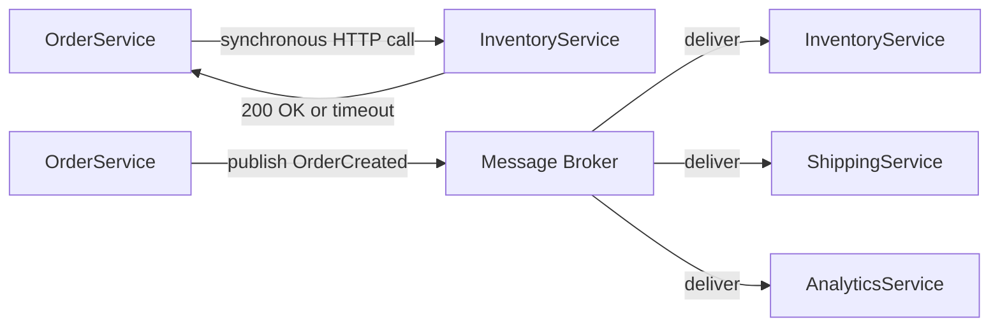
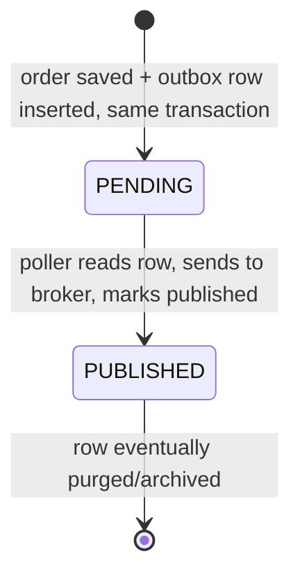
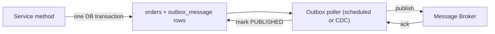
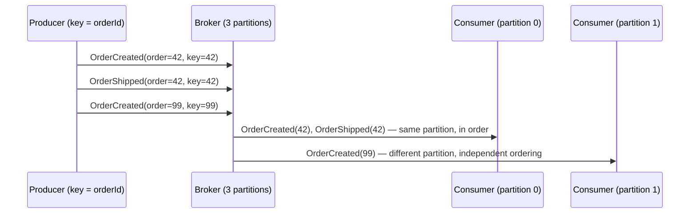
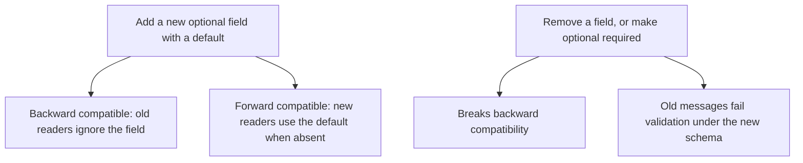

# Event-Driven Messaging: Kafka, RabbitMQ & the Outbox Pattern

A message broker lets services communicate by publishing events instead of calling each other synchronously, trading immediate consistency for independent scaling and resilience to a downstream outage. Interviewers probe this topic because the hard part is never "how do I call `kafkaTemplate.send()`" — it is reasoning correctly about delivery guarantees, the dual-write problem, and what a consumer must do to stay correct when the broker inevitably redelivers a message.

---

## 🟢 Beginner Level

### Why decouple with a broker instead of calling directly

A synchronous HTTP call from `OrderService` to `InventoryService` couples their availability: if inventory is down, order creation fails too, even though the order itself is valid.

Publishing an `OrderCreated` event instead lets `OrderService` finish its work immediately and lets `InventoryService` process the event whenever it is healthy again.

The trade-off is that the caller no longer knows the outcome of the downstream work at the moment it returns — consistency becomes eventual instead of immediate, and the system must be designed to tolerate that lag.



The broker also lets one event fan out to multiple independent consumers without the producer knowing they exist — `AnalyticsService` can start consuming `OrderCreated` events years after `OrderService` was written, with zero changes to the producer.

### Delivery semantics — what a broker actually promises

**At-most-once** delivery means a message is sent without retry; a network failure or crash after send can lose it silently. Few production systems intentionally choose this.

**At-least-once** delivery means the broker (or producer) retries until it has confirmation of delivery, which means a consumer can see the same message more than once — a retry after an unacknowledged send does not know whether the first attempt actually failed or just the acknowledgment was lost.

**Exactly-once** delivery — the message arrives and is processed exactly one time, with no duplicates and no loss — is not something a broker alone can generally guarantee end to end; it requires the consumer's processing to be either transactional with the broker or made idempotent.

| Semantics | Loss risk | Duplicate risk | Practical default |
|---|---|---|---|
| At-most-once | Possible | None | Rarely chosen deliberately |
| At-least-once | None (with retry) | Possible | The realistic default for most systems |
| Exactly-once | None | None (in effect) | Achieved via idempotent consumers on top of at-least-once, not a broker setting alone |

Most production systems target **at-least-once delivery with idempotent consumers**, which in combination behaves like exactly-once processing without requiring the broker to solve a problem it structurally cannot solve alone.

### Producers, consumers, and the vocabulary difference between Kafka and RabbitMQ

A **producer** publishes messages; a **consumer** reads them. Both Kafka and RabbitMQ share these roles, but structure the space between them differently.

Kafka organizes messages into **topics**, each split into ordered **partitions**; a **consumer group** allows multiple consumer instances to split the partitions of a topic between them, each partition read by exactly one consumer in the group at a time.

RabbitMQ routes messages through **exchanges** to **queues** based on routing rules (direct, topic, fanout), and multiple consumers reading the same queue compete for each message rather than each seeing a copy.

```java
@KafkaListener(topics = "order-events", groupId = "inventory-service")
public void onOrderCreated(OrderCreatedEvent event) {
    inventoryService.reserve(event.orderId(), event.items());
}
```

```java
@RabbitListener(queues = "order.created.queue")
public void onOrderCreated(OrderCreatedEvent event) {
    inventoryService.reserve(event.orderId(), event.items());
}
```

Both listener methods look nearly identical from the application code's point of view — the meaningful differences live in delivery ordering, partitioning, and routing flexibility, covered in the next tier.

### Basic publishing

```java
@Service
public class OrderEventPublisher {
    private final KafkaTemplate<String, OrderCreatedEvent> kafkaTemplate;

    public void publish(OrderCreatedEvent event) {
        kafkaTemplate.send("order-events", event.orderId().toString(), event);
    }
}
```

Publishing directly like this, called from inside the same method that saves the order to the database, is exactly the pattern the next tier explains is unsafe — it looks correct and works in every manual test, which is why the failure mode is easy to miss until production load exposes it.

### Message serialization: JSON, Avro, and Protobuf

The message payload needs to be serialized to bytes for transport and deserialized back into an object on the consumer side, and the format chosen affects both message size and how safely the schema can change over time.

**JSON** is human-readable and needs no schema definition ahead of time, which makes it the easiest format to start with and to debug by eye in a broker's message browser.

**Avro** and **Protobuf** are binary, schema-defined formats: a `.proto` or `.avsc` schema file defines the message shape up front, the payload on the wire carries no field names (just positional or tagged binary data), and a code generator produces typed classes from the schema.

| Format | Readable on the wire | Schema required | Typical size | Schema evolution support |
|---|---|---|---|---|
| JSON | Yes | No (implicit) | Largest — field names repeated per message | Manual discipline only |
| Avro | No | Yes, `.avsc` | Compact | Strong — designed for it, works well with a schema registry |
| Protobuf | No | Yes, `.proto` | Compact | Strong — field numbers make additions/removals explicit |

JSON's lack of an enforced schema is exactly what makes the schema-evolution discipline in the Expert tier a matter of team convention rather than something the serialization format itself can check; Avro and Protobuf push that check earlier, into the schema definition itself.

---

## 🟡 Intermediate Level

### The dual-write problem

A naive implementation saves the order to the database, then publishes the event, in two separate operations against two separate systems:

```java
@Transactional
public void createOrder(Order order) {
    orderRepository.save(order);
    kafkaTemplate.send("order-events", new OrderCreatedEvent(order));
}
```

If the database commit succeeds but the process crashes before the Kafka send completes, the order exists but no event was ever published — inventory is never reserved, and nothing downstream knows the order happened.

If the Kafka send succeeds but the surrounding database transaction then rolls back, the reverse happens: an event for an order that does not exist reaches every consumer.

There is no way to make a relational database commit and a broker publish atomic together using ordinary transactions, because they are two separate resource managers with no shared coordinator — this is the dual-write problem, and it is not a bug in any particular library, it is structural.

### The transactional outbox pattern

The fix is to make the *only* atomic operation a single database transaction, and move the actual publish to a separate, retriable step.



The order row and an `outbox_message` row are written in the **same** database transaction, so they are atomic by construction — either both exist or neither does.

```sql
INSERT INTO orders (id, customer_id, status) VALUES (?, ?, 'CREATED');
INSERT INTO outbox_message (id, aggregate_id, event_type, payload, status)
  VALUES (?, ?, 'OrderCreated', ?, 'PENDING');
```

A separate poller (a scheduled job, or a change-data-capture process such as Debezium reading the database's write-ahead log) reads `PENDING` outbox rows, publishes each to the broker, and marks it `PUBLISHED` only after the broker confirms receipt.



If the poller crashes after publishing but before marking the row `PUBLISHED`, the same row is published again on the next poll — the outbox pattern guarantees **at-least-once** delivery of the event, not exactly-once, which is why the next section on idempotent consumers is not optional, it is the other half of this pattern.

### Worked example: outbox flow with a mid-flight crash

Order `#4471` is created. The service transaction commits `orders` row `4471` and `outbox_message` row `o-9981` (status `PENDING`) together — one transaction, one commit, one point of atomicity.

The poller's next cycle reads `o-9981`, sends `OrderCreated` to the broker, receives an acknowledgment, and issues `UPDATE outbox_message SET status = 'PUBLISHED' WHERE id = 'o-9981'`.

Now assume the poller process is killed by the orchestrator immediately after the broker acknowledgment but before that `UPDATE` commits — the row is still `PENDING` in the database, even though the broker already has the message.

The next poller instance (or the same one after restart) reads `o-9981` again, since its status still reads `PENDING`, and publishes it a second time — the consumer now sees `OrderCreated` for order `4471` twice.

This is the exact "redelivery-duplicate" scenario: the outbox pattern's atomicity guarantee is about the *database write*, not about preventing the broker from ever seeing a message twice, and that gap is closed on the consumer side, not the producer side.

### Idempotent consumers

A consumer that assumes it will only ever see a message once will double-reserve inventory, double-charge a payment, or double-send an email the moment any redelivery occurs — and per the previous section, redelivery is not a rare edge case, it is an expected outcome of at-least-once delivery.

The fix is to make processing idempotent: track which message identifiers have already been fully processed, and skip the side effect (while still acknowledging) on a repeat.

```java
@KafkaListener(topics = "order-events", groupId = "inventory-service")
@Transactional
public void onOrderCreated(OrderCreatedEvent event, @Header(KafkaHeaders.RECEIVED_KEY) String key) {
    if (processedEventRepository.existsById(event.eventId())) {
        return; // already handled — this is a redelivery, not a new order
    }
    inventoryService.reserve(event.orderId(), event.items());
    processedEventRepository.save(new ProcessedEvent(event.eventId(), Instant.now()));
}
```

The idempotency check and the business-effect write need to be atomic with each other — wrapping both in one `@Transactional` boundary means a crash between "reserve inventory" and "record the event id" rolls both back together, so a retry sees neither as done rather than a half-applied state.

The event needs a stable, unique identifier the consumer can key on (`event.eventId()`, typically a UUID assigned at publish time) — using the message's Kafka offset or RabbitMQ delivery tag instead is wrong, because those change on redelivery and would defeat the entire check.

### Kafka vs. RabbitMQ — choosing based on the actual requirement

| Dimension | Kafka | RabbitMQ |
|---|---|---|
| Ordering | Guaranteed within a partition, by key | Guaranteed within a single queue, no built-in partitioning |
| Message retention | Log-based; messages persist for a configured retention window regardless of consumption | Message is removed once acknowledged by a consumer |
| Routing flexibility | Topic-based, consumers filter by subscribing | Rich routing (direct, topic, fanout, headers) at the exchange |
| Replay | Consumers can rewind to an earlier offset and reprocess | Not designed for replay once a message is acked and removed |
| Best fit | High-throughput event streams, event sourcing, multiple independent consumer groups needing the same history | Task queues, RPC-style request/reply, complex routing topologies |

Choosing Kafka for a low-volume task queue that needs complex conditional routing, or RabbitMQ for a system that needs months of replayable event history, both work against the tool's actual design center rather than with it.

### Consumer acknowledgment modes

Auto-acknowledgment (the default in many client configurations) acknowledges a message as soon as it is handed to the listener method, before processing completes — a crash mid-processing after auto-ack means the message is gone, silently, with no redelivery at all, which is effectively at-most-once behavior hiding inside a system meant to be at-least-once.

Manual acknowledgment, committed only after the business logic and the idempotency-record write both succeed, is what actually delivers the at-least-once guarantee this topic has assumed throughout — the message stays unacknowledged, and therefore eligible for redelivery, until the consumer proves it finished.

```java
@RabbitListener(queues = "order.created.queue", ackMode = "MANUAL")
public void onOrderCreated(OrderCreatedEvent event, Channel channel,
                            @Header(AmqpHeaders.DELIVERY_TAG) long tag) throws IOException {
    if (!processedEventRepository.existsById(event.eventId())) {
        inventoryService.reserve(event.orderId(), event.items());
        processedEventRepository.save(new ProcessedEvent(event.eventId(), Instant.now()));
    }
    channel.basicAck(tag, false);
}
```

The `channel.basicAck` call is the point at which RabbitMQ actually removes the message from the queue; if the process crashes anywhere before that line executes, the broker still holds the message and redelivers it once the consumer connection is detected as gone, which is exactly the safety net auto-ack gives up.

The Kafka equivalent is disabling `enable.auto.commit` and calling `Acknowledgment.acknowledge()` (or committing the offset explicitly) only after processing succeeds, following the identical principle even though the underlying mechanism, offset commits rather than per-message acks, differs from RabbitMQ's model.

Both mechanisms exist to answer the same question — has this specific message actually been fully handled — before the broker is told it no longer needs to keep it available for redelivery.

---

## 🔴 Expert Level

### Ordering guarantees and partitioning

Kafka guarantees order only **within a partition**, not across an entire topic — two events for the same order, published with the same partition key (typically the order id), land in the same partition and are delivered to a consumer in the order they were produced.

Events for *different* orders can and will be processed out of order relative to each other, because they may land on different partitions consumed by different consumer instances in parallel — this is a deliberate trade-off for throughput, not a defect.



Choosing a partition key that does not match the entity whose events must stay ordered — partitioning by a random UUID instead of by `orderId`, for instance — silently breaks the ordering guarantee the rest of the system may be assuming exists.

### Dead-letter queues and poison messages

A "poison message" is one that a consumer can never successfully process — a permanently malformed payload, or a downstream dependency that will never accept it — and naive infinite-retry logic turns one poison message into an indefinitely stuck consumer, blocking every message behind it in that partition or queue.

The standard fix is a dead-letter queue (DLQ): after a bounded number of retry attempts (commonly 3-5, with backoff), the consumer routes the message to a separate DLQ topic/queue instead of retrying forever, and acknowledges the original so processing of subsequent messages can continue.

```java
@RetryableTopic(attempts = "4", backoff = @Backoff(delay = 1000, multiplier = 2.0))
@KafkaListener(topics = "order-events", groupId = "inventory-service")
public void onOrderCreated(OrderCreatedEvent event) {
    inventoryService.reserve(event.orderId(), event.items());
}

@DltHandler
public void handleDlt(OrderCreatedEvent event) {
    alertingService.notify("order-events DLQ: " + event.orderId());
}
```

A DLQ is an operational escape valve, not a silent trash can — every message that lands there represents a real gap (a bug, a bad payload, a permanently-down dependency) that needs a human or an automated remediation process to eventually reprocess or explicitly discard it.

Worked example: a `1000ms` initial backoff with a `2.0` multiplier and 4 attempts retries at roughly 1s, 2s, and 4s after the first failure before landing in the DLQ at attempt 4 — a total window of about 7 seconds during which a transient blip (a brief network partition, a momentary connection-pool exhaustion) has a real chance to self-resolve before the message is given up on. A permanent failure, such as a payload that fails deserialization, exhausts all 4 attempts in that same window regardless of how long it waits, since retrying identical input against a broken deserializer never succeeds no matter the delay.

### Testing an event-driven flow end to end

Unit-testing a `@KafkaListener` method in isolation only verifies the business logic, not the delivery guarantees this topic is actually about — an integration test needs a real (or realistically embedded) broker to exercise partitioning, redelivery, and consumer-group rebalancing behavior.

Testcontainers' Kafka and RabbitMQ modules start a real broker in a Docker container for the test's lifetime, which is the standard way to test an outbox poller's actual publish-and-mark-published cycle, or to deliberately kill a consumer mid-processing and assert the next consumer instance picks up and correctly reprocesses the redelivered message.

A test that only asserts "the listener method was called with the right argument" using a mocked `KafkaTemplate` cannot catch a broken idempotency key, a wrong partition key breaking ordering, or a serialization mismatch between producer and consumer schemas — those bugs only surface against a real broker, which is why `spring-testing-production`'s guidance on integration tests over pure unit tests applies especially strongly to this topic.

### What "exactly-once" actually buys you, and its limits

Kafka's exactly-once semantics (EOS, via idempotent producers and transactional writes) guarantee that a producer will not create duplicate records **within Kafka itself** even after a retry, and that a consume-transform-produce pipeline entirely within Kafka can commit its read offset and its output write atomically.

That guarantee does **not** extend past Kafka's boundary — if a consumer's processing has an external side effect (an HTTP call, a database write, an email send) outside of a Kafka transaction, EOS says nothing about whether that external effect happens exactly once, because Kafka has no visibility into it.

This is why the idempotent-consumer pattern from the intermediate tier remains necessary even on a Kafka cluster configured for EOS the moment a consumer's job is "do something to a different system," which is the overwhelming majority of real consumers.

Spring's `@Transactional` support for Kafka (`KafkaTransactionManager`) can bind a database transaction and a Kafka producer transaction together for the specific consume-transform-produce shape, so that a service both processes an inbound message and produces an outbound one, or writes to its database, within one coordinated commit boundary. Even there, the coordination is between Spring-managed resources Spring knows how to enlist together; it does not extend to an arbitrary downstream HTTP call the same transactional guarantee.

The practical takeaway is that EOS narrows the scope of what needs an idempotency key, rather than eliminating the need for one — a purely internal Kafka-to-Kafka pipeline can lean on EOS, while any pipeline with an external side effect still needs the pattern from the intermediate tier.

### Production observability: consumer lag and retry storms

Consumer lag — the gap between the latest produced offset and the offset a consumer group has actually processed — is the primary early-warning signal for a struggling consumer; a steadily growing lag means the consumer cannot keep up with the production rate, whether from a slow downstream call, insufficient partition parallelism, or a stuck poison message.

A retry storm happens when many messages start failing at once (a downstream outage) and every consumer instance retries every message with the same short, fixed delay — the resulting retry traffic itself can overwhelm the recovering downstream service the moment it comes back up, re-triggering the outage. Exponential backoff with jitter, not a fixed delay, is the standard mitigation.

Monitor per-partition lag (not just an aggregate), DLQ arrival rate, and end-to-end event latency (publish timestamp to successful-processing timestamp) as the three numbers that catch most production messaging incidents before they become customer-visible.

### Schema evolution: keeping producers and consumers compatible

A message schema is a contract between services that deploy independently, so a producer cannot assume every consumer has upgraded to understand a new field the moment the producer ships it.

**Backward compatibility** means a new schema version can be read by code written against the old schema; **forward compatibility** means an old schema version can be read by code written against the new one. A change that is both is called **full compatibility**, and it is the property that lets producers and consumers deploy in any order without a coordinated release window.



Adding a new field with a default value, or adding a new optional field, is safe under both directions — an old consumer simply ignores a field it does not recognize, and a new consumer falls back to the default when reading an old message that predates the field.

Removing a field, renaming a field, or changing a field's type are the changes that break compatibility, because a reader built against one shape cannot correctly interpret data produced under the other; these require either a new topic/event-type version or a schema registry (such as Confluent Schema Registry for Kafka) that enforces a compatibility mode and rejects an incompatible schema at publish time rather than letting it reach consumers silently.

A schema registry moves this failure from "a consumer crashes in production on an unexpected field shape" to "a producer's deployment is rejected before the bad schema is ever published," which is a substantially cheaper place to catch the mistake.

### Common Misconceptions

1. **"Publishing to Kafka/RabbitMQ inside the same `@Transactional` method as the database save is safe because both are wrapped in one transaction."**
   *Correction*: A Spring `@Transactional` boundary covers the database (and, with specific dual-resource configuration, sometimes a JMS-style broker) — it does not make an ordinary Kafka or RabbitMQ publish atomic with a database commit by default. The outbox pattern exists specifically because this combination is not automatically safe.

2. **"At-least-once delivery is a rare edge case, not something to design for."**
   *Correction*: At-least-once is the realistic default delivery guarantee for almost every production messaging setup. Redelivery after a crash, timeout, or rebalance is expected, ordinary behavior, not a fault condition — consumers must be idempotent as a baseline requirement, not a defensive extra.

3. **"Exactly-once semantics means a message is processed exactly once, full stop."**
   *Correction*: Kafka's EOS guarantees apply within Kafka's own transactional boundary. Any external side effect a consumer performs outside that boundary is not covered, and still needs an idempotency mechanism to behave as exactly-once in practice.

4. **"Kafka partitions guarantee global ordering across a topic."**
   *Correction*: Ordering is guaranteed only within a single partition. Events land in the same partition only if they share a partition key; a poorly chosen key silently loses the ordering guarantee for entities that need it.

5. **"A dead-letter queue means the problem is handled."**
   *Correction*: A DLQ only stops a poison message from blocking the main queue. The underlying failure still needs investigation and, eventually, explicit reprocessing or discarding — an unmonitored DLQ is just a slower, quieter way to lose data.

### Interview Questions

**Q1. What is the difference between at-most-once and at-least-once delivery?** `[easy]`

At-most-once sends without retry, so a failure after send can lose the message silently. At-least-once retries until delivery is confirmed, which guarantees no loss but means a consumer can see the same message more than once. Most production systems choose at-least-once and handle the resulting duplicates on the consumer side.

**Q2. Why can't a service just call a downstream service directly instead of publishing an event?** `[easy]`

A direct synchronous call couples the caller's success to the downstream service's availability, so a downstream outage blocks otherwise-valid work. Publishing an event lets the caller finish immediately and lets the consumer catch up whenever it is healthy. The trade-off is that the caller gives up immediate knowledge of the downstream outcome, and the system must be designed to tolerate that eventual, rather than immediate, consistency.

**Q3. What is the basic vocabulary difference between a Kafka topic and a RabbitMQ queue?** `[easy]`

A Kafka topic is a partitioned, retained log that multiple independent consumer groups can each read in full and even replay; consumers in the same group split the partitions between them. A RabbitMQ queue delivers each message to one consumer among those competing for it, and the message is removed once acknowledged — it is not built for replay.

**Q4. What does "consumer lag" measure, and why does it matter?** `[easy]`

Consumer lag is the gap between the latest produced offset and the offset the consumer group has actually processed. A growing lag is the earliest signal that a consumer cannot keep up, whether from a slow downstream dependency, a stuck message, or insufficient parallelism. It usually precedes a customer-visible incident, which is why it belongs on a dashboard rather than being discovered only when a downstream team complains.

**Q5. What exactly is the dual-write problem?** `[medium]`

It is the inability to make a database commit and a message-broker publish atomic together, because they are two separate resource managers with no shared transaction coordinator. A crash between the two operations either loses the event, if the database committed but the publish never happened, or publishes an event for data that was never actually committed. Neither failure mode is rare under real production load, which is why it needs a deliberate pattern rather than being handled ad hoc.

**Q6. How does the transactional outbox pattern solve the dual-write problem?** `[medium]`

It makes the only atomic operation a single database transaction that writes both the business row and an outbox row in the same commit. A separate poller (or CDC process) later reads pending outbox rows and publishes them to the broker, retrying independently of the original transaction. Atomicity is achieved by removing the broker from the transaction entirely, not by forcing it in; the broker publish becomes a retriable step decoupled from the original commit.

**Q7. Why does the outbox pattern still require idempotent consumers?** `[medium]`

The outbox poller can crash after successfully publishing but before marking its row as published, causing the same row to be republished on the next cycle. That means the outbox pattern guarantees at-least-once delivery, not exactly-once. A consumer that assumes single delivery will double-process the resulting duplicate, which is exactly the class of bug idempotent consumers are designed to prevent.

**Q8. What makes a Kafka consumer method genuinely idempotent, beyond just checking an event id?** `[medium]`

The idempotency check (has this event id been processed?) and the business-effect write need to commit atomically together, typically inside one `@Transactional` boundary. Checking the id in one transaction and writing the effect in another leaves a window where a crash produces a half-applied, unrecoverable state instead of a clean retry.

**Q9. Why is auto-acknowledgment risky for a consumer that needs at-least-once delivery guarantees?** `[medium]`

Auto-ack confirms the message as received before the listener method's processing has actually completed. A crash during processing after auto-ack means the message is gone with no redelivery at all. That is effectively at-most-once behavior hiding inside a system that assumed at-least-once, which is the opposite of what most consumers are actually built to tolerate.

**Q10. When would you choose RabbitMQ over Kafka for a given integration?** `[medium]`

RabbitMQ fits task-queue and RPC-style workloads that need rich conditional routing (direct, topic, fanout, header-based) and do not need message replay once consumed. Kafka fits high-throughput event streams where multiple independent consumer groups need to read the same history, or where replay from an earlier offset is a requirement. Picking one against its design center, Kafka for a low-volume routed task queue or RabbitMQ for months of replayable history, fights the tool instead of using it.

**Q11. Scenario: after a deployment, downstream services start receiving duplicate `OrderCreated` events for the same order, roughly one in a thousand. Is this a bug?** `[hard]`

Not necessarily. This is the expected shape of at-least-once delivery combined with an outbox poller that can crash between publishing and marking a row published, or a consumer rebalance that causes a brief redelivery window. The actual bug, if any, is downstream; any consumer that is not idempotent will misbehave on that duplicate, and that consumer's idempotency handling is what needs fixing, not the delivery layer.

**Q12. Scenario: a consumer group's lag on one partition grows steadily while all other partitions stay near zero. What do you check first?** `[hard]`

Since ordering and load are per-partition, an isolated lagging partition usually means either a poison message stuck retrying on that partition specifically, or that the partition key distribution is skewed, with one hot key sending disproportionate traffic to one partition. Check the DLQ arrival rate for that consumer and the per-key traffic distribution before assuming a general capacity problem. Adding more consumer instances will not help a single overloaded partition beyond the number of partitions available, since a partition is only ever read by one consumer in the group at a time.

**Q13. Scenario: a payment-processing consumer occasionally double-charges a customer despite having an idempotency check keyed on the Kafka message offset. What is wrong with the design?** `[hard]`

The offset is not a stable identifier for the logical event; it can differ across redelivery in some rebalance and retry scenarios, and using it as the idempotency key means a genuine redelivery of the same logical event is not reliably recognized as a duplicate. The fix is a stable, producer-assigned event id, typically a UUID set at publish time, carried in the message payload. That id must be checked and recorded atomically with the charge itself, in the same transaction, or the same class of race reappears one layer down.

**Q14. Scenario: after a downstream payment gateway has an outage and recovers, it immediately falls over again under load. The team suspects the messaging layer. What pattern likely caused this, and how do you fix it?** `[hard]`

This is a retry storm: while the gateway was down, many messages failed and queued for retry with the same short, fixed delay, so the moment the gateway recovers, all of them retry near-simultaneously and re-trigger the outage. The fix is exponential backoff with jitter on retries instead of a fixed delay, spreading the retry traffic out over time so the recovering service is not hit with the full backlog at once.

### Further Reading

- [Apache Kafka documentation: consumer groups and ordering](https://kafka.apache.org/documentation/#intro_consumers) covers partition assignment and delivery ordering guarantees.
- [Debezium documentation: the outbox pattern](https://debezium.io/documentation/reference/stable/transformations/outbox-event-router.html) describes CDC-based outbox event routing in detail.
- [RabbitMQ documentation: reliability guide](https://www.rabbitmq.com/docs/reliability) covers acknowledgment modes and delivery guarantees.
- [Confluent: exactly-once semantics in Apache Kafka](https://www.confluent.io/blog/exactly-once-semantics-are-possible-here-s-how-apache-kafka-does-it/) explains the scope and limits of Kafka's EOS guarantees.
