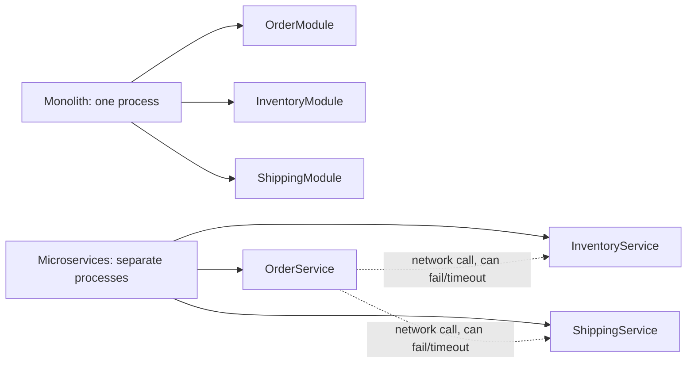
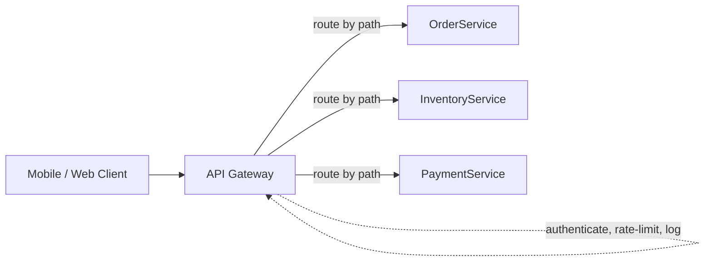
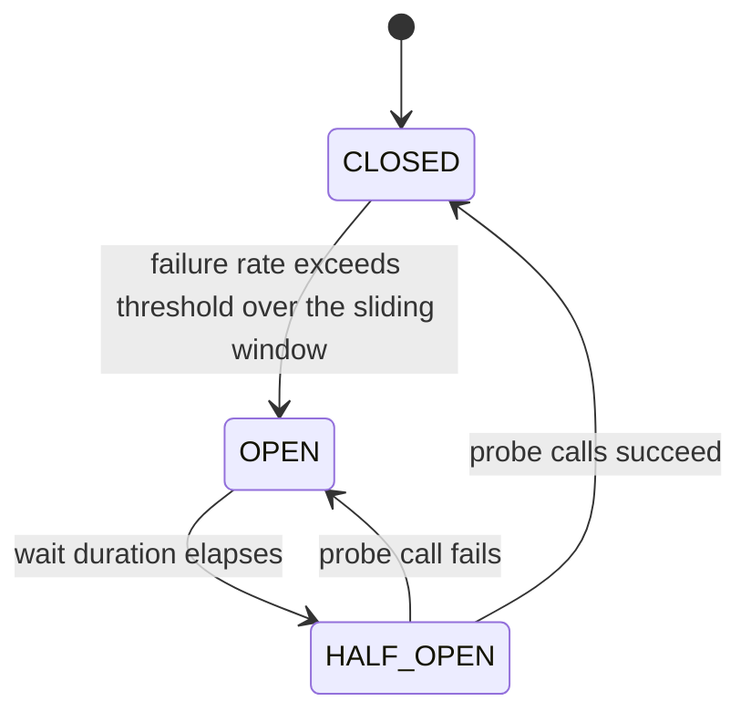
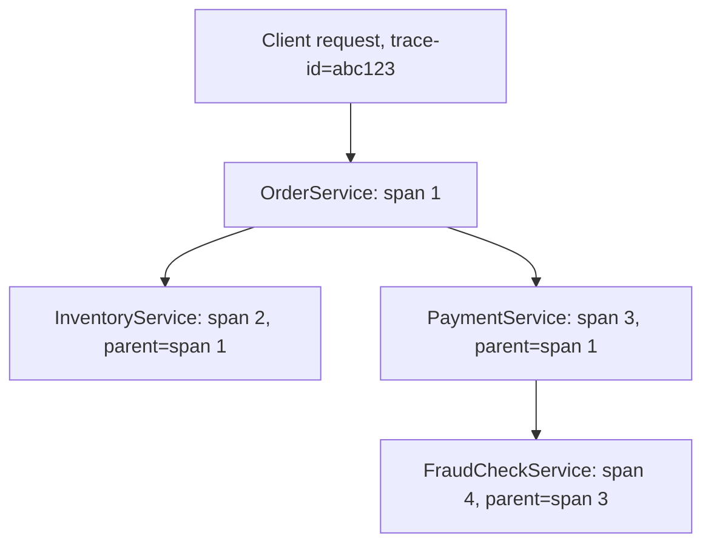
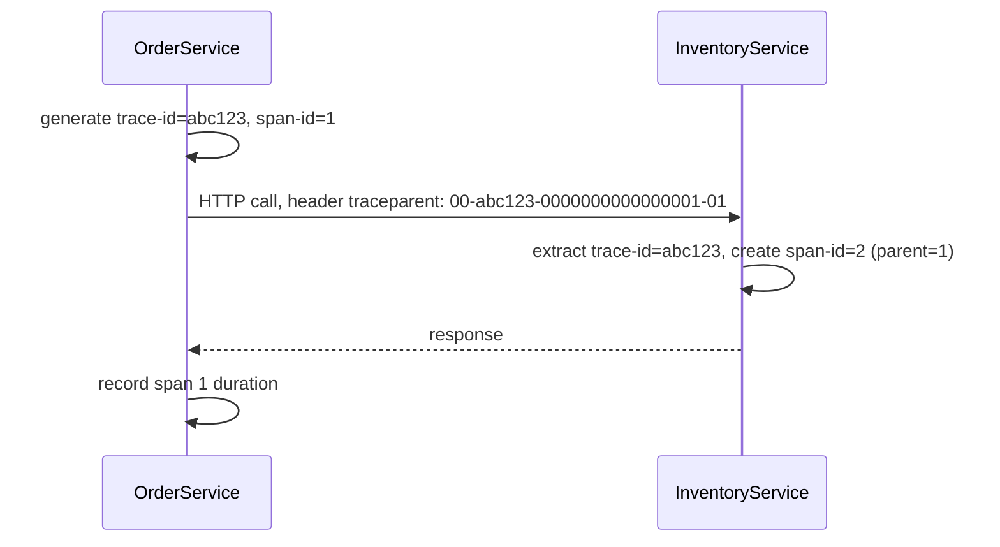

# Microservices Patterns: Discovery, Circuit Breakers & Config

Splitting a monolith into independently deployable services trades a single, simple failure mode (the whole application is up or down) for a distributed one, where any one of dozens of services can be slow or unreachable while the rest keep running. Interviewers probe this topic because the patterns here — service discovery, circuit breakers, externalized config, distributed tracing — are exactly the machinery that keeps a partial failure from becoming a total one, and knowing the names of the patterns without understanding their failure modes is a common gap.

---

## 🟢 Beginner Level

### Why decompose into services at all

A monolith deploys as one unit: every team's code ships together, and a bug in one module can crash the whole process, taking every feature down with it.

Splitting along business capability boundaries lets teams deploy independently and lets one service's outage stay contained to the features that actually depend on it, rather than taking down the entire application.

The cost is operational complexity: what used to be an in-process method call becomes a network call, which can be slow, can fail outright, or can succeed after an unpredictable delay — all failure modes an in-process call never had to consider.

A team that decomposes before it has the operational maturity to handle these new failure modes often trades a simple, reliable monolith for a distributed system that fails in ways nobody on the team has built the tooling to diagnose. The patterns in this topic exist precisely to close that maturity gap.



This topic covers the patterns that make the right side of that diagram survivable in production: knowing which instance to call, what to do when a call fails, and how to see what happened across services when something goes wrong.

### The problem service discovery solves

In a monolith, calling another module is a method call resolved at compile time. In a microservices deployment, `InventoryService` might run as 6 instances behind an auto-scaler, with instances added and removed continuously as load changes.

Hardcoding an IP address or hostname for a downstream service breaks the moment that instance is replaced — which, under a rolling deployment or an auto-scaling event, can happen constantly.

Service discovery solves this by having each service instance register itself with a registry on startup, and having callers ask the registry for a current, live list of instances instead of hardcoding one.

### Client-side vs. server-side discovery

**Client-side discovery** — the calling service queries the registry directly and picks an instance itself (often with client-side load balancing).

**Server-side discovery** — the caller sends the request to a fixed address (a load balancer or API gateway), which queries the registry and routes the request on the caller's behalf.

| Approach | Who queries the registry | Example | Trade-off |
|---|---|---|---|
| Client-side | The calling service | Netflix Eureka + Spring Cloud LoadBalancer | Caller needs discovery-client logic, but avoids an extra network hop |
| Server-side | A dedicated router/load balancer | Kubernetes Service, AWS ALB | Caller stays simple, but adds a hop and a potential bottleneck at the router |

A Kubernetes-native deployment typically uses server-side discovery implicitly: a Kubernetes `Service` object already load-balances across matching pod instances via `kube-proxy`, so an application calling another service by its Kubernetes DNS name (`inventory-service.default.svc.cluster.local`) gets discovery and load balancing for free, without any Eureka-style client library in the application code at all.

### Registering with a discovery server

```java
@SpringBootApplication
@EnableDiscoveryClient
public class InventoryServiceApplication {
    public static void main(String[] args) {
        SpringApplication.run(InventoryServiceApplication.class, args);
    }
}
```

`@EnableDiscoveryClient` registers this service instance with the configured registry (Eureka, Consul, or a Kubernetes-native mechanism) on startup and sends periodic heartbeats so the registry knows the instance is still alive.

A caller then looks up `InventoryService` by its logical name rather than a specific address:

```java
@LoadBalanced
@Bean
RestClient.Builder restClientBuilder() {
    return RestClient.builder();
}
```

```java
restClient.get().uri("http://inventory-service/api/items/{id}", itemId).retrieve();
```

`inventory-service` here is a logical name resolved through the discovery client at call time, not a real hostname — the `@LoadBalanced` builder is what makes that resolution happen transparently underneath an ordinary-looking HTTP call.

### Externalized configuration

A monolith often bundles its configuration inside the deployed artifact. A microservices deployment needs the same jar to run correctly across development, staging, and production, and across every instance of a horizontally scaled service, without rebuilding it per environment.

Spring's externalized configuration (`application.yml`, environment variables, or a config server) lets one build artifact behave differently per environment purely through configuration supplied at startup, keeping the deployable artifact identical across environments and making "what changed between staging and prod" a config diff instead of a code diff.

### The API Gateway pattern

A client application calling a dozen microservices directly needs to know every service's address, handle a dozen sets of authentication, and make a dozen separate round trips for what might logically be one screen's worth of data.

An API Gateway sits in front of the microservices as a single entry point: it routes each incoming request to the right downstream service (often using the same service discovery mechanism a service-to-service caller would use), and it is the natural place to centralize cross-cutting concerns like authentication, rate limiting, and request logging instead of duplicating them into every individual service.



Spring Cloud Gateway is the Spring ecosystem's implementation: routes are configured declaratively (by path, header, or other request attributes), and filters attached to a route can add, strip, or rewrite headers, enforce a rate limit, or apply a circuit breaker around the proxied call — the gateway itself becomes a caller subject to the same resilience patterns covered later in this topic.

This centralization is the gateway's core value: a change to how authentication tokens are validated, for instance, becomes one gateway-level change instead of a change duplicated across every individual service that would otherwise implement it independently.

A gateway is also a single point of failure and a potential bottleneck if it is not itself deployed with redundancy and appropriate capacity, so treating "we added a gateway" as automatically improving reliability, without also scaling and monitoring the gateway itself, trades one kind of risk for another rather than eliminating risk outright.

The same circuit breaker, bulkhead, and rate-limiter patterns covered later in this topic apply to the gateway's own outbound calls to backend services, since the gateway is itself just another caller from the perspective of whatever it is routing to.

---

## 🟡 Intermediate Level

### The circuit breaker — failing fast instead of failing slow

If `InventoryService` is down or badly overloaded, every call from `OrderService` to it will eventually time out — and if `OrderService` keeps calling it at the same rate, it burns threads and connections waiting on calls that are statistically very unlikely to succeed.

A circuit breaker wraps a call and tracks its recent success/failure rate; once failures cross a threshold, it "trips" and starts failing every subsequent call immediately, without even attempting the network call, until it decides enough time has passed to test recovery.



**CLOSED** is the normal state: calls pass through to the real downstream service, and the breaker just observes the outcome of each one.

**OPEN** means the breaker has tripped: calls fail immediately with a `CallNotPermittedException` (or route to a fallback) without ever reaching the network, which protects both the caller's own resources and the already-struggling downstream service from additional load.

**HALF_OPEN** is a recovery probe state: after the configured wait duration, the breaker allows a small number of real calls through to test whether the downstream has recovered, and decides whether to close or reopen based on their outcome.

### Worked example: a circuit breaker tripping under real numbers

Configure a Resilience4j circuit breaker with a sliding window of 10 calls, a failure-rate threshold of 50%, and a 30-second wait duration in the open state:

```java
CircuitBreakerConfig config = CircuitBreakerConfig.custom()
    .slidingWindowSize(10)
    .failureRateThreshold(50)
    .waitDurationInOpenState(Duration.ofSeconds(30))
    .permittedNumberOfCallsInHalfOpenState(3)
    .build();
```

`InventoryService` starts failing. Calls 1 through 4 in the window succeed; calls 5 through 9 fail (a real downstream outage begins partway through).

At call 9, the breaker evaluates its 10-call sliding window: `5` failures out of `9` observed calls so far is already above the `50%` threshold, so the breaker trips to **OPEN** before the window even fully fills, and call 10 fails immediately without reaching the network.

For the next 30 seconds, every call to `InventoryService` from this caller fails instantly via `CallNotPermittedException`. After 30 seconds, the breaker moves to **HALF_OPEN** and permits 3 probe calls through; if `InventoryService` has recovered and all 3 succeed, the breaker closes and normal traffic resumes, and if even one fails, it reopens and the 30-second wait restarts.

### Fallbacks — what to do instead of failing outright

A circuit breaker alone only converts "slow failure" into "fast failure" — it does not make the caller succeed. A fallback method supplies a degraded but useful response instead of propagating the failure to the end user.

```java
@CircuitBreaker(name = "inventoryService", fallbackMethod = "inventoryFallback")
public InventoryStatus checkStock(String itemId) {
    return inventoryClient.checkStock(itemId);
}

private InventoryStatus inventoryFallback(String itemId, Throwable t) {
    return InventoryStatus.unknown(itemId); // "we can't confirm stock right now"
}
```

A good fallback communicates degraded confidence honestly (`unknown` stock rather than silently claiming `inStock`) rather than fabricating a success response that could let an order through for an item that turns out to be unavailable.

Not every downstream call has a safe fallback — a payment authorization call failing has no honest degraded answer, since "assume the payment succeeded" and "assume it failed" are both wrong roughly half the time. For calls like that, the correct response to an open circuit is usually to fail the user-facing operation clearly and let the caller retry, rather than inventing a fallback value with no basis in what actually happened downstream.

### Config server and refresh scope

A Spring Cloud Config Server centralizes configuration for every service in one place, typically backed by a Git repository, so a configuration change is a commit and a redeploy-free refresh rather than a rebuild of every affected service.

```java
@RefreshScope
@Component
public class FeatureFlags {
    @Value("${feature.new-checkout-flow:false}")
    private boolean newCheckoutFlowEnabled;
}
```

`@RefreshScope` marks a bean for re-creation (picking up new property values) when a `/actuator/refresh` event fires, instead of requiring the whole service to restart to pick up a config change.

This only refreshes values used in `@RefreshScope` beans going forward — configuration already captured into a field outside such a bean, or baked into a static value at startup, does not update until an actual restart.

### Health checks and readiness probes

Service discovery only helps if the registry's list of instances is accurate — an instance that is running but unable to serve traffic (still starting up, database connection lost, out of memory) needs to be removed from routing consideration even while its process is technically alive.

Spring Boot Actuator's `/actuator/health` endpoint distinguishes **liveness** (is the process running at all, should it be restarted if not) from **readiness** (is the process currently able to serve traffic, should it receive requests right now) — a service can be alive but not ready, for example during a slow startup sequence that still needs to warm a cache before accepting real load.

```java
@Component
public class DatabaseHealthIndicator implements HealthIndicator {
    private final DataSource dataSource;

    @Override
    public Health health() {
        try (Connection ignored = dataSource.getConnection()) {
            return Health.up().build();
        } catch (SQLException e) {
            return Health.down(e).build();
        }
    }
}
```

A custom `HealthIndicator` like this one contributes to the overall readiness result: if the database is unreachable, `/actuator/health/readiness` reports `DOWN`, and a Kubernetes readiness probe (or the discovery client's own health check) stops routing new traffic to this instance without killing the process outright.

This distinction matters operationally: conflating liveness and readiness into one check means a temporary downstream outage (which should only affect readiness) can trigger unnecessary process restarts, churning healthy instances during exactly the kind of transient degradation a circuit breaker is meant to absorb gracefully instead.

A readiness check that itself calls a downstream dependency needs its own timeout and should never block indefinitely, since a slow readiness check delays startup and can make an orchestrator conclude the instance failed to start at all, when it was simply waiting on a check that never returned.

### Distributed tracing — following one request across services

A single user-facing request to `OrderService` might fan out into calls to `InventoryService`, `PaymentService`, and `ShippingService` — when it is slow, "which of those four services was slow, and for how long" is not answerable from any single service's own logs alone.

Distributed tracing solves this by generating a trace id for the original request and propagating it (along with a per-service span id) through every downstream call, so every service's logs and spans can later be correlated back into one end-to-end picture of the request.



Micrometer Tracing (the successor to Spring Cloud Sleuth) automatically injects trace and span ids into outgoing HTTP headers and log output, and a collector such as Zipkin or an OpenTelemetry backend assembles the individual spans into one visualized trace.

---

## 🔴 Expert Level

### Sliding window types — count-based vs. time-based

A count-based sliding window (the example above) evaluates the failure rate over the last N calls, regardless of how long they took to accumulate — under low traffic, that window can span minutes; under high traffic, seconds.

A time-based sliding window instead evaluates the failure rate over the last N seconds, regardless of how many calls occurred in that period, which behaves more predictably under highly variable traffic because the evaluation period itself does not stretch or shrink with load.

| Window type | Evaluation basis | Behaves well when | Can misbehave when |
|---|---|---|---|
| Count-based | Last N calls | Traffic is roughly steady | Traffic is bursty — window duration varies wildly |
| Time-based | Last N seconds | Traffic is bursty or variable | Very low traffic — too few calls to evaluate a meaningful rate |

Resilience4j additionally requires a `minimumNumberOfCalls` before it will evaluate a failure rate at all in either mode, specifically to avoid tripping a breaker off a statistically meaningless sample of 1-2 calls right after startup.

```java
CircuitBreakerConfig config = CircuitBreakerConfig.custom()
    .slidingWindowType(SlidingWindowType.TIME_BASED)
    .slidingWindowSize(60) // last 60 seconds
    .minimumNumberOfCalls(20)
    .failureRateThreshold(50)
    .build();
```

With this configuration, a downstream that receives only 5 calls in a quiet 60-second window never trips the breaker regardless of how many of those 5 fail, because `minimumNumberOfCalls` of 20 has not been met — the breaker correctly treats "too little data to judge" as distinct from "the data says this is healthy."

### Bulkheads and rate limiting alongside circuit breakers

A circuit breaker protects against a downstream that is already failing, but it does nothing to prevent one slow (not yet failing) downstream from exhausting the caller's own thread pool or connection pool while calls are still technically succeeding, just slowly.

A **bulkhead** (the term borrowed from ship compartmentalization) isolates the resources used to call one downstream from the resources used to call others, typically by giving each downstream dependency its own bounded thread pool or semaphore, so a slow `InventoryService` cannot starve the threads `PaymentService` calls need.

A **rate limiter** caps the number of calls permitted to a downstream per time window regardless of success or failure, protecting the downstream from being overwhelmed by the caller's own retry or traffic-growth behavior rather than reacting to observed failures after the fact.

These three patterns are complementary, not redundant: a bulkhead limits blast radius from a slow dependency, a rate limiter caps outbound load proactively, and a circuit breaker reacts to an already-elevated failure rate — a resilient client to an important downstream typically combines all three rather than relying on any one alone.

Worked example: a bulkhead configured with a max concurrent-calls limit of 10 for the `inventoryService` client means at most 10 calls can be in flight to that dependency at once, regardless of how many threads the wider application has available.

```java
Bulkhead bulkhead = Bulkhead.of("inventoryService",
    BulkheadConfig.custom().maxConcurrentCalls(10).maxWaitDuration(Duration.ofMillis(500)).build());
```

If inventory calls start taking 2 seconds each instead of the normal 50ms, the 11th concurrent caller waits up to the configured `maxWaitDuration` of 500ms for a slot to free up, then fails fast with a `BulkheadFullException` rather than queuing indefinitely — that failure is contained to inventory-bound requests specifically, while payment and shipping calls, drawing from their own separate bulkheads, continue processing normally at their usual latency.

### Trace context propagation across process boundaries

The trace id and span id need to survive an HTTP call from one JVM to another, which means they travel as HTTP headers, not as in-memory state — the W3C Trace Context standard (`traceparent` header) or the older B3 format (`X-B3-TraceId`, `X-B3-SpanId`) both encode this the same conceptual way.



An instrumentation library that forgets to propagate the header on one specific call path (a manually constructed `RestTemplate`/`RestClient` call outside the auto-instrumented client, for instance) breaks the trace at that point — the downstream call still happens and still succeeds, but it starts a brand new, disconnected trace instead of continuing the original one, which is a common and hard-to-notice observability gap.

Sampling matters at scale: tracing every single request in a high-throughput system is expensive to store and mostly redundant, so production tracing systems typically sample a percentage of traces (often with a higher rate for traces containing an error) rather than capturing 100% of traffic.

The sampling decision is normally made once, at the root span, and propagated to every downstream span via the same trace-context header — a sampling flag decided independently by each service partway through a trace would produce fragments of a trace with no way to reassemble the full picture, since some services would have discarded spans that others kept.

Consistent, root-decided sampling is what keeps a sampled trace complete end to end rather than partially recorded.

### Production failure modes: cascading failures and thundering herds

A **cascading failure** happens when one slow service exhausts a caller's resources (threads, connections) waiting on it, which then makes the caller itself slow to its own callers, and the slowness propagates backward through the call graph — exactly the failure mode circuit breakers and bulkheads exist to stop at the first hop rather than letting it propagate.

A **thundering herd** on service discovery happens when many caller instances simultaneously detect a downstream instance's removal from the registry and simultaneously reconnect or re-resolve, creating a load spike on the registry and the remaining healthy instances at the exact moment the system is already down an instance — jittered retry and connection-pool warm-up delays are the standard mitigation, spreading the reconnection load out instead of concentrating it.

A circuit breaker's own `waitDurationInOpenState` can itself synchronize into a thundering herd if every caller instance trips at the same moment and all retry at the same moment 30 seconds later — adding jitter to the wait duration (a random component on top of the base delay) avoids every instance's probe calls landing on the recovering downstream in the same instant.

Service discovery itself can compound a cascading failure if it is slow to remove a dead instance from its registered list: callers keep routing a share of traffic to an instance that is failing every request until the registry's health check catches up, effectively reducing the pool of healthy instances that must absorb the same total load. A shorter health-check interval speeds up removal but increases load on the registry from more frequent checks, so the interval itself is a trade-off, not a value to minimize unconditionally.

Combining a reasonable check interval with client-side circuit breakers gives two independent layers of protection against a slow-to-be-removed instance: the registry eventually removes it, and any caller that still routes to it in the meantime stops sending traffic on its own once that instance's own failure rate trips the breaker.

### Common Misconceptions

1. **"A circuit breaker prevents failures."**
   *Correction*: A circuit breaker does not prevent the underlying failure; it converts a slow failure into a fast one and stops the caller from wasting resources on calls unlikely to succeed. The actual downstream problem still needs its own fix.

2. **"Service discovery means the client no longer needs to handle a downstream being unavailable."**
   *Correction*: Discovery solves "which instance do I call," not "what happens when every instance is unhealthy." A caller still needs a circuit breaker, timeout, and fallback strategy for the case where discovery successfully returns instances that are all failing.

3. **"Distributed tracing happens automatically with zero configuration once a tracing library is on the classpath."**
   *Correction*: Auto-instrumentation covers common call paths (Spring MVC, common HTTP clients, common messaging clients), but a manually constructed client or an unusual call path can silently break propagation. Verify an actual end-to-end trace in the tracing backend, rather than assuming the library caught every path.

4. **"A time-based sliding window is always more accurate than a count-based one."**
   *Correction*: A time-based window can evaluate a failure rate off too few calls during a genuinely quiet period, producing a statistically meaningless trip or non-trip decision. Both window types need `minimumNumberOfCalls` protection, and the right choice depends on whether the caller's traffic is steady or bursty.

5. **"Externalized configuration means secrets can live in the same config repository as ordinary settings."**
   *Correction*: A Git-backed config server is not automatically an appropriate place for credentials or API keys, since it is typically readable by the same broad set of engineers who can read application configuration. Secrets need a dedicated secrets manager (Vault, AWS Secrets Manager) with its own access control, referenced from config rather than stored directly in it.

### Interview Questions

**Q1. What problem does service discovery solve that a hardcoded hostname does not?** `[easy]`

Service instances in a microservices deployment are added and removed continuously under auto-scaling and rolling deployments. A hardcoded address breaks the moment that specific instance is replaced. Service discovery instead lets a caller ask a registry for a current, live list of instances at call time, so the caller never depends on any one instance's address staying valid.

**Q2. What is the difference between client-side and server-side service discovery?** `[easy]`

In client-side discovery, the calling service queries the registry directly and picks an instance itself, often with client-side load balancing. In server-side discovery, the caller sends the request to a fixed router or load balancer, which queries the registry and forwards the request. This keeps the discovery logic out of the caller entirely, at the cost of an extra network hop through the router.

**Q3. What does a circuit breaker's OPEN state actually do?** `[easy]`

In the OPEN state, the breaker fails every call immediately without attempting the network call at all, typically raising an exception or routing to a fallback. This protects the caller's own threads and connections from being tied up waiting on calls unlikely to succeed. It also reduces additional load on an already-struggling downstream service, giving it room to recover instead of being hit by continued traffic.

**Q4. Why does externalized configuration matter more in a microservices deployment than in a monolith?** `[easy]`

The same build artifact needs to run correctly across multiple environments and across many horizontally scaled instances of one service, without a rebuild per environment. Externalizing configuration keeps the deployable artifact identical everywhere. It turns an environment difference into a config diff rather than a code diff, which also makes "what changed between staging and prod" auditable without comparing two separate builds.

**Q5. Walk through what a circuit breaker's HALF_OPEN state is for.** `[medium]`

After the configured wait duration elapses in the OPEN state, the breaker allows a small, configured number of real calls through as a recovery probe rather than assuming recovery or continuing to fail everything blindly. If those probe calls succeed, the breaker closes and resumes normal traffic; if even one fails, it reopens and the wait timer restarts.

**Q6. Why is a fallback method necessary in addition to a circuit breaker?** `[medium]`

A circuit breaker on its own only converts a slow failure into a fast one; it does not make the caller's own request succeed. A fallback method supplies a degraded but honest response, such as marking stock status as unknown rather than assuming availability, so the end user gets a usable outcome instead of a propagated failure.

**Q7. What is the practical effect of `@RefreshScope` on a Spring bean?** `[medium]`

It marks the bean for re-creation, picking up new property values, when a refresh event fires rather than requiring the whole service to restart. Only values actually read from that refresh-scoped bean pick up the change; a value already captured into a plain field outside that mechanism, or resolved once at startup elsewhere, does not update until a real restart.

**Q8. What is the difference between a count-based and a time-based sliding window in a circuit breaker?** `[medium]`

A count-based window evaluates the failure rate over the last N calls regardless of how long they took to occur, so its duration stretches or shrinks with traffic volume. A time-based window evaluates the failure rate over the last N seconds regardless of call count. That behaves more predictably under bursty traffic, but it can be statistically unreliable during a genuinely quiet period when too few calls land inside the window to evaluate a meaningful rate.

**Q9. Why does a bulkhead matter even if a circuit breaker is already in place?** `[medium]`

A circuit breaker only trips once a downstream is already failing at a measurable rate; it does nothing for a downstream that is merely slow while its calls are still technically succeeding. A bulkhead isolates the thread or connection pool used for one downstream from others, so a slow-but-not-yet-failing dependency cannot starve resources another dependency needs.

**Q10. Why do trace ids and span ids need to travel as HTTP headers rather than in-memory context?** `[medium]`

A trace spans multiple separate JVM processes connected only by network calls, so any state that needs to survive the hop between services has to be serialized into the request itself, since nothing about a separate process's memory is visible to the caller. The W3C Trace Context `traceparent` header or the B3 headers carry the trace id and parent span id across that boundary. The receiving service extracts them and continues the same trace under a new child span, instead of starting a disconnected one with no relationship to the original request.

**Q11. Scenario: after adding a circuit breaker to a critical downstream call, the team notices that every 30 seconds, several caller instances simultaneously spike load against the recovering downstream, sometimes re-tripping it. What is happening, and how do you fix it?** `[hard]`

Multiple caller instances tripped their circuit breakers at approximately the same moment during the original outage, so their identical `waitDurationInOpenState` timers all expire at the same moment. Their half-open probe calls then all land on the downstream simultaneously, which is a thundering herd caused by the circuit breaker's own synchronized timing rather than by anything the downstream did. Adding jitter, a randomized component on top of the base wait duration so each instance's timer expires at a slightly different moment, spreads the probe traffic out instead of concentrating it.

**Q12. Scenario: a distributed trace for a slow checkout request shows a large, unexplained gap in the timeline between `OrderService` finishing its span and `PaymentService`'s span starting, with no service failure reported. What's the likely cause?** `[hard]`

The most likely explanation is that the request spent that time queued somewhere invisible to tracing, such as waiting for an available thread in a saturated pool, waiting in a message broker before a consumer picked it up, or blocked on a connection-pool checkout, none of which is itself an instrumented span. Tracing shows where time was spent, but only within instrumented spans, so a resource-queueing delay between two spans is exactly the kind of gap it will not explain by itself. Check thread pool and connection pool saturation metrics for the window matching that gap before assuming the gap represents genuine downstream latency.

**Q13. Scenario: a service calling three downstreams (inventory, payment, shipping) starts failing entirely whenever any single one of them is degraded, even though the other two are healthy. What pattern is missing, and why?** `[hard]`

This is the classic symptom of a missing bulkhead. Without one, all three downstream calls likely share the caller's single thread pool or connection pool, so a slow inventory dependency exhausts the shared resource pool and starves calls to payment and shipping even though those downstreams are perfectly healthy. Giving each downstream its own isolated thread pool or semaphore-based bulkhead contains a slow dependency's impact to only the calls that actually depend on it, rather than letting resource exhaustion spill over into unrelated call paths.

**Q14. Scenario: after moving configuration to a Spring Cloud Config Server backed by Git, a security review flags that database credentials are stored in plaintext in that same repository, readable by the whole engineering org. What is the fix, and why doesn't `@RefreshScope` alone solve it?** `[hard]`

`@RefreshScope` only controls when a bean picks up a new property value; it has no bearing on who can read that value from the underlying config store, so it does not address the access-control problem at all. The fix is moving credentials into a dedicated secrets manager, such as Vault or AWS Secrets Manager, with its own narrower access control, and having the application configuration reference that secret rather than embedding its value directly in the Git-backed config repository.

### Further Reading

- [Spring Cloud Netflix: Eureka client](https://docs.spring.io/spring-cloud-netflix/reference/spring-cloud-netflix.html) covers service registration and discovery mechanics.
- [Resilience4j documentation: CircuitBreaker](https://resilience4j.readme.io/docs/circuitbreaker) details sliding window types, states, and configuration.
- [Spring Cloud Config reference](https://docs.spring.io/spring-cloud-config/reference/) covers the config server, refresh scope, and Git-backed configuration.
- [Micrometer Tracing documentation](https://docs.micrometer.io/tracing/reference/) covers trace/span propagation, context, and backend integration.
