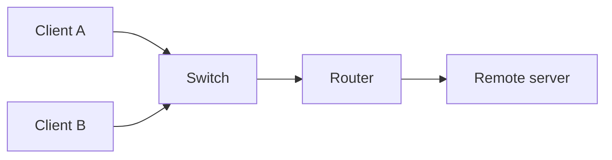
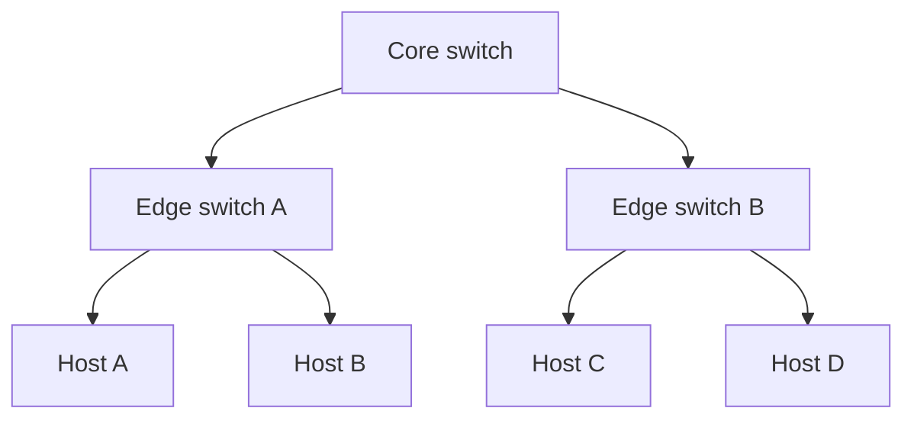
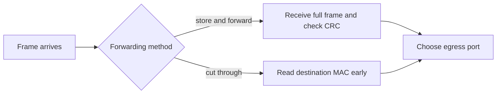

# Computer Network Fundamentals, Devices & Topologies

Computer networking moves data between independent hosts over shared physical and logical links.
This first lesson establishes the vocabulary for later protocol lessons: topology, forwarding devices, switching models, performance, and the distinction between a packet's path and an application's service contract.
Interviewers use these basics to test whether a design choice is justified by failure domains, traffic patterns, and measurable latency rather than a memorized layer number.

## 🟢 Beginner Level

### What is a Computer Network?
A **Computer Network** is an interconnected collection of autonomous computational nodes (computers, servers, smartphones, IoT sensors, switches, routers) capable of exchanging data and sharing resources (such as storage, compute power, printers, and internet access) over communication channels.



```
       [ Client A ] ──────┐
                          │
       [ Client B ] ──── [ SWITCH / ROUTER ] ──── [ Cloud / Server ]
                          │
       [ Client C ] ──────┘
```

### Network Classifications by Geographical Scale

| Network Type | Full Name | Coverage Range | Typical Data Rates | Example Use Case |
| :--- | :--- | :--- | :--- | :--- |
| **PAN** | Personal Area Network | ~1 to 10 meters | 1 – 24 Mbps (Bluetooth) | Smartwatch synced to phone, wireless headphones |
| **LAN** | Local Area Network | ~10m to 1 km | 100 Mbps – 10 Gbps (Ethernet/Wi-Fi) | Home, university lab, office floor |
| **CAN** | Campus Area Network | ~1 km to 5 km | 1 Gbps – 10 Gbps | College campus, military base |
| **MAN** | Metropolitan Area Network | ~5 km to 50 km | 100 Mbps – 1 Gbps (Fiber rings) | City-wide cable TV, municipal municipal network |
| **WAN** | Wide Area Network | Country / Global | Variable (Mbps to 100+ Gbps) | The Global Internet, cross-continent enterprise WAN |

### Network Hardware Devices & OSI Layer Mappings

1. **Repeater & Hub (Layer 1 - Physical)**:
   - **Repeater**: Regenerates electrical or optical signals attenuated over long distances.
   - **Hub**: A multiport repeater. Operates in a **single collision domain** and a **single broadcast domain**. It blindly broadcasts all incoming electrical signals to every connected port (half-duplex).
2. **Bridge & Switch (Layer 2 - Data Link)**:
   - **Switch**: A multiport bridge that maintains a hardware **MAC Address Table (CAM Table)**. Inspects destination MAC addresses in Ethernet frames and forwards traffic exclusively to the designated egress port. Creates separate collision domains per port while maintaining a single broadcast domain.
3. **Router (Layer 3 - Network)**:
   - Connects heterogeneous networks (e.g., LAN to WAN). Maintains a **Routing Table** and forwards IP packets based on logical IP addressing, breaking both collision and broadcast domains.
4. **Modem (Modulator-Demodulator)**:
   - Converts digital signals from computers into analog signals for transmission over analog telephone/coaxial lines and demodulates analog signals back to digital.
5. **Access Point (AP)**:
   - Transceives radio frequency (RF) signals allowing Wi-Fi enabled client devices to connect to a wired Ethernet backbone.

### Packet Switching vs. Circuit Switching

```
CIRCUIT SWITCHING (Dedicated Pipe):
[Host A] ════════════════════════════════════════════════════════ [Host B]
           (Dedicated continuous physical path, e.g. Landline PSTN)

PACKET SWITCHING (Shared Statistical Multiplexing):
[Host A] ──[Pkt 1]──► [ Router 1 ] ──[Pkt 1]──► [ Router 3 ] ──► [Host B]
         ──[Pkt 2]──► [ Router 2 ] ──[Pkt 2]──►
```

| Feature | Packet Switching | Circuit Switching |
| :--- | :--- | :--- |
| **Connection Setup** | No pre-allocation needed (Connectionless / Datagram) | Explicit reservation phase required prior to transfer |
| **Resource Allocation** | Dynamic, statistical multiplexing | Dedicated reserved bandwidth per call |
| **Bandwidth Efficiency** | **High** (Idle capacity used by other packets) | **Low** (Idle line capacity is wasted) |
| **Congestion / Latency** | Variable delay (queuing + processing jitter) | Constant latency once established |
| **Failure Recovery** | Robust (packets dynamically rerouted around dead nodes) | Fragile (entire circuit drops if one switch fails) |
| **Primary Domain** | The Internet (IP), Ethernet | Traditional PSTN Telephony |

---

## 🟡 Intermediate Level

### Network Topologies

A network **topology** defines the geometric and logical arrangement of nodes and communication links.



```
1. STAR TOPOLOGY          2. BUS TOPOLOGY             3. RING TOPOLOGY
     [Node A]                [Node A]  [Node B]           [A] ──► [B]
        │                       │         │                ▲       │
  [Hub/Switch] ── [Node B]  ════╪═════════╪════ (Bus)      │       ▼
        │                       │         │               [D] ◄── [C]
     [Node C]                [Node C]  [Node D]
```

```
4. FULL MESH TOPOLOGY                      5. TREE / HIERARCHICAL TOPOLOGY
      [A] ───────── [B]                                [Core Switch]
      │ ╲         ╱ │                                 ╱             ╲
      │   ╲     ╱   │                       [Dist Switch 1]     [Dist Switch 2]
      │     ╳       │                           ╱        ╲           ╱        ╲
      │   ╱     ╲   │                       [Edge 1]  [Edge 2]   [Edge 3]  [Edge 4]
      [C] ───────── [D]
```

#### Topology Evaluation & Cost Analysis

| Topology | Cable Lines Needed ($N$ nodes) | Fault Tolerance | Scalability & Installation | Bottlenecks / Failure Point |
| :--- | :--- | :--- | :--- | :--- |
| **Star** | $N$ | **Moderate** (Single cable failure affects only 1 node) | Easy to add/remove nodes | Central Switch/Hub is a Single Point of Failure (SPOF) |
| **Bus** | $1$ backbone trunk | **Low** (Backbone break splits or crashes entire bus) | Difficult to troubleshoot reflections | Bus terminators, traffic collisions |
| **Ring** | $N$ | **Low** (Single token break halts ring unless dual counter-rotating ring) | Hard to reconfigure live ring | Any broken node drops the loop |
| **Full Mesh** | $\frac{N(N-1)}{2}$ | **Highest** (Multiple redundant paths available) | Extremely expensive & complex ($O(N^2)$ cabling) | High port density and maintenance cost |
| **Partial Mesh** | Between $N$ and $\frac{N(N-1)}{2}$ | **High** (Redundant links only between critical core routers) | Cost-effective compromise for WAN backbones | Complex dynamic routing protocols needed |
| **Tree / Hybrid**| $N-1$ | **Moderate to High** (Failure of a leaf isolates only that branch) | Highly scalable for enterprise hierarchies | Failure of root/core switch isolates subnets |

### Network Communication Models: Client-Server vs. Peer-to-Peer (P2P)

```
CLIENT-SERVER ARCHITECTURE:
    [Client 1] ──┐
    [Client 2] ──┼──► [ Centralized Server ] (Database / Web API)
    [Client 3] ──┘

PEER-TO-PEER (P2P) ARCHITECTURE:
    [ Peer A ] ◄───────► [ Peer B ]
        ▲                   ▲
        │                   │
        ▼                   ▼
    [ Peer C ] ◄───────► [ Peer D ] (BitTorrent, Blockchain, IPFS)
```

- **Client-Server**:
  - Dedicated central nodes respond to client requests.
  - Strengths: Centralized security, backup, access control, consistency.
  - Weaknesses: Central bottleneck, costly server scaling, single point of failure.
- **Peer-to-Peer (P2P)**:
  - Every node acts as both a consumer (Client) and provider (Server) of resources (e.g. BitTorrent, Bitcoin network).
  - Strengths: High fault tolerance, decentralized scaling, cost-free infrastructure.
  - Weaknesses: Complex discovery (Distributed Hash Tables - DHT), lack of centralized trust, security vulnerabilities.

### Modes of Data Transmission

1. **Simplex**:
   - Unidirectional communication only. One transmitter, one receiver (e.g., Keyboards to CPU, Radio/TV broadcast, GPS satellites).
2. **Half-Duplex**:
   - Bidirectional communication, but **only one direction at a time**. Nodes must take turns transmitting (e.g., Walkie-Talkies, Legacy Hub-based Ethernet with CSMA/CD).
3. **Full-Duplex**:
   - Simultaneous bidirectional transmission on separate transmit/receive wire pairs or frequency channels (e.g., Modern switched Ethernet, Telephone calls, Fiber optics).

### Core Network Performance Metrics

- **Bandwidth**: The theoretical maximum data carrying capacity of a link (measured in bits per second, e.g., 1 Gbps).
- **Throughput**: The actual rate of successful data delivery over a channel in real conditions (always $\le$ Bandwidth due to protocol overhead, loss, and latency).
- **Latency (Propagation + Transmission + Queuing + Processing Delay)**:
  $$\text{Total Latency} = D_{\text{prop}} + D_{\text{trans}} + D_{\text{queue}} + D_{\text{proc}}$$
  - $D_{\text{trans}} = \frac{L \text{ (Packet Length in bits)}}{R \text{ (Transmission Rate in bps)}}$
  - $D_{\text{prop}} = \frac{d \text{ (Distance in meters)}}{s \text{ (Propagation Speed } \approx 2 \times 10^8 \text{ m/s in copper/fiber)}}$
- **Jitter**: The statistical variance in packet arrival latency. Critical for VoIP and live video streaming.

---

## 🔴 Expert Level

### Packet Forwarding Mechanics: Store-and-Forward vs. Cut-Through

Modern network switches and routers forward packets using two fundamental internal architectures:



```
1. STORE-AND-FORWARD SWITCHING:
   Frame In ──► [ Full Buffer (64-1518 bytes) ] ──► [ CRC-32 Checksum Validation ] ──► Egress Port
   (Zero bad frames forwarded, but higher latency equal to frame serialization time)

2. CUT-THROUGH SWITCHING:
   Frame In ──► [ Inspect first 6 bytes: Dst MAC ] ──► Immediately Forward to Egress Port
   (Ultra-low latency (< 1 microsecond), but corrupted frames are propagated downstream)
```

- **Fragment-Free (Modified Cut-Through)**: Reads the first 64 bytes (the minimum Ethernet collision window size) to filter out runt frames caused by CSMA/CD collisions before forwarding.

### Virtual Circuit vs. Datagram Networks

```
DATAGRAM NETWORKS (Connectionless - IP):
- Each packet contains full Destination IP address.
- Packets of the same flow may follow entirely different paths.
- Out-of-order delivery handled by end hosts (TCP).

VIRTUAL CIRCUIT NETWORKS (Connection-Oriented - MPLS / ATM / X.25):
- Virtual Circuit Identifier (VCI / MPLS Label) in header.
- Explicit signaling phase sets up state in intermediate switches.
- Fixed route for all packets in the flow; guaranteed FIFO delivery.
```

### Software-Defined Networking (SDN) Architecture

Traditional networking couples the **Control Plane** (routing logic, OSPF/BGP calculations) and **Data Plane** (packet forwarding hardware ASIC) inside every individual box.

SDN physically separates these layers:
- **Centralized Control Plane**: A centralized software SDN Controller (e.g., OpenDaylight, ONOS) computes global routing topology and provisions rules via southbound APIs (**OpenFlow**, P4).
- **Decoupled Data Plane**: Commodity white-box switches simply perform line-rate flow-table matching and forwarding without running complex distributed routing protocols locally.

```
┌─────────────────────────────────────────────────────────────┐
│               SDN Applications (Load Balancers, Firewalls)   │
├─────────────────────────────────────────────────────────────┤
│         Northbound API (RESTful / gRPC)                     │
├─────────────────────────────────────────────────────────────┤
│       SDN CONTROLLER (Centralized Routing & Policy Engine)  │
├─────────────────────────────────────────────────────────────┤
│         Southbound API (OpenFlow / P4 / NETCONF)            │
├─────────────────────────────────────────────────────────────┤
│   [ Whitebox Switch 1 ]   [ Whitebox Switch 2 ]   [ Switch 3 ]│
└─────────────────────────────────────────────────────────────┘
```

---

### Key Interview Questions

#### Q1: Why does a Layer 2 Switch separate Collision Domains while a Layer 1 Hub does not?
**Answer**: A Hub is an unmanaged physical repeater; electrical pulses arriving on one pin are repeated across all pins simultaneously. If two nodes transmit at the same time, electrical signals collide and destroy data across the entire hub (1 shared collision domain). A Switch has a dedicated buffer and microprocessor per port. When a frame arrives, the switch stores it in memory, consults its CAM table, and forwards it solely onto the specific destination port. Collisions cannot occur between ports, making every single switch port its own independent collision domain.

#### Q2: If link bandwidth is 100 Mbps and propagation delay is 20 ms, what is the Bandwidth-Delay Product (BDP)?
**Answer**:
$$\text{BDP} = \text{Bandwidth} \times \text{RTT} = 100 \times 10^6 \text{ bps} \times (2 \times 0.020 \text{ s}) = 4{,}000{,}000 \text{ bits} = 500{,}000 \text{ bytes} \ (500 \text{ KB})$$
The BDP represents the total volume of "in-flight" unacknowledged data necessary to fully saturate the transmission pipe.

#### Q3: What happens when a switch's MAC Address CAM Table becomes full or receives a frame for an unknown MAC?
**Answer**: When a switch receives a unicast frame whose destination MAC address is not currently in its CAM table, it performs **Unknown Unicast Flooding** — it broadcasts the frame out of all ports within that VLAN except the arrival port. Once the target host replies, the switch records the source MAC and ingress port, populating the CAM table. If an attacker floods random MACs (CAM Table Overflow attack), the switch reverts to behaving like a dumb hub, broadcasting all traffic to all ports and exposing unencrypted traffic to eavesdropping.

### Encapsulation and Failure Domains

An application creates bytes such as an HTTP request.
Transport adds ports and reliability information when required.
IP adds source and destination network addresses so routers can forward between networks.
Ethernet or Wi-Fi adds local-link addressing for one hop.
Each router removes the incoming link header and creates a new one for the next link.

Broadcast traffic normally remains inside one Layer 2 broadcast domain or VLAN.
A router does not forward ordinary Layer 2 broadcast frames between IP networks.
This boundary limits the scope of address-resolution and broadcast storms.
A switch port isolates collision behavior but not necessarily broadcast traffic in its VLAN.

MAC addresses identify interfaces on a local link.
IP addresses identify logical network locations and are used for routed forwarding.
Ports identify application endpoints on a host.
Confusing these identities leads to incorrect troubleshooting and weak firewall rules.

### Worked Example: Link Delay and Throughput

Assume a 1,500-byte Ethernet payload is sent on a 100 Mb/s link.
Ignoring framing overhead, serialization delay is $(1500 \times 8) / 100{,}000{,}000 = 0.00012$ seconds, or 120 microseconds.
Assume the fiber path is 200 km and propagation is about $2 \times 10^8$ meters per second.
Propagation delay is $200{,}000 / 200{,}000{,}000 = 0.001$ seconds, or 1 ms.

The link therefore spends much longer propagating than serializing this one packet.
At 10 Mb/s the same packet serialization delay becomes 1.2 ms.
Queueing can exceed both values during congestion, which is why link speed alone does not predict application latency.
Bandwidth is capacity, throughput is delivered rate, and latency is time; they must be measured separately.

### Address Learning and Forwarding

A switch learns by recording a source MAC address and ingress port in its forwarding table.
For a known destination in the same VLAN, it transmits only through the recorded egress port.
For an unknown unicast or permitted broadcast, it floods to other ports in the VLAN.
The destination's reply gives the switch an opportunity to learn the reverse mapping.

Entries age out because hosts move, ports change, and stale mappings would misdirect traffic.
Port security, MAC limits, VLAN assignment, and authentication can constrain who may attach to an access port.
Layer 2 learning does not authenticate the source MAC address by itself.
Attackers can forge source addresses, so trust boundaries need controls above simple CAM learning.

### Topology Is a Trade-off

Star topology simplifies cabling and limits a leaf-link fault to one host.
Its central switch or uplink can become a single point of failure without redundancy.
Mesh topology supplies alternate paths but needs routing, loop prevention, more ports, and operational discipline.
Tree topologies scale by aggregating edge switches into distribution and core layers.

Redundancy can create loops.
At Layer 2, repeated broadcast frames can multiply indefinitely without loop prevention such as spanning-tree mechanisms or carefully designed fabrics.
At Layer 3, routing protocols and equal-cost multipath choose among paths while limiting forwarding loops through TTL or hop-limit behavior.
More links improve availability only when the control plane and failure testing make them usable.

### Packet Switching, Queues, and Loss

Packet switching multiplexes traffic statistically: an idle flow does not reserve all link capacity.
This raises utilization for bursty traffic but requires buffers when arrivals briefly exceed transmission rate.
Buffers absorb small bursts and reorder service according to scheduling policy.
Long buffers can create bufferbloat, where packets are delivered eventually but with unacceptable queue delay.

When a queue is full, a device drops a packet or applies active queue management.
Reliable transports may retransmit, while real-time media may prefer a late packet to be dropped rather than delivered after its playout deadline.
Network design therefore starts from workload needs: loss tolerance, latency target, rate, and failure behavior.
Do not treat packet loss as automatically a routing failure.

### Control Plane and Data Plane

The data plane forwards individual frames or packets according to installed tables.
The control plane discovers topology, exchanges reachability information, and installs those tables.
On a home router these functions can be hidden in one box.
In a large network they are separate operational concerns with different failure modes and observability.

SDN centralizes some policy and route computation while devices perform table matching in a data plane.
Centralized control does not remove the need for distributed failure handling because switches still need safe behavior when a controller is unavailable.
Policy rollout should be versioned, validated, and reversible because one bad forwarding rule can impact many flows at once.

### Common Misconceptions

1. **"Bandwidth and throughput are the same."**
   *Correction*: Bandwidth is a link's nominal capacity, while throughput is the useful delivered rate after protocol overhead, loss, and contention. A high-bandwidth link can still have poor application throughput under congestion or receiver limits.

2. **"A switch routes IP packets."**
   *Correction*: A conventional Layer 2 switch forwards frames by MAC table within a broadcast domain. A router or Layer 3 switch makes IP forwarding decisions between networks.

3. **"More buffering always improves a network."**
   *Correction*: Buffers handle bursts, but excessive queues create bufferbloat and hurt latency-sensitive traffic. A capacity and queue policy must match the workload's latency budget.

4. **"A full mesh is always more reliable."**
   *Correction*: Extra paths improve potential resilience but also add loop, configuration, and operational complexity. Reliability depends on control-plane convergence and tested failover.

5. **"Packet switching guarantees every packet follows the same route."**
   *Correction*: Datagram networks can choose different paths for packets or flows. End systems and transport protocols handle reordering or loss when the service requires it.

### Interview Questions

**Q1. What is the difference between a hub, a switch, and a router?** `[easy]`

A hub repeats physical signals to all ports, so attached hosts share one collision domain. A switch learns MAC-to-port mappings and forwards frames within a Layer 2 domain. A router forwards IP packets between networks and separates broadcast domains.

**Q2. What does full-duplex Ethernet change compared with half-duplex Ethernet?** `[easy]`

Full duplex permits simultaneous transmit and receive on a point-to-point link. It removes the shared-medium collision behavior associated with hubs and legacy half-duplex Ethernet. Both endpoints must negotiate or configure matching mode to avoid errors and poor throughput.

**Q3. What is a broadcast domain?** `[easy]`

It is the set of interfaces that receive a Layer 2 broadcast from one sender. A VLAN commonly defines one broadcast domain on switched Ethernet. Routers normally stop those broadcasts at an IP network boundary.

**Q4. What is the difference between bandwidth, throughput, latency, and jitter?** `[easy]`

Bandwidth is nominal capacity, throughput is successful delivery rate, latency is delivery time, and jitter is variation in delivery time. They influence different applications: bulk transfer needs throughput while interactive voice is especially sensitive to latency and jitter. Measuring one does not imply the others are healthy.

**Q5. How does a switch learn its forwarding table?** `[medium]`

It records the source MAC address of an arriving frame and the ingress port and VLAN. A later known destination is forwarded to that port, while an unknown destination is flooded within the VLAN. Entries age out so a host move does not create permanent stale forwarding.

**Q6. Why does a router replace the Ethernet header at each hop?** `[medium]`

Ethernet addresses identify endpoints on one local link, not the final Internet destination. A router receives a frame, examines the IP packet, chooses the next hop, and creates a new link-layer frame for that next link. The IP source and destination normally persist across these routed hops.

**Q7. What causes queueing delay?** `[medium]`

Queueing appears when packet arrival rate temporarily exceeds an egress link or processor's service rate. Devices buffer the excess until they can transmit or until buffers fill and drop packets. Persistent queues indicate a capacity mismatch and can create high tail latency even on a fast link.

**Q8. Why is a mesh topology operationally difficult?** `[medium]`

It has many links and alternate paths, increasing cost, configuration combinations, and loop risks. Routing or loop-prevention control planes must converge correctly after failure. The extra complexity must be justified by a real availability or capacity requirement.

**Q9. What is store-and-forward versus cut-through switching?** `[medium]`

Store-and-forward receives a complete frame and can verify its checksum before transmission. Cut-through begins forwarding after enough header information identifies an egress port, reducing latency. Cut-through can propagate corrupted frames and has constraints around rate changes and policy features.

**Q10. What is the bandwidth-delay product?** `[medium]`

It is the amount of data that can be in flight on a path, computed as bandwidth times round-trip time for acknowledged traffic. A sender needs enough window or buffering to keep that pipe full. It does not by itself predict loss or queue delay, which depend on bottlenecks and policy.

**Q11. How do circuit and packet switching differ?** `[medium]`

Circuit switching reserves a path's resources before transfer, providing predictable allocation but wasting idle capacity. Packet switching shares links statistically and queues packets as demand changes. Packet switching is efficient for bursty data but needs congestion handling and end-to-end reliability where required.

**Q12. Scenario: users report video calls freeze while a speed test reports 900 Mb/s. What do you inspect?** `[hard]`

Measure latency, jitter, packet loss, queue depth, Wi-Fi retransmissions, and competing upload traffic rather than relying on bulk throughput. A saturated uplink can buffer packets for hundreds of milliseconds while still delivering a high speed-test average. Apply queue management or traffic shaping and isolate the contention source.

**Q13. Scenario: hosts on two switch ports cannot communicate after a cable move, but both links are up. What do you check?** `[hard]`

Check VLAN assignment, port security, MAC-table learning, spanning-tree state, authentication, and any static forwarding configuration. Link state only proves physical signaling, not that both ports share an allowed Layer 2 and Layer 3 path. Clear or wait for a stale MAC entry only after confirming the host identity and intended VLAN.

**Q14. Scenario: a new redundant switch link creates intermittent broadcast storms. What is the likely design gap?** `[hard]`

The added physical loop lacks correct Layer 2 loop prevention or has inconsistent spanning-tree and VLAN configuration. Broadcast and unknown-unicast frames can circulate and multiply, consuming every port's bandwidth. Remove or block the loop safely, verify the active topology, then test failure convergence before restoring redundancy.

### Further Reading

- [IEEE 802.1 overview](https://1.ieee802.org/) is the standards-family entry point for bridged LAN and VLAN behavior.
- [RFC 8200: IPv6 specification](https://www.rfc-editor.org/rfc/rfc8200) is an authoritative example of Internet-layer packet semantics.
- [RFC 791: Internet Protocol](https://www.rfc-editor.org/rfc/rfc791) defines the original IPv4 datagram model.
- [Cisco Enterprise Campus design guides](https://www.cisco.com/c/en/us/solutions/enterprise-networks/campus-networking.html) provide vendor architecture context for hierarchical topologies.
