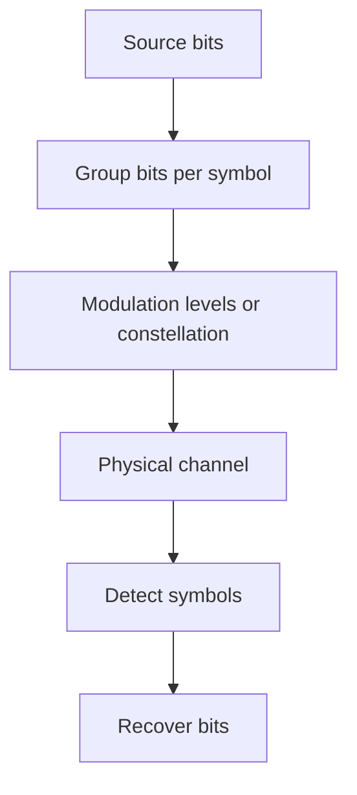
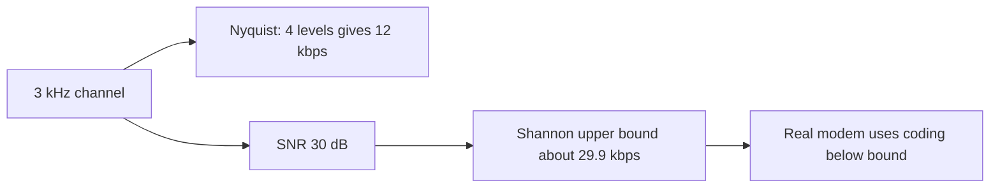
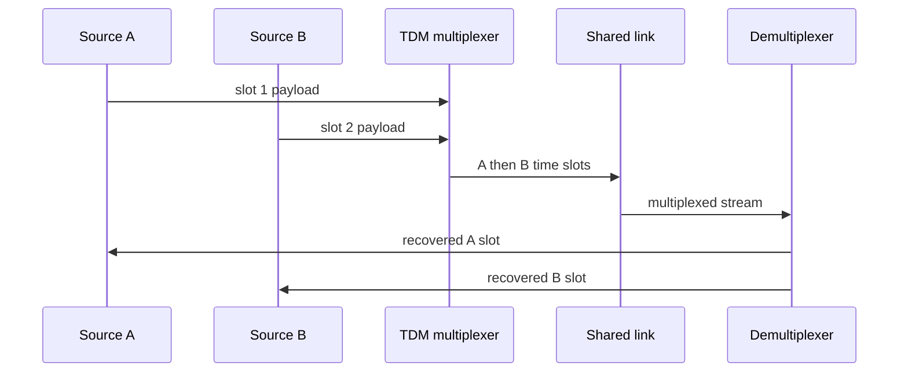
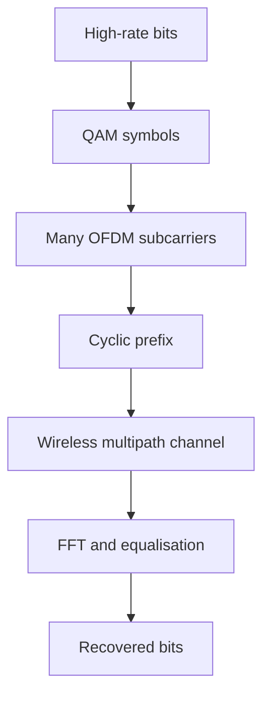

# Physical Layer: Transmission Media, Encoding, and Channel Capacity

The physical layer moves unstructured bits as voltage changes, light pulses, or radio energy across a medium. It defines signal timing, connectors, modulation, bandwidth use, and the hardware conditions that make a higher-layer frame possible. Interviewers ask it to distinguish bit rate from baud rate, ideal formulas from noisy reality, and a medium's data rate from its deployment constraints.

---

## 🟢 Beginner Level

### Bits become signals

Higher layers describe addresses, frames, packets, and requests.

The physical layer carries a sequence of bits without interpreting a frame header.

A transmitter converts bits into an electrical, optical, or electromagnetic signal.

A receiver detects that signal, recovers timing, and decides which bit values arrived.

Attenuation weakens a signal as distance increases.

Noise adds unwanted energy that makes symbol decisions uncertain.

Distortion changes a waveform shape or timing.

Interference comes from neighbouring cables, radio sources, motors, or other transmitters.

Repeaters, amplifiers, equalisation, shielding, encoding, and error correction address different parts of that problem.

### Guided and unguided media

Guided media confines energy to a physical path.

Unguided media radiates energy through air or space.

| Medium | Strength | Limitation | Typical use |
|---|---|---|---|
| Twisted-pair copper | Inexpensive and easy to terminate | EMI, distance, crosstalk | Ethernet access links |
| Coaxial cable | Shielded and robust | Bulkier, shared-medium constraints | Cable distribution and RF |
| Multimode fiber | High local capacity | Shorter optical reach than single mode | Buildings and data centres |
| Single-mode fiber | Very long reach and high capacity | Optics and installation cost | Metro, backbone, WAN |
| Radio | Mobility and fast deployment | Shared spectrum and fading | Wi-Fi and cellular |
| Microwave | Focused long-distance links | Line of sight and weather sensitivity | Point-to-point backhaul |

Twisted pairs are twisted to reduce electromagnetic coupling from external fields and adjacent pairs.

Fiber uses a core and cladding with different refractive indices to guide light.

Wireless links must share spectrum and contend with reflection, diffraction, interference, and mobility.

The right medium depends on distance, environment, availability, latency, capacity, and operational access.

### Bandwidth, bit rate, and baud rate

Bandwidth is the useful frequency range of a channel in hertz.

Bit rate is the number of data bits transferred per second.

Baud rate is the number of signal symbols per second.

One symbol can encode more than one bit when a modulation has multiple distinguishable levels.

For example, four ideal signal levels can represent two bits per symbol.

Higher-order modulation improves bits per symbol but needs a cleaner channel so receivers can distinguish closer points.

Clock recovery is the receiver's ability to find bit or symbol boundaries.

Long identical NRZ levels make clock recovery difficult without a separate clock or coding rule.

Encodings with regular transitions sacrifice some spectral efficiency to improve timing robustness.

---

## 🟡 Intermediate Level

### Line encoding and clock recovery

NRZ-L represents values using voltage levels.

NRZ-I represents a value through a transition or lack of transition.

Manchester encoding has a mid-bit transition for every bit.

That transition lets the receiver recover timing from the data stream.

It uses more signalling transitions and therefore more bandwidth than a simple NRZ signal at the same bit rate.

Differential Manchester keeps a mid-bit transition while encoding data in the beginning-of-bit transition pattern.

Scrambling changes a troublesome long run into a transition-rich signal without losing data.

Modern Ethernet physical layers use more sophisticated block coding and PAM techniques than classic Manchester Ethernet.

| Scheme | Clock signal in data? | DC tendency | Relative bandwidth | Example concept |
|---|---|---|---|---|
| NRZ-L | Weak for long runs | Can have DC component | Low | Simple baseband |
| NRZ-I | Transitions for selected bits | Long zero run remains issue | Low | Transition encoding |
| Manchester | Every bit | Balanced transitions | Higher | Classic 10BASE-T |
| Block coding | Controlled by code words | Controlled | Moderate overhead | 4B/5B or 8B/10B |
| Multi-level PAM | Depends on coding | Depends on code | Efficient symbols | Modern high-speed links |

The encoding choice joins electrical constraints with receiver complexity and protocol rate.

It cannot be evaluated merely by counting voltage levels.

### Worked example: Nyquist and Shannon limits

Assume a noiseless channel has bandwidth `3 kHz` and can reliably distinguish four signal levels.

Nyquist's ideal maximum is:

$$R = 2B \log_2 L$$

Here $B = 3000$ Hz and $L = 4$.

Because $log_2 4 = 2$, the ideal rate is $2 × 3000 × 2 = 12,000$ bits per second.

Now suppose the same 3 kHz channel has an SNR of 30 dB.

Convert decibels to a linear ratio: $S/N = 10^{30/10} = 1000$.

Shannon capacity is:

$$C = B\log_2(1 + S/N)$$

So $C = 3000\log_2(1001)$.

Because $log_2(1001)$ is approximately 9.967, capacity is about $29,901$ bits per second.

The Shannon result is an upper bound for an ideal coding scheme on this noisy channel.

The Nyquist calculation used four levels, so it describes that signalling choice rather than the ultimate information-theoretic limit.

Increasing levels can approach a higher rate only if noise and receiver design permit reliable distinctions.

Neither formula promises an application throughput value.

Framing, coding, retransmissions, protocol headers, and contention reduce delivered payload rate.

### Multiplexing shares a medium

Frequency-division multiplexing assigns different frequency bands to separate signals.

Guard bands reduce adjacent-channel interference.

Time-division multiplexing assigns repeating time slots.

Synchronous TDM reserves a slot even when its source is silent.

Statistical TDM gives slots to active sources and needs buffering and scheduling.

Wavelength-division multiplexing is frequency division for light in fiber.

Code-division systems use spreading codes so multiple transmitters share time and frequency with separable codes.

Multiplexing is not the same as packet switching.

It happens at a physical or link signalling level, while packets may also share paths statistically at higher layers.

### Sampling and PCM

Pulse Code Modulation turns an analogue waveform into digital samples.

The sampling theorem requires a sample rate at least twice the highest represented frequency under its ideal assumptions.

Telephone voice traditionally limits useful audio near 4 kHz and samples at 8,000 times per second.

Using 8 bits per sample produces `8,000 × 8 = 64,000` bits per second before framing.

Quantisation maps a measured analogue amplitude to a finite digital level.

More levels reduce quantisation error but increase bit rate.

Anti-alias filtering removes frequencies above the target range before sampling.

Without it, high-frequency energy appears as a false lower-frequency component after sampling.

### Measuring a physical link

Physical-layer troubleshooting starts with the signal and negotiated capability, not an application benchmark alone.

Copper testers can identify pair continuity, length, split pairs, impedance anomalies, and return loss.

Ethernet interface counters reveal CRC errors, symbol errors, alignment errors, and link renegotiations.

Optical transceivers commonly report transmit and receive power through digital diagnostics.

Compare those readings with the optic's specified minimum and maximum values.

Too little receive power indicates loss, a dirty connector, a bend, or a wrong route.

Too much receive power can saturate a short-reach receiver.

Wireless surveys measure received signal strength, noise floor, channel utilisation, retransmissions, and roaming behaviour.

Signal strength alone is insufficient because a strong interfering transmitter can raise the noise floor.

The signal-to-noise ratio is the meaningful separation for a receiver decision.

Bit error rate measures incorrect received bits before higher-layer recovery.

Frame-error and retransmission rates show the application consequence after framing and MAC rules.

Run measurements over time because temperature, machinery, rain, and neighbouring wireless users can change the channel.

Document baseline counters after installation so a later degradation has a useful comparison.

---

## 🔴 Expert Level

### Fiber optics, dispersion, and link budgets

Single-mode fiber has a small core that supports essentially one propagation mode at operating wavelengths.

Multimode fiber supports multiple paths, which can spread a pulse in time through modal dispersion.

Chromatic dispersion occurs because wavelengths travel at slightly different velocities.

Attenuation is commonly expressed in dB per kilometre.

A link budget subtracts fiber loss, connector loss, splice loss, and margin from transmitter output to estimate received power.

Optical amplifiers and regenerators extend reach, but they add cost and operational design constraints.

Dense WDM carries many precisely spaced wavelengths on one fiber pair.

It increases capacity without trenching new fiber but needs optical filtering, power balancing, and careful channel planning.

### Modulation, equalisation, and OFDM

Quadrature amplitude modulation changes amplitude and phase to encode multiple bits per symbol.

Higher-order constellations pack symbols closer together and need higher SNR.

Multipath radio causes delayed copies of a signal, creating inter-symbol interference.

Orthogonal Frequency Division Multiplexing divides a wide channel into many closely spaced orthogonal subcarriers.

Each subcarrier has a lower symbol rate, making equalisation easier against delay spread.

A cyclic prefix repeats the end of a symbol at its start to absorb echoes within a designed guard interval.

OFDM improves robustness but has peak-to-average power ratio and synchronisation challenges.

It is not simply many independent radio channels placed next to each other.

### Wireless capacity and regulatory constraints

Wireless capacity is shared across users and changes with distance, walls, interference, and modulation adaptation.

The advertised physical rate includes coding and protocol overhead that applications cannot use as payload.

Unlicensed bands require coexistence with other users and technologies.

Licensed cellular spectrum allows coordinated deployment but has auction, regulatory, and operator constraints.

MIMO uses multiple antennas to improve diversity, beamforming, or spatial multiplexing when channel conditions permit.

More antennas do not guarantee linear throughput gain in a crowded or poorly separated environment.

### Production troubleshooting and failure modes

Copper errors can arise from excessive length, poor termination, wrong category, bend damage, or EMI.

Fiber failures may involve dirty connectors, wrong optic type, insufficient budget, polarity reversal, or excessive bends.

Wireless failures often need spectrum analysis, channel planning, client roaming data, and signal-to-noise measurements rather than only a speed test.

Autonegotiation mismatches and duplex mismatches can create loss and poor throughput while a link light remains on.

Monitor error counters, retransmissions, negotiated rate, optical power, channel utilisation, and latency distribution.

Change one physical variable at a time because signal failures can be intermittent and environment-dependent.

### Common Misconceptions

1. **"Bandwidth in hertz is the same as throughput in bits per second."**
   *Correction*: Bandwidth is a frequency range, while bit rate depends on modulation, coding, and noise. Protocol overhead and contention reduce application payload further.

2. **"Shannon capacity is a speed a device can always reach."**
   *Correction*: It is a theoretical upper bound under a noise model. Real transmitters use finite constellations, imperfect coding, framing, and shared-medium rules below that bound.

3. **"Fiber has no loss or operational problems."**
   *Correction*: Fiber resists EMI and supports high capacity, but attenuation, dispersion, bends, connector contamination, and optic compatibility still matter. A clean optical budget is required.

4. **"Manchester is obsolete, so clock recovery no longer matters."**
   *Correction*: Modern links use different block coding and clock-data recovery mechanisms, but receivers still need timing information. The engineering trade-off remains spectral efficiency versus robust detection.

5. **"A higher Wi-Fi link rate guarantees a faster application."**
   *Correction*: Airtime sharing, interference, retransmissions, backhaul, and server performance can dominate. Measure useful throughput and latency at the application path.

### Interview Questions

**Q1. What does the physical layer provide?** `[easy]`

It transmits a raw bit stream as physical signals and defines signalling, timing, media, and connectors. It does not interpret addresses or frame semantics from higher layers. Its constraints determine what a reliable data-link implementation can build upon.

**Q2. What is the difference between bit rate and baud rate?** `[easy]`

Bit rate counts data bits per second, while baud rate counts symbols per second. A multi-level modulation can encode several bits in one symbol, making bit rate higher than baud rate. The trade-off is that denser symbol choices need better SNR and receiver accuracy.

**Q3. Why does Manchester encoding help clock recovery?** `[easy]`

Manchester has a transition in the centre of every bit interval. The receiver can use that regular transition to align its timing even through long sequences of the same data bit. It costs more signalling bandwidth than a simple NRZ representation.

**Q4. What is the main difference between multimode and single-mode fiber?** `[easy]`

Multimode fiber has a larger core and supports several light paths, making it practical for shorter building or campus links. Single-mode fiber limits propagation modes and supports much longer, higher-capacity links with suitable optics. The choice balances distance, optics cost, existing cabling, and required rate.

**Q5. How do Nyquist and Shannon formulas differ?** `[medium]`

Nyquist relates an ideal noiseless channel's bandwidth and number of signal levels to a maximum signalling rate. Shannon gives an information-theoretic upper bound for a noisy channel from bandwidth and signal-to-noise ratio. Neither includes application headers, contention, or a specific real modem implementation.

**Q6. Why does higher-order QAM need a cleaner channel?** `[medium]`

Higher-order QAM places more possible symbols closer together in amplitude and phase space. Noise, fading, and distortion can then move a received point across a decision boundary more easily. Adaptive systems lower modulation order when SNR falls to maintain an acceptable error rate.

**Q7. What is the purpose of a guard band in FDM?** `[medium]`

A guard band leaves unused spectrum between adjacent frequency channels. It reduces interference caused by imperfect filters and signal sidebands. The cost is less spectrum available for payload channels.

**Q8. How does statistical TDM differ from synchronous TDM?** `[medium]`

Synchronous TDM reserves each source a repeating slot even when it has nothing to send. Statistical TDM allocates slots to active sources and therefore uses shared capacity more efficiently for bursty traffic. It requires buffering and can queue when active demand exceeds link capacity.

**Q9. Why is anti-alias filtering needed before PCM sampling?** `[medium]`

Sampling cannot distinguish a frequency above half the sample rate from certain lower frequencies after digitisation. An analogue low-pass filter removes those high components before sampling. Without it, aliasing produces false content that cannot be repaired after the fact.

**Q10. What causes attenuation and dispersion in fiber?** `[medium]`

Attenuation comes from absorption, scattering, bends, connectors, and splices that reduce optical power. Dispersion broadens pulses because modes or wavelengths travel differently. Both limit distance and rate, so optic budgets and modulation choices must include margin.

**Q11. Scenario: a 90-m copper Ethernet link negotiates down and shows rising CRC errors near industrial machinery. What do you check?** `[hard]`

Check cable category, termination quality, grounding and shielding design, routing near motors, and whether the length includes all patch leads. EMI or crosstalk can reduce signal margin even when link lights remain active. Test with a certified cable analyser, reroute or use fiber where isolation is needed, and verify negotiated speed after each change.

**Q12. Scenario: a 3 kHz channel has 30 dB SNR and a team claims it can carry exactly 29.9 kbps. What correction do you make?** `[hard]`

About 29.9 kbps is Shannon's theoretical upper bound after converting 30 dB to a linear ratio of 1000. A real system must operate below it because modulation, coding, finite block length, framing, and implementation loss consume margin. The chosen constellation may impose a lower Nyquist-style or practical limit as well.

**Q13. Why can an OFDM link fail in multipath even when received power is strong?** `[hard]`

Strong received power can include delayed reflections that overlap adjacent symbols and create inter-symbol interference. OFDM uses a cyclic prefix and per-subcarrier equalisation, but delay spread beyond the guard interval still harms decoding. Diagnose channel delay, interference, synchronisation, and modulation adaptation rather than assuming power alone represents link quality.

**Q14. Why is a fiber link budget important before deployment?** `[hard]`

A link budget verifies that received optical power remains above receiver sensitivity after fiber, connector, splice, and engineering-margin losses. Without it, a link may work in a clean lab but fail after aging, repairs, or temperature changes. The budget also prevents selecting optics that saturate a short receiver or cannot span a long route.

### Further Reading

- [ITU-T G.652 single-mode fiber recommendation](https://www.itu.int/rec/T-REC-G.652) defines common optical-fiber characteristics.
- [IEEE 802.3 Ethernet standards overview](https://standards.ieee.org/ieee/802.3/7071/) links physical-layer Ethernet standardisation.
- [Shannon's 1948 paper](https://people.math.harvard.edu/~ctm/home/text/others/shannon/entropy/entropy.pdf) is the original channel-capacity foundation.
- [FCC spectrum policy and allocations](https://www.fcc.gov/engineering-technology/policy-and-rules-division/general/radio-spectrum-allocation) provides the regulatory context for radio use.
