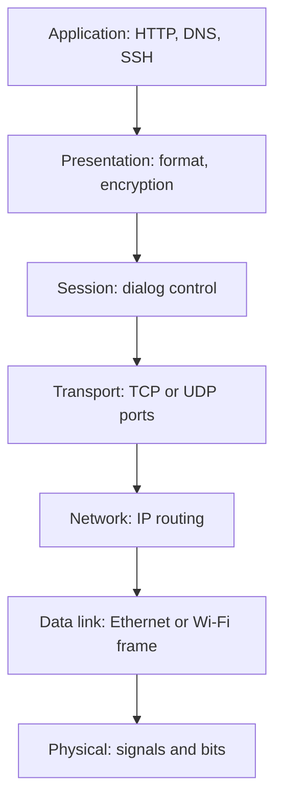
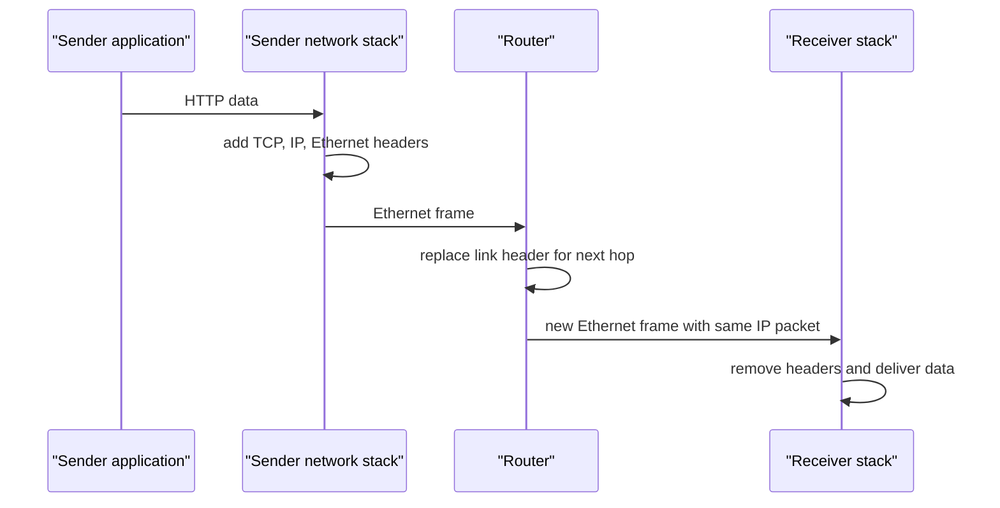
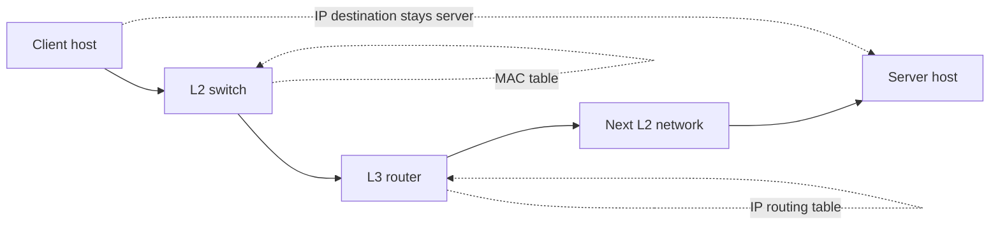
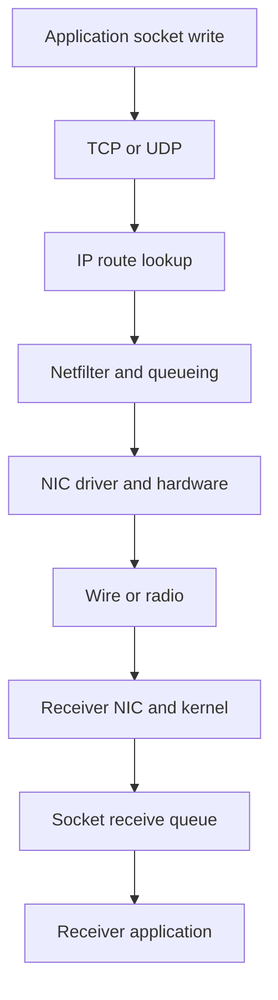

# Computer Networks: OSI & TCP/IP Reference Models

The OSI and TCP/IP models divide network communication into layers so each concern—application meaning, delivery between processes, routing, local framing, and signals—can evolve without every component knowing every detail.
They are diagnostic and design models rather than a literal picture of every implementation, but they give engineers a shared language for locating failures and protocol responsibilities.
Interviewers use them to test whether a candidate can follow one request across a host, a LAN, routers, and a remote application.

---

## 🟢 Beginner Level

### OSI layers, TCP/IP mapping, and encapsulation

An application wants to send meaningful data such as an HTTP request.
The network must also identify a receiving process, route across networks, deliver across one local link, and encode bits on a medium.
Layers assign those responsibilities to separate protocols and interfaces.



The seven labels are the **OSI reference model**.
Real Internet protocols commonly combine the presentation and session responsibilities into applications or libraries.
The model remains useful because it asks a precise question: which layer owns the information or failure being discussed?

For example, an invalid TLS certificate is not a cable problem.
A missing route is not a TCP port problem.
A duplicate Ethernet frame does not mean an HTTP server processed a request twice.

### The OSI layers have distinct jobs

The **application layer** provides network-facing services to application software, such as HTTP, DNS, SMTP, and SSH.
The **presentation layer** covers representation concerns such as character encoding, compression, and cryptographic transformation.
The **session layer** covers dialog concepts such as checkpoints and session management.

The **transport layer** identifies processes with ports and may provide reliability, ordering, flow control, or multiplexing.
The **network layer** addresses hosts and routes packets between networks.
The **data-link layer** frames data for one local link and uses link-local addressing such as Ethernet MAC addresses.
The **physical layer** transmits symbols as electrical, optical, or radio signals.

| OSI layer | Unit often discussed | Examples | Main question |
|---|---|---|---|
| 7 Application | data | HTTP, DNS, SMTP | what service or message? |
| 6 Presentation | data | TLS encoding, UTF-8 | how is data represented? |
| 5 Session | data | session checkpoints | how is a dialog controlled? |
| 4 Transport | segment or datagram | TCP, UDP | which process and delivery semantics? |
| 3 Network | packet | IPv4, IPv6, ICMP | which host and route? |
| 2 Data link | frame | Ethernet, Wi-Fi | which next-hop interface? |
| 1 Physical | bits or symbols | copper, fibre, radio | how are bits signalled? |

Names such as segment, packet, and frame are useful shorthand.
People sometimes use “packet” generically for every unit, so clarify the layer when precision affects a design discussion.

### TCP/IP is the deployed Internet model

The TCP/IP model describes the protocol suite used by the Internet.
It usually groups OSI's seven layers into four or five practical layers.
The application layer includes OSI application, presentation, and session concerns.

| TCP/IP layer | Rough OSI mapping | Common protocols |
|---|---|---|
| application | OSI 5 through 7 | HTTP, DNS, TLS, SSH |
| transport | OSI 4 | TCP, UDP, QUIC over UDP |
| internet | OSI 3 | IPv4, IPv6, ICMP |
| link | OSI 1 and 2 | Ethernet, Wi-Fi, ARP |

TCP/IP is not “the same as TCP plus IP.”
It is the interoperating suite and architecture around many protocols.
OSI is more granular as a teaching and standardization reference, while TCP/IP names the protocols that widely run on real networks.

### Encapsulation adds addressing for each scope

At the sender, each layer receives data from above and adds its own control information.
At the receiver, the peer layer interprets and removes the corresponding information.
This is encapsulation and decapsulation.



The transport header identifies the source and destination processes.
The IP header identifies end hosts across the route.
The link header identifies the next hop on one local link and usually changes at every router.

---

## 🟡 Intermediate Level

### A worked encapsulation example uses real sizes

Assume a browser sends 1,400 bytes of HTTP application data over IPv4 and TCP on Ethernet.
Assume no TCP options, a 20-byte IPv4 header, a 20-byte TCP header, and a 14-byte Ethernet header plus a 4-byte frame check sequence.

The TCP segment contains $1{,}400 + 20 = 1{,}420$ bytes.
The IP packet contains $1{,}420 + 20 = 1{,}440$ bytes.
The Ethernet frame on the wire contains $1{,}440 + 14 + 4 = 1{,}458$ bytes, excluding preamble and inter-frame gap.

| Layer | Added bytes in this example | Resulting unit |
|---|---:|---:|
| application | 1,400 payload | application data |
| TCP | 20 | 1,420-byte segment |
| IPv4 | 20 | 1,440-byte packet |
| Ethernet header and FCS | 18 | 1,458-byte frame |

Ethernet's common payload MTU is 1,500 bytes.
The IPv4 packet here is 1,440 bytes, so it fits without IP fragmentation.
The maximum TCP payload under these simple IPv4 assumptions is usually $1{,}500 - 20 - 20 = 1{,}460$ bytes, called the TCP maximum segment size before options.

Headers are not pure waste.
They let the receiver demultiplex a socket, routers forward between networks, switches deliver locally, and integrity checks detect corrupted frames.
They also create overhead for very small messages, which is one reason batching and protocol design matter for high-throughput systems.

### Ports, IP addresses, and MAC addresses have different scopes

A transport port identifies a service endpoint on one host.
An IP address identifies an interface or host in an internetworking namespace used for routing.
A MAC address identifies a link-layer interface for delivery on a local broadcast domain.

```text
HTTPS request
source socket: 192.0.2.10:51532
destination socket: 198.51.100.20:443
current Ethernet destination: gateway MAC address
```

The client sends the first Ethernet frame to its default gateway's MAC address when the destination IP is remote.
The router removes that frame, consults the destination IP route, decrements TTL or hop limit, and creates a new link-layer frame for the next hop.
The destination IP and TCP port normally remain end-to-end, while each link's MAC addresses change.

Address Resolution Protocol, or ARP, maps a local IPv4 next-hop IP address to a MAC address.
IPv6 uses Neighbor Discovery rather than ARP.
Neither protocol finds an Internet-wide destination MAC address; MAC addressing is intentionally local to a link.

### Transport chooses delivery semantics

TCP is a connection-oriented byte stream with reliable ordered delivery subject to endpoint and network conditions.
It uses sequence numbers, acknowledgements, retransmission, flow control, and congestion control.
UDP is a connectionless datagram service with ports and checksums but no built-in reliability or ordering.

| Property | TCP | UDP |
|---|---|---|
| service abstraction | ordered byte stream | independent datagrams |
| connection setup | handshake | none at transport layer |
| loss handling | retransmission by protocol | application decides |
| message boundaries | not preserved | preserved per datagram |
| head-of-line behaviour | ordered stream can wait | one lost datagram need not block another |
| examples | HTTPS, SSH, database sessions | DNS, media, QUIC transport |

TCP does not promise an application message maps to one packet.
One `write` may be split across segments, merged with another write, or buffered.
UDP preserves message boundaries but a datagram can be lost, duplicated, reordered, or too large for an efficient path.

### Routers operate at layer boundaries

A switch commonly forwards frames based on learned MAC-address tables within a LAN or VLAN.
A router forwards IP packets between networks after removing the incoming link frame.
A host performs both link delivery and transport demultiplexing for its own traffic.



Devices can perform more than one role.
A firewall may inspect transport ports and application metadata, while a load balancer may terminate TCP and create a new connection upstream.
Layer labels describe the primary information a decision uses, not a strict limitation on every appliance.

### MTU and fragmentation expose cross-layer limits

Every link advertises or implies a maximum transmission unit, or MTU.
An IP packet larger than the path allows may need fragmentation or may be dropped so the sender can reduce its size through path MTU discovery.
IPv6 routers do not fragment packets in transit; the sender must use an appropriate packet size.

Fragment loss is expensive because a missing fragment prevents reassembly of the original packet.
TCP generally avoids routine IP fragmentation by negotiating an MSS and adapting to path information.
UDP applications should choose datagram sizes carefully and implement any required application-level chunking or loss handling.

---

## 🔴 Expert Level

### The kernel stack routes a packet through queues and hooks

On Linux, an application writes through a socket API.
The kernel associates the socket with transport state, chooses a route, builds packet buffers, and queues frames to a network interface driver.
At reception, the driver and kernel process frames, verify or offload checks, route locally or forward, then deliver data to a matching socket.



Kernel packet representations such as Linux `sk_buff` carry metadata and pointers as a packet moves through the stack.
NIC hardware can offload checksum calculation, segmentation, receive aggregation, and filtering.
Offloads improve throughput but can make packet captures on one host look different from wire-level packets, so diagnostics must identify capture location.

The `epoll` interface lets an application wait efficiently for readiness events across many file descriptors.
`io_uring` provides a submission and completion queue interface for asynchronous operations, including networking features where supported.
These are host-side I/O interfaces, not replacements for TCP/IP layers.

### Layering is a contract with deliberate exceptions

Strict layering would let each layer inspect only adjacent-layer information.
Real stacks share information for performance and policy.
TCP's congestion control depends on IP delivery signals; a NIC can segment a large TCP payload; TLS is usually implemented above TCP but below HTTP semantics.

Middleboxes create more exceptions.
NAT rewrites IP addresses and often transport ports.
A proxy terminates one connection and creates another, so it is not merely forwarding lower-layer packets.
QUIC runs over UDP but implements encryption, reliability, streams, and congestion control in user space.

These designs do not invalidate the model.
They show that layers are interfaces and responsibilities, while implementations may optimize across an interface or intentionally terminate a protocol boundary.
The diagnostic question remains: where did the end-to-end property change?

### Encapsulation affects security boundaries

TLS protects application bytes between its endpoints, not necessarily every network header or every service in a proxy chain.
IP routing headers must remain available for forwarding.
Ethernet headers are local and replaced at each hop, so their source address alone is not an end-to-end identity proof.

Firewalls frequently decide using several layers: IP prefixes, TCP ports, TLS server names, and HTTP paths where decryption or proxying permits inspection.
Network segmentation can limit reachability but does not authenticate an application user.
Application authorization and transport encryption remain necessary even on a trusted internal VLAN.

An encrypted packet can still reveal metadata such as source and destination IP addresses, timing, packet sizes, and sometimes DNS activity depending on protocol configuration.
Threat models should state which endpoints and metadata are protected rather than describing “encryption” as a single blanket property.

### Debugging moves from lower layers upward

When a service is unreachable, start with the most falsifiable boundary.
Check link state and interface counters, local IP address and route, next-hop reachability, DNS resolution, transport handshake, TLS negotiation, then the application response.
This order avoids blaming HTTP when the host has no route to the destination.

Packet capture tools reveal frame, IP, and transport headers at their capture point.
Socket tools reveal local listening ports and established connections.
Application logs reveal request semantics after the network has already delivered bytes.
Correlate timestamps carefully because retransmissions, buffering, and asynchronous logging can make one user request appear in several layers at different times.

### Naming and service discovery cross several layers

Users and applications usually begin with a name, not an IP address.
DNS translates a domain name into records such as IPv4 `A`, IPv6 `AAAA`, service `SRV`, or alias `CNAME` data.
The resolver caches those results according to time-to-live values, then the transport and internet layers use the chosen address to attempt a connection.

A successful DNS answer does not prove an application is reachable.
The answer may be stale, the address may have no route from this client, the server may reject the port, or a load balancer may route to an unhealthy backend.
Conversely, an application can be healthy while an old DNS cache directs clients to a retired address.

Service discovery in an internal platform often uses DNS names, registries, or a control plane.
It adds policy about which endpoints are eligible, how health changes propagate, and how clients balance across instances.
That policy is application architecture above basic IP forwarding, but it still depends on correct transport connections to each selected endpoint.

Name resolution has its own transport choices.
Traditional DNS commonly uses UDP port 53 for ordinary queries and can use TCP for larger responses, zone transfer, or fallback.
Encrypted DNS transports such as DNS over TLS and DNS over HTTPS protect queries to a resolver but do not eliminate the need to trust that resolver.

Caching is a performance and failure trade-off.
A 60-second TTL limits how long many compliant caches should retain an answer, but clients, operating systems, browsers, and intermediate resolvers can have additional behaviour.
Very short TTLs increase lookup load and do not guarantee instantaneous traffic migration.
Deployment plans therefore combine DNS changes with overlapping endpoint availability and connection-draining policies.

The client also chooses an address family.
Dual-stack hosts may receive both `A` and `AAAA` records and race or sequence connection attempts under a Happy Eyeballs style policy.
An IPv6 route failure can look like an intermittent application timeout if the client waits too long before trying IPv4.
Capture the selected address and connection timing before assuming the server application is slow.

Load balancers can operate at different layers.
A layer-4 load balancer chooses a backend using addresses and ports while passing an existing byte stream onward.
A layer-7 proxy understands HTTP or another application protocol and can route by host, path, header, or identity after terminating or inspecting a connection.

Terminating a connection creates two transport conversations.
Client-to-proxy TCP state and proxy-to-backend TCP state have independent timeouts, congestion windows, and failure modes.
An HTTP response code from the proxy may therefore describe a backend connection problem even though the client-side TCP handshake succeeded.

Health checks must match the layer that owns readiness.
A successful ICMP response shows IP reachability, not that port 443 accepts connections.
A TCP connect shows a listener, not that a database-backed HTTP endpoint can serve a correct request.
Use a lightweight application health check only when it is safe and representative of the dependency needed for traffic.

Retries must respect this layering as well.
DNS retry, TCP connection retry, TLS retry, and HTTP request retry have different costs and idempotency implications.
Blindly retrying at multiple layers can multiply one user action into many backend requests.
Set bounded budgets and propagate request identity so the receiving application can identify safe replays.

Observability should record the logical service name, resolved address, selected route or interface when relevant, socket error, TLS peer identity, and application status separately.
This lets an incident report distinguish “name was wrong,” “network path failed,” “port refused,” and “server returned an error.”
Layered evidence is faster to act on than a single generic “request failed” counter.
It also prevents ownership gaps between a platform DNS team, network team, and application team.
Runbooks should state which team owns the first actionable signal at each boundary.
That keeps a DNS incident from being investigated first as an HTTP application bug.

When a service has many endpoints, connection pooling can retain old resolved addresses longer than one request.
Drain policies must therefore consider existing connections as well as fresh DNS lookups.
For long-lived protocols, an explicit reconnect or endpoint retirement signal may be required.
These lifecycle details are why naming is part of end-to-end delivery, not merely a preliminary lookup.

Test failure paths with an unavailable address, a refused port, a failed certificate, and an unhealthy backend.
Each should produce a distinguishable signal and a bounded retry pattern.

### Common Misconceptions

1. **“OSI is a list of protocols that every network implements exactly.”** It is a reference model that assigns responsibilities. TCP/IP deployments commonly merge the upper OSI layers and use implementations that cross boundaries for performance.
2. **“A MAC address identifies a host everywhere on the Internet.”** It is used for local link delivery and changes from hop to hop. IP addresses and ports have broader scopes, but even they can be rewritten by NAT or proxies.
3. **“One TCP write becomes one packet.”** TCP exposes a byte stream, so segmentation and coalescing are implementation decisions. Applications must frame their own messages above the stream.
4. **“TCP guarantees a message arrives exactly once.”** It provides an ordered reliable byte stream while a connection is viable, but failures can leave endpoints uncertain whether an application operation was processed. Idempotency is an application concern.
5. **“TLS is OSI layer 6 in every real stack.”** TLS provides presentation-like security services but is usually a library protocol above TCP and below application protocols. The model helps describe its role without dictating one implementation boundary.

### Interview Questions

**Q1. What is the purpose of network layering?** `[easy]`

Layering separates concerns such as application meaning, process delivery, routing, local framing, and physical signalling. Each layer can evolve behind an interface without every application implementing all lower-level details. The boundaries are conceptual contracts, so real systems may optimize across them while preserving the intended responsibilities.

**Q2. Compare the OSI and TCP/IP models.** `[easy]`

OSI names seven conceptual layers, while TCP/IP commonly groups them into application, transport, internet, and link layers. TCP/IP describes the deployed Internet protocol suite more directly, whereas OSI gives a finer vocabulary for responsibilities. They are complementary models, not competing wire formats.

**Q3. What changes at each router hop?** `[easy]`

A router removes the incoming link-layer frame, examines the IP packet, selects a next hop, and creates a new frame for the outgoing link. The Ethernet source and destination MAC addresses therefore change on each link. The end-to-end IP addresses and transport ports normally remain the same unless a device such as NAT or a proxy intentionally changes them.

**Q4. What is encapsulation?** `[easy]`

Encapsulation is the sender-side process of adding layer-specific headers and sometimes trailers around data from the layer above. For example, HTTP data becomes a TCP segment, then an IP packet, then an Ethernet frame. The receiver performs the reverse decapsulation after validating and interpreting each layer's information.

**Q5. Why does TCP use ports when IP already has addresses?** `[medium]`

IP routes a packet to a host or interface, while a transport port identifies the receiving process or socket on that host. The combination of protocol, source IP and port, and destination IP and port distinguishes concurrent flows. Without ports, one host could not efficiently deliver many independent network conversations to different applications.

**Q6. What is the difference between a TCP segment and a UDP datagram?** `[medium]`

A TCP segment carries part of an ordered byte stream and participates in sequence, acknowledgement, flow-control, and retransmission logic. A UDP datagram is a self-contained message at transport level and preserves its boundary. UDP leaves loss, ordering, duplication, and retry policy to the application or a higher protocol such as QUIC.

**Q7. How does MTU affect TCP payload size?** `[medium]`

The link MTU bounds the IP packet that can traverse a link without fragmentation. With a 1,500-byte Ethernet payload limit and 20-byte IPv4 and TCP headers, a common maximum TCP payload is 1,460 bytes before options. TCP uses MSS negotiation and path information to avoid routine fragmentation, but tunnels and options can reduce the usable value.

**Q8. Why is ARP not an Internet-wide address lookup?** `[medium]`

ARP resolves a local IPv4 next-hop address to a MAC address on one broadcast domain. When the destination is remote, the host resolves the default gateway's MAC rather than the remote server's MAC. Each router repeats local link resolution for its next hop, so no global MAC route exists.

**Q9. What layer does a router operate at?** `[medium]`

A conventional router makes forwarding decisions primarily at the network layer using IP prefixes and routing tables. It must also receive and transmit data-link frames on adjacent links. Modern devices may inspect transport or application data for firewalling and policy, so “layer 3 device” identifies its core forwarding role rather than an absolute limit.

**Q10. Why is TCP not message-oriented?** `[medium]`

TCP presents an ordered stream of bytes, not a sequence of preserved application writes. The stack may split one write into multiple segments or combine several writes before sending. Applications need explicit framing such as lengths, delimiters, or a protocol grammar to reconstruct individual messages safely.

**Q11. A browser can resolve a hostname but cannot connect to port 443. How do you locate the failing layer?** `[hard]`

Because DNS succeeds, start by checking the selected destination address, local route, firewall policy, and whether TCP SYN packets receive SYN-ACK responses. Then inspect a packet capture or socket error to distinguish a rejected port, silent filtering, path problem, or address-family mismatch. TLS and HTTP are later layers and should not be blamed until the transport handshake is established.

**Q12. A service sees an HTTP request twice after a client timeout. What does layering tell you about correctness?** `[hard]`

TCP may retransmit bytes within a connection, and a client or proxy may retry an entire application request after losing confidence in a response. The server can therefore receive semantically duplicate operations even if each TCP stream is ordered. Use application-level idempotency keys or deduplication for operations such as payments, because transport reliability cannot establish exactly-once business execution.

**Q13. Packet capture shows a 64 KiB TCP packet on a host with 1,500-byte Ethernet MTU. Is that impossible?** `[hard]`

It can be a host-side observation caused by TCP segmentation offload or receive aggregation, where the kernel or NIC handles segmentation later or coalesces received data earlier. The physical wire frames can still obey the MTU. Check the capture point and offload settings before concluding the network emitted an oversized Ethernet frame.

**Q14. A security team says TLS makes a service safe because all traffic is encrypted. What important boundaries remain?** `[hard]`

TLS protects bytes between its negotiated endpoints, but routing metadata, timing, packet sizes, endpoint trust, and proxy termination points remain relevant. A TLS-terminating load balancer can see plaintext and requires its own authorization and logging controls. Network encryption also does not replace application authentication, authorization, input validation, or idempotency.

### Further Reading

- [RFC 1122: Requirements for Internet Hosts](https://www.rfc-editor.org/rfc/rfc1122) defines the Internet protocol architecture and host requirements.
- [RFC 8200: Internet Protocol Version 6](https://www.rfc-editor.org/rfc/rfc8200) documents IPv6 packet handling and fragmentation rules.
- [RFC 9293: Transmission Control Protocol](https://www.rfc-editor.org/rfc/rfc9293) specifies TCP's transport behaviour.
- [Linux kernel networking documentation](https://docs.kernel.org/networking/index.html) provides primary documentation for Linux network stack interfaces.
