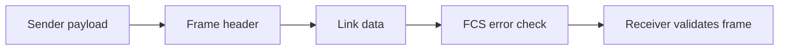
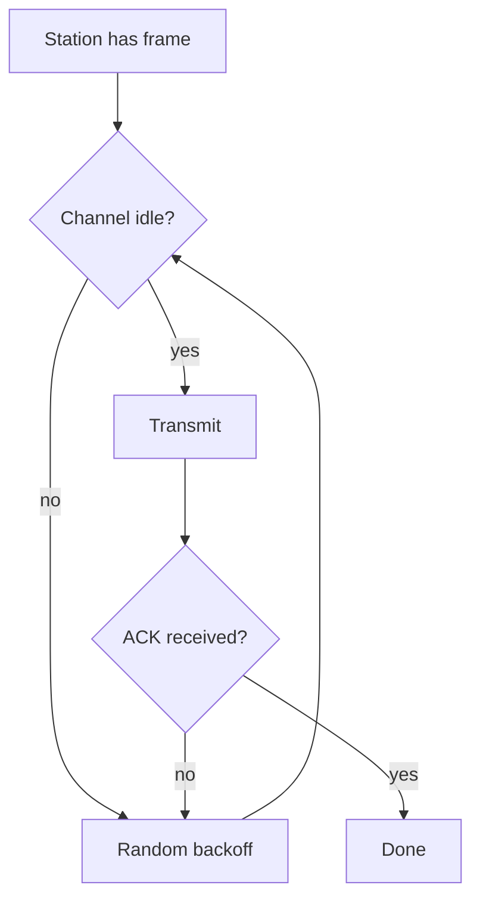
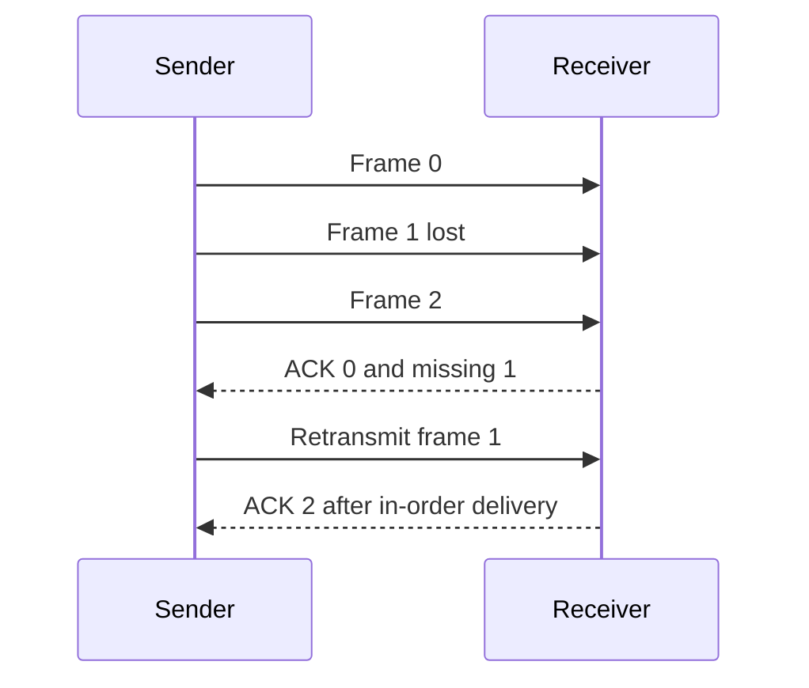
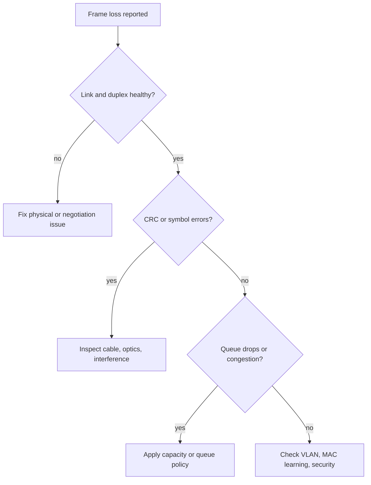

# Data Link Layer, MAC, Framing & ARQ

The data-link layer delivers frames across one local link, turning an unreliable physical signal into an addressable, error-detectable hop.
It is where Ethernet switching, Wi-Fi contention, checksums, and retransmission protocols meet, so it explains why a correct IP packet can still be delayed, duplicated, dropped, or delivered on the wrong local segment.
The layer does not promise end-to-end application success; it provides bounded hop-level mechanisms that higher layers compose.

---

## 🟢 Beginner Level

### Frames Give Bits Local Meaning

The physical layer carries signals and bits.

The data-link layer groups those bits into frames.

A frame normally includes a local destination address, source address, type or length, payload, and error-detection field.

Ethernet is a common wired link-layer technology.

Wi-Fi is a common wireless link-layer technology with different medium-access rules.

Link addresses identify interfaces on one broadcast domain.

They are not Internet-wide routing addresses.

The frame check sequence, or FCS, helps a receiver detect corruption.

It does not encrypt traffic.

It does not prove that a source address is authentic.

It does not recover a dropped frame without a protocol that requests recovery.

### Local Delivery and Switching

A switch learns a source MAC address from the port on which a frame arrives.

It forwards a known unicast destination only to the learned port in the same VLAN.

It floods broadcasts and unknown unicasts to other ports in that VLAN.

A router receives a link-layer frame, removes its local header, and forwards the enclosed IP packet using a new next-hop frame.

This is why the MAC addresses change at routed boundaries while end-to-end IP addresses usually remain.

| Term | Scope | Example | Does it cross a router? |
|---|---|---|---|
| Frame | One link | Ethernet frame | No, it is replaced |
| MAC address | Local interface | Switch lookup | No routing meaning |
| Packet | Network layer | IPv4 or IPv6 | Yes |
| Port | Host transport endpoint | TCP 443 | End-to-end host meaning |

### Errors Are Normal on Links

Noise, weak radio signal, interference, faulty cables, overloaded buffers, and collisions can damage or lose frames.

Parity adds one bit and detects many odd-bit errors.

A checksum adds a compact computed value but has weaker burst-error guarantees than CRC for many link uses.

Cyclic redundancy check, or CRC, treats bits as a polynomial and computes a remainder using an agreed generator polynomial.

The receiver divides again and rejects a frame with a nonzero unexpected remainder.

CRC detects all single-bit errors when the generator has multiple terms and many burst errors up to a selected length.

It is detection, not correction.

### Shared Media Needs Rules

On a shared medium, two transmitters can choose the same time.

Legacy shared Ethernet used collision detection.

Modern switched full-duplex Ethernet has one sender and receiver per link, so normal collisions do not occur.

Wi-Fi shares radio spectrum and cannot reliably listen for a collision while transmitting.

It therefore uses collision avoidance, random backoff, acknowledgments, and optional RTS/CTS exchanges.

The diagram describes a simplified contention cycle.

Real Wi-Fi includes inter-frame spaces, contention windows, retries, rate adaptation, and access categories.

---

## 🟡 Intermediate Level

### Framing and Transparency

Receivers need to know where one frame ends and the next begins.

Length fields state a payload size.

Sentinel bytes mark boundaries in some protocols.

Byte stuffing escapes a sentinel when it appears in data.

Bit stuffing inserts a zero after a run of ones so a flag pattern cannot occur accidentally in payload.

Physical encodings and Ethernet framing rules provide other boundaries.

The chosen technique must handle malformed lengths and corrupted delimiters without losing permanent synchronization.

### Stop-and-Wait ARQ

Automatic repeat request, or ARQ, combines error detection with acknowledgments and timeouts.

Stop-and-wait sends one frame then waits for an acknowledgment before sending the next.

Sequence numbers distinguish a delayed duplicate from a new frame.

If an ACK is lost, the sender retransmits after timeout.

The receiver recognizes the duplicate sequence number, discards duplicate data, and acknowledges again.

This provides reliable in-order delivery over the modeled hop but uses only one frame per round trip.

### Sliding Windows

Go-Back-N permits several unacknowledged frames.

The receiver accepts only the next expected sequence and discards later out-of-order frames.

On loss, the sender retransmits from the missing frame onward after timeout.

Selective Repeat permits a receiver window and buffers valid later frames.

It retransmits only missing frames but needs more receiver memory and careful sequence-number rules.

| Protocol | Sender window | Receiver behavior | Loss cost |
|---|---|---|---|
| Stop-and-wait | 1 | One expected frame | One timeout per frame |
| Go-Back-N | N | Discard later frames | Retransmit suffix |
| Selective Repeat | N | Buffer later frames | Retransmit missing only |

### Worked Example: Link Utilization

Assume a 1 Mb/s link sends 1,000-byte frames.

Serialization time is $1000 \times 8 / 1{,}000{,}000 = 8$ ms.

Assume round-trip propagation and ACK delay is 80 ms.

Stop-and-wait completes one 8 ms frame roughly every 88 ms.

Its ideal utilization is about $8 / 88 = 9.1\%$.

A window of 12 frames can put $12 \times 8 = 96$ ms of transmission into flight.

That is enough to cover the 80 ms round trip in this simplified example.

The needed window changes with frame size, bandwidth, round-trip time, and loss.

### Ethernet MAC and VLANs

Ethernet switches learn source addresses per VLAN.

A VLAN creates a separate Layer 2 broadcast domain over shared switching hardware.

Trunk links carry multiple VLANs using tags or an equivalent configured mechanism.

Access ports normally admit one endpoint VLAN.

Inter-VLAN traffic requires Layer 3 routing and policy.

VLANs improve segmentation but do not replace firewall policy, host authentication, or encrypted application traffic.

### Wi-Fi Hidden Nodes and RTS/CTS

Two stations may both reach an access point while not hearing each other.

They can each sense an idle channel and transmit together, causing a collision at the access point.

This is the hidden-node problem.

RTS/CTS reserves a short interval so nearby stations defer transmission after hearing the control exchange.

It adds overhead, so it is useful only when collision avoidance benefits exceed that overhead.

Rate adaptation, signal strength, retries, and airtime fairness often matter more than advertised Wi-Fi link rate.

---

## 🔴 Expert Level

### CRC, FCS, and Hardware Offload

Ethernet FCS is typically a CRC computed by network hardware.

A bad FCS frame is normally discarded at the receiving interface.

Capture tools may not show all bad frames because the NIC can drop them before the operating system receives them.

Checksum and segmentation offloads can make packet captures appear to contain incomplete checksums before the NIC finalizes transmission.

Interpret captures with knowledge of offload settings and capture point.

### CSMA/CD Is Historical Context

CSMA/CD required a station to detect collision before it finished transmitting the minimum frame.

This led to Ethernet slot-time and minimum-frame constraints on shared half-duplex media.

Full-duplex switched Ethernet has no shared collision domain and disables CSMA/CD behavior.

Duplex mismatch can still cause errors, late collisions, retransmissions, and poor throughput on misconfigured legacy links.

Always inspect negotiated speed, duplex, errors, and drops at both ends of a suspicious link.

### Reliability Boundaries and Duplicate Delivery

Link-layer retries can improve delivery over one lossy hop.

They do not make an end-to-end operation exactly once.

Frames can be duplicated after ACK loss, and a later routed hop can fail after an earlier hop succeeded.

Higher layers use sequence numbers, acknowledgments, idempotency keys, or transactions when the application needs stronger semantics.

Do not stack retries at every layer without a budget.

Independent link, transport, HTTP, and application retries can multiply traffic during an outage.

### Operations and Security Failure Modes

Unknown-unicast flooding is normal before a switch learns a destination.

Excessive flooding can indicate a topology loop, MAC churn, table exhaustion, or an attack.

Broadcast storms consume bandwidth and CPU across a VLAN.

Loop prevention, storm control, port security, and segmentation limit blast radius.

ARP spoofing and rogue DHCP are local-link attacks that require controls beyond ordinary MAC learning.

Use authenticated access, DHCP snooping, dynamic ARP inspection where suitable, and host encryption for sensitive traffic.

### Forwarding Diagnostics and Counters

Diagnose a link problem from counters and a defined traffic path rather than from one capture alone.

Start with physical link state, negotiated speed, duplex, optical power where applicable, and interface error counters.

Then inspect received frames, transmitted frames, discards, queue drops, CRC errors, MAC moves, and VLAN membership.

Compare both ends of a link because one side's receive errors can be the other side's transmit problem.

CRC errors usually point below IP, toward signal integrity, cable, optics, connector, or incompatible speed and duplex behavior.

Queue drops can occur with perfect physical counters when bursts exceed egress service capacity.

MAC flapping shows the same source address moving rapidly between ports and often signals a loop, incorrect aggregation, virtualization configuration, or spoofing.

Collect counters over an interval because a total since boot cannot show whether an incident is current.

Correlate interface changes with topology events, access-point channel changes, and deployment timestamps.

### Frame Size, MTU, and Fragmentation Boundaries

The maximum transmission unit, or MTU, is the largest network-layer payload a link can carry without lower-layer fragmentation.

Ethernet commonly carries an IP MTU of 1500 bytes, but tunnel overhead, VLAN tags, VPNs, and provider links can reduce effective usable size.

An oversized packet may be fragmented, dropped, or trigger path-MTU discovery depending on protocol and configuration.

Blocking the ICMP messages needed for path-MTU discovery can create a black-hole failure where small requests work and larger responses stall.

Jumbo frames can reduce per-packet processing for supported high-throughput paths.

They must be configured consistently across every relevant hop, including hosts, switches, storage fabric, and virtualization layers.

Do not enable a larger MTU only on one endpoint and assume negotiation will protect all application traffic.

### Link Aggregation and Ordering

Link aggregation can combine several physical links into one logical connection for redundancy and aggregate capacity.

Traffic is commonly hashed by flow so packets from one flow stay ordered on one member link.

The aggregate's capacity does not mean one TCP flow automatically exceeds one member link's capacity.

Hash imbalance can leave one member busy while others are underused.

Validate aggregation mode, peer configuration, hashing inputs, and failure behavior before blaming an application for uneven utilization.

### Common Misconceptions

1. **"CRC corrects damaged frames."**
   *Correction*: CRC detects corruption; a protocol must retransmit or the frame is lost. Error correction needs additional coding and is a different mechanism.

2. **"Wi-Fi uses CSMA/CD."**
   *Correction*: Wi-Fi uses collision avoidance because a radio normally cannot detect another sender reliably while transmitting. It relies on backoff and acknowledgments.

3. **"A VLAN is a security boundary by itself."**
   *Correction*: VLANs segment Layer 2 broadcast scope. Routing, ACLs, authentication, and encryption still define actual access control.

4. **"Selective Repeat always has lower total cost."**
   *Correction*: It saves retransmission bandwidth on loss but needs buffering, timers, and sequence-space discipline. Go-Back-N can be simpler on low-loss links.

5. **"Modern Ethernet collisions explain ordinary switch-port loss."**
   *Correction*: Full-duplex switched links do not contend like a hub. Examine queues, errors, duplex mismatch, congestion, and physical faults instead.

### Interview Questions

**Q1. What does the data-link layer provide?** `[easy]`

It provides framed delivery across one local link with addressing and error detection. Specific technologies can add medium access and local retransmission. It does not alone guarantee an end-to-end application transaction.

**Q2. What is CRC used for?** `[easy]`

CRC detects many accidental bit errors in a received frame. The sender and receiver use the same generator polynomial and compare the computed remainder. A failed check normally causes discard and possible retransmission by a higher local protocol.

**Q3. What is the difference between a MAC address and IP address?** `[easy]`

A MAC address identifies an interface on a local link for frame delivery. An IP address supports routing between logical networks. Routers replace local MAC headers at each hop while forwarding IP packets.

**Q4. Why does Wi-Fi acknowledge unicast frames?** `[easy]`

Wireless loss is common and collision detection during transmission is impractical. A link-layer ACK tells the sender that a receiver accepted a frame. Missing ACKs trigger retry and backoff, subject to retry limits.

**Q5. How does Stop-and-Wait avoid duplicate delivery after an ACK loss?** `[medium]`

It uses a sequence number, usually alternating one bit for consecutive frames. The receiver remembers the expected number and discards a retransmitted duplicate while sending the acknowledgment again. This distinguishes recovery from delivery of a second application message.

**Q6. Why does Selective Repeat limit its window relative to sequence space?** `[medium]`

The sequence space must not wrap so soon that an old delayed frame looks like a new frame in the current receiver window. A common rule limits each window to at most half the sequence space. This keeps retransmissions and new transmissions unambiguous.

**Q7. What happens for an unknown unicast on a switch?** `[medium]`

The switch floods the frame to eligible ports in the VLAN except the ingress port. When the destination replies, the switch learns its source MAC and can forward later traffic selectively. Persistent flooding merits investigation for churn or attack.

**Q8. What is the hidden-node problem?** `[medium]`

Two wireless stations can each hear the access point but not each other. They both believe the channel is idle and can collide at the access point. RTS/CTS can reduce this pattern at the cost of control overhead.

**Q9. Compare Go-Back-N and Selective Repeat after one lost frame.** `[medium]`

Go-Back-N discards later out-of-order frames and retransmits from the missing one. Selective Repeat buffers valid later frames and retransmits only the missing frame. Selective Repeat saves bandwidth on lossy long links but is more complex.

**Q10. Why does a full-duplex Ethernet link not use CSMA/CD?** `[medium]`

Each endpoint has a dedicated transmit and receive path, so two independent stations do not contend for one shared wire. Collision detection was for shared half-duplex media such as hubs. Errors on a full-duplex link point to different causes.

**Q11. Why can a packet capture show a bad outbound checksum?** `[medium]`

The capture can occur before the NIC performs checksum offload. Hardware fills the final checksum as it transmits the frame. Confirm offload settings and capture location before diagnosing an application or protocol bug.

**Q12. Scenario: Wi-Fi users have strong signal but frequent retries and low throughput. What do you inspect?** `[hard]`

Inspect channel utilization, co-channel interference, hidden nodes, airtime fairness, retry rate, and client data rates rather than signal strength alone. Strong signal does not prove a clean shared radio medium. Change channel plan, client placement, or capacity after confirming the contention source.

**Q13. Scenario: one VLAN sees flooding and CPU spikes after a new access switch is attached. What is likely wrong?** `[hard]`

Check for a Layer 2 loop, inconsistent VLAN trunking, spanning-tree failure, or MAC flapping between ports. A loop can multiply broadcasts and unknown unicasts until the network becomes unusable. Contain the link, confirm the intended topology, and test loop prevention before restoring it.

**Q14. Scenario: an API records duplicate payments even though the Wi-Fi link retries frames. Where should correctness be fixed?** `[hard]`

Fix it at the application or transaction boundary with an idempotency key and durable business state. Link retries only address one hop and can themselves duplicate delivery when acknowledgments are lost. End-to-end effects need end-to-end deduplication and recovery design.

### Further Reading

- [IEEE 802.3 Ethernet standards entry point](https://www.ieee802.org/3/) provides the authoritative Ethernet family context.
- [IEEE 802.11 working group](https://www.ieee802.org/11/) is the standards entry point for Wi-Fi MAC behavior.
- [RFC 1662: HDLC-like framing](https://www.rfc-editor.org/rfc/rfc1662) explains framing and bit stuffing mechanisms.
- [RFC 1055: SLIP](https://www.rfc-editor.org/rfc/rfc1055) provides historical framing context for byte-stuffed links.
