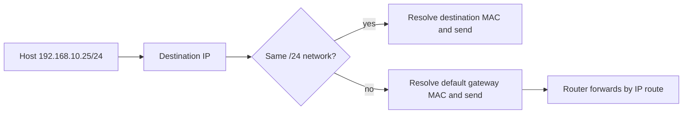
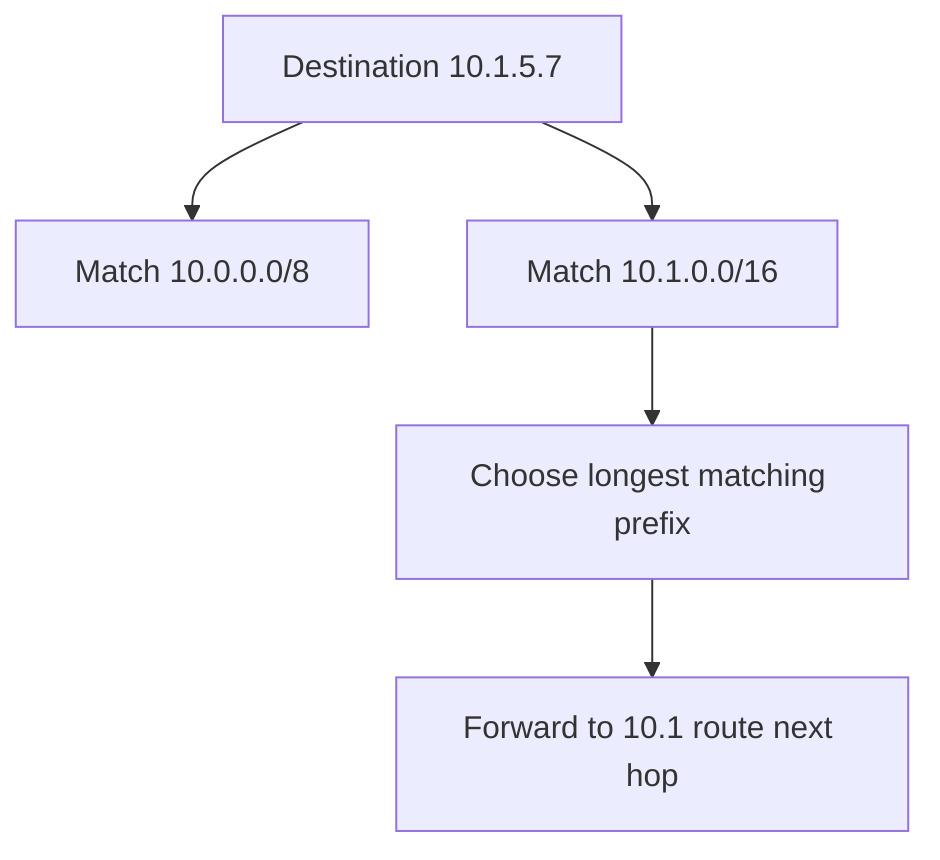
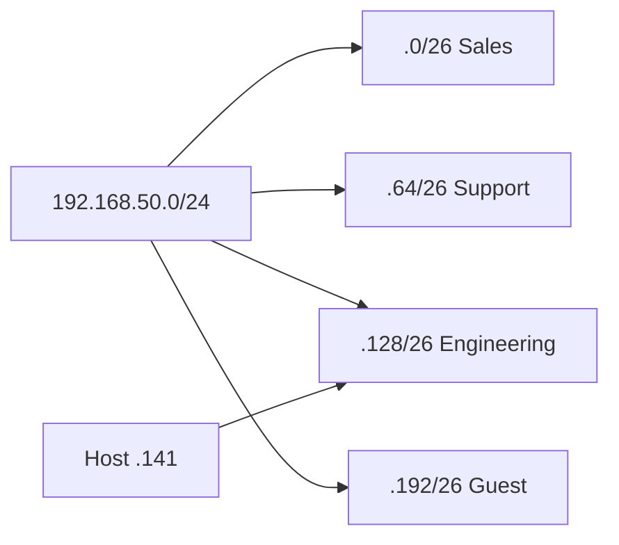
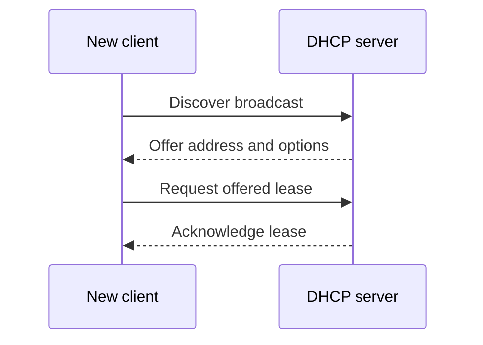
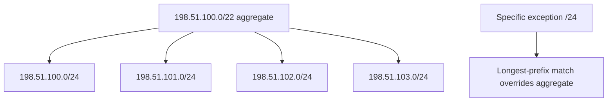

# IP Addressing, CIDR Subnetting, ARP, DHCP, and NAT

IP addressing gives hosts and networks a logical location so routers can forward packets beyond one local link. CIDR makes address allocation and route aggregation flexible, while ARP, DHCP, and NAT solve local delivery, configuration, and address-conservation problems around that addressing. Interviewers expect candidates to calculate a prefix correctly and to explain what happens before the first packet actually leaves a LAN.

---

## 🟢 Beginner Level

### IPv4, IPv6, CIDR, and subnetting

IPv4 is a 32-bit address usually written as four decimal octets.

For `192.168.10.25/24`, the `/24` prefix says the first 24 bits identify the network.

The remaining 8 bits identify a host position within that network.

The subnet mask for `/24` is `255.255.255.0`.

Routers compare destination prefixes with route prefixes to choose the next hop.

Hosts first decide whether a destination is local or requires the default gateway.

The IP destination remains the remote host across routed hops.

The Ethernet source and destination MAC addresses change at each link.

This is why an IP address is not a substitute for a local hardware address.

### IPv4 address categories and private space

Historic class A, B, and C boundaries are useful vocabulary but do not control modern routing.

CIDR replaced classful allocation with arbitrary prefix lengths.

Private IPv4 ranges are reserved for use inside organisations and are not globally routed on the public Internet.

| Range | CIDR block | Common purpose |
|---|---|---|
| `10.0.0.0` to `10.255.255.255` | `10.0.0.0/8` | Large private networks |
| `172.16.0.0` to `172.31.255.255` | `172.16.0.0/12` | Private enterprise networks |
| `192.168.0.0` to `192.168.255.255` | `192.168.0.0/16` | Home and small LANs |
| `127.0.0.0/8` | Loopback | Local host testing |
| `169.254.0.0/16` | Link-local IPv4 | Auto-configuration fallback |

Public address space is allocated through regional Internet registries and providers.

Private addressing requires a router, NAT policy, VPN, or other gateway to reach public destinations.

Do not assume every address beginning with `172` is private.

Only `172.16.0.0` through `172.31.255.255` is the RFC 1918 private block.

### IPv6 changes scale and discovery

IPv6 has 128-bit addresses written in hexadecimal groups.

Leading zeros may be omitted and one run of zero groups may be compressed with `::`.

For example, `2001:0db8:0000:0000:0000:0000:0000:0001` can be written as `2001:db8::1`.

IPv6 uses prefixes such as `/64` for many LANs.

It replaces ARP with Neighbor Discovery messages carried by ICMPv6.

It supports link-local addresses beginning with `fe80::/10` for local-link communication.

IPv6 does not eliminate the need for routing, filtering, DNS, or operational address planning.

---

## 🟡 Intermediate Level

### CIDR masks and longest-prefix matching

CIDR writes a network as an address and prefix length, such as `203.0.113.0/24`.

The prefix length counts contiguous leading one bits in the mask.

A `/20` mask is `255.255.240.0` because the third octet has four one bits followed by four zero bits.

Routers apply longest-prefix matching.

If both `10.0.0.0/8` and `10.1.0.0/16` match destination `10.1.5.7`, the `/16` route wins because it is more specific.

Route aggregation advertises one shorter prefix that covers several adjacent networks.

Aggregation reduces routing-table size only when the covered blocks are aligned and share the same forwarding policy.

The default route is written `0.0.0.0/0`.

It matches every IPv4 destination but loses to any more specific route.

### Worked example: subnet `192.168.50.0/24`

An office needs four equal subnets from `192.168.50.0/24`.

Four subnets require two borrowed host bits because $2^2 = 4$.

The new prefix is `/26`.

A `/26` leaves six host bits, giving $2^6 = 64$ total addresses per subnet.

For ordinary IPv4 broadcast subnets, two addresses are reserved for network and broadcast.

Each `/26` therefore has 62 usable host addresses.

The mask is `255.255.255.192`.

The block size in the final octet is `256 - 192 = 64`.

The four ranges begin at 0, 64, 128, and 192.

| Subnet | Network address | Usable range | Broadcast address |
|---|---|---|---|
| Sales | `192.168.50.0/26` | `.1` to `.62` | `.63` |
| Support | `192.168.50.64/26` | `.65` to `.126` | `.127` |
| Engineering | `192.168.50.128/26` | `.129` to `.190` | `.191` |
| Guest | `192.168.50.192/26` | `.193` to `.254` | `.255` |

Host `192.168.50.141/26` belongs to Engineering.

Bitwise AND between its address and mask produces network `192.168.50.128`.

Its broadcast is the last address before the next block, `192.168.50.191`.

The usable-host formula is a convention for broadcast-capable IPv4 LANs.

Point-to-point links and special prefixes can have different rules.

### VLSM and route planning

Variable Length Subnet Masking allocates different prefix sizes based on actual need.

Allocate the largest required subnet first to avoid fragmentation.

For 100 hosts, choose at least 128 addresses, which is `/25` with 126 usable conventional host addresses.

For 50 hosts, choose `/26` with 62 usable addresses.

For 20 hosts, choose `/27` with 30 usable addresses.

For a point-to-point IPv4 link, `/31` can be used when both endpoints support the relevant standard because no broadcast is needed.

Leave aggregation boundaries and growth space in the plan.

Address design is a routing and security policy tool, not a spreadsheet exercise alone.

### ARP, DHCP, and NAT solve local problems

ARP maps a known IPv4 address on the local network to a MAC address.

The requester broadcasts an ARP request asking who owns an IP address.

The owner normally replies with its MAC address.

Hosts cache the mapping for a limited lifetime.

DHCP dynamically provides an address, prefix or mask, default gateway, DNS servers, lease duration, and other options.

The basic exchange is Discover, Offer, Request, and Acknowledge.

NAT rewrites addressing information at a boundary.

Port Address Translation maps many private internal source tuples onto a smaller set of public address and port tuples.

NAT saves public IPv4 addresses but complicates inbound reachability, protocol design, logging, and peer-to-peer connectivity.

It is not a security policy by itself, although stateful firewalls are often deployed beside it.

---

## 🔴 Expert Level

### ARP security and neighbor correctness

ARP has no authentication in its base design.

An attacker on the same broadcast domain can send forged replies that associate a gateway IP with the attacker's MAC address.

This enables traffic interception or denial of service.

Switch features such as DHCP snooping and Dynamic ARP Inspection validate bindings in managed networks.

Static bindings help only for limited critical cases because they create operational overhead.

IPv6 Neighbor Discovery has different message formats but also needs local-link security controls such as RA Guard and SEND where appropriate.

Monitor unexpected mapping changes and duplicate-IP alerts.

### NAT state, connection tracking, and traversal

A stateful NAT records an inside tuple, translated public tuple, protocol, and timeout.

For example, `10.0.0.5:51514` can become `198.51.100.8:40001` for an outbound UDP flow.

Reply packets to the public tuple are translated back while the state exists.

Different NAT behaviours affect whether peer-to-peer applications can predict or reuse a mapping.

STUN helps a client discover its public-facing mapping.

ICE coordinates possible candidate paths between peers.

TURN relays media when a direct path cannot be established.

NAT tables are finite resources and can exhaust under bursts, scans, or unusually long idle timeouts.

### IPv6 addressing and dual-stack operations

IPv6 avoids IPv4 public-address scarcity but dual-stack networks must operate two protocols during transition.

DNS may return both A and AAAA records.

Clients use address-selection and connection-racing strategies to avoid a broken IPv6 path delaying user experience.

IPv6 subnetting commonly uses `/64` for SLAAC-compatible LANs, even if the current host count is small.

Do not apply IPv4 habits such as relying on NAT as the default boundary.

Use explicit firewall rules, prefix delegation, address inventory, and logging for IPv6.

### Operational failure modes and diagnostics

An incorrect prefix can make a host ARP for an address that should be routed, or send local traffic unnecessarily to a gateway.

An incorrect default gateway makes off-subnet traffic fail while local communication succeeds.

Overlapping private ranges cause ambiguity through VPNs and mergers.

DHCP exhaustion prevents new clients from receiving addresses even while existing leases still work.

NAT port exhaustion causes intermittent outbound failure under high connection churn.

Start diagnosis with address, prefix, route table, gateway reachability, ARP or neighbor cache, DHCP lease, and packet capture in that order.

### Prefix aggregation and routing policy

CIDR permits one route advertisement to represent several adjacent smaller networks.

For example, `198.51.100.0/22` covers four contiguous `/24` blocks beginning at `.0`, `.1`, `.2`, and `.3` in the third octet position.

An upstream router can keep one `/22` entry instead of four `/24` entries when all four use the same next hop.

The aggregation boundary must align with the prefix length.

Advertising `198.51.100.0/22` while one covered `/24` belongs to another site sends some traffic to the wrong place.

More-specific routes can intentionally override an aggregate during migrations or traffic engineering.

That override must be monitored because accidental leaks of more-specific prefixes can pull traffic unexpectedly.

Good address planning leaves contiguous blocks for sites, environments, and future growth.

It does not allocate every free subnet randomly just because the arithmetic permits it.

Summaries also reduce route churn and control-plane memory in large networks.

They may hide a failed component behind a broad reachable prefix unless the routing protocol withdraws or overrides it correctly.

The forwarding table is distinct from the routing protocol's candidate information base.

The router makes the data-plane decision using selected forwarding entries.

### DHCP lease lifecycle and relay behaviour

DHCP clients do not broadcast across a router by default.

A DHCP relay on the client subnet forwards the request to a central server and identifies the receiving network.

The server selects an address scope based on relay information.

Leases have a duration so addresses can return to the pool when devices disappear.

Clients normally attempt renewal before lease expiry with the original server.

They later attempt rebinding more broadly if that server is unavailable.

Reservation binds a chosen address to a client identifier or MAC address under administrative policy.

Reservations simplify stable infrastructure addresses but still depend on a healthy DHCP service.

Use redundant servers or failover design for networks where new-device availability is critical.

Do not use an overly long lease merely to hide exhausted-pool monitoring.

Conversely, very short leases increase broadcast and server load for mobile clients.

### Common Misconceptions

1. **"The first three octets always identify a network."**
   *Correction*: The prefix length determines the network boundary. A `/20`, `/26`, or `/31` can divide an octet, so classful octet assumptions cause routing errors.

2. **"ARP finds the MAC address of the final Internet server."**
   *Correction*: A host ARPs only for a next hop on its local link. For a remote destination, that next hop is normally the default gateway, not the remote server.

3. **"NAT is a firewall."**
   *Correction*: NAT translates addresses and often creates state that blocks unsolicited inbound traffic by default. Security policy still requires explicit filtering, segmentation, and logging.

4. **"A `/24` always has 254 usable hosts."**
   *Correction*: That is the conventional broadcast-subnet count, not a universal law. Point-to-point and special-use prefixes have different semantics and cloud products may reserve additional addresses.

5. **"IPv6 has no need for address planning."**
   *Correction*: Large address space reduces scarcity but increases the need for readable prefix allocation, route aggregation, firewall policy, DNS, and inventory discipline.

### Interview Questions

**Q1. What does a CIDR prefix length represent?** `[easy]`

It is the number of leading address bits that identify the network prefix. The remaining bits identify positions inside that prefix. Routers use the prefix length to compare routes and choose the most specific match.

**Q2. What is the default route?** `[easy]`

The IPv4 default route is `0.0.0.0/0`, which matches every destination. It is used only when no more-specific route matches. A host normally sends such traffic to its configured default gateway on the local link.

**Q3. What does ARP do?** `[easy]`

ARP resolves a local IPv4 next-hop address into a link-layer MAC address. The requester broadcasts a question and the owner replies with its hardware address, which is cached temporarily. ARP does not route packets and does not resolve a remote Internet host's MAC across routers.

**Q4. What are the DHCP DORA messages?** `[easy]`

DORA stands for Discover, Offer, Request, and Acknowledge. A client without configuration discovers servers, receives an offer, requests a selected lease, and receives confirmation with network options. The exchange lets administrators centralise address assignment and lease control.

**Q5. Why does longest-prefix matching matter?** `[medium]`

It lets a routing table contain a broad aggregate route and a narrower exception route at the same time. When both match, the longer prefix wins because it identifies a smaller, more specific destination set. This supports route aggregation without losing precise forwarding policy where needed.

**Q6. How many usable hosts does a conventional `/26` subnet have?** `[medium]`

A `/26` leaves six host bits, producing 64 total addresses. In a normal IPv4 broadcast subnet, one is the network address and one is the directed broadcast address, leaving 62 usable addresses. Special point-to-point and platform-reserved cases need separate rules.

**Q7. What is the difference between SNAT and DNAT?** `[medium]`

Source NAT changes a packet's source address, often mapping private outbound clients to a public address. Destination NAT changes a destination address, commonly for inbound service publishing or load-balancing. Both require clear state and firewall policy so replies and logging remain correct.

**Q8. Why can overlapping private prefixes break a VPN?** `[medium]`

If both sites use the same address range, a router cannot tell whether a destination belongs locally or across the tunnel without extra translation or policy. Return paths and DNS can become ambiguous too. Renumbering is the clean long-term solution, while NAT overlays add operational complexity.

**Q9. What does a `/31` enable on a point-to-point link?** `[medium]`

It provides two addresses for two endpoints without reserving network and broadcast addresses in the traditional LAN sense. This conserves IPv4 address space on router-to-router links when both ends support the standard. It should not be copied blindly to a multi-access Ethernet segment.

**Q10. Why is NAT traversal needed for peer-to-peer traffic?** `[medium]`

NAT hides private endpoint tuples behind mappings that may exist only after outbound traffic. A peer cannot always send directly to another private host without discovering and coordinating those mappings. STUN, ICE, and TURN provide discovery, candidate selection, and relay fallback.

**Q11. Scenario: host `192.168.50.141/26` cannot reach `.70` but can reach `.160`. What do you check?** `[hard]`

The host belongs to `192.168.50.128/26`, while `.70` is in `192.168.50.64/26` and needs routing through a gateway. `.160` is local in the same `/26`, so direct ARP is expected. Verify the host's prefix and gateway, then inspect the router interface and firewall policy between the two subnets.

**Q12. Scenario: local LAN access works but every Internet destination times out after a new DHCP scope is deployed. What is a likely cause?** `[hard]`

The scope may be supplying an incorrect default gateway, mask, or DNS option even though local hosts remain reachable. Compare the lease options with a known-good client, then check the route table and ARP entry for the intended gateway. Fix the DHCP option rather than changing each client manually.

**Q13. Why can a NAT gateway fail under a traffic spike even with available bandwidth?** `[hard]`

Stateful NAT must allocate connection-tracking entries and often a translated source port for each flow. Rapid connection churn can exhaust ports, memory, or table capacity before link bandwidth saturates. Measure connection count, timeout policy, allocation failures, and reuse patterns, then add capacity or reduce unnecessary connections.

**Q14. How should IPv6 security differ from an IPv4 NAT-centric design?** `[hard]`

IPv6 endpoints can be globally addressable, so security should rely on explicit stateful firewall and segmentation policy rather than accidental address hiding. Neighbor Discovery and router advertisements also need local-link controls. Maintain prefix inventory, DNS, logging, and dual-stack tests because IPv4 policy does not automatically apply to IPv6 paths.

### Further Reading

- [RFC 4632: CIDR strategy](https://www.rfc-editor.org/rfc/rfc4632) defines classless addressing and aggregation principles.
- [RFC 1918: private IPv4 addressing](https://www.rfc-editor.org/rfc/rfc1918) defines private address blocks.
- [RFC 826: ARP](https://www.rfc-editor.org/rfc/rfc826) specifies IPv4 address resolution on Ethernet-like networks.
- [RFC 4861: IPv6 Neighbor Discovery](https://www.rfc-editor.org/rfc/rfc4861) defines IPv6 neighbour and router discovery.
