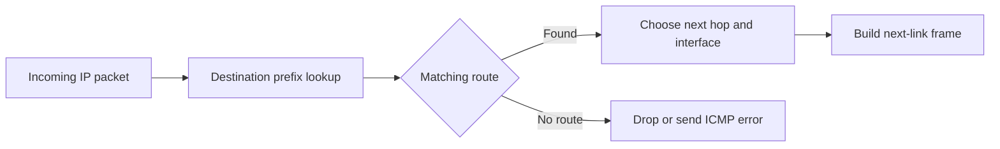
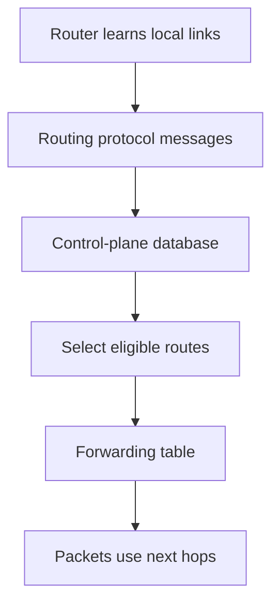
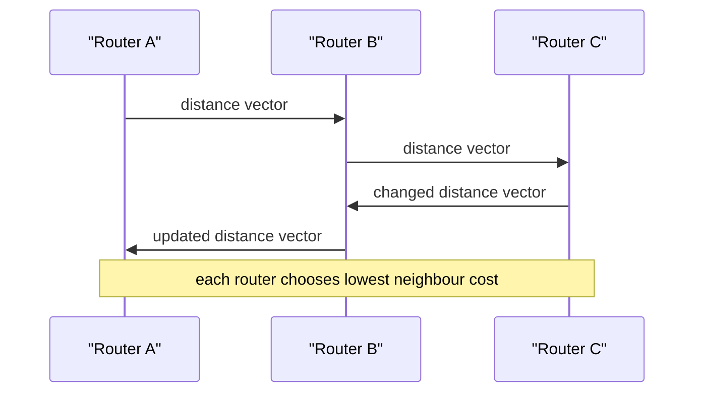
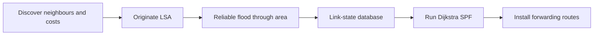
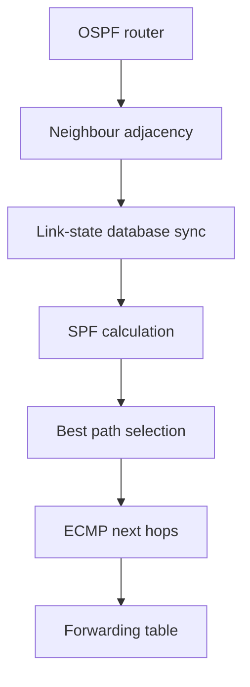

# Routing Algorithms, Link State & Distance Vector

Routing chooses the next hop for an IP packet so independent networks can reach one another without every host knowing the whole topology.
Routers build forwarding tables from connected networks, static configuration, and dynamic routing protocols that react to failures and policy changes.
Interviewers ask about routing because the algorithms reveal how a local decision can converge into an end-to-end path—or create loops and black holes during change.

---

## 🟢 Beginner Level

### Forwarding uses the best matching route

A router receives an IP packet, examines its destination address, and chooses an outgoing interface and next hop.
This packet-by-packet action is **forwarding**.
The control plane is the separate work of learning and selecting routes that populate the forwarding table.



Routes are normally written as address prefixes such as `10.20.0.0/16`.
When several prefixes match a destination, IP forwarding uses the longest prefix match.
For destination `10.20.7.9`, a route for `10.20.7.0/24` wins over `10.20.0.0/16` because it is more specific.

The router does not find a complete end-to-end path separately for every packet.
It chooses the next hop using its current forwarding table.
The next router repeats the same operation until the packet reaches a connected destination network or is dropped.

### A route has a destination and a path choice

A routing-table entry describes a destination prefix and how to reach it.
The entry may name an outgoing interface, a next-hop router address, a metric, and a source such as static, OSPF, or BGP.

| Route information | Example | Why it matters |
|---|---|---|
| destination prefix | `203.0.113.0/24` | addresses covered by the route |
| next hop | `192.0.2.1` | immediate router to send toward |
| outgoing interface | `eth0` | local link used for transmission |
| metric | 20 | relative cost within one protocol |
| administrative preference | protocol-specific | choose between route sources |

An IP address describes where the packet is ultimately going.
A next hop describes where the current router sends it on the next local link.
The next-hop MAC address is resolved locally with ARP for IPv4 or Neighbor Discovery for IPv6.

A default route, commonly `0.0.0.0/0` or `::/0`, matches when no more-specific route exists.
It is useful at network edges but dangerous when mistakenly advertised inside a network because it can hide missing specific routes.

### Routing protocols exchange reachability information

Dynamic protocols automate route learning between routers.
They send control messages, apply an algorithm or policy, and install eligible results into routing tables.
Different environments use different protocol families.



Distance-vector protocols exchange a router's distance estimates with neighbours.
Link-state protocols flood descriptions of links so each router builds a shared topology view.
Path-vector protocols advertise reachable prefixes with the autonomous-system path and policy attributes used between organizations.

The protocol supplies reachability information.
Operators still decide which neighbours to trust, which prefixes to advertise, and which path policy is acceptable.
Routing is therefore both an algorithmic and an administrative problem.

### Metrics and policy are not the same thing

Inside one organization, a routing metric often represents a technical cost such as bandwidth-derived cost, hop count, delay, or configured preference.
Lower metric usually wins within that protocol's comparison rules.
Between autonomous systems, commercial, security, and resilience policy often matter more than latency.

For example, an enterprise may prefer a private link over a cheaper public path.
An Internet provider may prefer a customer route over a peer route because of commercial policy.
These choices can make a route that is not geographically shortest the intentional best route.

---

## 🟡 Intermediate Level

### Distance vector applies the Bellman-Ford recurrence

In distance-vector routing, router `x` maintains an estimate of the cost to every destination `y`.
It learns neighbour `v`'s estimate and evaluates the path through that neighbour.
The update rule is:

$$
D_x(y) = \min_v \{c(x,v) + D_v(y)\}
$$

Here $c(x,v)$ is the cost of the direct link from x to neighbour v.
The router chooses the neighbour producing the smallest total known cost.
It periodically sends its vector to neighbours and also reacts to significant changes.



RIP is the classic Internet distance-vector protocol.
It uses hop count as its metric and treats 16 as infinity, limiting it to small networks.
Modern networks may use other protocols, but RIP remains a clear example of iterative neighbour-based convergence.

### Worked example: calculate a distance-vector update

Router A has direct neighbours B and C.
The A-to-B link cost is 2 and the A-to-C link cost is 5.
Destination D is currently reported by B at cost 4 and by C at cost 1.

The path through B costs $2 + 4 = 6$.
The path through C costs $5 + 1 = 6$.
The two routes are equal cost, so A can choose one according to tie-break policy or install equal-cost paths where supported.

Now suppose B advertises a new cost of 1 to D.
The path through B becomes $2 + 1 = 3$.
A updates its D entry to metric 3 with B as next hop.

| Router A candidate | Link cost from A | neighbour distance to D | total metric |
|---|---:|---:|---:|
| via B, initial | 2 | 4 | 6 |
| via C | 5 | 1 | 6 |
| via B, updated | 2 | 1 | 3 |

This local calculation is enough for convergence when every router repeatedly shares correct information.
It does not mean the router sees the complete topology.
That limited view is why a failure can cause stale neighbours to reinforce a bad route temporarily.

### Count to infinity is a failure-convergence problem

Suppose B loses its direct link to D but A still advertises that D is reachable through B.
B may believe A has an alternative path and select A as its next hop.
A still selects B, creating a loop while each periodic exchange increases the metric.

Split horizon prevents a router from advertising a route back on the interface from which it learned that route.
Poison reverse goes further by advertising that route to the learning neighbour with an infinite metric.
Triggered updates send changes quickly rather than waiting for the next periodic timer.

These techniques reduce common two-router loops.
They do not solve every multi-router convergence case, so distance-vector protocols trade simplicity for slower and less globally informed failure behaviour.
Hold-down timers can suppress rapid acceptance of a potentially false better route, but they may delay legitimate recovery.

### Link state floods topology rather than distances

In link-state routing, each router discovers its directly connected neighbours and link costs.
It originates a link-state advertisement, or LSA, that is reliably flooded through the routing domain.
Every participating router builds a link-state database representing the same topology, then independently runs shortest-path first computation.



OSPF and IS-IS are widely used link-state protocols within administrative domains.
They converge quickly after a consistent topology update because every router calculates paths from a shared graph.
Flooding and shortest-path computation require more memory, CPU, and protocol complexity than a simple periodic distance vector.

Link state still needs careful design.
Unstable links can cause repeated floods and SPF calculations.
Large deployments use hierarchy, areas or levels, route summarisation, throttling, and authentication to bound the scope and cost of change.

### Dijkstra's algorithm builds a shortest-path tree

Dijkstra's algorithm starts with the local router at distance zero.
It repeatedly selects the unsettled node with the smallest tentative distance, then relaxes each outgoing edge.
Relaxing an edge means testing whether the path through the selected node improves the neighbour's known distance.

```text
dist[source] = 0
put source in priority queue
while queue is not empty:
  u = lowest-distance unsettled node
  for each edge u -> v:
    dist[v] = min(dist[v], dist[u] + cost(u, v))
```

With a binary heap priority queue, the common complexity is $O((V + E)\log V)$.
The result is a shortest-path tree rooted at the calculating router.
The router derives next hops from the first edge of each resulting tree path, not from a central controller's command.

---

## 🔴 Expert Level

### OSPF scopes topology and selects routes in stages

OSPF forms adjacencies with eligible neighbours and exchanges database descriptions, requests, and link-state updates until their link-state databases synchronize.
Routers run SPF after relevant database changes and calculate intra-area, inter-area, and external route candidates according to OSPF rules.
Areas limit LSA flooding and SPF scope; area 0 is the backbone that connects normal areas.

An OSPF cost is administratively derived, commonly from reference bandwidth divided by interface bandwidth.
It is not an automatic promise of measured latency.
If the reference bandwidth is left too low on fast links, several high-speed interfaces can receive the same cost and reduce path differentiation.

Equal-cost multipath, or ECMP, lets a router install several next hops with equal eligible cost.
The data plane commonly hashes flow fields so packets of one flow stay ordered while aggregate traffic uses multiple links.
Per-packet balancing can create reordering and harm TCP performance, so flow-based balancing is the common choice.



Authentication protects routing exchanges from unauthorised neighbours but does not replace interface and control-plane protection.
Route filtering and prefix limits remain important where routing domains connect.
An attacker or configuration error that injects many routes can consume memory and CPU even if every LSA is authenticated.

### BGP is path vector and policy, not shortest path

Border Gateway Protocol, or BGP, exchanges reachability between autonomous systems.
An announcement includes a destination prefix and attributes such as AS_PATH, NEXT_HOP, LOCAL_PREF, MED, communities, and origin information.
Routers apply policy before and after advertising routes to neighbours.

AS_PATH records the autonomous systems an advertisement traversed.
If a router sees its own AS number in a received AS_PATH, it rejects the route to avoid an interdomain routing loop.
This is a direct loop-prevention mechanism, unlike link-state topology flooding.

BGP's best-path process is implementation and policy dependent, but a common high-level preference is higher local preference, then shorter AS_PATH, then other attributes and tie breakers.
AS_PATH length is not a latency measurement.
A longer path may be preferred because it is more reliable, less expensive, or required by security policy.

Route aggregation reduces the number of prefixes advertised and supports scalable global routing tables.
Overly broad aggregation can create a black hole if the aggregate is advertised while a more-specific internal route is unavailable.
Operators use explicit discard routes, conditional advertisement, and careful summarisation boundaries to make aggregates safe.

### Convergence must preserve forwarding safety

Control-plane convergence is the time for routers to learn a new consistent route view.
Data-plane convergence is the time until packets actually follow the new viable path.
They can differ because forwarding-table programming, hardware updates, ARP or neighbour resolution, and traffic hashing happen after protocol calculation.

During a failure, some routers can forward on old information while others forward on new information.
This can create transient loops, microloops, black holes, and asymmetric paths.
Fast failure detection such as Bidirectional Forwarding Detection can shorten detection time, but aggressive timers increase false-failure risk under congestion or CPU pauses.

Graceful restart and stale-route retention can reduce traffic disruption during planned control-plane restarts.
They can also prolong forwarding to a dead neighbour if the failure is not actually graceful.
Choose timers and restart behaviour based on failure domains, not only the lowest possible lab convergence time.

### Routing security needs validation at every edge

Static route filters should allow only expected prefixes and prefix lengths from each neighbour.
Maximum-prefix limits prevent one neighbour from exhausting routing resources with an accidental or malicious flood.
RPKI route-origin validation lets a network compare an announced prefix and origin AS against signed route-origin authorizations.

RPKI validates origin authorization, not the whole AS_PATH or business relationship.
It is one important signal in a policy decision, not a complete routing-security solution.
Operators also use peer authentication, control-plane policing, monitoring, and incident procedures for route leaks and hijacks.

Route leaks occur when a network advertises routes learned from one provider or peer to another in violation of policy.
They can attract enormous volumes of traffic even if the prefix's origin AS is valid.
Detecting and limiting leaks requires export policy, communities, AS-path filtering, and observability across peering edges.

### Route selection combines several decision layers

A router can learn the same prefix from connected interfaces, static configuration, an interior gateway protocol, and BGP.
It first compares the preference between those route sources using the platform's administrative-distance or protocol-preference rules.
Only comparable candidates then reach metric and protocol-specific best-path decisions.

This explains why an OSPF route with a lower numerical cost does not automatically replace a BGP route, or vice versa.
The numbers belong to different algorithms and have no universal unit.
An operator must decide which protocol is authoritative for a destination class before comparing values within that class.

After route selection, longest prefix match is still applied in the forwarding table.
For example, a BGP route for `198.51.100.0/24` can coexist with a static route for `198.51.100.128/25`.
Traffic for `.130` uses the static `/25`, while traffic for `.10` uses the BGP `/24`, assuming both are active.

Recursive next hops introduce another dependency.
A BGP route may name a next-hop address that itself is reachable through an IGP route.
If that IGP route disappears, the BGP path becomes unusable even though its prefix advertisement remains present.
Troubleshooting must therefore inspect the resolved forwarding next hop, not only the protocol's advertised route.

Route summarisation deliberately hides detailed routes behind a broader prefix.
It reduces table size and limits churn, but it must be placed at a boundary where every destination covered by the summary has a valid forwarding outcome.
Advertising `10.8.0.0/16` while only `10.8.1.0/24` exists sends the other 255 subnets into a potential black hole unless a discard or fallback route is intentional.

Policy-based routing can choose a table using source address, packet mark, interface, or other metadata rather than destination alone.
It is useful for multi-uplink, security, and service-chaining cases.
It also creates asymmetric paths if the return path does not apply a compatible policy, which can break stateful firewalls and confuse troubleshooting.

Route dampening suppresses prefixes that flap repeatedly to protect the wider network from churn.
If tuned too aggressively, it can keep a now-stable route unavailable after the underlying fault is fixed.
Modern operations should measure flap frequency and recovery impact rather than treating dampening as an automatic cure.

Control-plane scale needs protection even in a private network.
Limit neighbour sessions to expected addresses, authenticate where supported, bound accepted prefixes, and isolate routing daemons from untrusted traffic.
CPU exhaustion in the control plane can delay both route convergence and management access during the incident where those controls matter most.

Changes deserve staged validation.
Verify received and advertised prefixes, selected routes, resolved next hops, forwarding-table entries, and a real data-plane probe from both directions.
Rolling back a configuration that merely “looks correct” without verifying those stages can leave a partial policy change in place.
Automated configuration validation should test prefix filters and maximum-prefix expectations before a session is enabled.
It should also compare the intended route count against the observed route count after deployment.
These controls turn a global reachability incident into a rejected change where possible.

Route observability benefits from both control-plane and data-plane views.
The control plane explains why a route was chosen.
The data plane confirms that packets actually use the expected interface and return path.
Neither view alone proves complete end-to-end reachability through stateful middleboxes.
Capture the test source, destination, protocol, and time window with every route-change verification.
That evidence makes later asymmetric-path failures diagnosable.

### Common Misconceptions

1. **“A router calculates the whole Internet path for every packet.”** The control plane builds a forwarding table in advance. The data plane normally performs a fast prefix lookup and sends the packet to one next hop.
2. **“Lowest metric always means fastest user latency.”** Metrics are protocol-defined or administratively configured costs. Policy, congestion, queueing, and asymmetric return paths can make measured latency differ substantially.
3. **“Link state cannot loop because every router has a topology map.”** During asynchronous failure convergence, routers can temporarily use inconsistent forwarding tables and create microloops. Hierarchy and careful convergence design reduce but do not erase this risk.
4. **“BGP chooses the shortest physical path.”** BGP selects policy-compliant paths using attributes, and AS_PATH counts administrative domains rather than kilometres or milliseconds. Commercial and resilience policy often intentionally overrides geographic shortness.
5. **“RPKI prevents all BGP incidents.”** It helps reject announcements whose origin AS is not authorised for a prefix. It does not validate every path attribute, prevent leaks of valid-origin prefixes, or replace neighbour filtering.

### Interview Questions

**Q1. What is the difference between forwarding and routing?** `[easy]`

Forwarding is the data-plane action of sending one packet to a next hop using a current table. Routing is the control-plane process that learns, calculates, and selects entries for that table. Separating them allows high-speed forwarding without running a graph algorithm for every packet.

**Q2. What is longest prefix match?** `[easy]`

When multiple routes match a destination address, the router chooses the route with the most matching prefix bits. A `/24` route therefore wins over a matching `/16`, and either wins over a default route. This lets operators advertise broad reachability while overriding it with more specific paths where needed.

**Q3. How do distance-vector and link-state protocols differ?** `[easy]`

Distance-vector routers exchange destination costs with neighbours and infer routes through iterative local calculations. Link-state routers flood link descriptions, build a topology database, and independently run shortest-path calculation. Distance vector is simpler but can converge slowly after failures, while link state uses more control-plane resources for faster informed convergence.

**Q4. What is a routing metric?** `[easy]`

A metric is a protocol-specific value used to compare candidate routes, such as hop count or configured interface cost. Lower often means preferred within that protocol, but the value is not necessarily real latency or bandwidth. Administrative preference and policy can choose between routes learned from different sources before metric comparison occurs.

**Q5. Explain the Bellman-Ford update used by distance vector.** `[medium]`

A router evaluates each neighbour by adding its direct link cost to that neighbour's advertised distance to a destination. It selects the smallest resulting value and records the neighbour as next hop. Repeated exchanges propagate improvements, but stale information after failure can temporarily create loops.

**Q6. What is count to infinity and how do split horizon and poison reverse help?** `[medium]`

Count to infinity occurs when routers reinforce a false belief that a failed destination remains reachable through each other, increasing the metric on each update. Split horizon stops a router advertising a learned route back to the neighbour that supplied it. Poison reverse explicitly advertises that route back with an infinite metric, which improves failure signalling for common loops but does not solve every topology.

**Q7. How does link-state routing use Dijkstra's algorithm?** `[medium]`

After flooding LSAs, every router has a link-state database representing the routing area topology. Each router runs Dijkstra from itself, repeatedly relaxing link costs to build a shortest-path tree. The first hop on each tree path becomes a forwarding next hop, and changes trigger recalculation under controlled timers.

**Q8. What is OSPF area 0?** `[medium]`

Area 0 is the OSPF backbone that connects normal OSPF areas and carries inter-area routing information. Areas limit topology flooding and SPF computation so one local change does not require every router in a large domain to process it. A disconnected or incorrectly designed backbone can make otherwise valid area routes unreachable.

**Q9. What is ECMP and why is flow hashing common?** `[medium]`

ECMP installs multiple equal-cost eligible next hops so aggregate traffic can use parallel paths. Flow hashing sends packets from one flow consistently to one path, preserving ordinary packet order. Per-packet distribution may use links more evenly but can reorder TCP packets and degrade throughput.

**Q10. Why is BGP called a path-vector protocol?** `[medium]`

BGP announces prefixes together with an AS_PATH listing the autonomous systems traversed. Routers use that path and other attributes to apply policy and reject a route containing their own AS. This differs from distance-vector's scalar metric and link-state's shared topology graph.

**Q11. A branch loses its primary WAN link but intermittently forwards packets in loops. What evidence and controls do you use?** `[hard]`

Collect routing-table snapshots, protocol neighbour state, interface events, and traceroutes from several locations to determine whether routers have inconsistent control-plane or forwarding-plane state. Check failure-detection timers, route withdrawal propagation, recursive next hops, and any backup route metrics or administrative preferences. Use stable failover policy and tested convergence timers rather than simply lowering all timers, because false failure detection can create repeated flaps.

**Q12. A BGP peer suddenly advertises 500,000 unexpected prefixes. What should the edge router do?** `[hard]`

Apply a maximum-prefix limit and inbound prefix filter so unexpected announcements are rejected or the session is protected before routing resources are exhausted. Investigate the peer's export policy and compare received prefixes with the contractual or operational expectation. Do not accept the routes merely because their AS_PATH looks plausible; route leaks and configuration mistakes can propagate valid-looking information at harmful scale.

**Q13. Why can a link-state network still have microloops after a failure?** `[hard]`

LSAs and SPF results reach and are installed by routers at different times, so adjacent routers may temporarily disagree on their best next hop. One router can send traffic back to a neighbour that has already changed its route, forming a short-lived loop. Ordered FIB updates, hierarchy, fast reroute designs, and measured timers reduce the window but do not make asynchronous updates instantaneous.

**Q14. A service path has a longer AS_PATH but lower real latency than the selected BGP path. Should you force shortest AS_PATH?** `[hard]`

Not automatically, because AS_PATH length is one policy signal and does not represent distance, capacity, loss, business cost, or resilience. Measure latency and failure behaviour, then use controlled policy such as local preference or traffic engineering for the relevant prefixes. A local improvement that ignores backup paths or commercial policy can create a larger outage during the next failure.

### Further Reading

- [RFC 2328: OSPF Version 2](https://www.rfc-editor.org/rfc/rfc2328) specifies OSPF neighbour, LSA, and route computation behaviour.
- [RFC 4271: Border Gateway Protocol 4](https://www.rfc-editor.org/rfc/rfc4271) specifies BGP messages and path attributes.
- [RFC 2453: RIP Version 2](https://www.rfc-editor.org/rfc/rfc2453) documents a classic distance-vector protocol and hop-count behaviour.
- [RFC 6811: BGP Prefix Origin Validation](https://www.rfc-editor.org/rfc/rfc6811) defines route-origin validation based on RPKI data.
