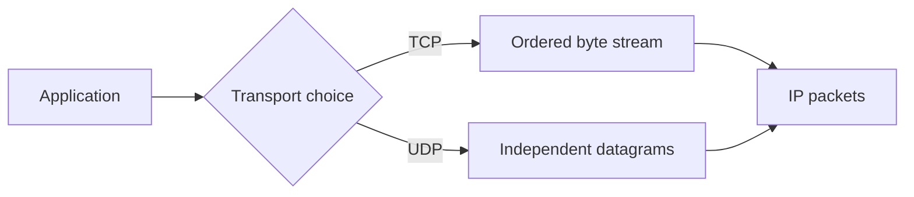
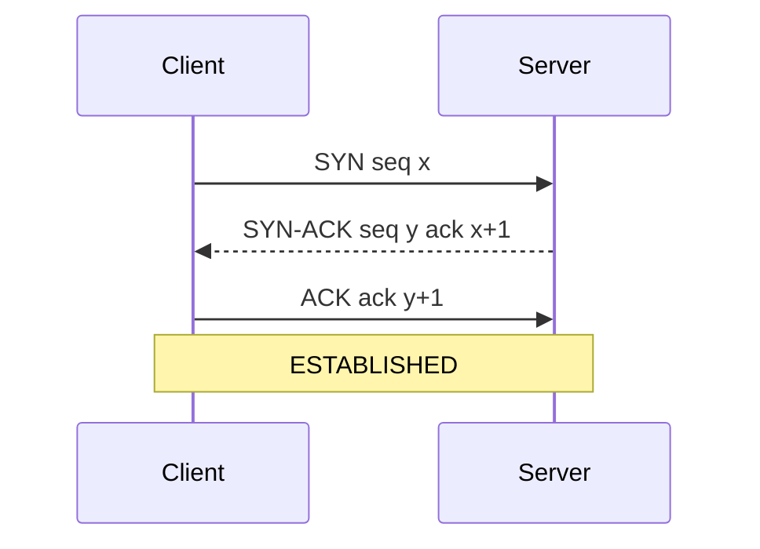
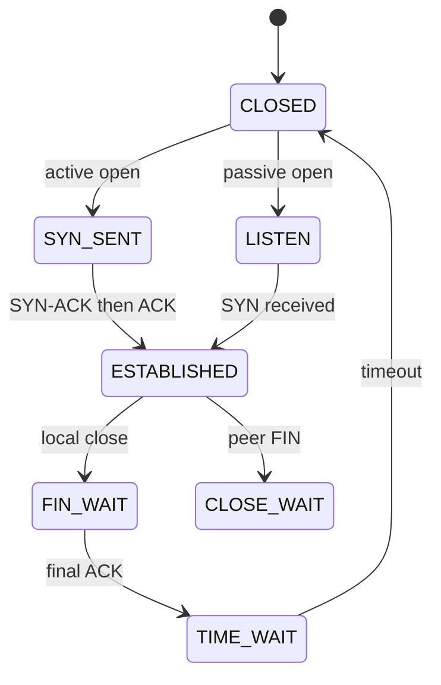

# Transport Layer: TCP vs UDP & Connection Management

TCP and UDP provide process-to-process delivery above IP, using ports to multiplex many applications on one host.
TCP adds an ordered reliable byte stream and congestion-aware connection state; UDP preserves message boundaries with minimal transport policy.
Choosing between them means choosing which guarantees the application must implement, observe, and recover itself.

## 🟢 Beginner Level

### TCP vs. UDP Protocols

The Transport Layer provides process-to-process communication using **Port Numbers**.

```mermaid
flowchart LR
    A["Application"] --> T{"Transport choice"}
    T -->|"TCP"| R["Ordered byte stream"]
    T -->|"UDP"| D["Independent datagrams"]
    R --> I["IP packets"]
    D --> I
```

Think of TCP as a numbered stream of bytes and UDP as separately addressed envelopes.
Neither promise tells your application whether a database transaction committed.
A socket is the application's operating-system interface; a port helps choose an endpoint on one host.
A segment is a TCP transmission unit, and a datagram is one UDP message.
Retransmission repairs missing transport bytes, not a failed business workflow.

#### Key Differences

| Feature | TCP (Transmission Control Protocol) | UDP (User Datagram Protocol) |
| :--- | :--- | :--- |
| **Connection Mode** | connection state and ordinary three-way opening | independent datagrams; an OS socket can still be locally connected |
| **Reliability** | ordered bytes with recovery or a reported failure; eventual success is not guaranteed | no transport recovery or delivery guarantee |
| **Ordering** | In-order delivery via Sequence Numbers | Out-of-order delivery possible |
| **Header Overhead** | **20 Bytes minimum** | **8 Bytes fixed** |
| **Use Cases** | Web (HTTP/HTTPS), Email (SMTP), SSH | Video Streaming, Online Gaming, DNS |

---

## 🟡 Intermediate Level

### TCP connection management and reliability

TCP's defining characteristics are a connection-oriented, full-duplex, ordered, reliable byte stream rather than independent application messages. Its **three-way handshake** exchanges initial sequence numbers and synchronizes sequence spaces and validates the ordinary opening exchange; it does not promise future reachability or authenticate a user. Graceful close has four logical FIN/ACK events because each endpoint closes its sending direction independently; events can share packets.

TCP assigns **sequence numbers** to bytes, and cumulative **ACKs** report the next contiguous byte expected. A **sliding window** permits multiple bytes to remain in flight instead of waiting after every segment. Receiver-advertised **flow control** prevents a fast sender from overrunning one endpoint, while path-oriented **congestion control** reduces traffic when the network shows loss, delay, or explicit congestion signals.

Reliability comes from checksums, ordered reassembly, acknowledgments, timers, and **retransmission** after inferred loss; it does not guarantee that an application processed a request exactly once. **TCP vs UDP** is therefore a semantics choice: UDP sends independent datagrams without built-in connection setup, ordering, retransmission, flow control, or congestion control, so applications that need those behaviours must supply them.

```mermaid
sequenceDiagram
    participant C as Client
    participant S as Server
    C->>S: SYN seq x
    S-->>C: SYN-ACK seq y ack x+1
    C->>S: ACK ack y+1
    Note over C,S: ESTABLISHED
```

### Trace sequence numbers before memorizing packet counts

For an ordinary opening handshake, let the client start at 100 and server at 300.
SYN consumes one sequence number even though it contains no application payload here.
The first client data byte is therefore 101; the first server data byte is 301.
ACK-only segments do not consume another sequence number.

| Event | Sequence number | Acknowledgment / consequence |
|---|---:|---|
| Client SYN | 100 | announces client sequence space |
| Server SYN + ACK | 300 | ACK 101; server still waits for acknowledgment |
| Client ACK | 101 | ACK 301; server can finish its opening state |
| Client sends four data bytes | 101–104 | server can acknowledge 105 |
| Client FIN after those bytes | 105 | server acknowledges 106; other direction may remain open |

A server can combine its ACK of a peer FIN with its own FIN, so graceful close need not use exactly four packets.
Simultaneous close can leave both peers in TIME_WAIT. FIN closes one sending direction; it does not itself disable receiving.
TCP Fast Open is a negotiated extension that can place early data in a SYN; applications must handle its replay risks.

---

## 🔴 Expert Level

### Socket Programming & Port Multiplexing

```mermaid
stateDiagram-v2
    [*] --> CLOSED
    CLOSED --> SYN_SENT: active open
    CLOSED --> LISTEN: passive open
    SYN_SENT --> ESTABLISHED: SYN-ACK then ACK
    LISTEN --> ESTABLISHED: SYN received
    ESTABLISHED --> FIN_WAIT: local close
    ESTABLISHED --> CLOSE_WAIT: peer FIN
    FIN_WAIT --> TIME_WAIT: final ACK
    TIME_WAIT --> CLOSED: timeout
```

A TCP connection endpoint is defined by a unique 4-tuple:
$$\text{Connection ID} = (\text{Source IP}, \text{Source Port}, \text{Dest IP}, \text{Dest Port})$$

Within one TCP/network namespace, many clients can share one destination port because their peer tuples differ. Actual capacity still depends on descriptors, memory, application limits and upstream/NAT tuples; one source address has finite source-port space toward a fixed destination.

The state diagram is a collapsed overview: passive open passes through SYN-RECEIVED before the final ACK establishes it. FIN_WAIT represents FIN-WAIT-1/2, and normal active close is one path to TIME_WAIT; simultaneous close and resets have additional paths.

### Sequence Numbers, ACKs, and Byte Streams

TCP numbers bytes, not application messages.

An ACK acknowledges the next byte expected.

The receiver can buffer out-of-order segments and present only contiguous bytes to the application.

This is why one `send` does not imply one matching `read`.

Applications need their own message framing such as lengths, delimiters, or a protocol grammar.

UDP does not merge two messages into one ordinary receive. An undersized receive buffer can discard the datagram remainder, so message boundaries do not guarantee complete payloads.

It can still lose, duplicate, reorder, or truncate messages when buffers or limits intervene.

### Worked Example: Window and Flight Size

Assume a 100 Mb/s path with 40 ms round-trip time.

The bandwidth-delay product is $100{,}000{,}000 \times 0.040 = 4{,}000{,}000$ bits.

That is 500,000 bytes in flight to fill the path.

With 1,460-byte TCP payloads, about $500{,}000 / 1460 \approx 343$ segments can be outstanding.

The receiver and congestion windows limit outstanding bytes. New-send credit is roughly `min(rwnd, cwnd) - bytes_in_flight`; pacing, available data and recovery rules can further restrict sending.

A fixed 64 KiB receive window permits about `65536 / 0.040 = 1,638,400` payload bytes/s, or 13.1 Mb/s, in this steady-state upper-bound model. Headers, loss and application behavior reduce throughput further.

Window scaling permits larger advertised windows when both peers negotiate it.

### Reliability and Failure Boundaries

TCP retransmits when acknowledgments suggest loss.

It cannot know whether a peer application processed bytes before a connection failed.

An HTTP client retry can therefore repeat a server-side effect.

Commit a local effect and deduplication result atomically, with payload/scope checks, before treating retries as one operation. An external payment provider needs its own idempotency or reconciliation contract; a local key alone cannot atomically commit that remote effect.

UDP is appropriate when timeliness matters more than complete delivery, or when an application supplies its own protocol.

DNS, real-time media, games, and QUIC use UDP for different reasons.

### Flow Control and Congestion Control

Receiver flow control protects one receiver buffer with an advertised window.

Congestion control protects the network path by limiting a sender's congestion window.

They are independent limits.

Despite its name, classic slow start grows roughly exponentially per RTT while acknowledgments arrive; its initial window is small relative to a high-bandwidth path.

Congestion avoidance grows more slowly after a threshold.

Loss, ECN, or delay signals can reduce sending rate.

### TIME_WAIT and Safe Reuse

On ordinary active close, the endpoint completing its FIN exchange enters TIME_WAIT; simultaneous close can put both peers there. Sending an arbitrary ACK does not imply this state.

It keeps state long enough for delayed segments to expire and for a lost final ACK to be repeated.

TIME_WAIT is normal for active closers, not automatically a leak.

Exhaustion often indicates connection churn, incorrect pooling, or too few ephemeral ports.

Do not suppress it with unsafe reuse settings before measuring the workload.

### SYN Backlogs and Cookies

A listening server holds partial state after receiving a SYN.

A SYN flood can fill that backlog with spoofed or incomplete opens.

SYN cookies encode enough validation state in the initial sequence number under pressure.

A cookie lets the server postpone normal half-open state and reconstruct a connection when a valid final ACK returns. It tests reachability in the opening exchange, not caller authentication; availability and option support depend on the implementation.

Cookies are mitigation, not a replacement for rate limits and capacity planning.

### Teardown: Closing One Direction of a Full-Duplex Stream

TCP permits each endpoint to close its sending direction independently.

A FIN means “I will send no more bytes.”

It does not mean “I can no longer receive.”

The peer acknowledges that FIN and can finish bytes already queued for its own sending direction.

It later sends its own FIN when finished.

This produces the familiar four logical control messages.

An RST is different from FIN.

It aborts a connection without the graceful byte-stream completion contract.

Applications should distinguish a clean EOF from reset and timeout failures.

Closing a socket while another component still expects a response can create partial application transactions.

Coordinate shutdown with request deadlines and idempotent recovery.

### Retransmission Timers and Loss Signals

TCP estimates round-trip time from acknowledged segments.

It derives a retransmission timeout with variance so a short transient delay does not cause premature retransmission.

An ACK that repeats the same next expected byte can indicate a missing segment.

Several duplicate acknowledgments can trigger fast retransmit before the timer expires.

Selective acknowledgments help a sender identify received ranges beyond the gap.

Retransmission is not proof that a packet was lost; an ACK may have been delayed or lost.

The receiver must handle duplicate segments safely.

Excessive retransmissions can indicate congestion, Wi-Fi loss, interface errors, asymmetric routing, or overloaded endpoints.

Compare retransmission metrics with RTT, packet loss, queue delay, and server CPU before blaming one layer.

### Receive Buffers and Backpressure

A TCP receiver advertises how much buffer space it can accept.

When an application reads slowly, its receive buffer fills.

The advertised window shrinks and can reach zero.

The sender pauses ordinary data transmission until a window update arrives.

This protects memory but transfers pressure toward the producing application.

Backpressure is valuable only when upstream components honor it.

An unbounded application queue before the socket can still exhaust memory while TCP correctly advertises a small window.

Design queues, timeouts, and admission control as one flow-control policy.

### Socket Lifecycle and Resource Limits

Each accepted connection consumes kernel state, file descriptors, buffers, and application memory.

Linux separately limits incomplete SYN requests and fully established sockets waiting for `accept()`. The listen backlog mainly bounds the latter; the application chooses its own worker queues. They are distinct from accepted sockets already owned by the process.

Increasing every limit can only move overload to CPU, memory, or a dependency.

Set file-descriptor limits, backlog, application concurrency, and downstream pools from measured traffic and latency budgets.

Use keep-alive when reuse is safe to reduce handshake and TIME_WAIT churn.

Use idle deadlines so abandoned peers do not retain resources forever.

Application heartbeats are useful when an otherwise idle long-lived protocol needs to detect a dead peer sooner than TCP alone can.

They should have jitter and failure thresholds to avoid synchronized traffic spikes.

### NAT, Ephemeral Ports, and Proxies

Clients normally choose ephemeral source ports.

A NAT device may translate many internal tuples to a smaller public address and port space.

This state can expire during idle periods or be exhausted by very high connection churn.

Load balancers and proxies terminate one TCP connection and create another upstream connection.

The end-to-end application request then spans several independent transport connections.

Timeouts must be coherent across client, proxy, server, and downstream service.

Otherwise an upstream can abandon work while a downstream continues consuming resources.

Log connection and request identifiers separately because one is not a stable substitute for the other.

### Transport Security and Protocol Choice

TCP itself does not encrypt or authenticate application data.

TLS usually runs above TCP to provide confidentiality, integrity, and peer authentication.

TLS handshake latency and certificate validation are part of the connection budget.

UDP also provides no encryption by itself.

QUIC integrates transport-like reliability, congestion control, and TLS over UDP.

It avoids TCP head-of-line blocking between independent streams but still shares path congestion and endpoint limits.

Choose a protocol based on semantics, ecosystem support, observability, and operational maturity.

Do not choose UDP merely to bypass a firewall or TCP merely to avoid defining an application protocol.

### Measuring a Connection Problem

Start with the symptom: connect failure, timeout, reset, slow first byte, stalled transfer, or duplicate request.

Identify the exact hop and timestamp using client, proxy, and server logs.

Inspect DNS resolution, handshake time, TLS time, application queue time, request processing, and response transfer separately.

Use packet capture only with privacy controls and a clear capture point.

Kernel socket statistics show states, retransmissions, listen drops, and orphaned connections.

Application metrics show request outcomes and pool saturation that packet counters cannot explain.

Test under realistic loss, delay, and reconnect conditions rather than only on a local loopback interface.

### TCP Options and Middleboxes

Peers negotiate options in SYN segments.

Common options include maximum segment size, window scaling, selective acknowledgment permission, and timestamps.

Middleboxes that drop unfamiliar options or ICMP can break path behavior in ways not visible in local tests.

A peer advertises the largest TCP segment payload it can receive; that MSS is not a measurement of every hop. The sender also applies path-MTU knowledge and actual IP/TCP option overhead. A 1,500-byte IPv4 path with 20-byte base headers yields the common 1,460-byte payload assumption.

Reducing MSS can avoid fragmentation through tunnels at the cost of more headers and packets.

Path-MTU discovery failures often appear as connections that establish and small requests succeed while larger transfers hang.

Treat such a symptom as a path and firewall investigation, not immediately as a server application bug.

### Graceful Service Shutdown

A server shutdown should stop accepting new work before destroying active connections.

It can advertise draining at a load balancer, wait for bounded in-flight requests, and then close remaining sockets according to a deadline.

Long-lived streams need an explicit reconnection and resume contract.

Blindly killing a process produces resets and pushes retry work to every client at once.

Staggered draining and retry jitter prevent a reconnect storm during deployment.

The business layer must still make interrupted requests idempotent because graceful shutdown cannot cover power loss or forced termination.

### Common Misconceptions

1. **"TCP preserves writes as messages."**
   *Correction*: TCP is a byte stream. Application framing is required.

2. **"UDP is always faster."**
   *Correction*: It avoids TCP features, but loss recovery and security may move work to the application.

3. **"TCP guarantees exactly once."**
   *Correction*: It provides reliable ordered bytes while connected, not exactly-once business effects after retry.

4. **"TIME_WAIT is an error."**
   *Correction*: It protects against delayed segments and lost final acknowledgments.

5. **"Ports identify a process globally."**
   *Correction*: A connection is identified by protocol and address-port tuple, not one port alone.

### Interview Questions

**Q1. What does TCP provide that UDP does not?** `[easy]`

TCP provides an ordered reliable byte stream with connection state. It uses sequence numbers, acknowledgments, retransmission, flow control, and congestion control. UDP leaves these choices to the application.

**Q2. Why does TCP need a three-way handshake?** `[easy]`

Both peers must exchange initial sequence numbers and confirm reachability. The final ACK confirms the client received the server's sequence number. This prevents stale connection attempts from creating a fully established session alone.

**Answer rubric**
- **Say it:** The three-way handshake synchronizes sequence numbers and confirms both directions can exchange control segments.
- **Mechanism:** Walk through SYN, SYN-ACK, and final ACK, including which side learns and acknowledges each initial sequence number.
- **Example:** A client sends SYN, the server answers SYN-ACK, and the client acknowledges before both treat the connection as established.
- **Limit:** The handshake establishes transport state; it does not authenticate application users or guarantee future delivery.
- **Watch for:** Do not say the third message exists only to make the connection slower or more reliable by repetition.
- **Follow-up:** What resource pressure arises if many clients send SYN but never finish the handshake?

**Q3. Why are ports required?** `[easy]`

Ports multiplex traffic to applications on one IP address. They let a host distinguish HTTPS, DNS, and many concurrent client sessions. A port is local endpoint information, not a globally unique connection identifier.

**Q4. Why is TCP a byte stream?** `[easy]`

TCP exposes ordered bytes rather than sender write boundaries. One read can return part of a message or several messages. Protocols must define lengths or delimiters before parsing.

**Answer rubric**
- **Say it:** TCP preserves byte order but does not preserve application write boundaries.
- **Mechanism:** The receiver can get any prefix of available bytes on each read, so application framing must define message boundaries.
- **Example:** Two JSON records may arrive in one read, or one record may require several reads.
- **Limit:** Framing choices such as length prefixes or delimiters need size limits and malformed-input handling.
- **Watch for:** Do not assume one `send` call corresponds to one `recv` call.
- **Follow-up:** How would you frame variable-length messages safely?

**Q5. What is the TCP four-tuple?** `[medium]`

It is source address, source port, destination address, and destination port, with protocol understood. Many clients can connect to one server port because their source tuple differs. NAT can rewrite tuples while maintaining mappings.

**Q6. How do flow and congestion control differ?** `[medium]`

Flow control limits data for the receiver's available buffer. Congestion control limits data for the path's observed capacity. The sender limits outstanding bytes by both windows; already-in-flight data, pacing and recovery rules further restrict new transmissions.

**Q7. What does an ACK number mean?** `[medium]`

It normally identifies the next byte the receiver expects. It cumulatively confirms all earlier contiguous bytes. Selective acknowledgment can report additional received ranges.

**Q8. Why can an application retry create duplicate effects over TCP?** `[medium]`

The network can fail after a server acted but before a client saw a response. TCP reconnection cannot reveal that business outcome automatically. A durable key only helps when the local effect and its recorded result commit atomically; external effects require a provider contract or reconciliation.

**Answer rubric**
- **Say it:** A timed-out request may have completed on the server even when its response was lost.
- **Mechanism:** TCP confirms byte delivery at transport level, but it does not resolve whether a business operation committed before the client retry.
- **Example:** A payment API stores one idempotency key with the completed result and returns that result on a retry.
- **Limit:** A key must be scoped, persisted, and checked transactionally with the effect; an in-memory cache alone can fail on restart.
- **Watch for:** Do not equate a new TCP connection with a new business transaction.
- **Follow-up:** What should the server return if the same key is reused with different request parameters?

**Q9. What is TIME_WAIT for?** `[medium]`

It lets delayed old segments expire before a tuple is reused. It lets the endpoint acknowledge a repeated FIN when its earlier final ACK was lost; ACKs are not independently retransmitted on an ACK timer. Removing it unsafely risks old traffic entering a new connection.

**Q10. What is a SYN flood?** `[medium]`

It fills a server's pending-handshake capacity with incomplete opens. SYN cookies defer expensive state allocation until a valid final ACK arrives. Rate limiting and filtering complement cookies.

**Q11. When is UDP a good fit?** `[medium]`

It suits small independent messages or latency-sensitive data where an application manages loss and ordering. It is also the substrate for protocols such as QUIC. The application must budget validation, congestion-aware sending and amplification defense; essential retries also need deadlines and duplicate handling.

**Q12. Scenario: a client receives occasional duplicate payment confirmations after retries. What changes?** `[hard]`

Treat the request as ambiguous after timeout rather than assuming TCP failure means no server action. Commit the local effect and one scoped key/result atomically, rejecting payload conflicts. For a remote charge, use the provider's idempotency/reconciliation rules before replaying a stored confirmation.

**Answer rubric**
- **Say it:** Make payment retries idempotent and treat timeout outcomes as uncertain.
- **Mechanism:** Persist a stable request key and outcome with the payment effect, then replay the recorded result for matching retries.
- **Example:** The first charge commits but the response is lost; the second request gets the original confirmation.
- **Limit:** Key scope, payload conflicts and retention matter; a local transaction cannot alone commit a remote provider charge.
- **Watch for:** Do not solve duplicate charges by disabling all retries or relying on TCP alone.
- **Follow-up:** Where must the idempotency record be committed relative to the payment effect?

**Q13. Scenario: a server has thousands of TIME_WAIT sockets. What do you inspect?** `[hard]`

Measure connection rate, active closer behavior, ephemeral-port use, and keep-alive policy. TIME_WAIT is expected under high short-lived connection churn. Reduce needless churn with safe pooling or protocol reuse before changing kernel timeouts.

**Q14. Scenario: a UDP game has low latency but missing state updates. What do you add?** `[hard]`

Classify updates as replaceable or essential. Add sequence numbers and selective recovery only for essential state while allowing stale movement updates to expire. Use congestion control, bounded rates, duplicate suppression and an amplification policy. Replaceable movement can expire; essential recovery still has deadlines and sequence rules.

### Further Reading

- [RFC 9293: Transmission Control Protocol](https://www.rfc-editor.org/rfc/rfc9293) defines modern TCP behavior.
- [RFC 768: User Datagram Protocol](https://www.rfc-editor.org/rfc/rfc768) defines UDP.
- [RFC 7323: TCP window scaling](https://www.rfc-editor.org/rfc/rfc7323) documents high-performance TCP extensions.

- [Linux TCP API](https://man7.org/linux/man-pages/man7/tcp.7.html) separates socket, backlog and option behavior.
- [Linux UDP API](https://man7.org/linux/man-pages/man7/udp.7.html) explains message truncation and connected UDP sockets.
- [RFC 8085: UDP usage guidance](https://www.rfc-editor.org/rfc/rfc8085.html) covers congestion and amplification responsibilities.
- [RFC 7413: TCP Fast Open](https://www.rfc-editor.org/rfc/rfc7413.html) describes early data and replay considerations.
