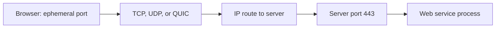
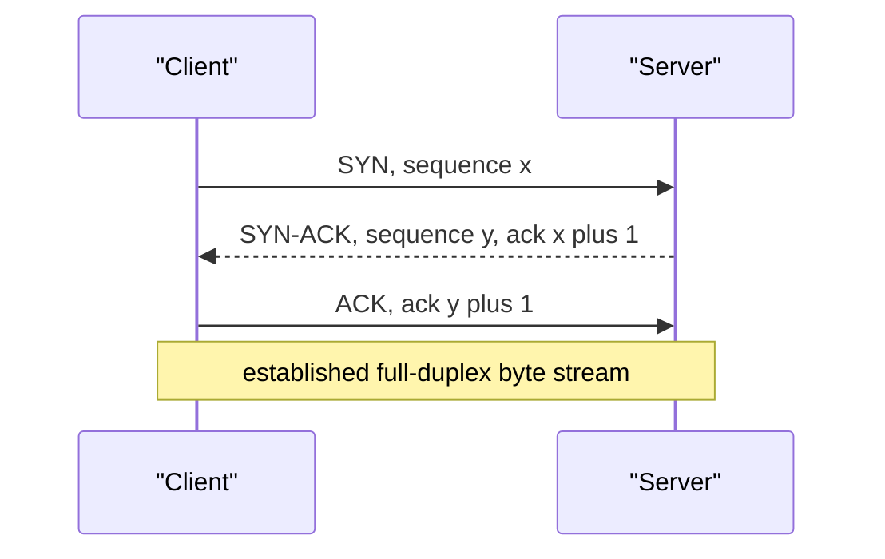
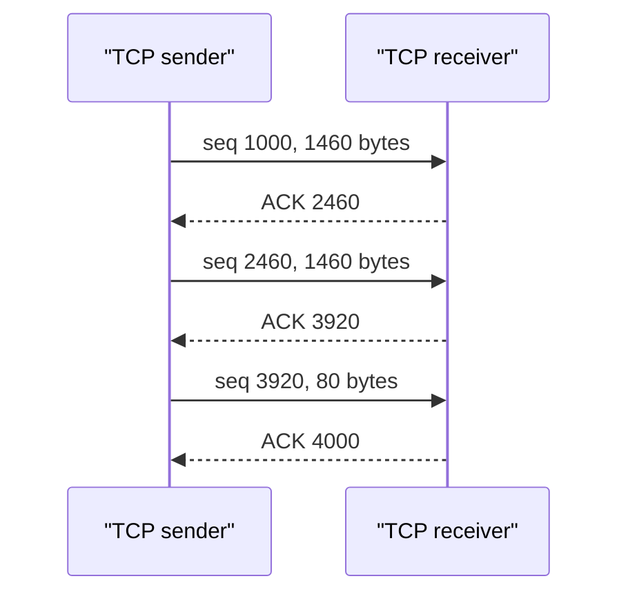
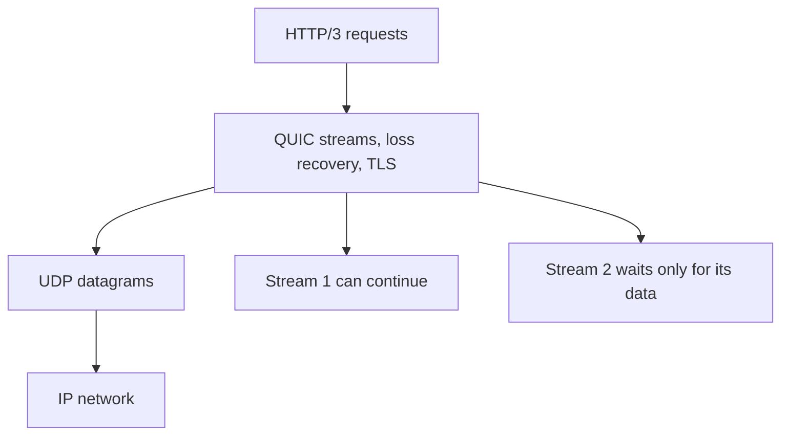

# Transport Protocols: QUIC, SCTP & TCP Segment Internals

The transport layer delivers network data to the right process and defines whether the application receives an ordered byte stream, independent messages, multiplexed streams, or only best-effort datagrams.
TCP, UDP, QUIC, and SCTP make different choices about reliability, connection state, congestion control, message boundaries, and migration.
Interviewers ask about them because protocol semantics directly shape latency, retry safety, load balancing, and failure behaviour in distributed applications.

---

## 🟢 Beginner Level

### Transport connects application processes

IP delivers a packet to a host or interface.
Transport delivers it to a socket associated with an application process on that host.
Ports are 16-bit numbers that identify those local service endpoints.



A socket is commonly described by protocol, local IP address and port, plus remote IP address and port for a connected flow.
Two browser tabs can connect to the same server port because their source ports or source addresses differ.
The familiar “port 443” identifies a service at one host, not a globally unique server on the Internet.

| Port range | Typical purpose | Examples |
|---|---|---|
| 0–1023 | well-known service assignments | 22 SSH, 53 DNS, 80 HTTP, 443 HTTPS |
| 1024–49151 | registered services | 3306 MySQL, 5432 PostgreSQL |
| 49152–65535 | dynamic or ephemeral range convention | outbound client connections |

Operating-system ephemeral ranges are configurable and need not exactly match the IANA dynamic range.
Binding a low port may require extra privileges depending on the operating system.
Firewalls and load balancers make decisions on ports, but a listening port does not itself authenticate a caller.

### TCP, UDP, QUIC, and SCTP offer different services

TCP provides a reliable ordered byte stream between two endpoints.
UDP provides independent datagrams with minimal transport framing.
QUIC runs over UDP and supplies encrypted reliable streams, congestion control, and connection migration in user space.
SCTP is a message-oriented association protocol with multi-streaming and multi-homing features.

| Property | TCP | UDP | QUIC | SCTP |
|---|---|---|---|---|
| abstraction | byte stream | datagrams | multiplexed streams | messages and streams |
| built-in reliability | yes | no | yes per stream | yes |
| message boundaries | no | yes | yes | yes |
| encryption required | no | no | yes in IETF QUIC | no |
| connection migration | 4-tuple bound | application responsibility | connection IDs | multi-homing support |
| common use | HTTPS, SSH | DNS, media | HTTP/3 | telecom signalling |

No protocol is universally “faster.”
UDP has less header and state overhead, but an application that adds reliability, ordering, encryption, and congestion control may recreate much of a transport protocol.
TCP is often the safest default for a new reliable service because its behaviour and operational support are mature.

### A TCP connection is full duplex

TCP establishes shared initial sequence information through a three-way handshake.
Both endpoints then independently send and acknowledge bytes in each direction.
Closing one direction does not immediately close the other.



The server allocates connection state only after it can validate the handshake according to its policy.
The handshake helps both sides agree on sequence-number spaces and makes blind spoofing harder than a one-packet setup.
It does not encrypt application data; TLS or another security protocol is required for that.

### UDP preserves one application message per datagram

UDP adds source port, destination port, length, and checksum to a datagram.
It does not establish a connection or retransmit a missing datagram.
The receiver gets one whole datagram or none of it.

```text
UDP header: source port | destination port | length | checksum
```

This makes UDP useful where an old packet is less valuable than a new one, such as real-time media or discovery queries.
Applications must decide how to handle loss, reordering, duplication, authentication, rate limiting, and oversized messages.
UDP checksum is optional in IPv4 only under specific rules and mandatory in IPv6.

---

## 🟡 Intermediate Level

### TCP header fields support reliable byte delivery

The minimum TCP header is 20 bytes and can grow to 60 bytes with options.
It contains two 16-bit ports, 32-bit sequence and acknowledgement numbers, flags, window advertisement, checksum, and optional extensions.
The data offset gives the header size in 32-bit words.

| TCP field | Purpose | Failure avoided |
|---|---|---|
| sequence number | first byte in this segment | unordered byte placement |
| acknowledgement number | next expected byte | ambiguous successful delivery |
| flags | setup, reset, close, push | unclear connection state |
| receive window | available receive capacity | receiver buffer overflow |
| checksum | header and payload integrity | undetected corruption |
| options | MSS, window scale, timestamps | fixed protocol limits |

The acknowledgement number is cumulative.
An ACK of 10,001 means the endpoint has received every byte through 10,000 and expects byte 10,001 next.
Selective acknowledgement options can additionally identify received ranges beyond a gap, reducing unnecessary retransmission.

TCP sequence numbers count bytes, not segments.
This lets the receiver reassemble differently sized segments into one ordered stream.
Applications must still add their own message framing because TCP never reports “the sender's write call ended here.”

### Worked example: track a byte stream and MSS

Assume a sender starts data at sequence number 1,000 and has an MSS of 1,460 bytes.
It sends two full segments and then one 80-byte segment.
The segments begin at sequence numbers 1,000, 2,460, and 3,920.

The first segment covers bytes 1,000 through 2,459.
The second covers bytes 2,460 through 3,919.
The final segment covers bytes 3,920 through 3,999.

If the receiver receives all three, it sends cumulative acknowledgement 4,000.
That number means the next missing byte is 4,000; it does not mean exactly 4,000 bytes were delivered during this one exchange.

| Segment | Sequence start | Payload length | Last byte | Next expected ACK |
|---|---:|---:|---:|---:|
| one | 1,000 | 1,460 | 2,459 | 2,460 |
| two | 2,460 | 1,460 | 3,919 | 3,920 |
| three | 3,920 | 80 | 3,999 | 4,000 |

For a 1,500-byte Ethernet MTU with 20-byte IPv4 and TCP headers and no options, 1,460 bytes is a common MSS.
TCP options, IPv6 headers, tunnels, and path MTU constraints can reduce this value.
Sending segments larger than the viable path risks fragmentation or loss, which is why TCP negotiates MSS during setup.



The receiver can buffer out-of-order bytes, but normally cannot present a gap-free stream to the application until the missing earlier bytes arrive.
This is TCP's transport-level head-of-line blocking.
It is valuable for ordered protocols but can delay unrelated application streams multiplexed above one TCP connection.

### Flow control and congestion control protect different things

Flow control prevents a sender from overrunning the receiving endpoint's buffers.
The receiver advertises a receive window, or `rwnd`, describing available capacity.
Congestion control prevents the aggregate traffic from overwhelming the network path.

The sender's effective in-flight limit is roughly the smaller of `rwnd` and congestion window `cwnd`.
If the receiver advertises 64 KiB but congestion control permits 16 KiB, the sender is network-limited at 16 KiB.
If `cwnd` is 1 MiB but `rwnd` is 32 KiB, the receiver is the limiting factor.

Loss recovery uses acknowledgements, duplicate acknowledgements, timers, and sometimes SACK information.
The exact algorithms evolve, but applications should not assume a fixed retransmission time or that loss means a remote server failed.
Network congestion, wireless loss, queue drops, and receiver overload can all produce retransmissions.

### TCP close and reset communicate different intent

A FIN says one endpoint will send no more bytes in its direction while allowing the other direction to continue.
The peer acknowledges the FIN and later sends its own FIN after it finishes sending.
The active closer commonly enters `TIME_WAIT` after acknowledging the final FIN.

`TIME_WAIT` lets the endpoint retransmit the last ACK if needed and allows delayed duplicate segments to expire before the same connection tuple is reused.
It is normal for clients and proxies with many short-lived connections to show TIME_WAIT sockets.
An RST instead aborts a connection immediately, often because no listener exists, a process rejected a connection, or an endpoint cannot maintain valid stream state.

### Datagram size and path MTU are application constraints

UDP preserves a datagram boundary at the receiving socket, but it does not guarantee that a large datagram travels efficiently across a path.
An IPv4 packet larger than a link MTU can be fragmented when policy allows.
IPv6 routers do not fragment in transit, so senders must discover or choose an acceptable size.

If one fragment is lost, the receiver cannot deliver the original datagram.
The sender then loses all work represented by the whole datagram, not merely one small fragment.
Fragmentation also increases state pressure and makes filtering and troubleshooting harder.

For a 1,500-byte Ethernet MTU, an IPv4 UDP payload without options is commonly at most $1{,}500 - 20 - 8 = 1{,}472$ bytes before fragmentation.
An IPv6 UDP payload with a 40-byte base IPv6 header is commonly at most $1{,}500 - 40 - 8 = 1{,}452$ bytes.
Tunnels, VPNs, and encapsulation headers reduce the path limit further.

Applications should choose a conservative datagram size or use path MTU discovery where their environment supports it.
They should handle ICMP “packet too big” signals safely and avoid blocking those signals in firewalls without a replacement strategy.
Sending a 64 KiB UDP payload because the API accepts it is rarely a production-quality design.

UDP service design also needs amplification defence.
A server that sends a large response to a small spoofable request can be abused to direct traffic at a victim.
Use source validation, response-size limits, cookies or tokens, and rate limits before sending expensive replies to an unverified address.

Connected UDP sockets are useful even though UDP has no handshake.
They let an operating system associate a default peer, filter unexpected peer datagrams, and report some asynchronous network errors to the socket.
They do not create TCP-like delivery or congestion semantics.

### Application framing and backpressure complete transport semantics

TCP's byte stream requires a parser that tolerates partial reads and partial writes.
The receiving application can read fewer bytes than requested even when the sender already wrote more.
The sending application can also be backpressured when kernel socket buffers fill.

Use nonblocking I/O or dedicated blocking workers with bounded queues so a slow peer cannot consume unlimited threads or memory.
Apply maximum frame sizes before allocating a buffer from an untrusted length field.
Use deadlines for handshake, idle, request, and overall operation phases instead of one unbounded socket timeout.

Backpressure crosses layers.
The receiver advertises TCP flow control, but the application must stop accepting work or buffering messages when its own processing queue is saturated.
Without that limit, a service can have healthy TCP windows while its heap fills with decoded but unprocessed requests.

Connection pools trade handshake overhead for stateful resource reuse.
They need maximum size, idle expiration, health checks that do not create storms, and retry budgets shared across callers.
A pool cannot repair a server that accepts connections but does not make application progress.

Protocol choice should consider observability too.
Expose metrics for handshake outcomes, active connections, retransmissions or loss signals, stream resets, queue occupancy, read and write latency, and application-level result codes.
Transport errors alone cannot distinguish a slow legitimate response from a duplicated business request.

---

## 🔴 Expert Level

### QUIC combines secure transport and stream multiplexing

IETF QUIC runs over UDP but includes transport reliability, congestion control, loss detection, streams, and TLS 1.3 encryption as one protocol.
HTTP/3 maps HTTP semantics onto QUIC streams rather than TCP.
This avoids TCP's connection-wide head-of-line blocking when one lost packet delays data from unrelated HTTP streams.



QUIC packet numbers are unique for transmissions within a packet-number space.
A retransmitted stream range is carried in a new packet number, avoiding TCP's retransmission ambiguity for round-trip measurement.
The protocol encrypts most transport metadata, which improves privacy but moves observability and protocol evolution into endpoint-aware tools.

QUIC connection IDs let a connection survive changes in address or port, such as moving from Wi-Fi to cellular, if path validation succeeds.
Migration is not an authorization bypass: endpoints validate a new path to avoid sending amplified traffic to an unverified address.
Load balancers need a connection-ID routing strategy so packets after migration reach the same connection state.

### QUIC setup and 0-RTT require replay awareness

TCP plus TLS typically requires transport setup and then a TLS handshake before ordinary application data is available.
QUIC integrates TLS negotiation, so a new connection commonly reaches usable encrypted application data in one round trip.
Session resumption can permit 0-RTT early data before handshake completion.

0-RTT data can be replayed by an attacker who captures it under the protocol's replay model.
Servers must accept only replay-safe operations such as idempotent reads in early data, or reject early data for operations like payments and account changes.
Faster setup is therefore a security and application-semantics decision, not a free latency switch.

UDP reachability is also an operational constraint.
Some networks block, rate-limit, or poorly handle UDP, so clients may need a TCP/TLS fallback for compatibility.
Monitor actual negotiated protocol use rather than assuming all HTTP/3-capable clients use QUIC successfully.

### SCTP supports messages, streams, and multiple paths

SCTP calls a connection an association.
It preserves message boundaries, so one send corresponds to one received user message unless fragmentation and reassembly are needed internally.
It supports multiple logical streams within an association so loss in one stream need not block delivery in another.

SCTP also supports multi-homing: endpoints can advertise several addresses and use an alternate path when the primary fails.
This is valuable in telecom and control-plane systems with redundant interfaces.
It is less broadly deployed on the public Internet because middleboxes and operating-system support often favour TCP and UDP.

Partial reliability extensions can allow a message to expire rather than consume resources retrying it forever.
This suits time-sensitive signaling or media control but shifts loss semantics to the application.
Choose SCTP only where its message and path features justify the compatibility and operational cost.

### Transport choice must include operational ownership

TCP benefits from mature kernel implementations, proxies, observability, and firewall support.
UDP offers a simple carrier but requires the application protocol to handle abuse resistance, rate limits, packet size, and retry policy.
QUIC supports modern web performance but changes load balancer, packet capture, and connection-state design.

Avoid inventing a bespoke “reliable UDP” protocol unless the team can own congestion control, security, retransmission, versioning, path MTU, and interoperability for years.
Uncontrolled UDP senders can harm shared networks just as surely as buggy TCP applications.
Use protocol libraries and standards where possible, then instrument request outcomes above the transport layer.

### Connection state creates resource and security limits

Every TCP connection consumes endpoint state: socket buffers, control blocks, file descriptors, timers, and often application session memory.
Servers protect their accept path with backlog limits, SYN cookies or equivalent defences, per-client limits, and fast rejection of invalid work.
The correct values depend on memory capacity, expected connection lifetime, and application concurrency rather than an arbitrary huge backlog.

A SYN flood attempts to consume server resources by sending many initial requests without completing handshakes.
SYN cookies encode enough information in the initial sequence number to defer some per-connection allocation until the final ACK returns.
They are a resilience mechanism, not a replacement for upstream filtering, rate limiting, and capacity planning.

TCP keepalive, application heartbeats, and idle timeouts solve different problems.
Keepalive detects a silent path over a long timescale under operating-system policy.
An application heartbeat can confirm that a peer is responsive at the semantic layer.
An idle timeout releases resources for a connection with no useful work, but too-short values disrupt slow clients and long-lived streams.

NAT and stateful firewalls also maintain connection mappings with their own expiration policy.
A long-idle UDP or TCP flow can fail after a middlebox expires state even though both endpoints believe it is open.
Applications should detect the failure, reconnect safely, and avoid treating a transport reconnect as proof that a previous operation did not complete.

TLS session resumption and connection pooling reduce setup work but increase state-management complexity.
Tickets and session keys need rotation and secure storage, while pooled connections require isolation so one request's cancellation or timeout does not corrupt another's response parsing.
The fastest handshake is not valuable if it makes retry and ownership semantics ambiguous.

Load balancers can terminate TCP or QUIC and create new upstream transport sessions.
They need timeouts aligned with application behaviour and consistent routing for stateful connections.
An upstream reset may become an HTTP 502 or 503 downstream, so runbooks should trace both legs rather than treating the edge transport status as the root cause.

Resource exhaustion is often visible first as accept failures, ephemeral-port exhaustion, growing retransmission queues, or increased tail latency.
Use bounded concurrency, connection reuse where appropriate, and graceful overload responses instead of letting every client retry immediately.
Retry storms can turn a partial transport failure into a full outage.
Budget retries across the caller population, add jitter, and surface clear overload signals instead of silently multiplying connection attempts.
This protects both transport state and the application work behind it.

### Common Misconceptions

1. **“TCP sends messages.”** TCP sends an ordered byte stream, so writes may be split or merged. A protocol above TCP must delimit messages explicitly.
2. **“UDP is unreliable, so it is unsuitable for serious systems.”** UDP intentionally provides minimal semantics and is the substrate for DNS, media, and QUIC. Serious UDP protocols add the exact reliability, security, and timing rules their workloads need.
3. **“QUIC has no head-of-line blocking.”** QUIC removes TCP's connection-wide stream blocking, but bytes within one QUIC stream remain ordered and can wait for a loss. Shared congestion and CPU limits can still delay all streams.
4. **“A TCP reset is a normal graceful close.”** FIN supports orderly half-close and pending data delivery. RST aborts the stream and may discard unread data, so applications need distinct error handling.
5. **“0-RTT is safe for every HTTPS request.”** Early data can be replayed under the protocol threat model. Servers must restrict it to idempotent, replay-tolerant operations or require a completed handshake.

### Interview Questions

**Q1. What does the transport layer add beyond IP?** `[easy]`

IP routes packets to a host or interface, while transport identifies the receiving process with ports and defines delivery semantics. TCP can provide ordered reliable bytes, UDP provides datagrams, and other transports add their own features. The application still owns message meaning, authentication, and business-level retries.

**Q2. Why can many clients connect to one server port?** `[easy]`

Each flow is distinguished by its protocol and source and destination address-port combination, often called a five-tuple when protocol is included. Clients normally receive different ephemeral source ports even when they contact the same server address and port. A server can therefore demultiplex many sockets listening behind one service port.

**Q3. What is the difference between TCP and UDP message boundaries?** `[easy]`

TCP exposes one continuous ordered byte stream and does not preserve sender write boundaries. UDP delivers one datagram as one message or does not deliver it. Applications using TCP must implement framing, while UDP applications must handle size limits and loss semantics.

**Q4. What do TCP sequence and acknowledgement numbers count?** `[easy]`

They count byte positions in each directional stream rather than whole application messages or packet counts. An acknowledgement names the next byte expected, cumulatively confirming all earlier bytes. This supports reassembly despite segmentation changes, but it does not give the application message boundaries.

**Q5. How do flow control and congestion control differ?** `[medium]`

Flow control uses the receiver's advertised window to avoid exhausting that receiver's buffers. Congestion control uses sender state such as cwnd to avoid overloading the shared network path. The sender is limited by the smaller of the two, so tuning one cannot overcome the other bottleneck.

**Q6. Why does TCP use `TIME_WAIT`?** `[medium]`

The active closer remains available to resend the final acknowledgement if the peer retransmits its FIN. It also lets delayed duplicate segments expire before the same connection tuple is reused. High TIME_WAIT counts are often normal, but aggressive port reuse changes need careful protocol and operating-system review.

**Q7. What transport problem does QUIC improve for HTTP/3?** `[medium]`

QUIC multiplexes independent streams below HTTP/3, so loss affecting one stream does not force unrelated streams to wait for TCP's ordered connection-level byte sequence. Each stream still preserves its own order. Congestion control and shared endpoint resources can still reduce overall throughput during loss.

**Q8. Why does QUIC use packet numbers instead of reusing sequence numbers for retransmission?** `[medium]`

Each transmitted QUIC packet gets a new packet number, even when it carries retransmitted stream data. This lets endpoints make clearer loss and round-trip-time decisions without confusing an original transmission with a retransmission. Stream offsets separately identify which application bytes are being delivered.

**Q9. What SCTP features distinguish it from TCP?** `[medium]`

SCTP preserves message boundaries and supports multiple streams within one association, reducing cross-stream delivery blocking. It can also bind multiple addresses per endpoint for failover. These features help specialized signaling workloads but face less universal middlebox and library support than TCP.

**Q10. What is dangerous about 0-RTT data?** `[medium]`

0-RTT permits a resumed client to send early encrypted data before the new handshake completes. That data can be replayed under the QUIC and TLS threat model, even though it is encrypted. Servers should allow only idempotent replay-tolerant actions or wait for full handshake confirmation.

**Q11. A TCP application occasionally parses two business messages as one. What is the correct fix?** `[hard]`

Add explicit framing such as a validated length prefix, delimiter with escaping rules, or a self-describing protocol grammar, then buffer reads until one complete frame is available. Do not assume one `read` matches one sender `write`, because TCP is free to split and combine byte delivery. Include maximum frame sizes and timeouts so malformed or stalled peers cannot consume unbounded memory.

**Q12. A mobile client changes networks and its HTTP/3 session fails at the load balancer. What do you investigate?** `[hard]`

Verify that the client attempted QUIC migration, the server successfully validated the new path, and the load balancer routes all connection-ID variants to the connection state owner. Check UDP firewall rules, idle timeouts, NAT rebinding behaviour, and whether the client fell back to TCP. Connection IDs enable migration only when every endpoint and intermediary preserves the required state and routing policy.

**Q13. A team wants to use raw UDP for a high-rate telemetry protocol. What responsibilities do they inherit?** `[hard]`

They must define authentication, packet validation, rate limiting, congestion behaviour, packet-size limits, duplication and loss handling, versioning, and observability. They should ensure senders do not overwhelm a shared network or become amplification targets. If they need reliable encrypted multiplexed streams, adopting QUIC or another established protocol is usually safer than rebuilding it.

**Q14. Why should a database client retry a transaction differently from a TCP retransmission?** `[hard]`

TCP retransmits bytes to preserve one transport stream and does not prove whether a server completed a business operation before the client timed out. Retrying a database transaction or payment can repeat a committed effect unless the application uses an idempotency key, transaction identifier, or reconciliation protocol. Transport reliability and exactly-once business execution are separate layers of correctness.

### Further Reading

- [RFC 9293: Transmission Control Protocol](https://www.rfc-editor.org/rfc/rfc9293) specifies modern TCP behaviour and header semantics.
- [RFC 768: User Datagram Protocol](https://www.rfc-editor.org/rfc/rfc768) defines the UDP datagram format.
- [RFC 9000: QUIC Transport Protocol](https://www.rfc-editor.org/rfc/rfc9000) specifies QUIC streams, packet numbers, migration, and loss recovery interfaces.
- [RFC 9260: Stream Control Transmission Protocol](https://www.rfc-editor.org/rfc/rfc9260) specifies SCTP associations, streams, and multi-homing.
