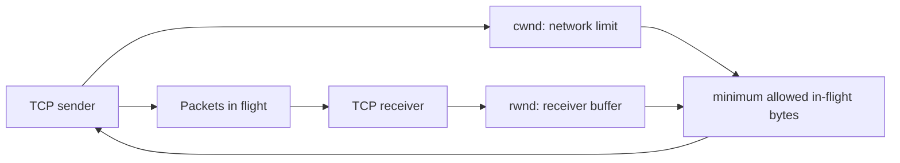
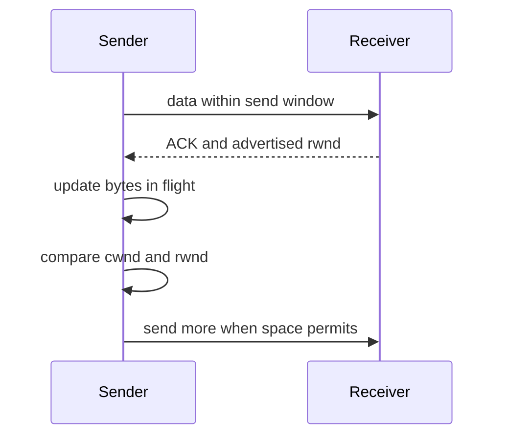
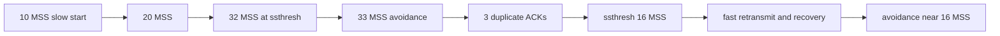
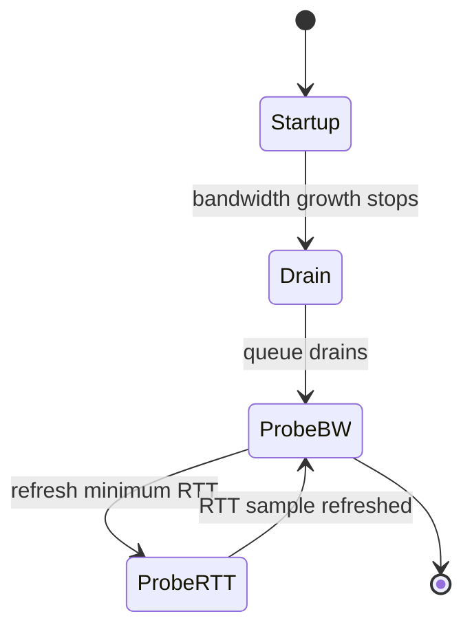

# TCP Flow and Congestion Control: Windows, Loss, and Pacing

TCP controls how much unacknowledged data a sender may keep in flight so it does not overwhelm either the receiving application or a shared network bottleneck. Flow control protects one receiver; congestion control probes and shares path capacity among competing flows. Interviewers use this distinction to test whether a candidate can diagnose a slow transfer from window, loss, RTT, and queueing evidence instead of treating every timeout as the same problem.

---

## 🟢 Beginner Level

### Two independent limits on sending

TCP numbers bytes so a receiver can acknowledge what arrived.

The receiver advertises free buffer space as the receive window, `rwnd`.

The sender maintains a congestion window, `cwnd`, as its estimate of safe in-flight data for the network.

The sender must honour the smaller limit.

$$\text{send window} = \min(\text{cwnd}, \text{rwnd})$$

If `rwnd` is small, the receiving process or its buffer is the immediate limiter.

If `cwnd` is small, the sender is limiting itself because it sees or anticipates congestion.

The advertised window can reach zero when the receiving application stops draining its socket buffer.

TCP then uses window probes so a lost window-update message does not deadlock the connection forever.

Flow control is end-to-end between sender and receiver.

Congestion control responds to the shared path between them.

### ACKs, RTT, and in-flight data

An acknowledgement says the receiver has received bytes up to a sequence number.

The round-trip time, RTT, is the delay from sending data until its acknowledgement returns.

For a stable path, useful sending rate roughly follows:

$$\text{throughput} \approx \frac{\text{in-flight data}}{\text{RTT}}$$

This is the bandwidth-delay product idea.

On a 100 Mbps path with 40 ms RTT, the path can hold roughly $100,000,000 × 0.040 / 8 = 500,000$ bytes in flight.

A sender limited to a 64 KiB window cannot fully use that path because 64 KiB per 40 ms is only about 13 Mbps before overhead.

Window scaling allows TCP to advertise receive windows beyond the original 16-bit header field range.

RTT includes propagation, transmission, processing, and queueing delay.

Growing RTT without loss can be an early sign that a bottleneck queue is filling.

### Loss is a signal, not always proof

Classic TCP algorithms treat loss as evidence that a router queue or link was overloaded.

That is often useful on wired Internet paths.

Wireless corruption, policers, and overloaded hosts can also drop packets without the same persistent network congestion meaning.

Duplicate acknowledgements indicate later data arrived while an earlier segment is missing.

Three duplicate ACKs can trigger fast retransmit before the retransmission timer expires.

A retransmission timeout is treated as stronger evidence of loss because acknowledgements stopped making progress.

TCP algorithms reduce their sending state after these signals to give queues a chance to drain.

---

## 🟡 Intermediate Level

### Slow start and congestion avoidance

Slow start begins with a small congestion window and grows quickly while acknowledgements arrive.

Despite its name, it is exponential growth by RTT in the ideal one-ACK-per-segment model.

Starting at 10 MSS, a sender can grow toward 20, 40, and 80 MSS in successive RTTs when no loss occurs.

The slow-start threshold, `ssthresh`, separates this probing phase from congestion avoidance.

Congestion avoidance grows more cautiously, approximately one MSS per RTT for traditional AIMD algorithms.

Additive increase slowly tests for extra capacity.

Multiplicative decrease reduces load rapidly after congestion evidence.

| Phase or event | Traditional cwnd action | Purpose | Risk |
|---|---|---|---|
| Slow start | Rapid growth each RTT | Discover capacity | Overshoot small queues |
| Congestion avoidance | About one MSS per RTT | Stable probing | Slow recovery after idle |
| Three duplicate ACKs | Fast retransmit and reduced window | Repair isolated loss quickly | Reordering can imitate loss |
| Timeout | Strong reduction and restart | Drain severe congestion | Large throughput collapse |
| Receiver window limit | Stop at `rwnd` | Protect receiver | Network capacity unused |

Modern TCP implementations use byte counting, pacing, ACK handling rules, and algorithm-specific details beyond this simplified model.

The phase names remain a useful diagnostic model.

### Worked example: Reno window evolution

Assume an MSS of 1,460 bytes.

The sender starts with `cwnd = 10 MSS` and `ssthresh = 32 MSS`.

At RTT 1 it can send 10 MSS, or 14,600 bytes.

After successful ACKs it grows to 20 MSS.

At RTT 2 it can send 29,200 bytes.

After successful ACKs it grows to 32 MSS, reaching `ssthresh`.

In congestion avoidance, the next RTT increases cwnd to approximately 33 MSS instead of doubling to 64.

Suppose three duplicate ACKs arrive while cwnd is 33 MSS.

Reno sets `ssthresh` to roughly half: `floor(33 / 2) = 16 MSS`.

It retransmits the missing segment immediately.

After recovery, cwnd returns near `ssthresh`, about 16 MSS, and additive increase resumes.

The new in-flight limit is approximately `16 × 1,460 = 23,360` bytes.

If instead an RTO occurs, classic behaviour reduces cwnd much more aggressively and re-enters slow start.

The numbers are a learning trace, not a guarantee of every operating system's exact implementation.

Delayed ACKs, ACK thinning, pacing, and modern recovery algorithms affect the observed curve.

### Fast retransmit, recovery, and SACK

Fast retransmit sends a missing segment after enough duplicate ACK evidence rather than waiting for RTO.

Reno fast recovery temporarily accounts for packets still believed to be in the network.

NewReno improves recovery when several losses occur in one window.

Selective Acknowledgment, SACK, lets a receiver report non-contiguous blocks it has received.

The sender can retransmit only missing ranges instead of guessing from cumulative ACKs alone.

SACK is especially valuable when multiple packets are lost from a large window.

TCP timestamps can improve RTT measurement and protect against sequence-number wrap ambiguity.

The retransmission timer uses a smoothed RTT and variation estimate rather than one fixed timeout.

### Flow control edge cases

If an application stops reading, its receive buffer fills and `rwnd` falls.

The sender may have high `cwnd` but still be unable to send more application data.

The silly window syndrome occurs when tiny receive-window updates cause inefficient small segments.

Receivers and senders use avoidance algorithms such as delayed window updates and Nagle-style coalescing where appropriate.

Nagle's algorithm trades small-write latency for fewer tiny packets.

Interactive request-response protocols sometimes disable it with `TCP_NODELAY` when latency matters more than coalescing.

Do not change socket options without measuring packetisation and tail latency.

### ACK clocking and packet pacing

ACK clocking means returning acknowledgements naturally pace a sender's next data transmissions.

When the path is stable, ACKs arrive at roughly the rate packets leave the bottleneck.

That feedback helps a window-based sender avoid injecting an entire transfer without any timing signal.

ACK compression occurs when packets or acknowledgements queue and then arrive in a burst.

The sender may release a burst of data in response, briefly increasing queue pressure.

Packet pacing deliberately spaces transmissions according to a calculated rate.

It smooths bursts caused by large windows, offload batching, or compressed ACKs.

Pacing does not increase the allowed in-flight byte count by itself.

It controls when those permitted bytes are released.

TCP Segmentation Offload can let the host hand a large buffer to the NIC, which divides it into segments later.

Generic Receive Offload can combine received packets before the network stack processes them.

These offloads improve CPU efficiency but can confuse packet captures taken on the host.

A host capture may show very large packets that were never placed on the physical wire that way.

Capture at a suitable point or understand offload settings before concluding a peer sent malformed segments.

Application writes also affect packet timing.

Many tiny writes can create inefficient packetisation or latency interactions with Nagle and delayed ACK behaviour.

Batching at an explicit message boundary is usually clearer than relying on incidental TCP behaviour.

---

## 🔴 Expert Level

### CUBIC, BBR, and different congestion signals

CUBIC is widely used on Linux and grows its congestion window as a cubic function of time since the last congestion event.

It is designed to use high bandwidth-delay product paths more efficiently than classic Reno while remaining reasonably fair to Reno flows.

Loss remains its primary congestion signal.

BBR estimates bottleneck bandwidth and minimum RTT, then paces traffic toward that model.

It aims to avoid building a persistent queue simply to discover bandwidth.

BBR's behaviour depends on path conditions, competing algorithms, policers, and implementation version.

No algorithm eliminates the need for queues, receiver capacity, or application backpressure.

Loss-based and model-based approaches observe different symptoms of the same shared-resource problem.

The best choice follows measured throughput, latency, fairness, and path type rather than an algorithm name alone.

### Bufferbloat, pacing, and active queue management

Large unmanaged buffers can hold many packets rather than dropping them promptly.

That prevents loss-based TCP from receiving a fast congestion signal.

RTT rises as packets wait in the queue, producing bufferbloat and poor interactive latency.

Pacing spaces packets over time instead of releasing a whole cwnd-sized burst at once.

It reduces microbursts and can improve queue behaviour on fast links.

Active Queue Management algorithms such as CoDel and FQ-CoDel use queue delay and fair queueing to signal or control congestion before queues grow excessively.

Explicit Congestion Notification, ECN, lets routers mark congestion-capable packets instead of dropping them when endpoints and network support it.

The receiver echoes a mark and the sender reduces its rate according to the congestion-control rules.

ECN avoids a retransmission for the marked packet but still requires a valid response by the sender.

### Fairness, incast, and global synchronisation

TCP fairness is an emergent property, not equal bytes for every application.

Flows with different RTTs, congestion algorithms, paths, and application behaviour can receive different shares.

Incast occurs when many senders transmit to one receiver through a shallow shared bottleneck.

The aggregate burst overflows the queue, causing correlated loss and timeouts.

Global synchronisation occurs when many similar flows see tail drops together, reduce windows together, then grow together again.

Fair queueing separates flows and can reduce the harm one bulk flow causes to interactive traffic.

Application-level fan-in, connection pools, and request deadlines are often part of the remedy for incast.

### Diagnosing a slow TCP transfer

Packet captures reveal retransmissions, duplicate ACKs, SACK blocks, zero windows, and RTT changes.

Operating-system TCP statistics reveal retransmission counts, listen drops, and memory pressure.

Measure sender `cwnd` or pacing rate where tooling exposes it, receiver `rwnd`, application read rate, and link queue delay.

A low `rwnd` points toward receiver or application backpressure.

Loss bursts and growing RTT point toward a path bottleneck or queue problem.

Consistent low rate with no loss can be an application limit, policer, small socket buffer, or insufficient bandwidth-delay product window.

Change one variable at a time and compare packet-level evidence before tuning kernel defaults globally.

### Common Misconceptions

1. **"Flow control and congestion control are the same window."**
   *Correction*: `rwnd` is advertised by the receiver to protect its buffers, while `cwnd` is maintained by the sender to protect the network path. The effective window is the minimum of both.

2. **"Slow start grows slowly."**
   *Correction*: It grows exponentially by RTT while acknowledgements arrive, which can overshoot a shallow queue quickly. The word describes starting from a small window, not a linear growth rule.

3. **"Packet loss always proves a congested router."**
   *Correction*: Loss can also come from wireless corruption, policers, device overload, or path changes. Traditional algorithms often use it as a useful signal, but diagnosis needs more evidence.

4. **"A bigger socket buffer always makes transfers faster."**
   *Correction*: It can help a window-limited high-delay path, but it can also increase memory use and queueing. The needed capacity follows bandwidth-delay product and application behaviour.

5. **"BBR never creates queues or loss."**
   *Correction*: BBR models path bandwidth and delay, but shared bottlenecks, competing flows, policers, and implementation details still produce queues and loss. Measure fairness and latency on the real path.

### Interview Questions

**Q1. What is the difference between TCP flow control and congestion control?** `[easy]`

Flow control protects the receiver and is governed by the advertised receive window, `rwnd`. Congestion control protects the network path and is governed by the sender's congestion window or pacing model, `cwnd`. The sender is limited by the smaller value, so a slow application can limit a transfer even on an empty network.

**Q2. What does the congestion window represent?** `[easy]`

The congestion window is the sender's estimate of how much unacknowledged data the path can safely carry. It grows when acknowledgements suggest capacity and decreases after congestion signals such as loss or ECN. It is not sent as a TCP header field to the peer; it is sender-side control state.

**Q3. Why does TCP use acknowledgements?** `[easy]`

Acknowledgements confirm delivered byte sequence ranges and let the sender release in-flight accounting. Their timing also provides RTT and delivery-rate evidence for congestion control. Lost acknowledgements can be tolerated because later cumulative acknowledgements often cover earlier data.

**Q4. What is a retransmission timeout?** `[easy]`

An RTO occurs when an expected acknowledgement does not arrive before a timer derived from RTT estimates expires. It is treated as stronger loss evidence than duplicate ACKs because progress has stopped. TCP reduces sending aggressively and retransmits to restore reliable delivery.

**Q5. Why is the effective TCP send window the minimum of `cwnd` and `rwnd`?** `[medium]`

Sending more than `rwnd` can overflow receiver buffering, while sending more than `cwnd` can overload the path. Both limits protect a different shared resource. Choosing the minimum satisfies both constraints, although application availability and socket buffers impose additional practical limits.

**Q6. How does slow start differ from congestion avoidance?** `[medium]`

Slow start increases the congestion window rapidly by RTT while a connection probes initial capacity. Congestion avoidance grows much more slowly, approximately additively for traditional AIMD algorithms. The transition near `ssthresh` reduces the chance that an already substantial flow repeatedly overshoots a bottleneck.

**Q7. What do three duplicate ACKs tell a TCP sender?** `[medium]`

They suggest later segments reached the receiver while one earlier segment is missing. The sender can fast retransmit that missing segment without waiting for the full RTO. Reordering can produce duplicate ACKs too, which is why modern recovery logic and SACK information matter.

**Q8. Why is SACK valuable when multiple packets are lost?** `[medium]`

SACK lets the receiver identify blocks that arrived beyond a gap. The sender can retransmit only the missing ranges instead of inferring one loss per recovery round from cumulative ACKs. This improves recovery efficiency for large windows and clustered loss.

**Q9. What is bufferbloat?** `[medium]`

Bufferbloat is excessive queueing delay caused by deep buffers that retain packets rather than signalling congestion promptly. Throughput may appear high while interactive latency becomes poor because every packet waits behind the backlog. Pacing, active queue management, and appropriate buffer sizing address the queue rather than merely increasing sender windows.

**Q10. How does BBR differ conceptually from Reno or CUBIC?** `[medium]`

Reno and CUBIC primarily use loss-related behaviour to infer congestion, although their growth functions differ. BBR estimates bottleneck bandwidth and minimum RTT and paces toward that model. The trade-off is that model accuracy, fairness with other flows, and path-specific behaviour must be validated rather than assumed.

**Q11. Scenario: a transfer on a 100 Mbps, 40 ms path never exceeds 13 Mbps and captures show no loss. What do you check first?** `[hard]`

Calculate the bandwidth-delay product, which is about 500,000 bytes, then compare it with observed `cwnd` and `rwnd`. A 64 KiB effective window caps the transfer near 13 Mbps even without packet loss. Check receiver application drain rate, window scaling negotiation, socket-buffer policy, and any intermediary policer before changing congestion algorithms.

**Q12. Scenario: a video call has good bandwidth tests but latency jumps to seconds whenever a backup begins. What is likely happening?** `[hard]`

The backup is likely filling a deep bottleneck queue, creating bufferbloat rather than a raw capacity shortage. Inspect RTT during the backup, queue disciplines, upload saturation, and whether traffic is paced or fairly queued. Apply shaping slightly below the true bottleneck rate with FQ-CoDel or another appropriate AQM, then validate interactive latency under load.

**Q13. Why can global synchronisation reduce link utilisation?** `[hard]`

With a tail-drop queue, many similar TCP flows can lose packets at the same time and all reduce their windows together. The queue then drains and the link becomes underused until those flows grow again in synchrony. Fair queueing and active queue management randomise or isolate congestion signals to reduce this collective oscillation.

**Q14. How would you distinguish a receiver window problem from a congestion problem in a trace?** `[hard]`

Look for small advertised windows, zero-window announcements, and slow application reads when diagnosing receiver limitation. Look for duplicate ACKs, retransmissions, ECN marks, rising RTT, and loss bursts when diagnosing congestion. Compare these with sender in-flight data and application timing because a trace alone may not reveal the process consuming the socket.

### Further Reading

- [RFC 5681: TCP congestion control](https://www.rfc-editor.org/rfc/rfc5681) specifies classic slow start, avoidance, and recovery behaviour.
- [RFC 2018: TCP selective acknowledgment](https://www.rfc-editor.org/rfc/rfc2018) defines SACK options and receiver reporting.
- [RFC 8312: CUBIC](https://www.rfc-editor.org/rfc/rfc8312) describes the CUBIC congestion-control algorithm.
- [BBR congestion-control documentation](https://github.com/google/bbr/blob/master/Documentation/bbr-quick-start.md) provides the original implementation guidance from its maintainers.
