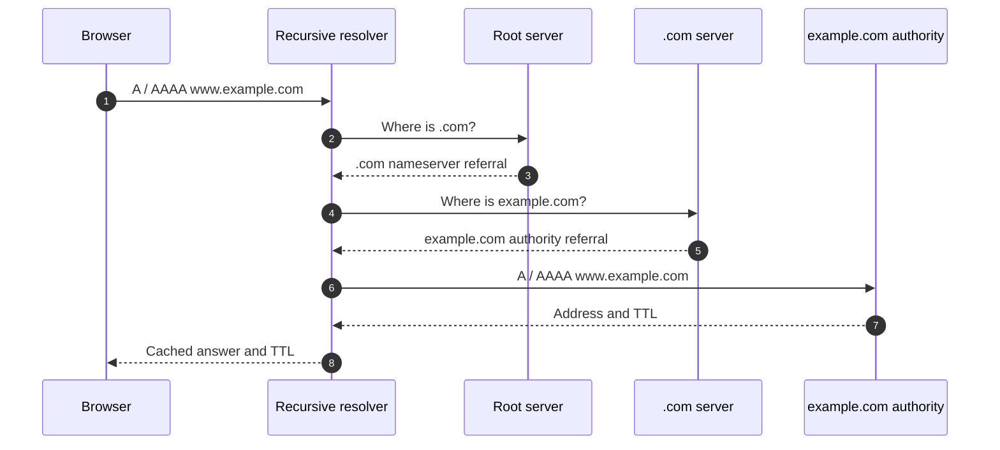
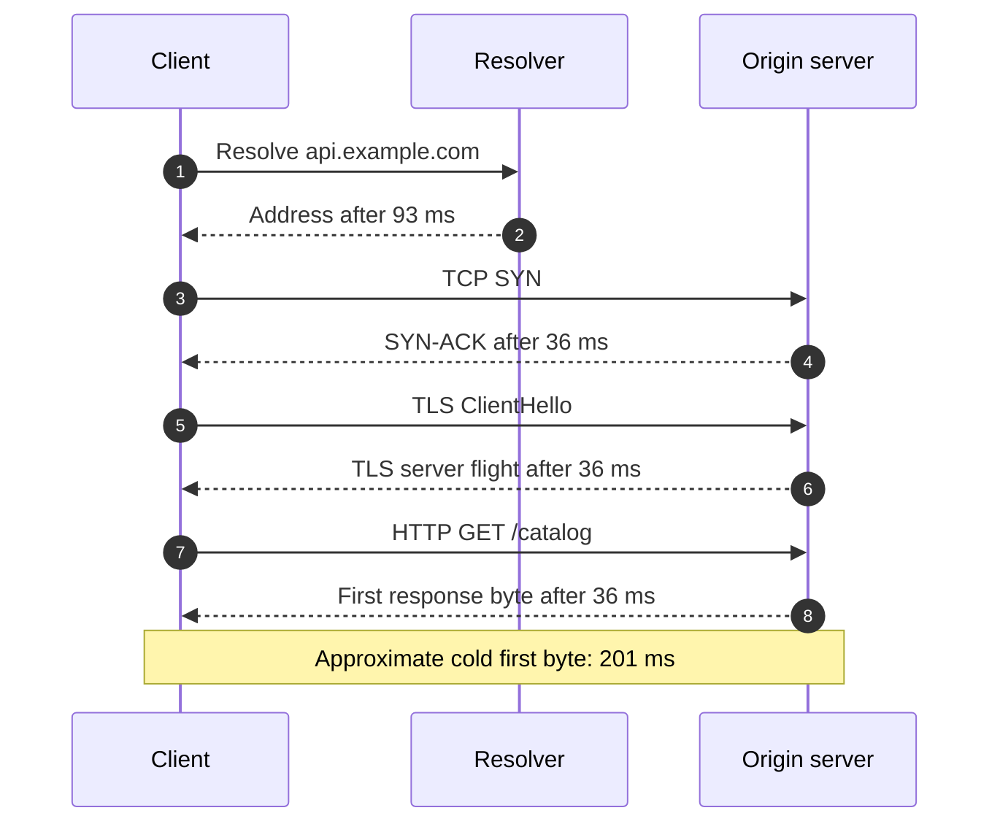
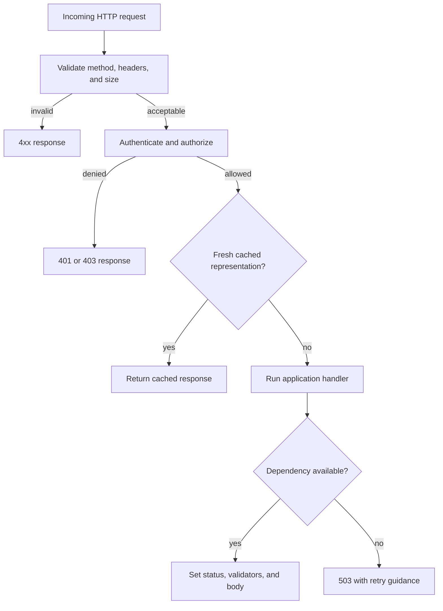
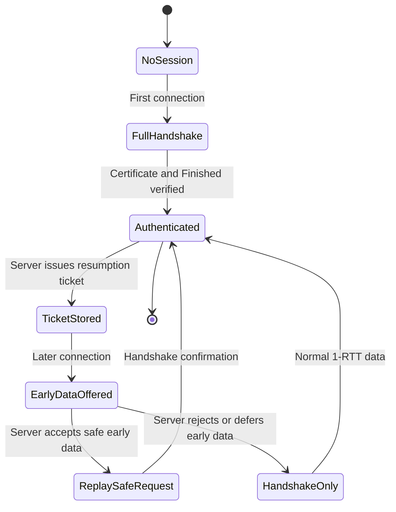

# Application Layer: DNS, HTTP, TLS, and Modern Web Delivery

The application layer is where a browser, mobile application, or service decides what a request means: resolve a name, fetch a representation, authenticate a caller, or send a message. It sits above transport protocols such as TCP and QUIC, but its choices determine most user-visible latency, cache behaviour, and security boundaries. Interviewers use DNS, HTTP, and TLS together because a convincing answer connects an address lookup, a protocol exchange, and a safe response rather than treating them as isolated acronyms.

---

## 🟢 Beginner Level

### A request is more than a URL

When a user enters `https://www.example.com/products`, the client first needs an address for `www.example.com`.

It then needs a secure connection to the server selected for that address.

Finally, it sends an HTTP request that states the method, path, headers, and sometimes a body.

The server returns an HTTP response containing a status code, headers, and an optional body.

The application layer defines the meaning of those messages.

TCP or QUIC only carries bytes reliably enough for the selected protocol; it does not know what a `GET` or a DNS `AAAA` record means.

This separation lets the same HTTP API run over HTTP/1.1 on TCP, HTTP/2 on TCP, or HTTP/3 on QUIC.

### DNS as the Internet's distributed directory

The Domain Name System, or DNS, maps names to records.

An `A` record maps a name to an IPv4 address.

An `AAAA` record maps a name to an IPv6 address.

A `CNAME` record makes one name an alias for another canonical name.

An `MX` record identifies mail exchangers, while `TXT` is commonly used for ownership and policy data.

Most applications ask a recursive resolver, often supplied by the network or chosen by the operating system.

The recursive resolver follows delegations on the application's behalf and caches the result.

The root zone does not know every host address.

It refers a resolver to the nameservers for a top-level domain such as `.com`.

The top-level-domain server refers the resolver to the authoritative servers for the particular domain.

The authoritative server provides the answer for that zone.



The browser normally does not contact root and authoritative servers directly.

That delegation work is valuable because a shared resolver can cache common answers for many clients.

### Caches, TTLs, and the limits of freshness

A DNS answer has a time to live, or TTL, measured in seconds.

Resolvers may reuse an answer until that TTL expires instead of repeating the full lookup.

If an `A` record has a TTL of 300 seconds, a resolver can normally reuse it for five minutes.

That reduces latency and protects authoritative servers from repeated identical requests.

A short TTL can make an address change visible sooner.

A long TTL reduces lookup load but makes a bad deployment or a moved endpoint take longer to disappear from caches.

Negative answers can be cached too, so creating a previously absent name may not become visible immediately.

DNS caching is therefore an availability and release-management decision, not merely a performance optimisation.

### HTTP is a request-response contract

HTTP gives a common shape to application messages.

The request line or pseudo-headers identify a method and target resource.

Headers carry metadata such as content type, caching policy, credentials, and accepted representations.

The body carries a representation when the method needs one.

`GET` asks for a representation and should not change server state.

`POST` commonly asks the server to process submitted data or create a subordinate resource.

`PUT` replaces a resource representation at a known target, while `PATCH` describes a partial modification.

`DELETE` asks the origin server to remove a resource.

The method's semantics matter for retries, caches, proxies, and incident recovery.

```http
GET /products/42 HTTP/1.1
Host: api.example.com
Accept: application/json
If-None-Match: "product-42-v8"
```

```http
HTTP/1.1 304 Not Modified
ETag: "product-42-v8"
Cache-Control: max-age=60
```

The `304` response says that the client's cached representation is still current.

It avoids sending a body but is meaningful only because the request supplied a validator.

### Status codes and ownership of failure

HTTP status codes classify the result at the protocol boundary.

The first digit gives a broad family.

| Family | Meaning | Typical example | Who usually changes something? |
|---|---|---|---|
| `2xx` | Request succeeded | `200 OK`, `201 Created` | Nobody; process the result |
| `3xx` | More action or another location | `301 Moved Permanently`, `304 Not Modified` | Client or cache follows protocol rules |
| `4xx` | Request cannot be accepted as sent | `401 Unauthorized`, `404 Not Found`, `429 Too Many Requests` | Caller changes credentials, input, or rate |
| `5xx` | Server or an upstream dependency failed | `500 Internal Server Error`, `503 Service Unavailable` | Server operator or upstream service |

A `404` does not always mean that the server is broken.

It can be an intentional response used to avoid revealing whether a protected resource exists.

A `500` does not automatically mean a client may safely retry.

The server might already have accepted a non-idempotent operation before failing to reply.

### TLS protects the conversation, not the destination choice

Transport Layer Security, or TLS, authenticates the server and encrypts application data in transit.

The browser checks that the certificate is valid for the hostname it intended to reach.

The handshake establishes shared traffic keys without putting those keys on the network.

After the handshake, passive observers cannot read HTTP headers and bodies protected by TLS.

TLS also detects modification of protected records in transit.

TLS does not guarantee that the web application is honest, safe, or free of authorization bugs.

It also does not by itself prove that DNS selected the intended endpoint; certificate validation is the critical binding to the hostname.

---

## 🟡 Intermediate Level

### Recursive versus iterative DNS resolution

The client normally requests recursive service from its configured resolver.

It asks one server for a final answer or an error rather than assembling referrals itself.

The resolver then performs iterative lookups against the DNS hierarchy.

At each delegation it receives the next place to ask, until an authoritative answer is found.

Authoritative servers answer for zones they administer and should not recursively resolve arbitrary names for strangers.

This distinction prevents an authoritative service from becoming an open resolver that attackers can abuse for reflection traffic.

Resolvers cache both the answer and the delegation information needed to find future answers efficiently.

They may also prefetch popular records before expiry, but prefetching is an implementation policy rather than a DNS guarantee.

### DNS records, aliases, and load distribution

An address lookup can involve more than one record lookup.

For example, `shop.example.com` might be a `CNAME` to `edge.vendor.net`.

The resolver must then obtain the address records for the canonical target.

This indirection is convenient for a CDN or managed platform, but it adds an alias dependency and possible extra latency.

Multiple `A` or `AAAA` records can distribute clients across several addresses.

That is not a health-aware load balancer by itself: cached answers continue to be used until their TTLs expire.

Modern DNS also has service-binding records, such as HTTPS and SVCB, that can advertise parameters and alternative services.

Applications still need safe fallback behaviour because resolvers, clients, and middleboxes may not all support newer record types.

### HTTP/1.1, HTTP/2, and HTTP/3 solve different bottlenecks

HTTP/1.1 uses text-formatted messages over one TCP byte stream per connection.

Persistent connections avoid a new TCP connection for every object, but a response sequence can still block later responses on the same connection.

Browsers historically opened several connections to work around this limitation.

HTTP/2 uses binary framing and multiplexes logical streams over a single TCP connection.

It can interleave frames for CSS, images, API data, and other responses.

HTTP/2 header compression, called HPACK, reduces repeated header bytes.

Yet TCP still delivers a single ordered byte stream.

If one TCP packet is lost, TCP cannot deliver later bytes to HTTP/2 until the missing bytes are retransmitted.

HTTP/3 maps HTTP streams to QUIC streams over UDP.

QUIC implements reliable transport, congestion control, encryption integration, and stream multiplexing in user-space protocol logic.

Loss in one QUIC stream does not prevent an unrelated stream's already available data from being delivered.

| Property | HTTP/1.1 | HTTP/2 | HTTP/3 |
|---|---|---|---|
| Wire format | Text messages | Binary frames | Binary HTTP frames over QUIC |
| Underlying transport | TCP | TCP | QUIC over UDP |
| Multiple request streams | Limited pipelining; usually separate connections | Yes | Yes |
| Header compression | None in protocol | HPACK | QPACK |
| Transport-level head-of-line blocking | Per TCP connection | Still possible across all HTTP/2 streams | Isolated between QUIC streams |
| Connection migration | New TCP connection normally needed | New TCP connection normally needed | Connection IDs can survive address changes |

HTTP/3 is not simply “HTTP over unreliable UDP.”

QUIC supplies reliability for streams where HTTP needs it, while preserving independence between streams.

### A worked latency example

Assume a user is on a network with a 36 ms round-trip time to the origin network.

Assume the recursive resolver has no cached entry and needs three upstream referral exchanges.

Suppose each resolver-to-DNS-authority round trip takes 25 ms.

Suppose the client-to-resolver request and reply together take 18 ms.

The cold DNS lookup time is approximately `18 + (3 × 25) = 93 ms`.

For a new HTTPS connection over TCP with TLS 1.3, TCP establishment costs roughly one downstream RTT.

The TLS 1.3 full handshake costs another RTT before normal application data can be sent.

The request and first response byte cost about one more RTT when server processing time is ignored.

The approximate first-byte time is therefore `93 + 36 + 36 + 36 = 201 ms`.

For a new HTTP/3 connection, QUIC and TLS establish their cryptographic context together in roughly one RTT.

It still needs an application request/response turn in this simplified model.

Its corresponding estimate is `93 + 36 + 36 = 165 ms`.

The 36 ms difference is not a promise for every network.

It illustrates why avoiding a separate transport handshake matters when latency is dominated by round trips.

A resumed TLS or QUIC session can use 0-RTT data, but only for replay-safe requests.



This model deliberately excludes server computation, packet loss, congestion, certificate-chain validation time, and browser connection reuse.

In production, a real-user measurement trace is more trustworthy than a hand calculation.

The calculation is still useful for forming a hypothesis: a DNS miss cannot be fixed by compressing JSON, and a slow server cannot be fixed by HTTP/3 alone.

### HTTP caching is a correctness protocol

An HTTP cache can store a representation and reuse it only when response directives permit it.

`Cache-Control: max-age=60` says a shared or private cache may regard a response as fresh for 60 seconds unless another directive changes that interpretation.

`no-store` says the response must not be stored, which is useful for highly sensitive material but can be overused.

`no-cache` is often misunderstood: it allows storage but requires validation before reuse.

An `ETag` is an opaque validator chosen by the server.

The client sends it in `If-None-Match` to ask whether its stored representation still matches.

If unchanged, the server can return `304 Not Modified` with no representation body.

`Last-Modified` and `If-Modified-Since` provide time-based validation but can be less precise than an entity tag.

Versioned static assets commonly use a long freshness lifetime because changing the filename makes the asset immutable in practice.

Dynamic, personalised responses should be carefully marked `private`, vary on the correct request headers, or not be cached at shared intermediaries.

### Safe methods, idempotency, and retries

A safe method is intended not to change server state from the user's perspective.

`GET`, `HEAD`, and `OPTIONS` are safe by HTTP semantics, even though a server may log or meter them.

An idempotent method has the same intended end state when applied once or repeatedly.

`PUT` and `DELETE` are normally idempotent, but a repeated response need not have the same status code.

`POST` is not generally idempotent because repeating it can create two payments or two orders.

Distributed applications often add an idempotency key to a POST request.

The server stores the key with the completed effect and returns the original result when it sees the key again.

That protects clients retrying after a timeout when they cannot tell whether the first request reached the server.

### TLS 1.3 handshake and certificate validation

TLS 1.3 has the client send a `ClientHello` containing supported algorithms, a server-name indication, and usually a key share.

The server selects parameters, sends its own key share, and proves its identity with a certificate chain and signature.

Both endpoints derive shared handshake secrets using ephemeral Diffie-Hellman key exchange.

The client validates the certificate chain to a trusted authority and checks the requested hostname against the certificate identity.

It also verifies the server's `CertificateVerify` signature and the handshake `Finished` message.

Only then should the application accept the server as the intended authenticated peer.

TLS 1.3 removed many legacy cryptographic choices and encrypts more handshake content than earlier TLS versions.

The public name in the initial ClientHello may still be observable without Encrypted Client Hello support.

---

## 🔴 Expert Level

### DNS failure modes, DNSSEC, and encrypted DNS

DNS is a control plane with security consequences.

An attacker who can cause a resolver to cache a false answer can direct clients to a malicious endpoint.

DNSSEC adds signed resource-record sets and a chain of trust from a signed parent zone to a signed child zone.

A validating resolver checks signatures and reports a validation failure rather than accepting an altered signed answer.

DNSSEC authenticates DNS data; it does not encrypt DNS queries or hide names from the resolver.

DNS over TLS and DNS over HTTPS encrypt the hop between a client and a resolver.

They improve confidentiality on that hop but shift trust toward the selected resolver.

They do not replace DNSSEC's origin-authentication role.

A common operational failure is a stale delegation or missing glue record after moving DNS providers.

Another is setting a TTL too low during a traffic spike and turning authoritative DNS into a bottleneck.

Instrument resolver response code, cache-hit rate, answer age, and authoritative query rate before making TTL changes.

### HTTP/2 and HTTP/3 flow control is deliberate backpressure

Multiplexing can let one eager sender consume memory at a slower receiver unless the protocol provides limits.

HTTP/2 has connection-level and stream-level flow-control windows.

The receiver sends `WINDOW_UPDATE` frames as it consumes data and can permit more bytes.

QUIC similarly applies flow control to streams and to the connection as a whole.

These windows are different from congestion control.

Flow control protects the receiver's buffers and application consumption rate.

Congestion control limits network sending based on loss, acknowledgements, and delay signals.

An application that stops reading a large download can therefore stall one stream without necessarily making unrelated QUIC streams unusable.

Servers need limits for header size, concurrent streams, queued bytes, and request-body duration as well as protocol flow control.



The diagram represents policy ordering as well as data flow.

Rejecting oversized or malformed input before expensive authentication and database work is an important availability control.

### TLS session resumption and the 0-RTT replay trade-off

After a successful TLS session, a server can issue a resumption ticket containing or referring to state needed for a future abbreviated handshake.

On a later connection, a client may send early data before the handshake fully completes.

This 0-RTT feature can reduce latency for a request that would otherwise wait for a round trip.

Early data is not safe against replay in the same way as data sent after handshake confirmation.

An attacker who captures an early-data request may be able to replay it to the server under conditions the protocol permits.

Servers must only accept replay-tolerant, idempotent operations as early data.

For example, an authenticated `GET /catalog` may be suitable if its side effects are truly absent.

`POST /payments` must not be made 0-RTT merely because it saves time.

Idempotency keys reduce duplicate effects but do not automatically make every security-sensitive request safe for early data.



The security review question is not “does the endpoint use HTTPS?”

It is “can this exact request be duplicated, reordered, or observed without violating money, authorization, or state invariants?”

### QUIC connection IDs and mobile clients

A TCP connection is identified by source address, source port, destination address, destination port, and protocol.

When a phone moves from Wi-Fi to cellular, that tuple usually changes.

Traditional TCP connections normally need to reconnect because the peer sees a different path and address.

QUIC separates a stable connection ID from the current network path.

After path validation, a client can continue a QUIC connection across an address change without recreating all application streams.

This can improve continuity for mobile users, especially for long-running transfers.

It also requires careful anti-amplification checks and path validation so an attacker cannot cause a server to send traffic to a victim address.

Connection IDs can create linkability concerns, so endpoints rotate them according to protocol rules and deployment policy.

### Observability across the application layer

Application-layer incidents rarely have a single useful metric.

For DNS, record lookup latency should be split by cache hit, negative answer, timeout, and DNS response code.

For HTTP, measure response status families, duration by route, request and response size, cache status, and retry count.

For TLS, observe handshake failures by alert, protocol version, cipher suite, certificate issuer, and client population without recording secrets.

For HTTP/2 and HTTP/3, observe open streams, stream resets, flow-control stalls, packet loss, and handshake duration.

Trace correlation should carry a request identifier across gateway, service, and downstream calls rather than logging credentials or full personal data.

An error budget alert that only says “5xx increased” is too late to distinguish expired DNS, certificate rotation, database overload, and application exceptions.

The protocol boundary should add enough structured context to make the next diagnostic query obvious.

### Common Misconceptions

1. **“DNS is only a one-time setup lookup.”** DNS resolution happens throughout normal operation because entries expire, names change, and services use many hostnames. A client may hide this through caches, but cache misses and negative caching are production latency and availability concerns.

2. **“HTTP/2 eliminates all head-of-line blocking.”** HTTP/2 removes application-level response ordering between streams, but all frames still share one ordered TCP byte stream. A lost TCP segment can delay delivery for every HTTP/2 stream on that connection.

3. **“HTTPS means every aspect of a web request is private.”** TLS encrypts the protected connection, but IP addresses, some routing metadata, traffic timing, and potentially the requested server name can still be visible depending on the deployment. It also does not protect data after the server deliberately exposes it to an authorised or compromised application component.

4. **“A timeout means the server did not process the request.”** A timeout means the client did not receive a conclusive response within its deadline. The server may have completed the operation, so blindly retrying a non-idempotent request can create duplicates.

5. **“0-RTT is simply a faster TLS handshake.”** It is a latency optimisation with replay constraints. Only requests whose duplicate execution is safe should be accepted as early data.

### Interview Questions

**Q1. What is the difference between a recursive DNS query and an iterative lookup?** `[easy]`

A recursive query asks the resolver to return a final answer or an error for the requested name. The resolver performs iterative lookups by following referrals from root, top-level-domain, and authoritative servers. This concentrates cache and protocol complexity in the resolver, but makes the resolver a critical dependency that must be secured and monitored.

**Q2. Why does a DNS TTL matter to an application deployment?** `[easy]`

A TTL controls how long resolvers may reuse an answer before asking again. A short TTL can make an endpoint change propagate faster, while a long TTL reduces lookup traffic and often improves latency. The trade-off is that an address rollback or outage can remain visible in independent caches until their stored lifetime ends.

**Q3. What does an HTTP status code tell a client, and what does it not tell it?** `[easy]`

The status code categorises the result of the HTTP exchange, such as success, caller error, or server failure. It gives clients a standard basis for redirects, authentication, caching, and selected retries. It does not prove that a non-idempotent action did not already happen when the exchange ended in a timeout or a broken connection.

**Q4. How does TLS authenticate a web server for a hostname?** `[easy]`

The server sends a certificate chain and proves possession of the corresponding private key with handshake signatures. The client validates that chain to a configured trust store and checks that the requested hostname matches a permitted certificate identity. Expired certificates, an untrusted issuer, or a hostname mismatch must fail validation even if encryption could otherwise be established.

**Q5. Why can HTTP/2 still suffer head-of-line blocking?** `[medium]`

HTTP/2 multiplexes application streams, so one large response need not wait for another response to finish. However, every stream's frames travel through one ordered TCP byte stream, and TCP waits for missing bytes before releasing later bytes to HTTP/2. Packet loss can consequently delay otherwise independent HTTP/2 streams, which is the transport-level limitation HTTP/3 addresses.

**Q6. How does HTTP/3 reduce the transport-level blocking seen by HTTP/2?** `[medium]`

HTTP/3 uses HTTP streams mapped to independent QUIC streams rather than placing every frame in one TCP byte stream. QUIC recovers lost data for the affected stream while delivering available data for other streams. It still faces congestion and shared-path limits, so it does not make packet loss free or guarantee lower latency in every network.

**Q7. Explain the difference between flow control and congestion control.** `[medium]`

Flow control limits how much data a sender may place in a receiver's buffers before the receiving application consumes it. Congestion control limits sending based on inferred network capacity and loss or delay feedback. A service needs both because a fast network can overwhelm a slow application, while a fast application can overload a constrained network path.

**Q8. What is an ETag, and why is it preferable to sending a full representation on every request?** `[medium]`

An ETag is an opaque version validator selected by the origin server for a representation. A client sends it in `If-None-Match`, allowing the server to answer `304 Not Modified` when the representation has not changed. This saves body bytes and transfer time, but cache directives and variation by headers must still be correct or a client can receive an inappropriate cached representation.

**Q9. A client timed out while creating an order. What should the retry design do?** `[medium]`

Treat the timeout as an unknown outcome rather than evidence that no order was created. Submit the operation with an idempotency key, store the completed effect against that key, and return the original result for a retry. The service must scope the key to the correct caller and request payload, otherwise a reused key can incorrectly join different operations.

**Q10. Why is DNSSEC different from DNS over HTTPS?** `[medium]`

DNSSEC adds signatures that a validating resolver can use to authenticate DNS data through a chain of trust. DNS over HTTPS encrypts DNS traffic between a client and its chosen resolver. One protects answer integrity and the other protects a network hop's confidentiality, so a mature design may use both rather than treating them as alternatives.

**Q11. Your mobile users report that long downloads restart whenever they move from Wi-Fi to cellular. What protocol behaviour would you investigate?** `[hard]`

First determine whether the application uses TCP-based HTTP/1.1 or HTTP/2 connections that are bound to the old network tuple. Then inspect whether a QUIC/HTTP/3 path is available and whether the client and load balancer preserve QUIC connection IDs during validated path migration. Resume support and byte-range requests remain necessary because migration can still fail, be blocked by network policy, or occur after the application already closed the connection.

**Q12. A CDN migration changed an address record, but some users still reach the old edge for several minutes. What do you check?** `[hard]`

Check the old record's TTL, resolver cache age, alias chain, and whether the application is resolving an unexpected canonical target. Compare answers from several recursive resolvers and inspect any in-process or operating-system DNS cache. Do not repeatedly lower the TTL after the change and expect existing cached answers to disappear, because the lifetime was attached when each resolver stored the earlier response.

**Q13. When is TLS 1.3 0-RTT data unsafe?** `[hard]`

It is unsafe when replaying the request could create a different or harmful effect, such as charging a payment card, changing a password, or consuming a one-time token. A captured early-data request can be replayed under the protocol's threat model before the server has fully confirmed freshness. Restrict 0-RTT acceptance to genuinely replay-safe operations and retain normal authentication, authorisation, and idempotency protections.

**Q14. A service has rising latency but stable application handler time. How would you isolate an application-layer cause?** `[hard]`

Split end-to-end timing into DNS, connection, TLS handshake, request queueing, upstream, and response phases instead of looking only at handler duration. Correlate those phases with resolver cache-hit rate, certificate errors, connection reuse, HTTP status families, stream resets, and packet-loss measurements. This can reveal a DNS cache miss storm, failed session resumption, or protocol fallback that would be invisible in the service's business-method timer.

### Further Reading

- [RFC 1034: Domain Names—Concepts and Facilities](https://www.rfc-editor.org/rfc/rfc1034) explains DNS delegation, recursive service, and caching.
- [RFC 9110: HTTP Semantics](https://www.rfc-editor.org/rfc/rfc9110) defines methods, status codes, conditional requests, and caching semantics.
- [RFC 9114: HTTP/3](https://www.rfc-editor.org/rfc/rfc9114) describes HTTP over QUIC and its stream model.
- [RFC 8446: The Transport Layer Security Protocol Version 1.3](https://www.rfc-editor.org/rfc/rfc8446) specifies the TLS 1.3 handshake, resumption, and early data.
