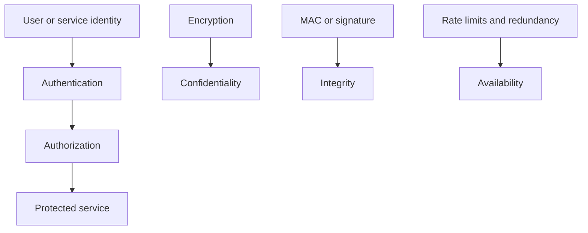
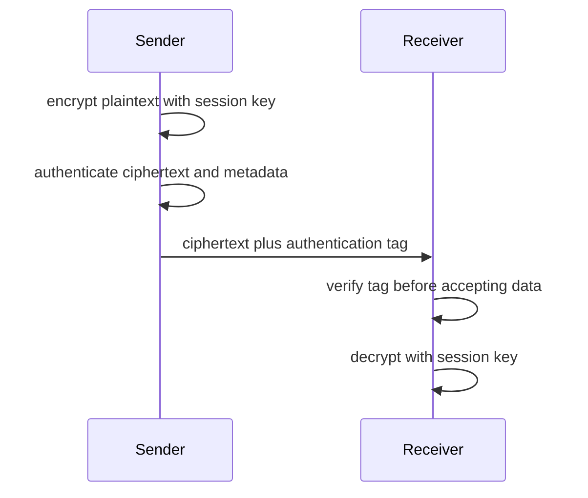
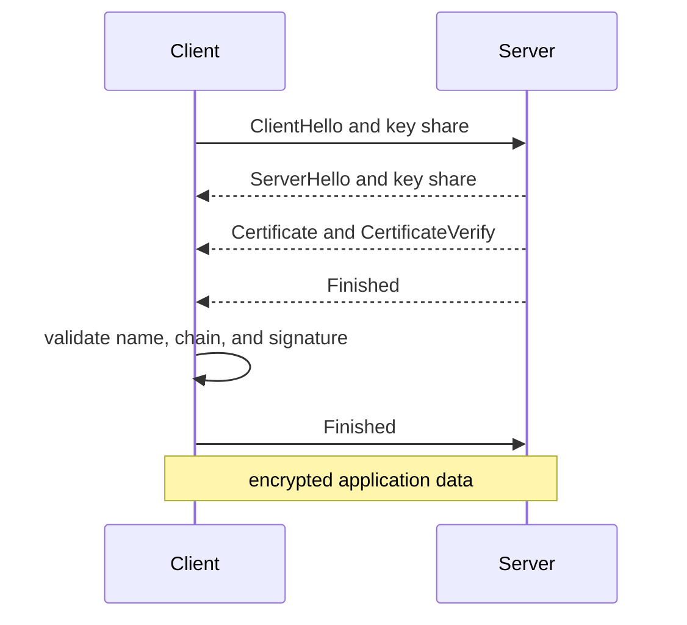
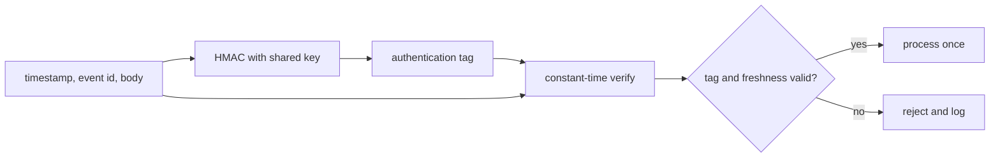
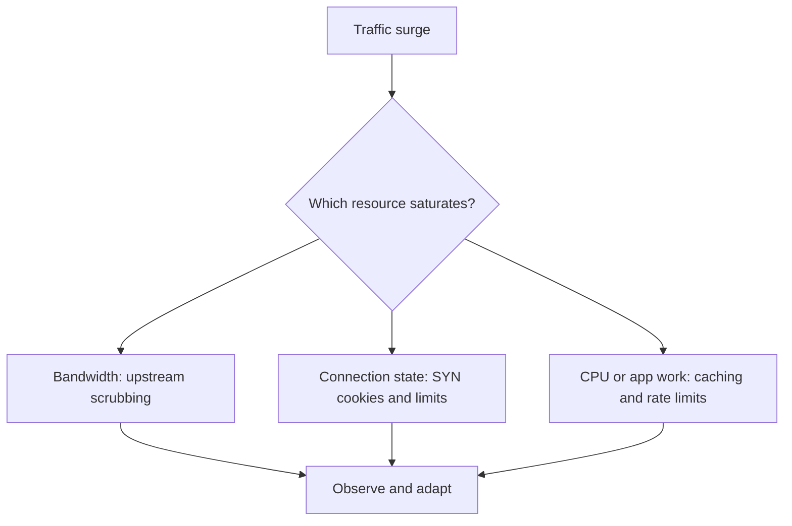

# Network Security: Cryptography, TLS, Filtering, and Resilience

Network security combines identity, cryptography, segmentation, protocol hardening, and operational response to protect data and services as they cross untrusted networks. Encryption alone is insufficient: an encrypted service can still be unavailable, misrouted, impersonated, or exposed through weak authorization. Interviewers expect a layered explanation that connects a threat to a control and the control's failure mode.

---

## 🟢 Beginner Level

### The security goals

The CIA triad gives a useful first model for network security.

Confidentiality prevents unauthorised reading of data.

Integrity detects or prevents unauthorised modification.

Availability keeps a service reachable for legitimate users.

Authentication establishes an identity.

Authorization decides what an authenticated identity may do.

Non-repudiation is a more specialised property supported by signed records and operational evidence.

Security controls should be matched to assets and threats.

A TLS certificate protects a server identity and handshake authentication.

It does not decide whether the authenticated user may delete a record.

A firewall can reduce exposed attack surface.

It cannot make an insecure application input parser safe by itself.

### Encryption, hashes, MACs, and signatures

Encryption turns plaintext into ciphertext using a key so an unauthorised observer cannot read it.

A cryptographic hash maps arbitrary data to a fixed-length digest.

Hashes alone do not authenticate a sender because anyone can hash altered data.

A Message Authentication Code, such as HMAC, combines a secret key and message to provide integrity and authentication to parties sharing that key.

A digital signature uses a private key to sign and a public key to verify.

It can provide integrity and signer authentication without sharing the private key with every verifier.

Authenticated encryption modes such as AES-GCM or ChaCha20-Poly1305 provide confidentiality and integrity together when used correctly.

Never reuse a nonce with the same key in modes that require nonce uniqueness.

Use established TLS and cryptographic libraries rather than creating a custom protocol from primitives.

### Threats appear at multiple layers

An attacker can exploit local-link trust through ARP spoofing.

They can exhaust a TCP listener with connection attempts.

They can intercept traffic where identity validation is skipped.

They can exploit application requests after the network connection is correctly encrypted.

Defence in depth uses multiple independent controls so one mistake is not total compromise.

Segmentation limits lateral movement.

Least privilege limits what a stolen credential can do.

Logging and detection shorten the time an incident remains invisible.

---

## 🟡 Intermediate Level

### Symmetric and asymmetric cryptography work together

Symmetric cryptography uses one shared secret for encryption or authentication.

It is efficient enough for bulk application data.

Asymmetric cryptography uses related public and private keys.

It is useful for signatures, identity, and key establishment but is costlier for large data streams.

TLS uses asymmetric operations during authentication and key agreement, then uses symmetric authenticated encryption for application records.

| Mechanism | Key relationship | Typical role | Important risk |
|---|---|---|---|
| AES-GCM | Shared symmetric key | Bulk encryption and integrity | Nonce reuse |
| ChaCha20-Poly1305 | Shared symmetric key | Efficient authenticated encryption | Key and nonce management |
| ECDHE | Ephemeral private/public pairs | Establish shared secret | Missing authentication enables MITM |
| RSA or ECDSA signature | Private signer, public verifier | Certificate and identity proof | Private-key compromise |
| HMAC | Shared secret | API message integrity | Both parties can forge |

The security of a system includes key generation, storage, rotation, revocation, and access policy.

A strong algorithm with a key copied into logs is not a secure design.

### TLS 1.3 handshake and certificate validation

TLS protects a connection only after the client verifies the server identity it intended to reach.

The client validates the certificate chain to a trusted root, hostname or subject alternative name, validity period, and key usage constraints.

TLS 1.3 commonly uses ephemeral Diffie-Hellman key agreement.

The client and server derive shared traffic secrets without sending that secret directly.

The server proves possession of its certificate private key by signing handshake data.

Perfect Forward Secrecy means compromising a long-term certificate key later should not reveal past sessions that used ephemeral key agreement and securely erased ephemeral secrets.

It does not protect a session if the endpoint itself was compromised while the session was active.

Certificate pinning can reduce some CA-misissuance risks but creates rotation and recovery challenges.

### Worked example: HMAC verification

Assume an API and a webhook sender share a 256-bit HMAC key.

The sender creates a canonical message containing timestamp `1710000000`, event id `evt-42`, and body bytes.

It computes `HMAC-SHA-256(key, canonical_message)` and sends the hex tag with the request.

The receiver recomputes the tag over the exact received canonical message.

It compares tags with a constant-time comparison.

If the attacker changes `amount=100` to `amount=900`, the recomputed tag differs with overwhelming probability.

The receiver rejects the request before processing it.

If the attacker replays the untouched request one hour later, the MAC still verifies.

The timestamp and event id must therefore be checked against an allowed time window and a replay store.

HMAC authenticates a party that knows the shared secret.

It does not provide public non-repudiation because either party can create a valid tag.

### Firewalls, segmentation, and zero trust

Stateless filtering evaluates each packet against fields such as source, destination, protocol, and port.

Stateful filtering tracks established connections and can allow reply traffic without opening every ephemeral port.

A web application firewall applies HTTP-aware rules but cannot replace secure application design.

Network segmentation separates workloads into zones with explicit allowed paths.

Microsegmentation narrows that policy closer to workloads or identities.

Zero trust means each request and connection is evaluated with explicit identity, device, context, and policy rather than inheriting trust from network location alone.

Default deny with specific egress and ingress rules is generally easier to audit than broad allow rules.

### Key lifecycle and secret handling

Keys are security-sensitive data with a lifecycle, not configuration strings that happen to be long.

Generate keys with a cryptographically secure random source.

Store them in a secrets manager, hardware-backed service, or restricted runtime identity path rather than source control.

Grant each workload only the key or secret material it needs.

Rotate keys periodically and immediately after suspected exposure.

Rotation design must support overlap so old data or active peers remain usable during the transition.

Assign key identifiers to ciphertext or signatures so a verifier knows which active key to select.

Revoke or disable a compromised credential quickly, then investigate access logs for use after exposure.

Avoid passing secrets through command-line arguments because process listings and crash reports can expose them.

Avoid placing long-lived tokens in browser local storage when a safer session design is available.

Use short-lived credentials and workload identity where an infrastructure platform supports them.

Back up encryption keys under a separately protected recovery process.

Losing the only decryption key can make correctly encrypted data permanently unrecoverable.

Key rotation tests should cover old-key reads, new-key writes, rollback, and monitoring alerts.

An encryption design is only as durable as its key recovery and access-control plan.

### Secure protocol selection

Disable obsolete protocol versions and weak algorithm suites through centrally managed configuration.

Prefer TLS 1.3 where compatible, with a reviewed TLS 1.2 fallback when required by clients.

Use HTTPS for web transport and validate certificates rather than accepting all server certificates in development-derived code.

SSH host-key verification prevents a client from silently trusting a substituted server.

Use VPN or mutually authenticated transport where internal traffic crosses an untrusted network boundary.

Protocol security includes safe defaults for redirects, cookies, DNS resolution, and proxy headers.

Forwarded client-IP headers are trustworthy only when they originate from known proxy infrastructure.

Never base authorization directly on a spoofable header received from the public Internet.

Inventory every externally reachable protocol and remove services that have no business owner.

Patch network-facing libraries and appliances promptly because exposed protocol parsers are high-value targets.

---

## 🔴 Expert Level

### TCP attacks, DDoS, and availability controls

A SYN flood sends many TCP connection attempts without completing the handshake.

Each pending connection can consume listener state until the backlog fills.

SYN cookies encode enough state into the server's initial sequence number to avoid allocating full state until the final ACK arrives.

Rate limiting, upstream filtering, anycast distribution, content delivery networks, and capacity planning address different DDoS layers.

Volumetric attacks exhaust bandwidth.

Protocol attacks exhaust network-device or connection state.

Application-layer attacks exhaust expensive request processing.

Availability controls need false-positive analysis.

An aggressive rate limit can deny legitimate users during a launch or incident.

Use layered limits keyed by identity, endpoint cost, source reputation, and global capacity.

### Local network attacks and secure access

ARP has no built-in authentication, allowing local attackers to send forged IP-to-MAC bindings.

Dynamic ARP Inspection can validate ARP messages against trusted DHCP-snooping bindings on managed switches.

Port security, 802.1X network access control, VLAN separation, and secure switch management reduce local exposure.

Wi-Fi security requires modern WPA modes, protected management where supported, and separate guest access.

An encrypted Wi-Fi association does not make all clients mutually trusted.

Client isolation and firewall policy still matter.

### DNS, certificates, and service identity

DNS answers direct a client toward an IP address but do not by themselves prove endpoint identity.

TLS hostname verification binds the certificate identity to the requested host name.

DNSSEC adds signed DNS data validation where a full chain is deployed, but it does not encrypt DNS queries.

Certificate Transparency logs make publicly trusted certificate issuance observable.

Automated certificate renewal reduces expiry outages but needs monitoring and rollback-safe deployment.

Mutual TLS can authenticate both client and server when service-to-service identity needs stronger assurance than bearer tokens alone.

### Incident response and security telemetry

Collect authentication failures, TLS validation errors, firewall decisions, DNS anomalies, and connection-rate metrics with enough context for investigation.

Avoid logging secret values, session tokens, plaintext sensitive payloads, or private keys.

Time synchronisation is essential because incident timelines and signed-token validity depend on reliable clocks.

Detection should feed a prepared response path: triage, containment, evidence preservation, eradication, recovery, and retrospective improvement.

Test incident procedures through exercises rather than discovering access gaps during an active attack.

### Common Misconceptions

1. **"Encryption automatically authenticates the server."**
   *Correction*: Encryption can hide bytes without proving who holds the other endpoint. TLS certificate and hostname validation bind cryptographic identity to the intended server name.

2. **"A hash is enough to protect an API message from tampering."**
   *Correction*: An attacker can hash its modified message too. Use a keyed MAC or digital signature, plus replay protection when messages can be repeated.

3. **"NAT or a firewall means internal services are secure."**
   *Correction*: Boundary filtering reduces exposure but does not prevent compromised credentials, lateral movement, application flaws, or overly broad egress. Segmentation and least privilege remain required.

4. **"Perfect Forward Secrecy makes a compromised endpoint harmless."**
   *Correction*: PFS protects recorded past sessions from later long-term key compromise under its assumptions. Malware on an endpoint can read live plaintext and session keys.

5. **"DDoS protection is just adding more bandwidth."**
   *Correction*: Attacks can target connection tables, CPU, caches, and expensive application paths before a link saturates. Controls must match the exhausted resource and preserve legitimate traffic.

### Interview Questions

**Q1. What are the CIA security goals?** `[easy]`

Confidentiality prevents unauthorised disclosure, integrity protects against undetected alteration, and availability keeps legitimate services usable. These goals can conflict, such as strict availability limits that reject legitimate burst traffic. A security design should name which asset and threat each control addresses.

**Q2. What is the difference between encryption and a hash?** `[easy]`

Encryption is reversible with the correct key and protects confidentiality. A cryptographic hash is one-way and produces a digest used for integrity comparison. A bare hash does not authenticate a sender because an attacker can compute a new hash for altered data.

**Q3. Why does TLS use both asymmetric and symmetric cryptography?** `[easy]`

Asymmetric keys authenticate identities and establish secrets without pre-sharing a bulk encryption key. Symmetric authenticated encryption then protects the much larger application data stream efficiently. This hybrid design combines scalable identity distribution with high throughput.

**Q4. What is a digital certificate?** `[easy]`

A certificate binds a public key to an identity such as a DNS name and is signed by an issuer trusted by the client. The client validates the chain, name, time validity, and constraints before trusting the server key. A certificate alone is insufficient if hostname verification or revocation and renewal operations are ignored.

**Q5. What is Perfect Forward Secrecy?** `[medium]`

PFS uses ephemeral session key agreement so a later compromise of a server's long-term private key does not decrypt previously captured sessions. TLS 1.3 normally provides this through ephemeral Diffie-Hellman exchanges. It does not protect sessions whose endpoints or ephemeral keys were compromised while active.

**Q6. What does HMAC provide?** `[medium]`

HMAC provides message integrity and authentication to parties that share a secret key. A valid tag means a party with the key likely created the covered message. It does not prevent replay by itself and does not offer non-repudiation because either secret holder can forge a tag.

**Q7. How does a stateful firewall differ from a stateless filter?** `[medium]`

A stateless filter evaluates each packet independently against header rules. A stateful firewall tracks connection state and can allow return traffic for an established flow while denying unsolicited packets. Stateful inspection adds resource and evasion considerations, so timeouts and rule order must be operated carefully.

**Q8. What is ARP poisoning?** `[medium]`

ARP poisoning is a local-network attack that sends forged bindings so a victim associates an IP address, often the gateway, with an attacker's MAC address. It can enable interception or denial of service on that broadcast domain. Managed switches can use DHCP snooping and Dynamic ARP Inspection to validate expected bindings.

**Q9. Why is a nonce important in AES-GCM?** `[medium]`

AES-GCM requires nonce uniqueness for every encryption under one key. Reusing a nonce can expose relationships between plaintexts and can undermine authentication guarantees. Systems must generate or allocate nonces safely across restarts, concurrency, and key rotation.

**Q10. What is a SYN cookie?** `[medium]`

A SYN cookie encodes enough handshake state into the server's initial sequence number so the server need not allocate a full connection entry for every incoming SYN. When the final ACK returns, the server can validate the cookie and create state. It mitigates backlog exhaustion but is one part of broader connection and DDoS defence.

**Q11. Scenario: users see a valid TLS lock icon but are redirected to a fraudulent site after a DNS incident. What controls do you investigate?** `[hard]`

First verify whether the certificate hostname and chain were actually valid for the intended service, because correct TLS validation should reject an unrelated certificate. Investigate DNS resolver integrity, registrar controls, DNSSEC where applicable, certificate issuance logs, and application redirect configuration. TLS protects the connection to the identity it validates; it cannot correct a user intentionally visiting a different valid domain.

**Q12. Scenario: a webhook endpoint accepts the same valid signed payment event repeatedly. How do you fix it?** `[hard]`

The HMAC proves authenticity and integrity but does not make an event unique. Store processed event identifiers atomically, enforce a timestamp freshness window, and reject duplicate deliveries after the first successful transaction. Keep the handler idempotent because legitimate delivery retries can also repeat an event.

**Q13. Why can a WAF not replace secure application coding?** `[hard]`

A WAF detects some known HTTP attack patterns and can reduce exposure to common exploit traffic. It lacks complete business context, can be bypassed by encoding or novel logic paths, and may block legitimate requests. Parameterised queries, output encoding, authorization checks, dependency updates, and code review remain necessary.

**Q14. How would you respond to a TCP SYN flood that fills a public service's backlog?** `[hard]`

Enable and validate SYN cookies or equivalent stateless admission protection, apply sensible per-source and global connection limits, and coordinate upstream filtering or scrubbing if traffic volume is large. Monitor legitimate handshake completion and error rates so mitigations do not become a self-inflicted denial of service. After containment, review exposed service capacity, rate-limit policy, source patterns, and alert thresholds.

### Further Reading

- [RFC 8446: TLS 1.3](https://www.rfc-editor.org/rfc/rfc8446) specifies the modern TLS handshake and record protocol.
- [NIST SP 800-52 Rev. 2](https://csrc.nist.gov/pubs/sp/800/52/r2/final) gives TLS configuration guidance for federal systems.
- [OWASP Transport Layer Security Cheat Sheet](https://cheatsheetseries.owasp.org/cheatsheets/Transport_Layer_Security_Cheat_Sheet.html) explains deployable TLS controls and operational pitfalls.
- [RFC 4987: TCP SYN flooding attacks](https://www.rfc-editor.org/rfc/rfc4987) documents SYN-flood mitigation considerations.
