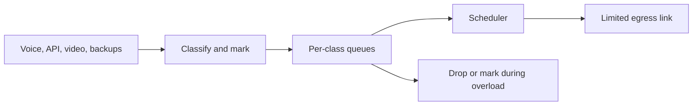
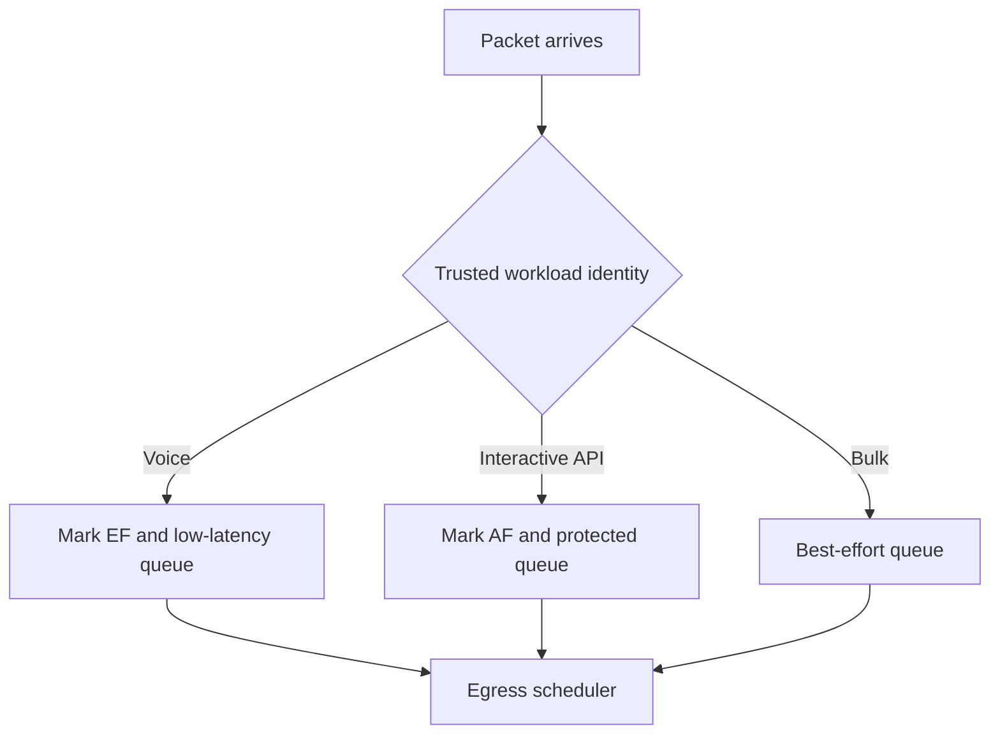
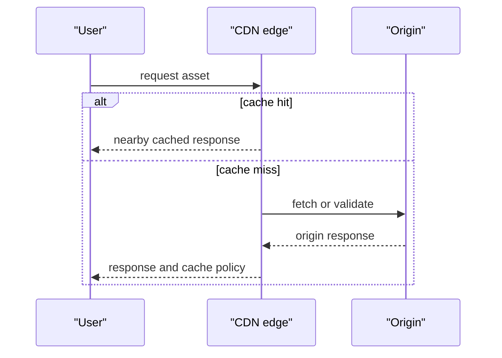
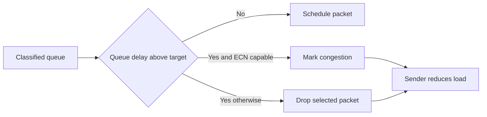
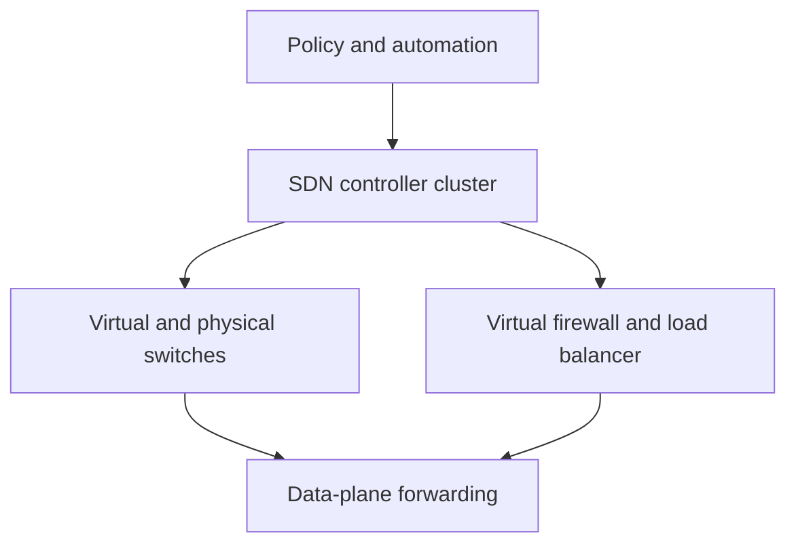

# Network QoS, Traffic Shaping & Modern Networking

Quality of Service manages scarce network capacity so latency-sensitive, loss-sensitive, and bulk traffic can share a path without one workload destroying another's user experience.
It combines classification, queueing, scheduling, shaping, policing, and measurement; CDNs, SDN, and wireless networks apply the same resource-allocation ideas at larger scales.
Interviewers ask about QoS because the real trade-off is not “prioritize everything,” but deciding what may wait, what may drop, and how to prove the policy works under congestion.

---

## 🟢 Beginner Level

### Congestion turns capacity into a queueing problem

When incoming traffic exceeds an egress link's service rate, packets queue or drop.
Queueing increases latency and jitter before the link becomes visibly saturated in a user dashboard.
Dropping packets triggers retransmission for TCP and can cause audible or visible defects for real-time media.



Bandwidth is the maximum data rate a link can carry.
Latency is the time one packet takes to travel and be processed.
Jitter is variation in latency between packets.
Loss is the fraction of packets that fail to arrive.

| Traffic | Primary sensitivity | Useful policy goal |
|---|---|---|
| voice call | latency and jitter | small bounded priority queue |
| interactive API | tail latency | protected minimum share |
| database replication | loss and throughput | assured bandwidth, backpressure |
| backup or software update | throughput | yield under congestion |
| video stream | jitter and loss | adaptive bitrate and fair queueing |

QoS cannot create bandwidth that a link does not have.
It can reserve, queue, drop, or delay traffic so overload has predictable consequences.
An application should still reduce demand, cache data, and use backpressure rather than expecting a network policy to repair unbounded load.

### Classification assigns a packet to a service class

At the network edge, a device classifies traffic using fields such as interface, VLAN, IP prefix, protocol, port, or authenticated workload identity.
It can place a Differentiated Services Code Point, or DSCP, in the IP header for downstream per-hop treatment.
Classification is a trust boundary because an untrusted client can mark all traffic as high priority.



Expedited Forwarding, often called EF, is intended for low-loss, low-delay, low-jitter traffic when the network provisions it correctly.
Assured Forwarding, or AF, defines classes with different forwarding and drop precedence behaviour.
Best effort is not “bad traffic”; it is traffic without a special service commitment.

Remark traffic at the boundary instead of trusting markings from arbitrary clients.
Record classification counters so operators can see whether a policy is receiving expected traffic or an application was misidentified.

### CDNs move data nearer to demand

A content delivery network caches or serves content from points of presence near users.
It can reduce round-trip time, avoid origin bottlenecks, and absorb traffic bursts before they reach the application backend.



An edge cache hit does not require a long origin round trip.
On a miss, origin shielding can funnel many edge misses through a regional layer to avoid a thundering herd.
Caching needs correct expiry, purge, authorization, and cache-key design; delivering stale or another user's response quickly is not a QoS success.

---

## 🟡 Intermediate Level

### Token buckets allow controlled bursts

A token bucket accumulates tokens at rate `r` up to capacity `B`.
Sending `n` bytes requires `n` tokens.
An idle workload can save tokens and burst at line rate until the bucket empties, then it is limited to the refill rate.

```text
tokens = min(B, tokens + elapsed_seconds * r)
if tokens >= packet_bytes: send and subtract packet_bytes
else: queue, delay, or drop
```

Assume capacity $B = 10$ MB, refill $r = 2$ MB/s, and line rate $M = 10$ MB/s.
Starting full, tokens drain at net rate $M-r = 8$ MB/s during a line-rate burst.
The burst lasts $10 / 8 = 1.25$ seconds.

During that time the sender transmits $10 \times 1.25 = 12.5$ MB.
Of that amount, 10 MB came from stored credit and 2.5 MB arrived while the burst was active.
Afterward, the sustainable rate is 2 MB/s until idle time refills the bucket.

| Mechanism | Burst behaviour | Typical consequence |
|---|---|---|
| token bucket | permits saved bursts | good for web and API burstiness |
| leaky bucket | emits a constant rate | smooth output, queues bursts |
| policer | drops or remarks excess | enforces contract at ingress |
| shaper | delays excess into queue | smooths egress at cost of latency |

Token bucket parameters are a contract.
If B is too small, normal request bursts are dropped or delayed.
If B is too large, one tenant can inject a burst that creates a queue large enough to harm other traffic.

### Queueing decides who waits and who drops

Strict priority always serves a higher class before lower classes.
It can protect a small voice class, but an unbounded high-priority class can starve everything else.
Weighted fair queueing and deficit round robin assign service shares among active queues, improving fairness across flows or classes.

Active queue management drops or marks packets before a queue becomes persistently full.
Random early detection and modern schemes such as CoDel aim to signal congestion before bufferbloat creates seconds of delay.
Explicit Congestion Notification can mark capable packets instead of dropping them, allowing responsive senders to reduce rate.



Queue length in packets is not enough to reason about latency because packet sizes differ.
Queue delay or bytes plus link rate gives a more useful bound.
A 1 MB queue on a 10 Mb/s link can add about $8$ seconds of serialization delay even before propagation or processing.

### IntServ reserves flows; DiffServ aggregates classes

Integrated Services, or IntServ, uses per-flow reservation concepts such as RSVP.
Routers maintain state for individual flows and can provide stronger admission-control semantics.
That state does not scale comfortably to millions of unconstrained Internet flows.

Differentiated Services, or DiffServ, aggregates traffic into a small number of classes marked by DSCP.
Core routers apply per-hop behaviours without remembering every end-to-end flow.
It scales better but provides only the service that every administrative domain actually honours.

| Model | State held in core | Strength | Limitation |
|---|---|---|---|
| IntServ | per flow | explicit reservation | scale and signalling cost |
| DiffServ | per class | scalable differentiated treatment | no end-to-end guarantee by itself |
| best effort | minimal | simple interoperability | unpredictable congestion behaviour |

An SLA should name measurable objectives: one-way delay percentile, jitter, loss, availability, and traffic profile.
“Priority network” without a class limit, queue bound, and measurement method is not an enforceable service level.

### Rate limiting protects a service as well as a link

Network shaping controls bytes or packets entering an interface.
Application rate limiting controls requests, identities, or expensive operations before they consume downstream capacity.
Both can use token-bucket logic, but their keys and failure semantics differ.

For an API limit of 100 requests per minute with a burst of 20, choose a refill rate of $100 / 60 \approx 1.67$ requests per second and a bucket capacity of 20.
After an idle period, a client can send 20 requests immediately.
It then sustains only about 1.67 requests per second unless more tokens accumulate.

Distributed rate limits need an authoritative shared counter or a carefully designed approximation.
Per-instance limits can allow a client to multiply its effective allowance by spreading traffic across many replicas.
Return clear retry information and use bounded queues; silently delaying every excess request can exhaust server memory.

---

## 🔴 Expert Level

### QoS policies fail when demand exceeds the protected budget

Giving EF strict priority is safe only if admission control caps aggregate EF load below the available capacity.
If voice and “important” traffic together consume 100% of a link, lower classes receive no useful service and priority traffic itself queues.
Reserve a small, measured budget for priority traffic and police it at trusted ingress points.

Per-tenant fair queueing prevents one large flow from dominating all flows in a class.
It does not protect a backend service whose CPU or database is already overloaded; that requires application concurrency limits and load shedding.
End-to-end performance is limited by the narrowest resource, which may be a queue, a TLS terminator, a disk, or a remote dependency rather than a WAN link.

Use queue delay, drop or ECN rate, class utilization, flow count, and application tail latency together.
A link at 40% average utilization can still have damaging microbursts and short queue spikes.
Conversely, a fully utilised bulk link can be healthy if latency-sensitive traffic has bounded service and queues remain controlled.

### SDN separates intent from packet forwarding

Software-defined networking separates a control plane that expresses policy from devices that enforce forwarding rules.
Controllers can program switches, virtual switches, load balancers, and security functions through vendor or open interfaces.
Network function virtualization runs functions such as NAT, firewalling, and load balancing as software rather than dedicated appliances.



Centralised intent does not mean one controller process forwards every packet.
Devices usually retain local forwarding state so the data plane keeps operating through control-plane delays.
Controller availability, stale policy, race conditions, and unsafe automation become new failure modes that require staged rollout and rollback.

### Wireless QoS shares a variable radio medium

Wi-Fi clients share airtime, not merely a fixed wire bandwidth.
Low-rate clients, retransmissions, interference, and contention can consume disproportionate airtime.
Wi-Fi Multimedia maps traffic into access categories with different contention parameters, but it cannot guarantee a clean spectrum or eliminate an overloaded access point.

Wi-Fi 6 and later use OFDMA to divide a channel into resource units so several clients can exchange smaller traffic in one scheduling opportunity.
Target Wake Time can reduce contention and power use for suitable clients.
These features improve efficiency under supported hardware and configuration; they do not turn a crowded radio environment into a deterministic low-latency network.

5G network slicing similarly describes logical service differentiation over shared infrastructure.
Latency and reliability claims depend on radio conditions, transport, core-network design, and application placement.
Treat advertised peak rates and ideal latency figures as planning inputs, not guarantees for every mobile device.

### CDN and edge design trade freshness for latency

A CDN cache key may include path, query parameters, selected headers, device variation, and authorization context.
Making the key too broad destroys cache-hit ratio; making it too narrow can leak personalized content or serve incorrect variants.
Cache-control TTL, stale-while-revalidate, purges, and versioned asset names determine the freshness trade-off.

Origin shielding reduces duplicate misses reaching the origin but adds a layer that must be observed and scaled.
When an origin is unhealthy, serve stale content only where the business semantics permit it.
For authenticated APIs and mutations, edge caching is often inappropriate unless explicitly designed for the operation.

Anycast can steer users to a topologically nearby point of presence through routing, but “nearest” reflects BGP policy and network topology, not geographic distance.
Failover changes can shift large traffic volumes quickly, so capacity plans need headroom at neighbouring points of presence.
Measure edge hit ratio, origin requests, cache age, regional latency, and error rate to detect when a cache policy harms correctness or performance.

### Performance engineering starts with a service-level budget

An end-to-end latency target is a budget shared by many stages.
A request with a 200 ms p99 target might reserve 30 ms for client-to-edge network travel, 20 ms for TLS and proxy handling, 80 ms for application work, 40 ms for a database dependency, and 30 ms for response transfer and margin.
The exact numbers vary, but making them explicit prevents every team from consuming the whole target independently.

Measure both one-way components where clock quality permits and end-to-end round-trip behaviour from real client locations.
Round-trip time includes work in both directions and may hide asymmetric paths.
Application timing can show server processing while network telemetry shows queue delay, retransmission, and loss; neither replaces the other.

Percentiles matter more than a single average.
If 99 requests finish in 20 ms and one waits 2,000 ms, the average is about 40 ms even though one percent of users had an unacceptable experience.
Report p50, p95, p99, and maximum values with sample count and time window.

Tail latency compounds across fan-out.
If one request calls ten independent services, the overall request is affected by the slowest dependency rather than the average dependency.
Hedged requests can reduce some tails but create extra load and should be limited to idempotent operations with a strict budget.

Use synthetic probes for stable reference paths and real-user monitoring for actual browser, device, ISP, and geography variation.
Synthetic probes can detect a regional outage before users report it.
They cannot represent every client network, cache state, or application workflow.

Measure queue occupancy and queue delay at the bottleneck, not merely link utilization.
A 10 Gb/s interface can show modest average utilisation while brief synchronized bursts overflow a shallow buffer.
Conversely, a saturated bulk link can have acceptable interactive latency if fair queueing protects small flows and queue delay remains bounded.

Packet loss deserves attribution.
Drops can occur at a NIC ring, host socket buffer, firewall, switch queue, wireless retry limit, WAN policer, or remote service that closes a connection.
Counting only TCP retransmissions shows a symptom but not the drop location.
Correlate interface counters, ECN marks, application errors, and packet captures at safe sampling rates.

Capacity planning must include failure traffic.
When one CDN point of presence or one WAN circuit fails, neighbouring sites receive shifted demand.
Provisioning each site only for its steady-state traffic can make a successful failover create a second outage.
Test failover with realistic cache-miss, authentication, and connection-establishment load.

Adaptive bitrate media is an application-level QoS technique.
It selects a representation based on observed throughput and buffer health, reducing rebuffering rather than demanding a fixed network guarantee.
Aggressive adaptation can oscillate when measurements are noisy, so clients use smoothing, safety margins, and bounded switching frequency.

Traffic engineering chooses paths or capacity allocations to avoid hot links and meet policy objectives.
It may use routing metrics, tunnels, segment routing, load-balancer weights, or application placement.
Changing a path can affect latency, failure domains, firewall state, and cost, so validate bidirectional reachability and rollback before shifting a large percentage of traffic.

Security controls interact with performance.
TLS inspection, DDoS mitigation, WAF checks, and rate limits add processing and queueing but can be essential for availability.
Benchmark them under realistic encrypted request size and attack-like traffic, not only a trusted internal happy path.
Removing a protective control to improve a latency graph can transfer the cost to a more severe outage later.

Use load shedding before queues become unbounded.
Reject or degrade low-priority work with an explicit retry-after signal when a dependency crosses its safe concurrency.
It is usually better to fail a small, well-defined fraction quickly than to hold every request until all clients time out and retry simultaneously.

Document policy ownership.
The team classifying a workload, the team operating the egress device, and the team owning the downstream service must agree on DSCP values, rate profiles, queue budgets, and change procedures.
Without that contract, a network-only QoS change can silently misclassify a new application release.

Review QoS and CDN policies after workload changes.
New video codecs, larger payloads, encrypted DNS, a new region, or a mobile-client release can change the traffic mix that an old policy assumed.
Treat counters and user-impact metrics as feedback loops, not merely post-incident diagnostics.

Finally, distinguish a performance objective from a guarantee.
An SLO can state that 99.9% of requests complete below a target under a defined load and failure model.
An SLA may add contractual remedies and explicit exclusions.
Neither should promise impossible latency through an unconstrained public network without capacity, admission, and measurement to support it.

Change windows need baseline data.
Capture the previous class distribution, queue delay, drop rate, and user-facing latency before changing a scheduler or rate profile.
After the change, compare the same metrics under a comparable traffic period.

Avoid judging a policy from one quiet five-minute interval.
Busy-hour, failure, and burst conditions reveal whether classification and budgets operate as designed.
Keep a rollback configuration that can be applied without reconstructing a device's previous state during an incident.

For multi-tenant systems, publish a fair-use profile rather than an opaque “unlimited” promise.
Tenants can then design their own client backoff around an explicit sustained rate and burst capacity.
Transparent limits reduce surprise retries and make capacity conversations technical rather than adversarial.

QoS succeeds when it makes overload behaviour intentional, observable, and aligned with business importance.

### Common Misconceptions

1. **“QoS makes a congested link faster.”** It cannot add capacity; it selects which traffic gets scarce capacity and how overload is signalled. Sustained demand above capacity still needs reduction, upgrade, or load shedding.
2. **“Strict priority is best for critical traffic.”** It is useful only with a bounded priority budget. Unpoliced priority traffic starves other classes and eventually harms itself through queueing.
3. **“A token bucket is a fixed-rate limiter.”** It permits bursts from accumulated tokens, then enforces a long-term average. A leaky bucket or shaper produces a smoother rate but can add queue delay.
4. **“DSCP guarantees Internet-wide QoS.”** Markings may be reclassified, ignored, or overwritten by each provider. End-to-end guarantees require agreements and capacity across every relevant domain.
5. **“A CDN always makes content safe and fresh.”** It can reduce latency and origin load, but incorrect cache keys or purge policy can serve stale or unauthorized data faster. Correctness rules must precede hit-rate optimisation.

### Interview Questions

**Q1. What is the difference between bandwidth, latency, jitter, and loss?** `[easy]`

Bandwidth is a capacity rate, latency is delivery time, jitter is variation in delivery time, and loss is the fraction of packets not delivered. A high-bandwidth path can still have poor interactive performance if queues add high latency and jitter. QoS must measure the property the application is actually sensitive to.

**Q2. How does a token bucket work?** `[easy]`

Tokens accumulate at a configured rate up to a fixed capacity, and sending bytes or packets consumes tokens. Idle time therefore permits a bounded burst, while sustained traffic is limited to the refill rate. The capacity and refill rate must be chosen from the intended traffic profile rather than copied from another service.

**Q3. What is the difference between shaping and policing?** `[easy]`

Shaping delays excess traffic in a queue to smooth its output rate. Policing enforces a profile by dropping or remarking excess traffic rather than buffering it. Shaping can preserve traffic at the cost of added latency, while policing protects a boundary but makes loss visible immediately.

**Q4. Why does a full queue increase latency?** `[easy]`

Packets must wait behind bytes already queued for the finite-rate output link. A 1 MB queue on a 10 Mb/s link alone represents roughly eight seconds of serialization time. Long queues can therefore create poor responsiveness even before packet loss is observed.

**Q5. Compare IntServ and DiffServ.** `[medium]`

IntServ maintains per-flow reservation state and can provide explicit admission-control semantics. DiffServ marks and handles traffic classes, allowing core routers to scale without tracking every flow. DiffServ is more practical at large scale but does not create an end-to-end guarantee unless each domain honours compatible policy.

**Q6. Why must priority traffic be policed?** `[medium]`

Strict priority serves a high class before others, so an unbounded high-priority sender can consume all egress capacity. Policing caps the class to its allocated budget and preserves room for other traffic. It also prevents a misconfigured client from turning a DSCP label into a denial of service.

**Q7. What is bufferbloat?** `[medium]`

Bufferbloat is excessive persistent queueing caused by buffers that hold traffic far longer than the application can tolerate. It hides early packet loss but inflates latency and jitter, often causing TCP to keep sending into a delayed path. Active queue management and fair queueing aim to signal congestion before the delay becomes extreme.

**Q8. What does ECN do?** `[medium]`

ECN lets a congested network mark capable packets instead of dropping them. A compatible receiver and sender feed that congestion signal into transport behaviour so the sender can reduce load. It is not universal, so networks need safe fallback for traffic that does not negotiate or correctly process ECN.

**Q9. Why is a CDN cache key important?** `[medium]`

The cache key decides which requests can share a stored response. Including unnecessary variation lowers hit ratio, while omitting authorization or relevant content variation can return the wrong response to a user. Cache design is therefore a correctness and security boundary as well as a performance optimisation.

**Q10. How does OFDMA improve Wi-Fi efficiency?** `[medium]`

OFDMA divides a channel into resource units so an access point can schedule several clients with small transfers in one opportunity. This reduces waste from one client occupying an entire channel for a short packet. It still depends on radio quality, client support, and correct access-point scheduling.

**Q11. Voice calls become choppy whenever nightly backups start. What do you change?** `[hard]`

Measure queue delay, class counters, backup rate, and radio or link capacity to confirm that bulk traffic is filling the shared egress queue. Classify and police a small voice class, shape or rate-limit backups below the remaining capacity, and use fair queueing for other traffic. Verify improvement with latency and jitter percentiles during the real backup window rather than only a throughput test.

**Q12. A token bucket allows a tenant to create a damaging burst. Which parameters do you revisit?** `[hard]`

Revisit both refill rate and bucket capacity, because capacity determines how much idle credit the tenant can spend immediately. Bound the burst to what downstream queues and services can absorb, then preserve a sustainable rate that matches the tenant contract. If many tenants burst together, also use fair queueing or aggregate admission control because individually valid bursts can still overload a shared bottleneck.

**Q13. A CDN has excellent hit ratio but users report stale account data. How do you fix it?** `[hard]`

Separate cacheable public assets from personalized or mutable account responses, then review cache keys, authorization variation, TTLs, invalidation, and stale-serving policy. Disable or tightly control caching for responses whose correctness requires immediate consistency. A higher origin load may be the correct cost of accurate account state, so capacity planning must accompany the cache change.

**Q14. An SDN policy rollout blackholes one region. What safety controls should have existed?** `[hard]`

Use staged deployment, pre-change validation, canaries, route and reachability probes, configuration versioning, and an immediate rollback path. Keep data-plane rules stable when the controller is unavailable and monitor both intended policy and actual forwarding. Central automation accelerates both recovery and blast radius, so guardrails must be stronger than manual-device procedures.

### Further Reading

- [RFC 2474: Differentiated Services Field](https://www.rfc-editor.org/rfc/rfc2474) defines the DS field and DSCP markings.
- [RFC 2697: Single Rate Three Color Marker](https://www.rfc-editor.org/rfc/rfc2697) defines a token-bucket-based traffic marker.
- [RFC 3168: Explicit Congestion Notification](https://www.rfc-editor.org/rfc/rfc3168) specifies ECN signalling in IP and TCP.
- [IEEE 802.11 working group resources](https://www.ieee802.org/11/) provide primary standards information for Wi-Fi evolution.
