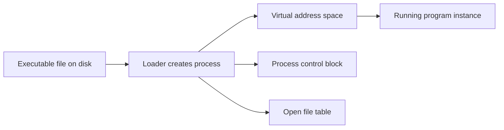
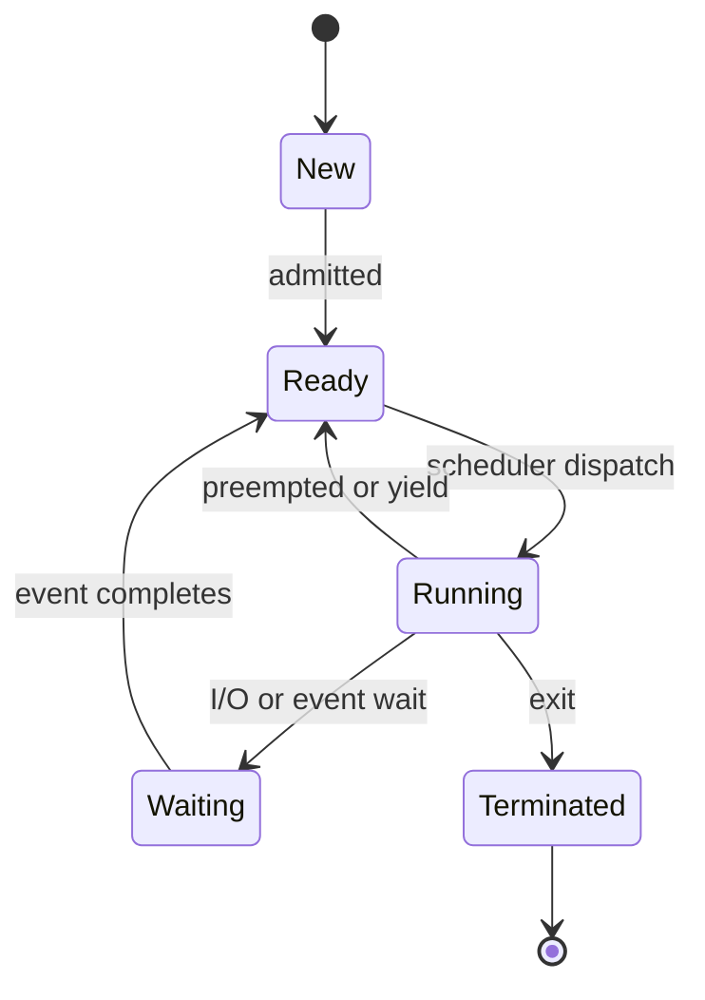
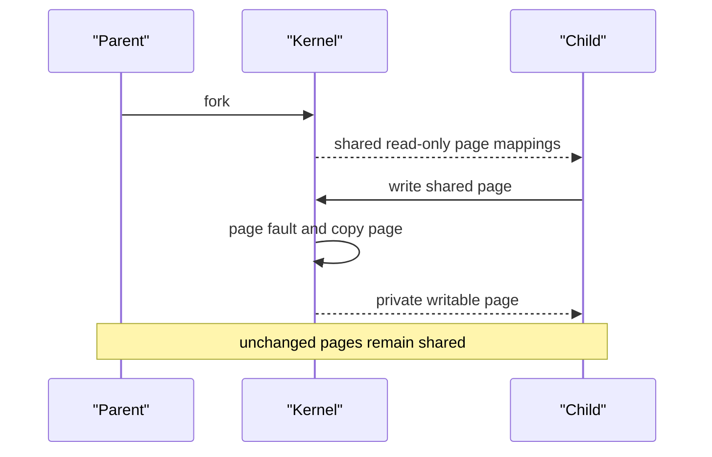
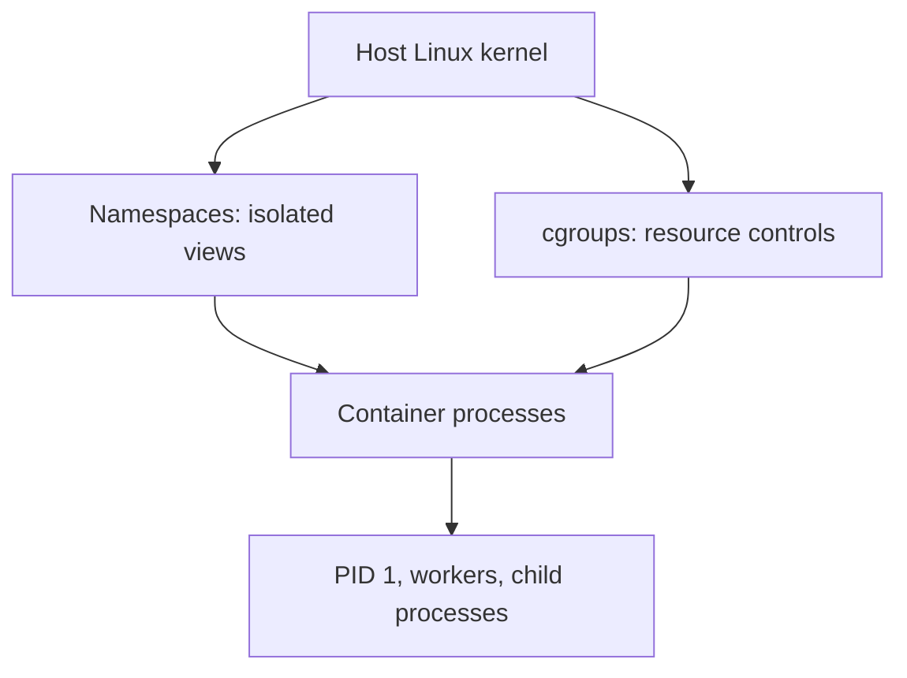

# Process Management

Process management is the operating system's machinery for starting programs, giving them CPU time, isolating their memory, waiting for events, and reclaiming resources when they end.
It connects user-visible actions such as launching a browser to kernel structures such as process tables, address spaces, scheduling queues, and file descriptor tables.
Interviewers ask about it because process state, context switching, `fork`, and isolation explain performance, reliability, and container behaviour.

---

## 🟢 Beginner Level

### A program becomes a process when it runs

A program is passive bytes on disk: executable code, static data, and metadata.
A process is that program while the operating system is executing it.
Each process has an identity, current CPU state, virtual address space, and operating-system-managed resources.

Launching the same executable twice normally creates two independent processes.
They may map the same executable file pages, but their mutable memory and process IDs are distinct.
A browser process crashing does not change the bytes in its executable file; the running state is what failed.



The scheduler runs threads of execution, but process management supplies the ownership and isolation boundary around them.
On Linux, a process can contain one or more tasks sharing some resources.
In introductory discussion, “the process runs” is useful shorthand for one of its runnable threads receiving a CPU.

### Processes move through states

A newly created process is admitted and becomes ready to run.
It becomes running when the scheduler dispatches it to a CPU.
It can block waiting for disk I/O, a lock, a timer, or another event.



**Ready** means the process could run if a CPU were available.
**Waiting** or **blocked** means it cannot use a CPU until a condition changes.
This distinction matters when diagnosing high load: a large ready queue suggests CPU contention, while many blocked tasks may indicate slow I/O or lock contention.

| State | CPU can run it now? | Typical reason |
|---|---:|---|
| new | no | kernel is creating process resources |
| ready | yes, when selected | waiting for a CPU |
| running | currently running | executing instructions |
| waiting | no | disk, socket, timer, or lock wait |
| stopped | no | debugger, job control, or signal |
| terminated | no | exit status awaits reaping |

State names vary across operating systems and tools.
The underlying question is always whether the task is executing, runnable, blocked, or already finished.

### The PCB records what the kernel must resume

The operating system maintains a process control block, often called a PCB.
Linux represents task state primarily with `task_struct` plus referenced structures.
The PCB is kernel-owned metadata, not application memory.

It includes a process ID and scheduling state.
It records saved CPU registers and a program counter when the task is not on a CPU.
It points to memory-management information, credentials, signal state, open files, and parent-child relationships.

```c
struct task_struct {
    pid_t pid;
    unsigned int flags;
    struct mm_struct *mm;
    struct files_struct *files;
    struct task_struct *real_parent;
    // scheduler, signal, namespace, and accounting state
};
```

The exact layout is kernel-version and architecture dependent.
Do not memorize a byte size for `task_struct`; it changes with configuration and enabled features.
The important point is that a process needs far more state than its code and heap.

### Context switching saves state but does no application work

A context switch changes the task using a CPU.
The kernel saves the outgoing task's machine state and restores the incoming task's state.
It also changes accounting and may change memory mappings, security context, and cache locality.

```text
task A registers -> PCB A
PCB B registers -> CPU registers
CPU begins task B instructions
```

The switch is necessary for responsiveness and fairness.
It is overhead from an application's perspective because neither task makes useful progress during the switch itself.
Frequent switching can also damage cache and TLB locality, making the cost greater than the register save alone.

---

## 🟡 Intermediate Level

### Processes and threads trade isolation for sharing

A process owns a virtual address space and a set of kernel-managed resources.
A thread is an execution context within a process.
Threads in one process normally share heap memory, code mappings, and open files, while retaining separate registers and stacks.

| Property | Process | Thread in same process |
|---|---|---|
| address space | separate by default | shared |
| crash containment | stronger | a fatal process error affects peers |
| communication | IPC required | shared memory directly |
| creation and switch cost | usually higher | usually lower |
| memory safety boundary | kernel-enforced | application synchronization required |

Threads make sharing fast but introduce races.
Processes make faults and permissions easier to contain but require explicit communication.
Modern servers commonly use both: several processes for isolation and many threads or asynchronous tasks inside each worker.

### Creation on Unix begins with fork and often exec

`fork()` creates a child process as a logical copy of its parent.
The return value distinguishes the two paths: zero in the child, the child PID in the parent, and negative on failure.
The child commonly calls an `exec` family function to replace its program image with another executable.

```c
pid_t pid = fork();
if (pid == 0) {
    execlp("worker", "worker", "--queue", "orders", (char *) NULL);
    _exit(127);
}
if (pid > 0) {
    int status;
    waitpid(pid, &status, 0);
}
```

After `fork`, parent and child have different PIDs.
They initially inherit many resources, including file descriptors, but each has its own process identity.
After `exec`, the child retains its PID while its code, stack, heap, and most process image content are replaced.

### Copy-on-write makes fork economical

Copying an entire multi-gigabyte address space at every fork would be expensive.
Instead, modern Unix-like kernels use copy-on-write.
Parent and child initially point at the same physical pages, marked so a write traps into the kernel.



Suppose a parent has 1 GiB of mapped anonymous memory consisting of 262,144 pages at 4 KiB each.
The child immediately calls `exec`, so it writes no inherited pages.
Copy-on-write avoids copying all 1 GiB; it needs page-table setup and shares the original pages until `exec` replaces the image.

If instead the child modifies 2,000 pages, it copies roughly $2{,}000 \times 4\text{ KiB} = 7.8125\text{ MiB}$ of page content.
This is still much less than 1 GiB, but page faults and allocator pressure are real costs.
Copy-on-write is an optimization, not a promise that `fork` is free.

### Parent, child, zombie, and orphan are lifecycle terms

When a child exits, the kernel retains a small record containing its PID and exit status until the parent collects it with `wait` or `waitpid`.
That exited-but-not-collected child is a zombie.
It consumes little memory but consumes a process-table slot, so many zombies can prevent new processes from starting.

An orphan is a running child whose parent has exited.
The kernel reparents it to a designated reaper, commonly PID 1 or a subreaper.
The reaper eventually waits for it after it exits.
An orphan is not automatically broken; daemons have historically used controlled parent exit as part of detachment.

```c
while ((pid = waitpid(-1, &status, WNOHANG)) > 0) {
    log_child_exit(pid, status);
}
```

Ignoring `SIGCHLD` without a correct platform-aware policy is a common source of zombies.
In a container, the process acting as PID 1 must reap children or delegate that responsibility to a small init process.

### IPC chooses a data and failure boundary

Processes cannot directly dereference each other's normal virtual memory.
They communicate through interprocess communication mechanisms.
The best mechanism depends on data volume, trust, locality, and failure requirements.

| Mechanism | Data path | Strength | Main cost |
|---|---|---|---|
| pipe | kernel byte stream | simple parent-child pipeline | unstructured stream and buffering |
| Unix socket | kernel socket API | local bidirectional protocol | copies and protocol handling |
| TCP socket | network stack | remote communication | latency and failure handling |
| shared memory | common mapped pages | high throughput | synchronization and access control |
| message queue | broker or kernel queue | decoupled producers | ordering and delivery semantics |

Shared memory avoids copying bulk data but does not remove concurrency problems.
It needs synchronization, a layout contract, and cleanup when one participant dies.
Sockets make failure and boundaries explicit, which often outweighs their overhead for service-to-service communication.

---

## 🔴 Expert Level

### Scheduling tracks runnable tasks, not just processes

Linux schedules tasks, which correspond closely to threads of execution.
The kernel maintains per-CPU run queues and selects a runnable task according to the active scheduling class and policy.
The Completely Fair Scheduler model historically used virtual runtime to favour tasks that have received less weighted CPU time.

For two runnable tasks with equal weights, each should receive roughly half of the available CPU over a sufficiently long interval.
If task A has nice weight twice task B's weight, A receives roughly twice B's share when both remain runnable.
Actual scheduling also includes wakeup behaviour, CPU affinity, real-time classes, cgroup controls, and kernel version details.

Consider one CPU with two always-runnable normal tasks of equal weight.
Over a 1-second interval, a fair scheduler aims to give each roughly 500 ms of CPU time.
If task A has twice the scheduling weight of task B, a simple proportional target is roughly 667 ms for A and 333 ms for B.
This is a long-term fairness model, not a guarantee that either task runs in one uninterrupted block.

Interactive workloads need short response delay when they wake.
Batch workloads benefit from sustained throughput and fewer disruptive preemptions.
The scheduler balances those goals using policy, load balancing, and heuristics rather than a single fixed quantum for every task.

CPU affinity limits or prefers the CPUs on which a task may execute.
Keeping a task on one CPU can retain hot cache data.
Overly strict affinity can instead leave one CPU overloaded while another is idle.
NUMA systems add another dimension because memory access can be faster from a local node than a remote node.

Real-time scheduling classes deserve special caution.
`SCHED_FIFO` can run until it blocks, yields, or a higher-priority task preempts it.
`SCHED_RR` adds rotation among tasks of one real-time priority.
An incorrectly configured real-time task can starve normal system work, including the management tools needed to repair the host.

The run queue is not necessarily a single global list.
Modern kernels use per-CPU structures and periodically balance work between CPUs.
That reduces shared-lock contention but means a process may migrate, affecting cache warmth and observed latency.
Use CPU affinity or real-time policy only with measured requirements and an operational rollback path.

```text
virtual runtime grows with actual runtime and inversely with weight
task with less service is selected sooner
```

Do not infer CPU utilization from process state alone.
A task can be runnable but wait behind many other runnable tasks, and a process can have several threads with different states.
Use scheduler traces, run-queue metrics, and profiling when latency depends on this distinction.

### Namespaces and cgroups construct containers

Linux namespaces isolate a process's view of global-looking resources.
PID namespaces change visible process IDs.
Mount, network, IPC, UTS, user, time, and cgroup namespaces isolate other views.

Control groups, or cgroups, account for and limit resources such as CPU, memory, I/O, and process counts.
Together, namespaces and cgroups underpin common container implementations.
They do not create a separate kernel the way a virtual machine generally does.



A cgroup memory limit can cause the kernel to kill a process under pressure.
A PID namespace changes what a process sees as PID 1 but does not remove its responsibility to reap children.
Container isolation is powerful but not a substitute for application authorization, secure configuration, or correct resource limits.

### Signals, exit status, and termination need ownership

Signals are asynchronous notifications delivered to a process or thread group.
`SIGTERM` asks for orderly termination, while `SIGKILL` cannot be caught or cleaned up by the target.
`SIGCHLD` informs a parent that a child changed state, commonly exited.

An exit status communicates a small result to the waiting parent.
It does not transport logs, stack traces, or a full business error.
Robust supervisors combine exit status with structured logging, health checks, restart backoff, and a deliberate policy for repeated failure.

When a service receives `SIGTERM`, it should stop accepting new work, finish or hand off bounded in-flight work, close resources, and exit before its orchestrator deadline.
Ignoring the signal forces escalation to `SIGKILL`, which bypasses cleanup.
Conversely, a shutdown handler that blocks forever turns a graceful deploy into an outage.

### Process limits prevent one workload consuming the host

The kernel and shell expose limits for open files, process counts, address space, and other resources.
`RLIMIT_NOFILE` constrains open file descriptors for a process.
`pids.max` in cgroup v2 constrains task creation within a cgroup.

Forking until failure is not merely an application bug; it can exhaust PIDs, memory, or file descriptors for unrelated services.
Use backpressure and bounded worker pools instead of creating one process per request.
Set realistic cgroup and ulimit values, then observe actual peak use and failure modes.

File descriptors are a common hidden process limit.
Sockets, pipes, regular files, and event handles all consume descriptors.
If a web process has an effective `RLIMIT_NOFILE` of 1,024 and leaks one socket per request, it eventually fails new accepts or outbound calls even with free CPU and memory.

Inspect both the configured limit and current descriptor count during incidents.
Raise a limit only after confirming that the process, kernel, and downstream services can safely support the larger concurrency.
Close resources deterministically through language constructs such as try-with-resources, and make long-lived connection pools bounded.

Process-count limits are similarly a resilience boundary.
A worker design with 64 fixed children fails predictably when capacity is reached.
An unbounded fork loop can turn one malformed request into host-wide resource exhaustion.
Backpressure is therefore a process-management feature as much as an application design pattern.
It turns resource exhaustion into a controlled rejection or queueing decision.
That is safer than allowing a host to run out of PIDs or memory without warning.
Capacity limits should be visible in metrics and exercised in load tests.

### Common Misconceptions

1. **“A program and process are the same.”** A program is stored code and data, while a process is one active execution with dynamic state and allocated resources. One executable can have many concurrent process instances.
2. **“Waiting means a process is waiting for CPU.”** A ready task waits for CPU; a waiting task cannot run until an event occurs. Confusing them leads to the wrong CPU-versus-I/O diagnosis.
3. **“Fork copies all parent memory immediately.”** Copy-on-write shares pages until one process writes a page. Page tables, faults, and modified pages still make fork measurable work.
4. **“A zombie is a running orphan.”** A zombie has exited and awaits parent reaping; an orphan is still running after its parent exits. Their remedies and resource effects are different.
5. **“Containers are lightweight virtual machines.”** Containers share the host kernel while using namespaces and cgroups for isolation and limits. Their security and failure model therefore differs from a VM's separate guest kernel.

### Interview Questions

**Q1. What is the difference between a program and a process?** `[easy]`

A program is a passive executable file and its static contents, while a process is one running instance with a PID, registers, memory mappings, and resources. Multiple processes can execute the same program simultaneously with separate mutable state. Ending a process normally changes none of the executable bytes on disk.

**Q2. What is the difference between ready and waiting states?** `[easy]`

A ready task has all needed inputs and can run as soon as the scheduler assigns a CPU. A waiting task is blocked on I/O, a timer, a lock, or another event and would make no progress even with a CPU. This distinction separates CPU contention from blocked-work diagnosis.

**Q3. What information does a process control block contain?** `[easy]`

It holds kernel metadata needed to manage and resume a process, including identity, scheduling state, saved CPU context, memory references, credentials, signals, and open-resource references. The exact structure differs by operating system and kernel version. It is separate from the process's user-space heap and stack.

**Q4. Why is context switching overhead?** `[easy]`

The kernel must save the outgoing execution context and restore another before application instructions resume. Cache, TLB, and branch-prediction locality can also be disrupted, adding cost beyond register saves. Switching is necessary for fairness and responsiveness, but excessive switching reduces useful CPU work.

**Q5. What happens after `fork` and `exec`?** `[medium]`

`fork` creates a child with a new PID and an initially similar process image, while the parent receives the child PID. The child commonly calls `exec`, which replaces its program image with a new executable while retaining its PID and selected inherited resources. The parent may call `waitpid` to collect the child's exit status and prevent a zombie.

**Q6. How does copy-on-write reduce fork cost?** `[medium]`

Parent and child initially share physical pages with mappings that cause a write fault when either attempts modification. The kernel copies only the page being written, so a child that immediately calls `exec` avoids copying the parent's whole address space. Copy-on-write still requires page-table work and can become costly when either side writes many pages.

**Q7. What is a zombie process and how do you prevent it?** `[medium]`

A zombie is a child that has exited but whose parent has not yet collected its status with `wait` or `waitpid`. Its execution resources are gone, but its process-table record remains so the parent can inspect the exit result. A parent must reap children promptly, and a container PID 1 must do the same for its descendants.

**Q8. Compare processes and threads.** `[medium]`

Processes normally isolate address spaces and require IPC, which improves fault containment but adds communication and creation overhead. Threads share a process address space, making sharing cheap but requiring synchronization and allowing a fatal process failure to affect peers. Real systems combine them based on trust, throughput, and blast-radius needs.

**Q9. What is the role of cgroups and namespaces in a container?** `[medium]`

Namespaces isolate a process's view of resources such as PIDs, mounts, networks, and users. Cgroups account for and limit shared host resources such as CPU, memory, I/O, and process count. They provide process isolation on one kernel, not a separate guest kernel as in a typical virtual machine.

**Q10. Why can shared memory be faster but riskier than sockets?** `[medium]`

Shared memory can avoid copying large payloads through a kernel transport path. Both processes then need explicit synchronization, memory-layout agreement, permission control, and cleanup for crashed peers. Sockets impose protocol and copying costs but make the boundary and failure handling clearer.

**Q11. A container accumulates zombies under load. What do you inspect and fix?** `[hard]`

Inspect the process tree and confirm whether the container's PID 1 or an intermediate supervisor is failing to handle `SIGCHLD` and call `waitpid`. Ensure the parent reaps every completed child, or run a minimal init that forwards signals and reaps descendants when the application cannot. Do not repeatedly restart the container without fixing the reaping owner, because the PID limit can be exhausted again quickly.

**Q12. A service has high latency but low CPU utilization. How does process state help your investigation?** `[hard]`

Check whether threads are blocked on disk, network sockets, locks, or rate limits rather than merely looking at aggregate CPU. A large runnable queue suggests scheduling pressure, whereas many waiting tasks point to the resource they await. Combine state inspection with traces and I/O metrics because process state alone does not identify the exact blocking call.

**Q13. Why is one-process-per-request usually a poor server design?** `[hard]`

Process creation, memory setup, scheduling, and resource ownership add much more overhead than reusing a bounded worker pool. Unbounded process creation can exhaust PIDs, memory, and file descriptors under load. Use fixed workers, asynchronous I/O, or controlled process pools, adding process isolation only where its fault boundary justifies the cost.

**Q14. A child exits after a remote side effect but before its parent records success. What must the parent design for?** `[hard]`

The parent can observe only the exit status and any durable records or messages the child produced; it cannot assume the external side effect was absent. Use idempotency keys, durable outbox records, or reconciliation logic so a retry does not duplicate an irreversible action. Process supervision must be paired with business-level recovery rather than treating an exit code as a transaction commit.

### Further Reading

- [Linux manual: `fork(2)`](https://man7.org/linux/man-pages/man2/fork.2.html) documents child creation and copy-on-write implications.
- [Linux manual: `waitpid(2)`](https://man7.org/linux/man-pages/man2/waitpid.2.html) documents child reaping and zombie state.
- [Linux kernel documentation: cgroup v2](https://docs.kernel.org/admin-guide/cgroup-v2.html) explains resource control for process groups.
- [Linux kernel documentation: namespaces](https://docs.kernel.org/admin-guide/namespaces/index.html) explains the isolation primitives used by containers.
