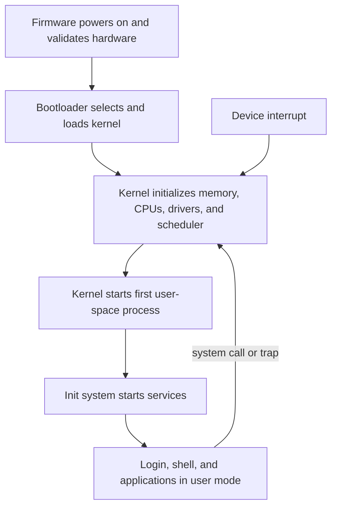
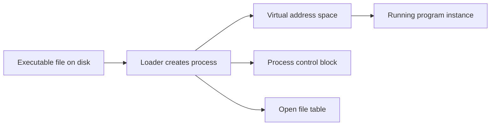
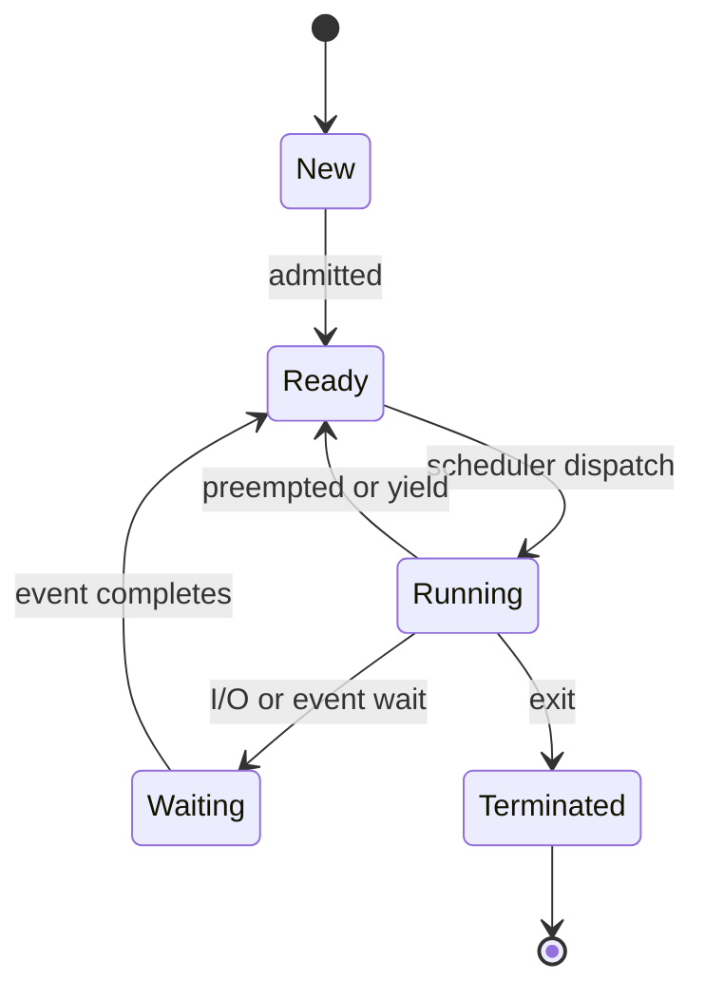
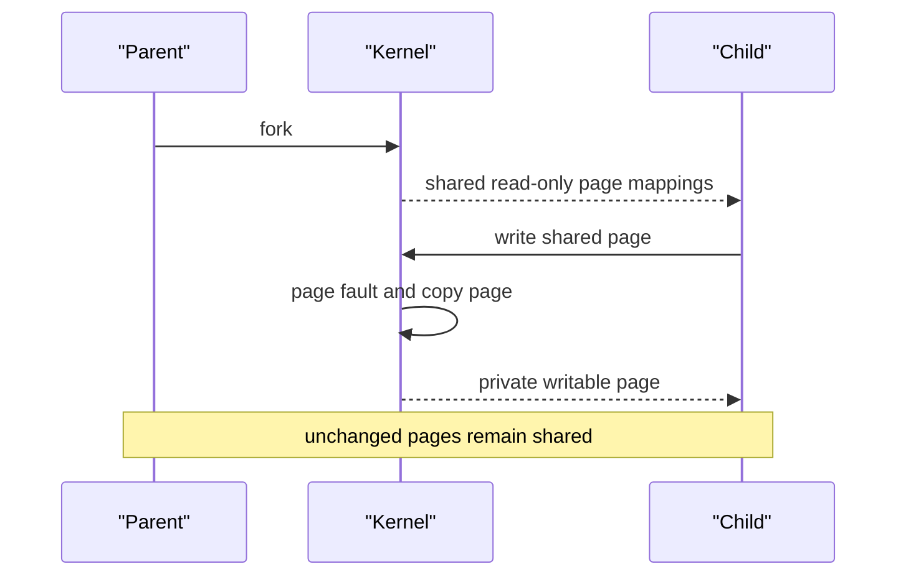
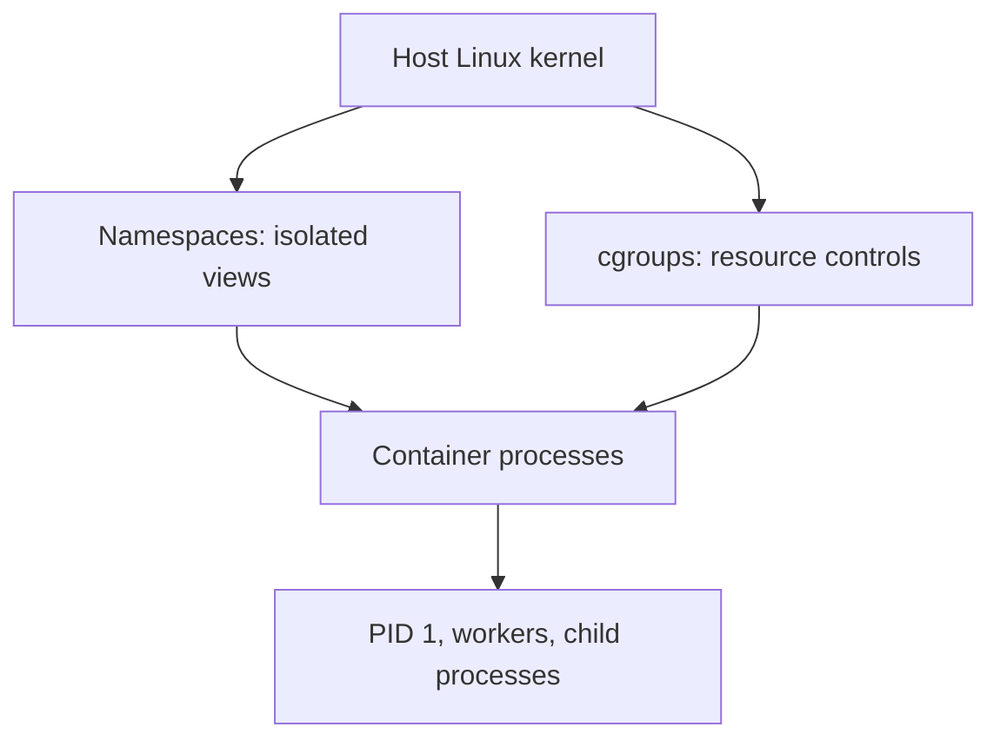

# Process Management

Process management is the operating system's machinery for starting programs, giving them CPU time, isolating their memory, waiting for events, and reclaiming resources when they end.
It connects user-visible actions such as launching a browser to kernel structures such as process tables, address spaces, scheduling queues, and file descriptor tables.
Interviewers ask about it because process state, context switching, `fork`, and isolation explain performance, reliability, and container behaviour.

---

## 🟢 Beginner Level

### Operating system fundamentals

An **operating system** manages hardware resources and provides stable interfaces such as processes, virtual memory, files, sockets, and devices. Stable does not mean that their state survives a power failure.
The **kernel** is its privileged core; the wider OS also includes system libraries, startup services, command tools, and user interfaces.
Applications therefore depend on the OS without executing every service inside the kernel.

Processors enforce at least two privilege levels.
**User mode** restricts direct device access and privileged instructions, while **kernel mode** allows the kernel to configure memory mappings, interrupt controllers, and hardware.
A **system call**, or syscall, is a controlled entry from user mode into a validated kernel service such as reading a file, mapping memory, or creating a process.

An **interrupt** is usually an asynchronous hardware notification, such as a network card reporting received data.
A **trap** is a synchronous transfer caused by the current instruction, such as a syscall request, breakpoint, invalid opcode, or page fault.
Both enter a kernel handler, but their causes and restart semantics differ. Entering kernel mode does not itself mean the scheduler switched to another task; a syscall can return to the same thread.


```mermaid
flowchart TD
    P["Firmware powers on and validates hardware"] --> B["Bootloader selects and loads kernel"]
    B --> K["Kernel initializes memory, CPUs, drivers, and scheduler"]
    K --> I["Kernel starts first user-space process"]
    I --> S["Init system starts services"]
    S --> U["Login, shell, and applications in user mode"]
    U -->|"system call or trap"| K
    H["Device interrupt"] --> K
```

The **boot** process begins in firmware, which discovers hardware and transfers control to a bootloader.
The bootloader loads the kernel and an initial filesystem; the kernel initializes subsystems and starts the first user-space process, which launches services and login environments.
A boot failure is therefore diagnosed by the last completed layer rather than treating startup as one indivisible event.

Operating systems are described by workload and timing goals.
Batch systems prioritize throughput, time-sharing systems prioritize interactive fairness, real-time systems bound response deadlines, embedded systems fit constrained devices, and distributed systems coordinate resources across machines.
These categories overlap; a general-purpose Linux host can run interactive, batch, and soft-real-time workloads simultaneously.

A **monolithic kernel** keeps major services such as scheduling, filesystems, networking, and many drivers in one privileged address space, enabling efficient internal calls but increasing the fault impact of kernel defects.
A **microkernel** keeps only minimal mechanisms such as scheduling, address spaces, and IPC in privileged mode and moves more services to isolated user processes.
Microkernels gain isolation and replaceability at the cost of extra IPC and context transitions; practical kernels often combine ideas rather than fitting a pure label.

### Processes and process control blocks

A program is passive bytes on disk: executable code, static data, and metadata.
A process is that program while the operating system is executing it.
Each process has an identity, current CPU state, virtual address space, and operating-system-managed resources.

The OS **creates** a process by assigning identity, a virtual address space, resource tables, and an initial thread; Unix `fork` and `exec` and Windows process-creation APIs expose different versions of this operation.
The creator establishes a **parent-child** relationship used for accounting, signals, and exit-status collection.
A process **terminates** normally by returning an exit status or abnormally through a fatal signal or fault, after which the kernel releases most resources.

The process moves among process **states** such as ready, running, waiting, stopped, and terminated.
Its **process control block (PCB)** retains the state required to schedule, suspend, and resume it, while a **context switch** saves one execution context and restores another.
CPU-bound work spends long periods computing and tends to remain runnable; I/O-bound work frequently blocks for storage, network, or device completion and often runs in short bursts.

A terminated child whose status has not been collected is a **zombie**, while a running child whose parent has exited is an **orphan** that must be adopted by a reaper.
These are relationship and lifecycle terms, not scheduling algorithms.

Launching the same executable twice normally creates two independent processes.
They may share executable pages and explicitly shared memory, while ordinary private mappings and process IDs are separate. Process isolation is not a promise that every mapped byte is private.
A browser process crashing does not change the bytes in its executable file; the running state is what failed.


```mermaid
flowchart LR
    A["Executable file on disk"] --> B["Loader creates process"]
    B --> C["Virtual address space"]
    B --> D["Process control block"]
    B --> E["Open file table"]
    C --> F["Running program instance"]
```

The scheduler runs threads of execution, but process management supplies the ownership and isolation boundary around them.
On Linux, a process can contain one or more tasks sharing some resources.
In introductory discussion, “the process runs” is useful shorthand for one of its runnable threads receiving a CPU.

### Processes move through states

A newly created process is admitted and becomes ready to run.
It becomes running when the scheduler dispatches it to a CPU.
It can block waiting for disk I/O, a lock, a timer, or another event.


```mermaid
stateDiagram-v2
    [*] --> New
    New --> Ready: admitted
    Ready --> Running: scheduler dispatch
    Running --> Ready: preempted or yield
    Running --> Waiting: I/O or event wait
    Waiting --> Ready: event completes
    Running --> Terminated: exit
    Terminated --> [*]
```

**Ready** means the process could run if a CPU were available.
**Waiting** or **blocked** means it cannot use a CPU until a condition changes.
This distinction matters when diagnosing high load: a large ready queue suggests CPU contention, while many blocked tasks may indicate slow I/O or lock contention.

| State | CPU can run it now? | Typical reason |
|---|---:|---|
| new | no | kernel is creating process resources |
| ready | yes, when selected | waiting for a CPU |
| running | currently running | executing instructions |
| waiting | no | disk, socket, timer, or lock wait |
| stopped | no | debugger, job control, or signal |
| terminated | no | exit status awaits reaping |

State names vary across operating systems and tools.
Linux `/proc` reports R for both running and ready, S for interruptible sleep, D for uninterruptible sleep and Z for zombies. A process leader's state does not summarize every thread. Linux load averages also count uninterruptible tasks, so high load with low CPU can indicate waiting rather than a CPU-only queue.

### The PCB records what the kernel must resume

The operating system maintains a process control block, often called a PCB.
Linux represents task state primarily with `task_struct` plus referenced structures.
The PCB is kernel-owned metadata, not application memory.

It includes a process ID and scheduling state.
It records saved CPU registers and a program counter when the task is not on a CPU.
It points to memory-management information, credentials, signal state, open files, and parent-child relationships.

```c
struct task_struct {
    pid_t pid;
    unsigned int flags;
    struct mm_struct *mm;
    struct files_struct *files;
    struct task_struct *real_parent;
    // scheduler, signal, namespace, and accounting state
};
```

The exact layout is kernel-version and architecture dependent.
Do not memorize a byte size for `task_struct`; it changes with configuration and enabled features.
The important point is that a process needs far more state than its code and heap.

### Context switching saves state but does no application work

A context switch changes the task using a CPU.
The kernel saves the outgoing task's machine state and restores the incoming task's state.
It also changes accounting and may change memory mappings, security context, and cache locality.

```text
task A registers -> PCB A
PCB B registers -> CPU registers
CPU begins task B instructions
```

The switch is necessary for responsiveness and fairness.
It is overhead from an application's perspective because neither task makes useful progress during the switch itself.
Frequent switching can also damage cache and TLB locality, making the cost greater than the register save alone.

---

## 🟡 Intermediate Level

### Threads, concurrency, and parallelism

A process owns a virtual address space and a set of kernel-managed resources.
A thread is an execution context within a process.
Threads in one process normally share heap memory, code mappings, and open files, while retaining separate registers and stack allocations. Those stacks inhabit the shared address space; one thread can access another's stack through a valid shared pointer, so separate stacks are not a security boundary.

A **user-level thread** can be created and scheduled by a language runtime without a separate kernel schedulable entity for every logical task.
This makes creation and switching cheap, but a blocking operation can stall the underlying carrier unless the runtime integrates with non-blocking I/O or multiple carriers.
A **kernel-level thread** is known to the OS scheduler, can block independently, and can run directly on another core, but its creation and context switching require kernel bookkeeping.

**Concurrency** means multiple tasks make progress during overlapping time intervals; one CPU can provide concurrency by interleaving them.
**Parallelism** means tasks execute at the same instant, which requires multiple execution resources such as a multicore processor.
On multicore hardware, kernel threads from one process may run truly in parallel, while user-level runtimes map many logical threads onto an available set of kernel threads.

Threading improves responsiveness, resource sharing, and I/O overlap, but introduces stack memory, scheduling overhead, synchronization, races, deadlocks, and difficult failure containment.
A thread context switch within one process can retain the address space and be cheaper than switching processes, yet it still saves registers and can disturb CPU caches.
The right design bounds runnable work rather than assuming more threads always create more parallel throughput.

| Property | Process | Thread in same process |
|---|---|---|
| address space | separate by default | shared |
| crash containment | stronger | a fatal process error affects peers |
| communication | IPC required | shared memory directly |
| creation and switch cost | usually higher | usually lower |
| memory safety boundary | kernel-enforced | application synchronization required |

Threads make sharing fast but introduce races.
Processes make faults and permissions easier to contain but require explicit communication.
Modern servers commonly use both: several processes for isolation and many threads or asynchronous tasks inside each worker.

### Creation on Unix begins with fork and often exec

`fork()` creates a child process as a logical copy of its parent.
The return value distinguishes the two paths: zero in the child, the child PID in the parent, and negative on failure.
The child commonly calls an `exec` family function to replace its program image with another executable.

```c
pid_t pid = fork();
if (pid == 0) {
    execlp("worker", "worker", "--queue", "orders", (char *) NULL);
    _exit(127);
}
if (pid > 0) {
    int status;
    waitpid(pid, &status, 0);
}
```

The C fork/exec block is an excerpt: a full launcher must handle failure and retry an interrupted wait. After `fork`, parent and child have different PIDs.
They initially inherit many resources, including file descriptors, but each has its own process identity.
After successful `exec`, the caller retains its PID and does not return to the old code. Descriptors normally survive unless marked close-on-exec; signal handlers and other attributes have explicit reset/preservation rules.

The child inherits descriptors referring to the same open file descriptions, including shared file offsets/status flags. In a multithreaded parent only the calling thread survives in the child; copied mutexes can remain locked by vanished threads. Use only async-signal-safe operations before exec in that child, or an appropriate spawn API.

### Copy-on-write makes fork economical

Copying an entire multi-gigabyte address space at every fork would be expensive.
Instead, modern Unix-like kernels use copy-on-write.
For ordinary private writable mappings, parent and child initially share physical pages protected for copy-on-write. Read-only and explicitly shared mappings have different rules; a write to shared memory can be visible to both.


```mermaid
sequenceDiagram
    participant P as "Parent"
    participant K as "Kernel"
    participant C as "Child"
    P->>K: fork
    K-->>C: shared read-only page mappings
    C->>K: write shared page
    K->>K: page fault and copy page
    K-->>C: private writable page
    Note over P,C: unchanged pages remain shared
```

Suppose a parent has 1 GiB of mapped anonymous memory consisting of 262,144 pages at 4 KiB each.
The child immediately calls `exec`, so it writes no inherited pages.
Copy-on-write avoids copying all 1 GiB; it needs page-table setup and shares the original pages until `exec` replaces the image.

Assuming all 2,000 modified base pages still need separate private copies, the payload copied is $2{,}000 \times 4\text{ KiB} = 7.8125\text{ MiB}$. An exclusively owned page can instead become writable without copying; huge pages and other mapping types alter this model.
This is still much less than 1 GiB, but page faults and allocator pressure are real costs.
Copy-on-write is an optimization, not a promise that `fork` is free.

### Runnable check: private value, shared file offset

**Linux C, one child and no background threads.** Save as `ForkStateDemo.c`; run `cc -std=c11 -D_POSIX_C_SOURCE=200809L -Wall -Wextra -Werror ForkStateDemo.c -o ForkStateDemo` and `./ForkStateDemo`. Only its unique temporary file is created; it is immediately unlinked.

```c
#include <errno.h>
#include <stdio.h>
#include <stdlib.h>
#include <sys/wait.h>
#include <unistd.h>
int main(void) {
    char path[] = "/tmp/cs-fork-XXXXXX";
    int fd = mkstemp(path);
    if (fd < 0) { perror("mkstemp"); return 1; }
    if (unlink(path) < 0) { close(fd); return 1; }
    if (write(fd, "AB", 2) != 2 || lseek(fd, 0, SEEK_SET) < 0) {
        close(fd); return 1;
    }
    int value = 7;
    pid_t child = fork();
    if (child < 0) { close(fd); return 1; }
    if (child == 0) {
        value = 9;
        char first;
        _exit(read(fd, &first, 1) == 1 && first == 'A' && value == 9 ? 0 : 1);
    }
    int status;
    pid_t result;
    do { result = waitpid(child, &status, 0); } while (result < 0 && errno == EINTR);
    if (result != child || !WIFEXITED(status) || WEXITSTATUS(status) != 0) {
        close(fd); return 1;
    }
    char second;
    if (read(fd, &second, 1) != 1) { close(fd); return 1; }
    close(fd);
    printf("parentValue=%d\nnextByte=%c\nchildExit=%d\n", value, second, WEXITSTATUS(status));
    return 0;
}
```

```text
parentValue=7
nextByte=B
childExit=0
```

**Predict/change/debug:** the child's private `value=9` does not change the parent's value. Its read advances the shared open-file-description offset, so the parent reads B after waiting. Independently reopening the path would create a different offset, but this example unlinks it first; using `pread` with an explicit offset would leave the shared position unchanged. The parent reaps its one child; this is not a multithreaded-launcher or crash-recovery implementation.

### Parent, child, zombie, and orphan are lifecycle terms

When a child exits, the kernel retains a small record containing its PID and exit status until the parent collects it with `wait` or `waitpid`.
That exited-but-not-collected child is a zombie.
It consumes little memory but consumes a process-table slot, so many zombies can prevent new processes from starting.

An orphan is a running child whose parent has exited.
The kernel reparents it to a designated reaper, commonly PID 1 or a subreaper.
The reaper eventually waits for it after it exits.
An orphan is not automatically broken; daemons have historically used controlled parent exit as part of detachment.

```c
while ((pid = waitpid(-1, &status, WNOHANG)) > 0) {
    log_child_exit(pid, status);
}
```

On modern Linux, explicitly setting SIGCHLD to SIG_IGN or using SA_NOCLDWAIT avoids zombies but loses waitable exit results; the default “ignore” disposition is different and still allows zombies. If results matter, drain waitpid until no completed children remain, retry EINTR, and keep logging outside an asynchronous handler. Standard signals can coalesce, so one notification is not one exited child.
A container init can reap adopted descendants, but cannot wait for an arbitrary grandchild whose living parent still owns it. Fix the direct parent's lifecycle handling too.

### IPC chooses a data and failure boundary

Processes cannot directly dereference each other's normal virtual memory.
They communicate through interprocess communication mechanisms.
The best mechanism depends on data volume, trust, locality, and failure requirements.

| Mechanism | Data path | Strength | Main cost |
|---|---|---|---|
| pipe | kernel byte stream | simple parent-child pipeline | unstructured stream and buffering |
| Unix socket | kernel socket API | local bidirectional protocol | copies and protocol handling |
| TCP socket | network stack | remote communication | latency and failure handling |
| shared memory | common mapped pages | high throughput | synchronization and access control |
| message queue | broker or kernel queue | decoupled producers | ordering and delivery semantics |

Shared memory avoids copying bulk data but does not remove concurrency problems.
It needs synchronization, a layout contract, and cleanup when one participant dies.
Sockets make failure and boundaries explicit, which often outweighs their overhead for service-to-service communication.

---

## 🔴 Expert Level

### Scheduling tracks runnable tasks, not just processes

Linux schedules tasks, which correspond closely to threads of execution.
The kernel maintains per-CPU run queues and selects a runnable task according to the active scheduling class and policy.
Historical CFS selected using weighted virtual runtime. Linux began moving the fair class to EEVDF in 6.6: eligible lag and virtual deadlines determine selection; see [CPU scheduling](/topic/cpu-scheduling) for the versioned mechanism.

For two runnable tasks with equal weights, each should receive roughly half of the available CPU over a sufficiently long interval.
If task A has nice weight twice task B's weight, A receives roughly twice B's share when both remain runnable.
Actual scheduling also includes wakeup behaviour, CPU affinity, real-time classes, cgroup controls, and kernel version details.

Consider one CPU with two always-runnable normal tasks of equal weight.
Over a 1-second interval, a fair scheduler aims to give each roughly 500 ms of CPU time.
If task A has twice the scheduling weight of task B, a simple proportional target is roughly 667 ms for A and 333 ms for B.
This is a long-term fairness model, not a guarantee that either task runs in one uninterrupted block.

Interactive workloads need short response delay when they wake.
Batch workloads benefit from sustained throughput and fewer disruptive preemptions.
The scheduler balances those goals using policy, load balancing, and heuristics rather than a single fixed quantum for every task.

A Linux affinity mask restricts the CPUs on which a task may execute, intersecting cpuset and online-CPU constraints. It does not reserve exclusive CPU time.
Keeping a task on one CPU can retain hot cache data.
Overly strict affinity can instead leave one CPU overloaded while another is idle.
NUMA systems add another dimension because memory access can be faster from a local node than a remote node.

Real-time scheduling classes deserve special caution.
`SCHED_FIFO` can run until it blocks, yields, or a higher-priority task preempts it.
`SCHED_RR` adds rotation among tasks of one real-time priority.
An incorrectly configured real-time task can starve normal system work, including the management tools needed to repair the host.

The run queue is not necessarily a single global list.
Modern kernels use per-CPU structures and periodically balance work between CPUs.
That reduces shared-lock contention but means a process may migrate, affecting cache warmth and observed latency.
Use CPU affinity or real-time policy only with measured requirements and an operational rollback path.

```text
virtual runtime grows with actual runtime and inversely with weight
task with less service is selected sooner
```

Do not infer CPU utilization from process state alone.
A task can be runnable but wait behind many other runnable tasks, and a process can have several threads with different states.
Use scheduler traces, run-queue metrics, and profiling when latency depends on this distinction.

### Namespaces and cgroups construct containers

Linux namespaces isolate a process's view of global-looking resources.
PID namespaces change visible process IDs.
Mount, network, IPC, UTS, user, time, and cgroup namespaces isolate other views.

Control groups, or cgroups, account for and limit resources such as CPU, memory, I/O, and process counts.
Together, namespaces and cgroups underpin common container implementations.
They do not create a separate kernel the way a virtual machine generally does.


```mermaid
flowchart TB
    H["Host Linux kernel"] --> N["Namespaces: isolated views"]
    H --> G["cgroups: resource controls"]
    N --> C["Container processes"]
    G --> C
    C --> P["PID 1, workers, child processes"]
```

A cgroup memory limit can cause the kernel to kill a process under pressure.
A PID namespace changes what a process sees as PID 1 but does not remove its responsibility to reap children.
Container isolation is powerful but not a substitute for application authorization, secure configuration, or correct resource limits.

### Signals, exit status, and termination need ownership

Signals can be process-directed or thread-directed; hardware faults can generate synchronous signals. Dispositions are process-wide while blocking masks are per-thread, and ordinary pending signals can coalesce.
`SIGTERM` asks for orderly termination, while `SIGKILL` cannot be caught or cleaned up by the target.
`SIGCHLD` informs a parent that a child changed state, commonly exited.

An exit status communicates a small result to the waiting parent.
It does not transport logs, stack traces, or a full business error.
Robust supervisors combine exit status with structured logging, health checks, restart backoff, and a deliberate policy for repeated failure.

When a service receives `SIGTERM`, it should stop accepting new work, finish or hand off bounded in-flight work, close resources, and exit before its orchestrator deadline.
Ignoring a shutdown request can lead a supervisor to escalate to `SIGKILL`, which bypasses target cleanup. Kernel waits can delay observable death; SIGKILL is not a guarantee of immediate resource release. Namespace PID 1 has special signal-disposition rules, so install handlers deliberately.
Conversely, a shutdown handler that blocks forever turns a graceful deploy into an outage.

### Process limits prevent one workload consuming the host

The kernel and shell expose limits for open files, process counts, address space, and other resources.
`RLIMIT_NOFILE` constrains open file descriptors for a process.
`pids.max` in cgroup v2 constrains task creation within a cgroup.

Forking until failure is not merely an application bug; it can exhaust PIDs, memory, or file descriptors for unrelated services.
Use backpressure and bounded worker pools instead of creating one process per request.
Set realistic cgroup and ulimit values, then observe actual peak use and failure modes.

File descriptors are a common hidden process limit.
Sockets, pipes, regular files, and event handles all consume descriptors.
If a web process has an effective `RLIMIT_NOFILE` of 1,024 and leaks one socket per request, it eventually fails new accepts or outbound calls even with free CPU and memory.

Inspect both the configured limit and current descriptor count during incidents.
Raise a limit only after confirming that the process, kernel, and downstream services can safely support the larger concurrency.
Close resources deterministically through language constructs such as try-with-resources, and make long-lived connection pools bounded.

Process-count limits are similarly a resilience boundary.
A worker design with 64 fixed children fails predictably when capacity is reached.
An unbounded fork loop can turn one malformed request into host-wide resource exhaustion.
Backpressure is therefore a process-management feature as much as an application design pattern.
It turns resource exhaustion into a controlled rejection or queueing decision.
That is safer than allowing a host to run out of PIDs or memory without warning.
Capacity limits should be visible in metrics and exercised in load tests.

### Common Misconceptions

1. **“A program and process are the same.”** A program is stored code and data, while a process is one active execution with dynamic state and allocated resources. One executable can have many concurrent process instances.
2. **“Waiting means a process is waiting for CPU.”** A ready task waits for CPU; a waiting task cannot run until an event occurs. Confusing them leads to the wrong CPU-versus-I/O diagnosis.
3. **“Fork copies all parent memory immediately.”** Copy-on-write shares pages until one process writes a page. Page tables, faults, and modified pages still make fork measurable work.
4. **“A zombie is a running orphan.”** A zombie has exited and awaits parent reaping; an orphan is still running after its parent exits. Their remedies and resource effects are different.
5. **“Containers are lightweight virtual machines.”** Containers share the host kernel while using namespaces and cgroups for isolation and limits. Their security and failure model therefore differs from a VM's separate guest kernel.

### Interview Questions

**Q1. What is the difference between a program and a process?** `[easy]`

A program is a passive executable file and its static contents, while a process is one running instance with a PID, registers, memory mappings, and resources. Multiple processes can execute the same program simultaneously with separate mutable state. Ending a process normally changes none of the executable bytes on disk.

**Q2. What is the difference between ready and waiting states?** `[easy]`

A ready task has all needed inputs and can run as soon as the scheduler assigns a CPU. A waiting task is blocked on I/O, a timer, a lock, or another event and would make no progress even with a CPU. This distinction separates CPU contention from blocked-work diagnosis.

**Q3. What information does a process control block contain?** `[easy]`

It holds kernel metadata needed to manage and resume a process, including identity, scheduling state, saved CPU context, memory references, credentials, signals, and open-resource references. The exact structure differs by operating system and kernel version. It is separate from the process's user-space heap and stack.

**Q4. Why is context switching overhead?** `[easy]`

The kernel must save the outgoing execution context and restore another before application instructions resume. Cache, TLB, and branch-prediction locality can also be disrupted, adding cost beyond register saves. Switching is necessary for fairness and responsiveness, but excessive switching reduces useful CPU work.

**Q5. What happens after `fork` and `exec`?** `[medium]`

`fork` creates a child with a new PID and an initially similar process image, while the parent receives the child PID. The child commonly calls `exec`, which replaces its program image with a new executable while retaining its PID and selected inherited resources. The parent may call `waitpid` to collect the child's exit status and prevent a zombie.

**Answer rubric**
- **Say it:** `fork` creates a child process; `exec` replaces the calling process image with a new program.
- **Mechanism:** Explain parent and child return paths, copied or shared initial state, the child's `exec`, and the parent's `waitpid`.
- **Example:** A shell forks, the child executes a command, and the shell waits for its exit status.
- **Limit:** `exec` preserves the process identity but can change which file descriptors remain open according to descriptor flags.
- **Watch for:** Do not describe `exec` as creating a second child process.
- **Follow-up:** What happens if the child exits and its parent never calls `waitpid`?

**Q6. How does copy-on-write reduce fork cost?** `[medium]`

For private writable mappings, fork can share pages under copy-on-write protection; explicitly shared mappings keep their shared semantics. A write fault creates a private copy when needed, or can reuse an exclusively owned page. An immediate exec often avoids large copying, but page-table setup and later writes still cost work.

**Answer rubric**
- **Say it:** Copy-on-write postpones physical page copying until a shared page is written.
- **Mechanism:** Private mappings initially share protected pages; a write fault copies a still-shared page or reuses an exclusively owned one.
- **Example:** A child that immediately calls `exec` need not copy the parent's whole heap.
- **Limit:** `fork` still has page-table and process setup costs, and widespread writes reduce the saving.
- **Watch for:** Do not claim that `fork` is free or that parent and child permanently share writable memory.
- **Follow-up:** What changes if the child modifies most of the inherited address space?

**Q7. What is a zombie process and how do you prevent it?** `[medium]`

A zombie is a child that has exited but whose parent has not yet collected its status with `wait` or `waitpid`. Its execution resources are gone, but its process-table record remains so the parent can inspect the exit result. Normally the parent must collect exit status promptly; an explicit auto-reap policy prevents zombies while sacrificing that result. Container init can reap descendants only once they become its children.

**Q8. Compare processes and threads.** `[medium]`

Processes normally isolate address spaces and require IPC, which improves fault containment but adds communication and creation overhead. Threads share a process address space, making sharing cheap but requiring synchronization and allowing a fatal process failure to affect peers. Real systems combine them based on trust, throughput, and blast-radius needs.

**Q9. What is the role of cgroups and namespaces in a container?** `[medium]`

Namespaces isolate a process's view of resources such as PIDs, mounts, networks, and users. Cgroups account for and limit shared host resources such as CPU, memory, I/O, and process count. They provide process isolation on one kernel, not a separate guest kernel as in a typical virtual machine.

**Q10. Why can shared memory be faster but riskier than sockets?** `[medium]`

Shared memory can avoid copying large payloads through a kernel transport path. Both processes then need explicit synchronization, memory-layout agreement, permission control, and cleanup for crashed peers. Sockets impose protocol and copying costs but make the boundary and failure handling clearer.

**Q11. A container accumulates zombies under load. What do you inspect and fix?** `[hard]`

Inspect the process tree and confirm whether the container's PID 1 or an intermediate supervisor is failing to handle `SIGCHLD` and call `waitpid`. Ensure the parent reaps every completed child, or run a minimal init that forwards signals and reaps descendants when the application cannot. Do not repeatedly restart the container without fixing the reaping owner, because the PID limit can be exhausted again quickly.

**Answer rubric**
- **Say it:** The parent or container init is failing to reap exited children.
- **Mechanism:** Inspect process ancestry and `SIGCHLD` handling; ensure the responsible parent calls `waitpid` for every exited child.
- **Example:** A service launches short-lived helpers, but PID 1 never collects their exit statuses.
- **Limit:** A minimal init can help with descendant reaping, but the direct parent still needs sound child-lifecycle handling.
- **Watch for:** Do not mistake zombies for CPU-consuming processes or treat restarts as a lasting fix.
- **Follow-up:** How would you verify the fix under sustained helper-process churn?

**Q12. A service has high latency but low CPU utilization. How does process state help your investigation?** `[hard]`

Check whether threads are blocked on disk, network sockets, locks, or rate limits rather than merely looking at aggregate CPU. A large runnable queue suggests scheduling pressure, whereas many waiting tasks point to the resource they await. Combine state inspection with traces and I/O metrics because process state alone does not identify the exact blocking call.

**Answer rubric**
- **Say it:** Low CPU with high latency points toward waiting rather than useful computation.
- **Mechanism:** Compare runnable tasks with those blocked on network, disk, locks, or limits, then correlate traces and resource metrics.
- **Example:** Workers wait for a saturated database pool while host CPU remains mostly idle.
- **Limit:** A state snapshot is only a clue; it cannot identify the exact bottleneck without timing evidence.
- **Watch for:** Do not infer that adding CPU capacity will resolve a waiting queue.
- **Follow-up:** Which wait state dominates slow requests, and what measurement confirms it?

**Q13. Why is one-process-per-request usually a poor server design?** `[hard]`

Process creation, memory setup, scheduling, and resource ownership add much more overhead than reusing a bounded worker pool. Unbounded process creation can exhaust PIDs, memory, and file descriptors under load. Use fixed workers, asynchronous I/O, or controlled process pools, adding process isolation only where its fault boundary justifies the cost.

**Q14. A child exits after a remote side effect but before its parent records success. What must the parent design for?** `[hard]`

The parent can observe only the exit status and any durable records or messages the child produced; it cannot assume the external side effect was absent. Use idempotency keys, durable outbox records, or reconciliation logic so a retry does not duplicate an irreversible action. Process supervision must be paired with business-level recovery rather than treating an exit code as a transaction commit.

### Further Reading

- [Linux manual: `fork(2)`](https://man7.org/linux/man-pages/man2/fork.2.html) documents child creation and copy-on-write implications.
- [Linux manual: `waitpid(2)`](https://man7.org/linux/man-pages/man2/waitpid.2.html) documents child reaping and zombie state.
- [Linux kernel documentation: cgroup v2](https://docs.kernel.org/admin-guide/cgroup-v2.html) explains resource control for process groups.
- [Linux kernel documentation: namespaces](https://docs.kernel.org/admin-guide/namespaces/index.html) explains the isolation primitives used by containers.
- [Linux execve API](https://man7.org/linux/man-pages/man2/execve.2.html) lists preserved and reset process attributes.
- [Linux task states](https://man7.org/linux/man-pages/man5/proc_pid_stat.5.html) explains R/S/D/Z observations.
- [Linux signal API](https://man7.org/linux/man-pages/man7/signal.7.html) distinguishes disposition, masks and coalescing.
- [Linux EEVDF](https://docs.kernel.org/scheduler/sched-eevdf.html) identifies the modern fair-scheduler transition.
