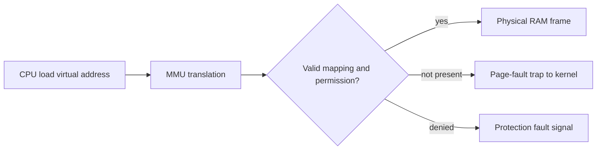
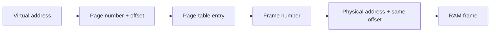
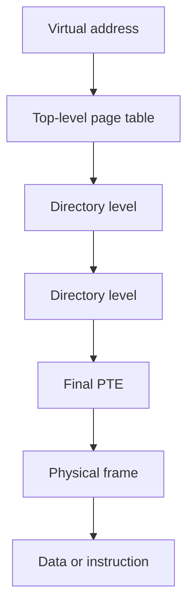
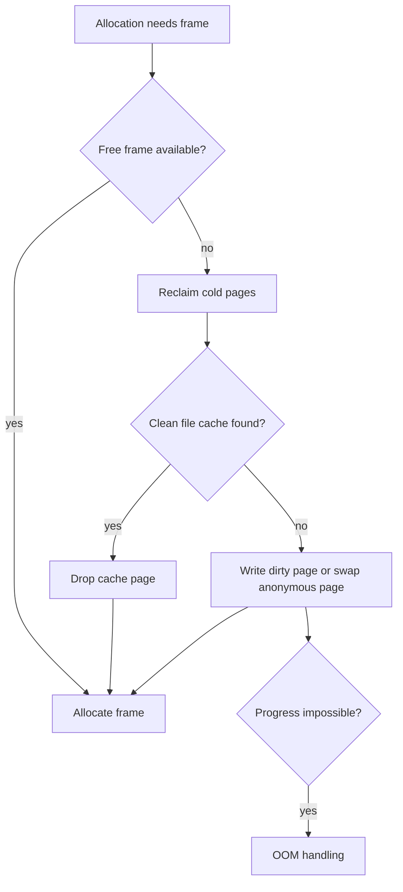

# Operating-System Memory Management

Memory management gives each process the illusion of a large, private, contiguous address space while sharing finite RAM safely and efficiently.
It sits between CPU address generation, memory hardware, files, and storage, so interview questions use it to connect virtual addresses, page faults, caches, replacement policies, and production failures such as thrashing or the Linux OOM killer.
The useful goal is not to memorize page-table acronyms but to follow exactly what happens when an instruction loads an address that is present, absent, protected, or under memory pressure.

---

## 🟢 Beginner Level

### Virtual Addresses Are an Isolation Contract

An application uses virtual addresses, also called logical addresses.
RAM hardware uses physical addresses.
The memory-management unit, or MMU, translates a permitted virtual address into a physical location before the CPU reads or writes data.
Each process has mappings that make its address space appear private.

Two unrelated processes can both use virtual address `0x400000`.
Those addresses can map to different physical frames, or one mapping can intentionally share a read-only program page.
A process cannot simply choose a physical address and read another process's private heap.
The processor checks mapping validity and permissions as part of translation.

Virtual memory is therefore an isolation and abstraction mechanism, not merely a trick for using disk as extra RAM.
It lets the kernel map program code, shared libraries, files, anonymous heap pages, stacks, and device memory using one address-space model.
It also lets the kernel remove or delay mappings until the process actually needs them.

### Contiguous Allocation and Fragmentation

Early systems could place each process in one physically contiguous memory region.
Fixed partitions make allocation simple but waste unused bytes inside a selected partition, called internal fragmentation.
Variable partitions fit a request more closely but leave holes between allocations, called external fragmentation.
Compaction can combine holes but requires moving data and updating references or relocation state.

Paging avoids the need for one contiguous physical allocation.
It divides virtual memory into fixed-size pages and RAM into equal-sized frames.
Any free frame can hold any page, so holes do not prevent a large virtual allocation.
The final partly used page can still have internal fragmentation.

### Pages, Frames, and the Page Table

With 4 KiB pages, a virtual address has a virtual page number and a 12-bit offset.
The page number selects a page-table entry, or PTE.
The PTE supplies a physical frame number plus state such as present, writable, executable, accessed, and dirty bits.
The frame number is combined with the unchanged offset to form the physical address.

The offset is unchanged because page and frame sizes match.
Only the containing page is relocated.
This fixed-size design simplifies allocation and protection, but page tables themselves consume memory and translation can require additional memory accesses.

### What a Page Fault Means

A page fault is a processor trap raised because the current mapping cannot be used for the requested access.
It is not always an application bug.
A valid but non-present anonymous page may fault the first time it is touched, allowing the kernel to allocate a zeroed physical frame lazily.
A file-backed page may fault because its data must be read through the page cache from storage.

An invalid address, an attempt to write a read-only mapping, or an execution attempt on a non-executable page is a different kind of fault.
The kernel normally delivers a signal such as `SIGSEGV` or `SIGBUS` when it cannot resolve that fault for the process.
The word “fault” therefore describes a control transfer, not necessarily a crash.

---

## 🟡 Intermediate Level

### Translation Lookaside Buffers

The TLB is a small, fast hardware cache of recent virtual-page-to-physical-frame translations.
On a TLB hit, the processor can translate without walking page tables in ordinary memory.
On a TLB miss, hardware or software walks one or more page-table levels and fills a TLB entry if translation succeeds.
The TLB is crucial because every load and instruction fetch needs address translation.

With a 4 KiB page, 512 TLB entries cover about $512 \times 4096 = 2$ MiB of memory at a time.
Larger pages increase TLB reach, which can help a database scan or virtual machine workload.
They can also waste memory and make reclamation or copy-on-write coarser.
The best page size depends on locality, allocation shape, and latency requirements.

### Worked Example: Effective Translation Time

Assume a TLB hit requires 10 ns and an ordinary RAM access after translation requires 100 ns.
For this simplified model, a TLB hit costs $10 + 100 = 110$ ns.
On a TLB miss, a single-level page-table access plus the data access costs $100 + 100 = 200$ ns, ignoring the small TLB lookup cost.
Assume a 99% hit ratio.

The effective access time is:

$$0.99 \times 110\text{ ns} + 0.01 \times 200\text{ ns} = 108.9\text{ ns} + 2\text{ ns} = 110.9\text{ ns}$$

At a 90% hit ratio, the same model becomes $0.90 \times 110 + 0.10 \times 200 = 119$ ns.
The 9.1 ns difference matters because it applies to a large fraction of instructions and data loads.
Real CPUs have multi-level TLBs, page-walk caches, out-of-order execution, and overlapping memory operations, but the arithmetic shows why locality matters.

### Multi-Level Page Tables

A flat page table for a large virtual address space would reserve entries for huge unused regions.
Multi-level tables allocate lower-level table pages only for populated address ranges.
On typical 64-bit x86 systems using 4 KiB pages, address bits are split among several levels and the offset.
The exact number of active levels varies with hardware and kernel configuration, including five-level paging support.

Each page-table page contains entries that point to the next level or, at the final level, a mapped physical page.
This reduces memory use for sparse address spaces such as a process with a small heap and a few shared libraries.
It makes a TLB miss potentially more expensive because a walk reads several levels.
Hardware page-walk caches and locality of page-table pages reduce that cost in common cases.

The hierarchy is not a chain searched linearly by page number.
Different bit fields index each level directly.
An absent upper-level entry proves that a whole region of the virtual address space has no mapping.

### Demand Paging and the Fault Path

Demand paging allocates or reads a page when a process first accesses it instead of eagerly loading all possible pages.
This improves startup time and lets RAM hold the working sets of more processes.
It also means the first touch of a page has far higher latency than an ordinary memory reference.
For disk-backed data, a major fault can wait on storage; for already cached data, a minor fault can be resolved without disk I/O.

When a valid non-present page faults, the kernel verifies access rights and locates the backing source.
It obtains a free frame or chooses a victim page if memory is under pressure.
It reads or initializes the page, updates the PTE, invalidates or updates relevant TLB state, and restarts the faulting instruction.
The instruction does not need application code to manually retry.

Copy-on-write uses this path intentionally.
After `fork`, parent and child can initially map the same physical pages as read-only.
When one writes a shared page, a protection fault lets the kernel copy that page, change the writer's mapping, and preserve the other process's original data.
This makes process creation cheaper when the child soon executes another program.

### Replacement Policies and Working Sets

When no free frame is available, the kernel must reclaim a page.
The ideal replacement policy would evict the page whose next use is farthest in the future, but that requires future knowledge.
FIFO evicts the oldest resident page and can suffer Belady's anomaly, where adding frames increases faults for a reference pattern.
LRU evicts the least recently used page and approximates temporal locality well, but exact LRU tracking is expensive.

Clock replacement keeps pages in a circular list and uses a reference bit.
It clears a referenced page's bit and advances, selecting a page already observed unused on a later pass.
Operating systems use more sophisticated active/inactive lists and aging approximations rather than a literal textbook list in every path.
The common goal is to keep the current working set resident and evict cold pages cheaply.

| Policy | Choice rule | Strength | Important weakness |
|---|---|---|---|
| FIFO | Oldest loaded page | Minimal metadata | Can show Belady's anomaly |
| Optimal | Farthest future use | Theoretical lower bound | Future is unavailable |
| Exact LRU | Least recent use | Matches locality | High tracking cost |
| Clock | Reference-bit scan | Cheap LRU approximation | Can scan many hot pages |
| Working-set aging | Recent-use history | Adapts to workloads | More implementation complexity |

Global replacement lets one process take frames that another process used.
It can improve total throughput but make an individual process's latency unpredictable.
Local replacement protects a process's allocation but can leave freeable memory unused elsewhere.
Modern kernels balance global reclaim with cgroup and memory-policy controls rather than following one classroom rule exclusively.

### Thrashing and Memory Pressure

Thrashing occurs when processes spend a large share of time handling page faults and reclaim instead of executing useful instructions.
Adding more runnable processes can make it worse because each loses part of its working set.
Disk or swap I/O grows, CPU utilization can paradoxically fall, and latency becomes unstable.
The remedy is often reducing concurrency, adding memory, reducing allocation, or limiting a noisy workload rather than tuning one replacement bit.

Linux exposes memory pressure through counters, pressure-stall information, reclaim activity, swap I/O, and cgroup events.
A rising fault count alone is not proof of trouble because lazy allocation produces harmless minor faults.
Investigate major faults, reclaim, swap traffic, CPU idle time, and the application's allocation behavior together.

---

## 🔴 Expert Level

### Linux Mappings, Page Cache, and Reclaim

Linux represents a process's address space as virtual memory areas with permissions and backing information.
Anonymous mappings back heap-like pages with swap or zero-fill behavior.
File-backed mappings and ordinary file I/O use the page cache, allowing cached file pages to be shared between readers and mappings.
Modified cached pages become dirty and later write back to storage.

The page cache is useful RAM, not automatically waste.
Under memory pressure, clean cache pages can be reclaimed because their authoritative contents remain in the file system.
Dirty pages need writeback before they can be reclaimed safely.
Confusing available memory with unused memory leads to needless cache-clearing scripts that slow the next file access.

Linux reclaim balances anonymous and file-backed pages based on reclaimability and configured policy.
Swapping anonymous pages can free RAM but adds latency on later access.
Dropping a clean file page is often cheaper because it can be read again from its file, though storage latency can still be substantial.
Memory cgroups add per-workload accounting and limits so one container can be constrained without treating the entire host as one pool.

### Huge Pages, NUMA, and Locality

Standard pages are commonly 4 KiB on x86-64.
Huge pages such as 2 MiB reduce the number of TLB entries needed for a large contiguous region.
Transparent Huge Pages can promote eligible mappings automatically, while explicit huge pages reserve or request a special pool depending on configuration.
They can help large scans and some virtual machines, but compaction, latency spikes, fragmentation, and copy-on-write amplification make them workload-specific.

NUMA systems attach memory more closely to particular CPU sockets or nodes.
Accessing local node memory is generally lower latency and higher bandwidth than accessing remote node memory over an interconnect.
The scheduler and allocator try to preserve locality, but thread migration, first-touch allocation, and uneven load can create remote accesses.
Pinning everything manually can make load balance worse, so profile locality before applying `numactl` or CPU affinity.

For a process that allocates 16 GiB on one NUMA node but runs worker threads across two sockets, the remote half can pay additional latency repeatedly.
First-touch placement means the thread that faults a page first often influences which node supplies it.
Parallel initialization that matches later worker placement can improve locality more safely than a global hard pin.
Measure with NUMA statistics and hardware counters rather than assuming every multi-socket issue is NUMA.

### Overcommit, OOM, and Commit Accounting

Linux can permit virtual-memory reservations larger than immediately available RAM and swap according to overcommit policy.
This supports sparse mappings and workloads that reserve address space but touch only part of it.
It becomes dangerous when many processes later touch their optimistic reservations at once.
The kernel can invoke the out-of-memory killer when reclaim cannot satisfy an allocation.

The OOM killer selects a victim using a badness score influenced by memory use and policy adjustments.
It is a last-resort recovery mechanism, not normal capacity management.
In a containerized deployment, a cgroup memory limit can trigger an OOM event for one workload even when host-wide free memory appears available.
Inspect cgroup events, limits, request allocation traces, and swap policy before raising a limit blindly.

Applications should set realistic heap and native-memory budgets.
The JVM heap is not the whole process: direct buffers, thread stacks, code cache, metaspace, shared libraries, and allocator fragmentation also count toward a container limit.
Leave headroom and monitor resident memory rather than assuming `-Xmx` equal to the cgroup limit is safe.

### Security, Permissions, and Fault Diagnosis

PTE permission bits enforce read, write, execute, and user-versus-kernel access rules.
Non-executable data mappings support defenses such as NX or DEP by preventing injected data from being executed as instructions.
Address-space layout randomization changes mapping locations to make exploitation harder, while still relying on permission checks for fundamental isolation.
Guard pages can turn stack overflows and invalid boundary accesses into faults before adjacent data is silently corrupted.

Diagnose a segmentation fault by identifying the faulting address, access type, thread, mapping, and native or managed stack.
An address near zero often suggests a null-derived pointer in native code, but do not infer a cause from that pattern alone.
Use core dumps, sanitizers for native components, JVM crash logs, and mapping information rather than adding a blanket signal handler that hides evidence.

### Reclaim and Writeback Under Pressure

When an allocation cannot be satisfied from a free list, the kernel first attempts reclaim.
It can drop clean file-cache pages because those contents can be read again from their backing files.
It can write dirty file-cache pages back to storage before reclaiming them.
It can swap eligible anonymous pages when swap is configured and policy permits it.
Only after reclaim and other recovery paths fail does an OOM decision become likely.

The diagram simplifies multiple Linux LRU generations, shrinkers, writeback queues, and cgroup decisions.
It is still useful because it shows why dirty data and anonymous memory are more expensive to reclaim than clean cache.
Writing dirty pages can create long tail latency if storage is saturated.
Swapping can preserve availability but shifts latency to the next access of the evicted page.

Dirty-page thresholds control when background writeback begins and when writers are throttled.
If a workload dirties memory faster than storage can flush it, allowing unlimited dirty cache postpones rather than solves the bottleneck.
The application may later experience stalls when it is forced to write back before making progress.
Monitor dirty memory, writeback throughput, storage queue depth, and request latency together.

### Cgroups, Containers, and Memory Protection

Memory cgroups account memory use by workload and can impose limits, high-water marks, and reclaim pressure independently of the host total.
This isolates one tenant or container from consuming every available frame.
It also means `free` inside one host view can look healthy while a constrained workload receives memory pressure or is OOM-killed.
The relevant diagnosis starts with the cgroup limit, current usage, peak usage, event counters, and swap settings.

Set an application memory budget below the hard cgroup limit.
Reserve room for kernel accounting, native allocations, temporary buffers, page faults, and runtime behavior during garbage collection.
For the JVM, reduce thread stack count or direct-buffer capacity when those are the observed costs; do not always lower heap first.
For native services, inspect allocator arenas, mappings, and retained caches because RSS alone does not identify the owning subsystem.

Memory protection settings can prioritize essential workloads during contention.
They are not a substitute for capacity planning, because protected workloads still require real frames and can displace less important work.
Define an explicit degradation order: reject optional work, shrink caches, shed background jobs, then protect critical request paths.
This makes memory pressure a controlled operational mode rather than a surprise process kill.

### A Practical Fault-Investigation Sequence

Start with the symptom and timestamp: latency, OOM event, fault, swap, or unexplained RSS growth.
Check whether the issue is host-wide or cgroup-local, then inspect available memory, page-fault rates, swap, pressure-stall time, and I/O waits.
Separate virtual size from resident size and anonymous memory from file cache.
The conclusions differ sharply when a process reserves 100 GiB sparsely versus actually retains 100 GiB of anonymous pages.

Capture an allocation profile or heap dump only with a production-safe plan.
Large diagnostic captures can themselves consume memory, CPU, and storage during an incident.
Use sampling, bounded retention, and a representative staging replay where possible.
After remediation, validate not only average memory use but also the highest concurrent load, restart behavior, and tail latency under reclaim.
Record the baseline before the change so a later kernel, runtime, or workload change has a meaningful comparison point.
Treat a reduction in fault count as useful only when useful work and latency remain acceptable.
This prevents an optimization from merely moving pressure to a different resource.
Memory behavior is a system property spanning allocator, kernel, storage, and workload policy.

### Common Misconceptions

1. **"Virtual memory means RAM plus disk with the same performance."**
   *Correction*: Virtual memory gives mapping and isolation semantics; disk-backed fault resolution is orders of magnitude slower than RAM. Swap can prevent an immediate failure but can also create severe tail latency.

2. **"Every page fault reads from disk."**
   *Correction*: A minor fault can allocate a zero page, perform copy-on-write, or map data already resident in page cache. Major faults involve I/O, so the distinction matters during diagnosis.

3. **"Free memory is the only useful memory."**
   *Correction*: Linux uses otherwise idle RAM for page cache and reclaims it under pressure. Low free memory without reclaim pressure or swapping is not automatically a problem.

4. **"Huge pages always improve performance."**
   *Correction*: They increase TLB reach but can cause fragmentation, compaction stalls, and coarser allocation behavior. Their effect depends on access pattern and latency tolerance.

5. **"An OOM kill proves the JVM heap was too large."**
   *Correction*: Heap size is only one contributor to a process's resident and committed memory. Native buffers, thread stacks, cgroup limits, and concurrent allocation can trigger the event too.

### Interview Questions

**Q1. What is the difference between a virtual address and a physical address?** `[easy]`

A virtual address is the address an instruction uses within a process's isolated address space. A physical address identifies actual RAM after the MMU translates an allowed mapping. The translation and permission checks stop one ordinary process from directly reading another process's private memory.

**Q2. Why does paging avoid external fragmentation?** `[easy]`

Paging uses fixed-size virtual pages and physical frames, so a process's pages can occupy any free frames rather than one contiguous region. Small holes are still usable as individual frames. The final partly filled page can still waste space internally.

**Q3. What is a TLB and why is it important?** `[easy]`

The TLB is a hardware cache of recent virtual-to-physical translations. It avoids a multi-level page-table walk for common accesses, which is vital because nearly every instruction fetch and load needs translation. A low hit rate can add latency across the entire program even when RAM itself is fast.

**Q4. What is the difference between a minor and major page fault?** `[easy]`

A minor fault is resolved without waiting for disk, such as zero-fill allocation, copy-on-write, or mapping an already cached file page. A major fault requires storage I/O to obtain data that is not resident. Both are traps, but only major faults usually imply substantial latency.

**Q5. How does demand paging work after a valid non-present page is accessed?** `[medium]`

The processor traps to the kernel, which checks that the access is valid and locates the backing source. The kernel obtains or reclaims a frame, initializes or reads the page, updates the PTE and translation state, then restarts the faulting instruction. The application normally observes only the extra latency unless the fault cannot be resolved.

**Q6. Why is `count` of page faults alone not sufficient to diagnose memory trouble?** `[medium]`

Lazy allocation produces many harmless minor faults during normal startup and heap growth. Trouble is more strongly indicated by major faults, reclaim scans, swap I/O, pressure-stall time, and rising request latency together. The workload's allocation rate and working-set size explain whether faults are expected or destructive.

**Q7. Compare FIFO, LRU, and Clock replacement.** `[medium]`

FIFO evicts the oldest resident page and is simple but can evict useful pages and show Belady's anomaly. LRU follows temporal locality well but exact recency tracking is costly. Clock uses reference bits and a circular scan to approximate LRU cheaply, which is closer to practical kernel behavior.

**Q8. What is copy-on-write after `fork`?** `[medium]`

Parent and child initially share physical pages marked so a write traps. When either writes, the kernel allocates and copies only that page for the writer, preserving the other process's view. This avoids eagerly copying a large address space when a child soon calls `exec`.

**Q9. Why can a process thrash even though the CPU is not fully utilized?** `[medium]`

It may be waiting for page-in and writeback I/O because its working set no longer fits in available RAM. More runnable work can steal frames and create more faults, so useful CPU execution falls while the system does reclaim and I/O. Reduce pressure or concurrency rather than adding still more work.

**Q10. What is the page cache and why should it not be cleared routinely?** `[medium]`

The page cache retains file data in RAM so later reads and mappings avoid storage I/O. Clean cached pages are reclaimable when applications need memory, so they are useful capacity rather than waste. Clearing cache discards locality and usually makes the next workload slower without solving an underlying memory leak.

**Q11. How do huge pages change the TLB trade-off?** `[medium]`

Each huge-page translation covers more bytes, increasing TLB reach and reducing translation pressure for large contiguous access patterns. The cost is coarser allocation, possible fragmentation, and potentially expensive compaction or copy-on-write. Use them after measurement, especially on latency-sensitive systems.

**Q12. Scenario: a service p99 latency spikes and disk activity rises after traffic increases, while CPU is only 35% busy. What do you investigate?** `[hard]`

Check major faults, swap reads and writes, reclaim activity, memory pressure-stall metrics, and working-set growth. The service may be thrashing: CPU is idle because threads wait for memory-related I/O rather than doing useful work. Reduce concurrency or memory demand, find a leak or cache growth, and add RAM only after confirming the capacity model.

**Q13. Scenario: a JVM container is OOM-killed even though `-Xmx` is below the container limit. What are likely missing costs?** `[hard]`

Account for direct buffers, thread stacks, metaspace, code cache, native libraries, allocator overhead, and temporary duplication during GC or copying. Verify the cgroup's actual memory limit and event counters, because a container limit can differ from host-wide memory availability. Lower heap to leave headroom, reduce native consumers, and monitor resident memory by category.

**Q14. Scenario: an analytics query is slower after moving from one socket to a two-socket NUMA server. What do you test?** `[hard]`

Measure local versus remote memory access, CPU placement, first-touch allocation, and thread migration before forcing affinity. A data set allocated mostly on one node can make workers on the other node repeatedly pay remote-memory latency. Initialize data in parallel with intended workers or apply targeted NUMA policy only when measurements confirm locality is the bottleneck.

### Further Reading

- [Linux kernel memory-management documentation](https://docs.kernel.org/admin-guide/mm/index.html) covers Linux virtual memory, reclaim, and related controls.
- [Linux kernel page-table documentation](https://docs.kernel.org/mm/page_tables.html) explains page tables and address translation in kernel terms.
- [Linux kernel OOM documentation](https://docs.kernel.org/mm/oom.html) describes OOM selection and tuning behavior.
- [Intel 64 and IA-32 software developer manuals](https://www.intel.com/content/www/us/en/developer/articles/technical/intel-sdm.html) are the primary hardware reference for paging and translation behavior.
