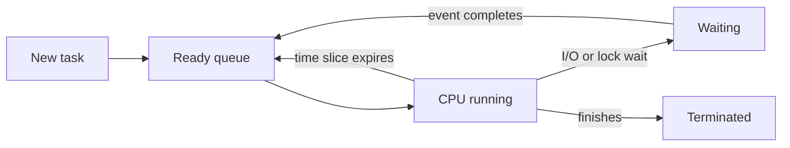
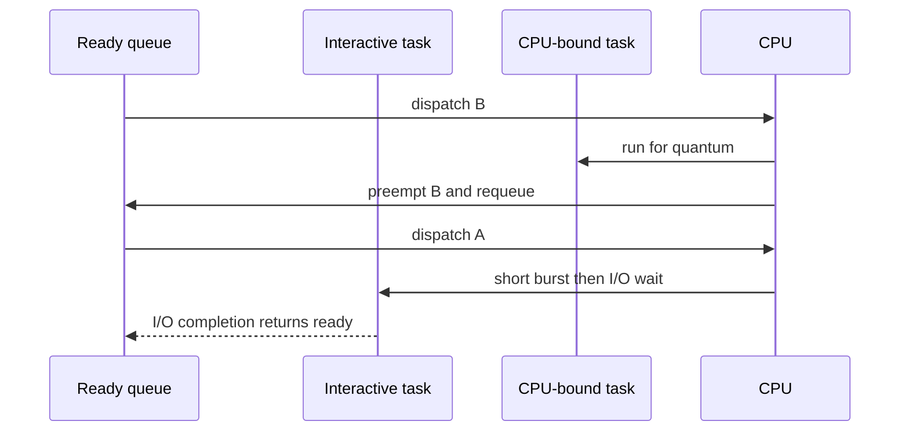
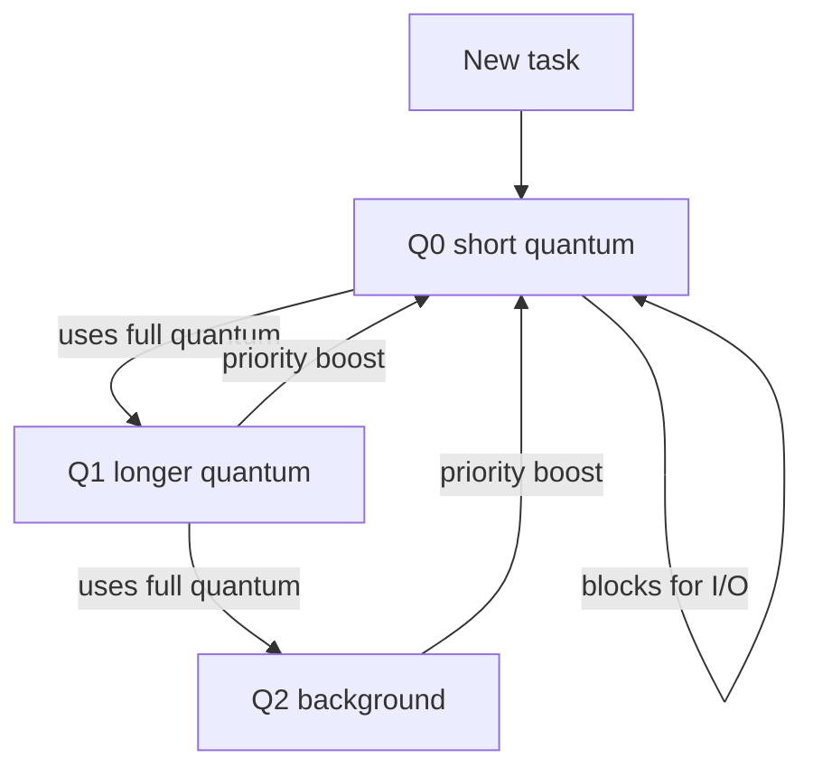
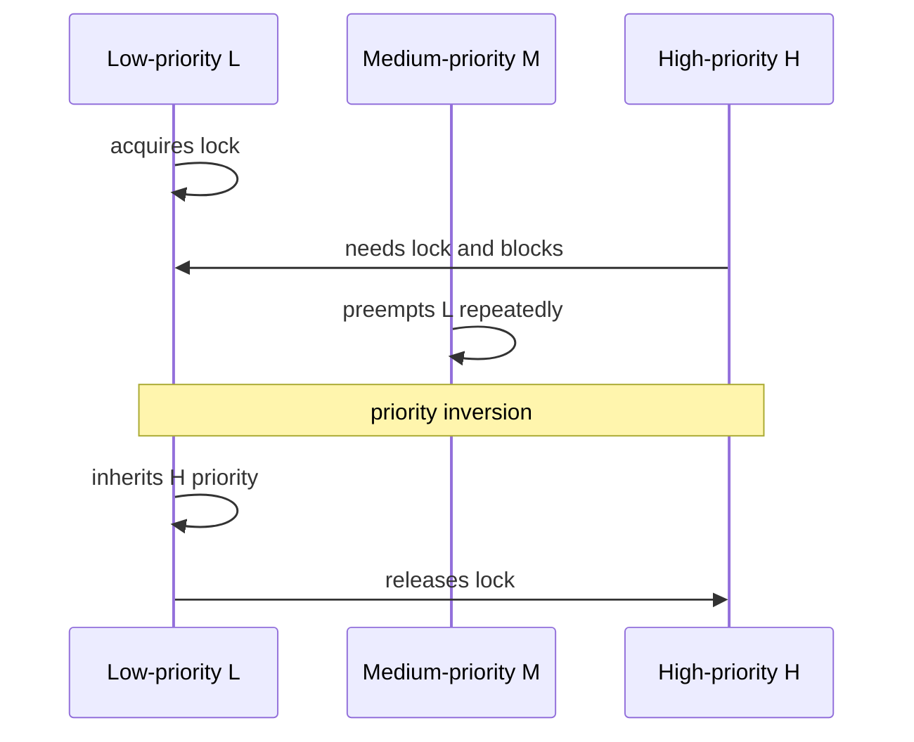

# CPU Scheduling: Fairness, Latency, and Throughput

CPU scheduling decides which runnable thread receives a processor next and for how long. It connects user-visible responsiveness with kernel policy, cache behaviour, I/O waits, and real-time deadlines. Interviewers use scheduling questions to test precise metrics, preemption trade-offs, and the difference between a textbook algorithm and a production operating-system scheduler.

---

## 🟢 Beginner Level

### Why a scheduler exists

A processor executes one instruction stream per hardware core at a time.

Many more processes and threads may be ready to run.

The scheduler selects work from a run queue and gives it CPU time.

When a task blocks for I/O, finishes, yields, or is preempted, another runnable task can run.

This keeps the system useful while applications wait for disks, networks, locks, and user input.

The long-term scheduler controls which jobs enter a system in batch environments.

The medium-term scheduler may suspend or swap tasks under memory pressure.

The short-term CPU scheduler runs frequently and chooses the next runnable task.

The dispatcher performs the context switch.

Context switching saves registers, stack state, and scheduling bookkeeping before restoring another task.

### Metrics describe different goals

No single policy optimises every workload goal.

| Metric | Definition | Why it matters |
|---|---|---|
| CPU utilisation | Fraction of time a CPU performs useful work | Idle CPU may indicate no work or poor I/O overlap |
| Throughput | Jobs completed per unit time | Important for batch work |
| Turnaround time | Completion time minus arrival time | Measures end-to-end batch delay |
| Waiting time | Time spent ready but not running | Exposes queueing delay |
| Response time | First run time minus arrival time | Matters to interactive users |
| Fairness | Comparable service for comparable tasks | Prevents starvation |

Turnaround includes CPU execution, ready-queue waiting, and blocking time.

Response time stops at the first CPU service.

A text editor can have excellent response time even when a long background compile has poor turnaround.

Throughput can improve while tail response time becomes unacceptable.

Every scheduling claim should say which metric it improves.

### Preemption and CPU bursts

A non-preemptive scheduler lets a running task keep the CPU until it blocks or exits.

A preemptive scheduler can interrupt it when a timer fires or more urgent work arrives.

Preemption improves responsiveness and priority handling.

It also adds context-switch overhead and cache disruption.

A CPU burst is a period of computation between I/O waits.

I/O-bound tasks often have short CPU bursts and frequent waits.

CPU-bound tasks have long bursts and tend to consume whole time quanta.

Good interactive policies tend to reward tasks that block early for input or I/O.

They must still ensure CPU-bound work eventually makes progress.

---

## 🟡 Intermediate Level

### FCFS, SJF, SRTF, and priority

First-Come, First-Served runs tasks in arrival order.

It is simple and fair by arrival order.

It can cause the convoy effect, where many short jobs wait behind one long CPU-bound job.

Shortest Job First selects the smallest next CPU burst.

With exact burst knowledge, non-preemptive SJF minimises average waiting time among available jobs.

Operating systems estimate bursts from past behaviour because future execution time is unknown.

Shortest Remaining Time First is the preemptive version.

It can interrupt a long job when a shorter remaining job arrives.

Priority scheduling runs the highest priority task first.

It risks starvation when lower-priority tasks never outrank incoming urgent work.

Aging gradually improves the priority of waiting tasks.

| Algorithm | Preemptive? | Main strength | Main risk |
|---|---|---|---|
| FCFS | No | Very simple | Convoy effect |
| SJF | No | Low average waiting with known bursts | Future burst unknown |
| SRTF | Yes | Favors short work quickly | Frequent preemption |
| Priority | Either | Expresses importance | Starvation |
| Round Robin | Yes | Good interactive fairness | Quantum overhead |
| MLFQ | Yes | Adapts to behaviour | Harder to tune |

### Worked example: calculate FCFS and Round Robin

Assume three processes all arrive at time `0`.

Their CPU bursts are P1 = `10 ms`, P2 = `4 ms`, and P3 = `2 ms`.

Under FCFS in that order, P1 runs from 0 to 10.

P2 runs from 10 to 14.

P3 runs from 14 to 16.

P1 waits `0 ms`.

P2 waits `10 ms`.

P3 waits `14 ms`.

Average waiting time is `(0 + 10 + 14) / 3 = 8 ms`.

The completion times are 10, 14, and 16.

Average turnaround time is `(10 + 14 + 16) / 3 = 13.33 ms`.

Now use Round Robin with a quantum of `2 ms`.

The timeline is P1 from 0 to 2, P2 from 2 to 4, P3 from 4 to 6, P1 from 6 to 8, P2 from 8 to 10, then P1 from 10 to 16.

P3 completes at time 6.

P2 completes at time 10.

P1 completes at time 16.

Waiting equals turnaround minus CPU burst because there is no I/O in this example.

P1 waits `16 - 10 = 6 ms`.

P2 waits `10 - 4 = 6 ms`.

P3 waits `6 - 2 = 4 ms`.

Average waiting time is `(6 + 6 + 4) / 3 = 5.33 ms`.

Round Robin greatly improves P3's first response: it starts at time 4 instead of time 14.

```mermaid
gantt
    title Round Robin schedule, quantum 2 ms
    dateFormat X
    axisFormat %L
    section CPU
    P1 :p1a, 0, 2
    P2 :p2a, 2, 4
    P3 :p3, 4, 6
    P1 :p1b, 6, 8
    P2 :p2b, 8, 10
    P1 :p1c, 10, 16
```

The better average here does not mean Round Robin always wins.

Each quantum boundary has context-switch cost and disrupts warmed caches.

### Round Robin quantum selection

A very large quantum makes Round Robin behave like FCFS.

A very small quantum gives quick initial response but spends more time switching.

If a switch costs `10 microseconds` and a quantum is `100 microseconds`, up to roughly 10 percent of CPU time can be lost to switching before cache effects.

If the quantum is `10 ms`, that direct overhead is much smaller but interactive tasks can wait longer behind peers.

The right value depends on workload, core count, cache effects, and latency targets.

The old rule that 80 percent of bursts should fit inside the quantum is a useful intuition, not a universal tuning law.

Measure p95 and p99 response alongside context switches per second.

### Multilevel feedback queues

MLFQ has several ready queues with different priorities and time quanta.

New tasks commonly begin at the highest priority.

A task that uses a whole quantum is treated as more CPU-bound and demoted.

A task that blocks quickly can remain high priority, supporting interactive responsiveness.

Periodic priority boosts return waiting tasks to the top and prevent starvation.

MLFQ does not know task burst length in advance.

It learns an approximation from observed behaviour.

Its policies must defend against a task gaming the scheduler by yielding just before quantum expiry.

Modern implementations track actual CPU consumption rather than relying only on voluntary yield timing.

---

## 🔴 Expert Level

### Fair scheduling and Linux CFS concepts

Linux's Completely Fair Scheduler historically models fair sharing by tracking virtual runtime for normal tasks.

Virtual runtime grows faster for lower-weight tasks and slower for higher-weight tasks.

The scheduler chooses tasks with the smallest virtual runtime so tasks converge toward their weighted CPU share.

Runnable tasks are stored in an ordered tree, giving selection and insertion logarithmic complexity in runnable-task count.

Nice values influence weight rather than representing a fixed millisecond time slice.

For two equal-weight runnable tasks on one core, each trends toward about half the available CPU.

For a task with twice the weight, its ideal share is roughly two thirds against one equal baseline task.

The exact implementation and scheduler extensions vary across kernel versions.

Read the target kernel documentation rather than assuming one historical default applies everywhere.

### Real-time scheduling and priority inversion

Real-time policies care about deadline behaviour, not merely average waiting time.

Rate Monotonic assigns fixed higher priority to tasks with shorter periods.

Earliest Deadline First dynamically prefers the task with the nearest deadline.

Priority inversion occurs when high-priority H waits for a lock held by low-priority L.

A medium-priority M can then run repeatedly, preventing L from running to release the lock.

Priority inheritance temporarily boosts L while it holds the resource needed by H.

Priority ceiling protocols impose stronger rules for bounded blocking in some real-time systems.

Do not confuse priority inversion with ordinary high-priority CPU use.

The defining feature is a resource dependency through a lower-priority owner.

### Multiprocessor scheduling and affinity

On multiprocessor systems, each CPU may have a local run queue.

Local queues reduce shared-lock contention.

Load balancing moves tasks when one CPU is overloaded while another is idle.

Processor affinity keeps a task on the same CPU when possible.

That preserves warm L1 and L2 cache contents and reduces migration cost.

Hard affinity forbids running on other selected CPUs.

Soft affinity is a preference that balancing may override.

NUMA systems add memory-locality concerns because remote memory access is slower than local node access.

The scheduler must balance fairness, cache locality, and total utilisation.

### Production scheduling diagnostics

High load average does not prove all CPUs are doing useful computation.

On Linux, tasks in uninterruptible I/O sleep can contribute to load average.

Inspect CPU utilisation, run-queue pressure, context-switch rate, steal time, and blocked I/O separately.

Thread-pool queues are application-level scheduling layers and can dominate latency before the kernel scheduler is involved.

Do not create more runnable application threads than the dependency and CPU budget can support.

For CPU-bound work, a bounded pool near available cores is often a sound starting point.

For blocking work, capacity depends on blocking ratio and downstream limits rather than only core count.

### Common Misconceptions

1. **"SJF is always the best practical scheduler."**
   *Correction*: It is optimal for average waiting only under assumptions including known burst times. Real systems estimate bursts, serve interactive workloads, and must protect fairness and deadlines.

2. **"Round Robin is fair if every task gets the same quantum."**
   *Correction*: Equal quanta ignore task weights, I/O behaviour, core topology, and context-switch cost. Fairness is a policy decision about which tasks deserve what share.

3. **"A high priority task can never be delayed by low priority work."**
   *Correction*: A low-priority task can hold a lock required by high-priority work. Priority inheritance exists specifically to reduce that inversion.

4. **"More threads always improve CPU throughput."**
   *Correction*: Too many runnable threads create scheduling, cache, and locking overhead. Throughput can fall when run queues and shared resources are saturated.

5. **"Load average is CPU percentage."**
   *Correction*: Load average approximates runnable and certain uninterruptible tasks over time. It must be interpreted with core count, I/O state, and CPU metrics.

### Interview Questions

**Q1. What is the difference between turnaround time and response time?** `[easy]`

Turnaround time is the total time from arrival to completion, including all CPU, waiting, and I/O phases. Response time ends when the task first receives CPU service or produces its first response. Interactive systems often optimise response even if background turnaround worsens.

**Q2. What is the convoy effect in FCFS?** `[easy]`

The convoy effect happens when a long CPU-bound task at the front makes many short tasks wait behind it. Short I/O-bound jobs cannot run soon enough to issue their I/O, so devices and CPUs may be underused in sequence. Preemptive or short-job-aware policies reduce this problem at the cost of scheduling complexity.

**Q3. Why is SJF difficult to implement exactly?** `[easy]`

SJF needs the next CPU burst length before running the task. Operating systems do not know future program behaviour, so they estimate from past bursts or use feedback policies. Incorrect estimates can make it less fair or less effective than its optimal textbook result suggests.

**Q4. What does preemption cost?** `[easy]`

Preemption requires saving one task's execution state and restoring another's, which takes CPU time. It can also evict useful cache and translation entries, increasing later execution cost. The benefit is better latency and priority responsiveness when that overhead is justified.

**Q5. How do you calculate waiting time in a no-I/O scheduling trace?** `[medium]`

Waiting time equals turnaround time minus the total CPU burst when the process performs no I/O. Turnaround is completion time minus arrival time. In traces with I/O, subtract both CPU service and blocking time to isolate ready-queue waiting.

**Q6. How does Round Robin's quantum affect responsiveness?** `[medium]`

A shorter quantum lets newly ready interactive tasks reach the CPU sooner. It also increases context switches and can reduce useful throughput through direct overhead and cache disruption. A longer quantum reduces switching but approaches FCFS behaviour for latency.

**Q7. How does aging prevent starvation in priority scheduling?** `[medium]`

Aging increases the effective priority of a task as it waits, eventually allowing it to outrank newer higher-priority work. This bounds indefinite postponement while keeping urgent work preferred for short periods. The rate must be tuned so low-priority jobs progress without erasing meaningful priority distinctions.

**Q8. What does MLFQ infer from a task that repeatedly consumes its entire quantum?** `[medium]`

It infers the task is likely CPU-bound because it uses all offered processor time before blocking. The scheduler commonly demotes it to a lower queue with a longer quantum. This protects short interactive bursts, but periodic boosts are needed so CPU-bound work is not starved forever.

**Q9. Why is processor affinity useful?** `[medium]`

Running a task again on the same core can preserve useful cache and TLB state. That reduces memory latency and migration overhead compared with moving it constantly between cores. Excessive affinity can hurt global balancing if other CPUs sit idle, so schedulers normally treat it as a preference.

**Q10. What is priority inversion?** `[medium]`

It is a resource-wait scenario where a high-priority task is blocked by a low-priority lock holder. Medium-priority tasks can then run ahead of the lock holder, extending the high-priority task's delay. Priority inheritance temporarily boosts the holder so it can release the resource sooner.

**Q11. Scenario: an interactive service has low CPU utilisation but users report multi-second first responses during batch work. What do you inspect?** `[hard]`

Inspect run-queue latency, worker-pool queueing, thread priorities, blocking I/O, and whether long CPU bursts are monopolising the available cores. A simple FCFS-like application queue or oversized quantum can delay short requests even while aggregate CPU use looks moderate. Separate the interactive path, use bounded work queues, and measure p99 response after changing scheduling policy.

**Q12. Scenario: a real-time control task misses deadlines while a low-priority logger holds a mutex. What mechanism is relevant?** `[hard]`

This is priority inversion because the urgent task is waiting for a resource owned by lower-priority work. Enable or design priority inheritance or a priority-ceiling protocol for that lock, and minimise the critical section. Also verify that the logger does not perform I/O while holding the mutex because protocol choice cannot compensate for an unbounded critical section.

**Q13. How does CFS approximate weighted fairness?** `[hard]`

CFS tracks a virtual runtime that advances in relation to actual execution and task weight. Tasks with less accumulated virtual runtime are selected so runnable tasks converge toward their configured weighted CPU shares. This is fair-sharing behaviour, not a strict fixed time-slice guarantee, and exact details vary by kernel version.

**Q14. Why can an application with hundreds of threads become slower on eight cores?** `[hard]`

Hundreds of runnable threads compete for only eight execution contexts, increasing context switches, cache misses, and lock contention. More concurrency can also overload downstream services and create application-level queueing. Bound CPU work near core capacity and choose separate limits for blocking operations based on measured dependency capacity.

### Further Reading

- [Linux kernel scheduler documentation](https://docs.kernel.org/scheduler/index.html) describes scheduler classes and Linux scheduling behaviour.
- [Linux CFS design documentation](https://docs.kernel.org/scheduler/sched-design-CFS.html) explains virtual runtime and fair scheduling goals.
- [POSIX scheduling interfaces](https://pubs.opengroup.org/onlinepubs/9699919799/functions/V2_chap02.html) documents priority and scheduling policy concepts.
- [Linux real-time locking documentation](https://docs.kernel.org/locking/rt-mutex-design.html) explains priority inheritance mutexes.
