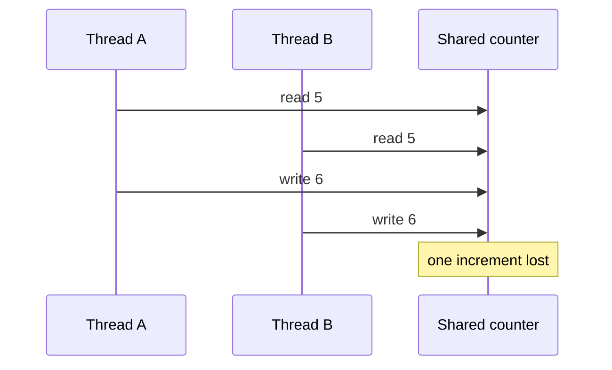
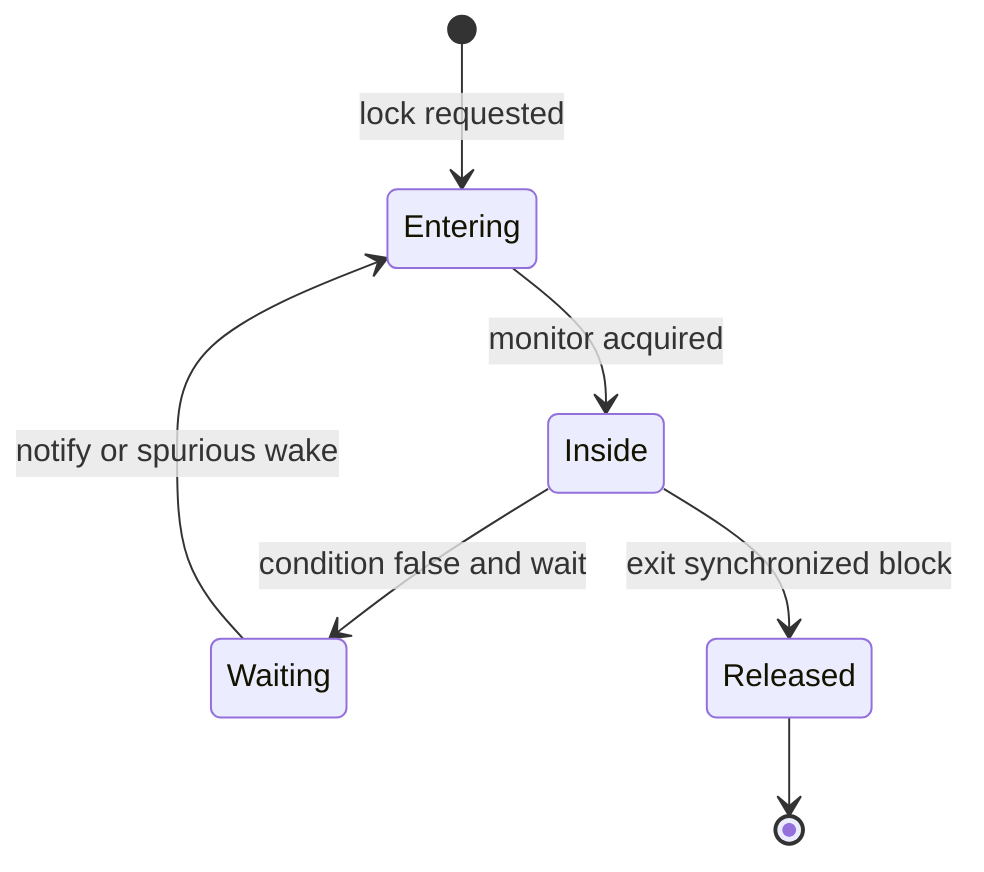
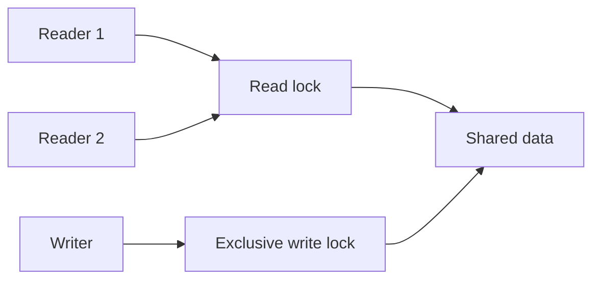
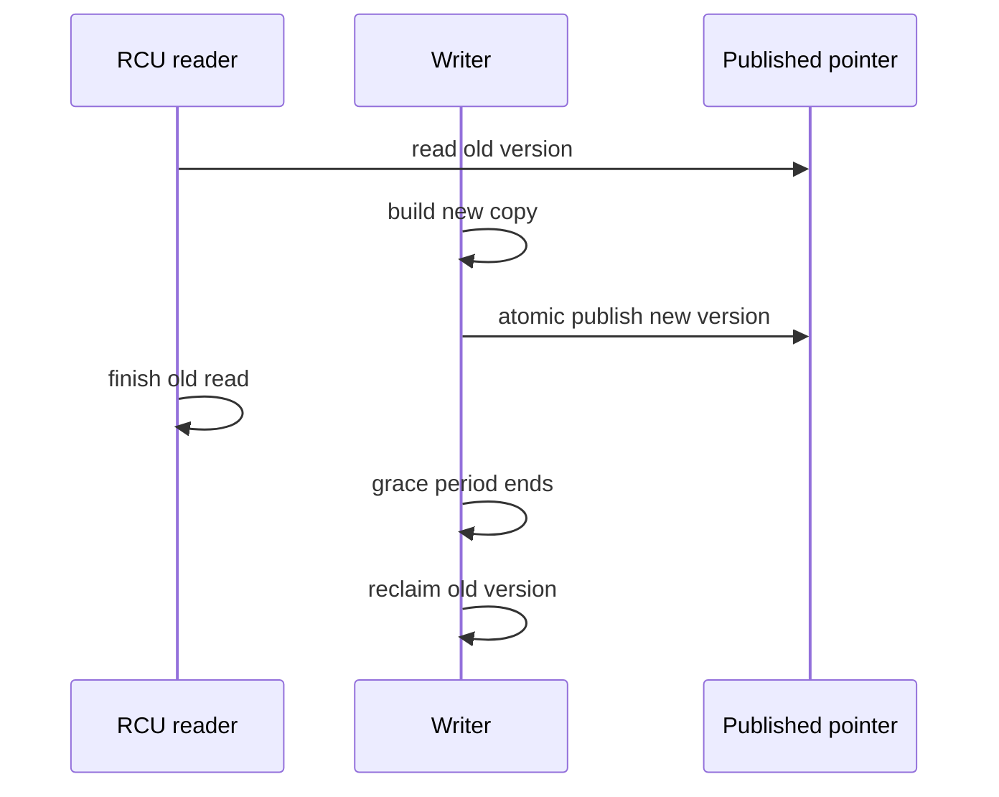

# Process Synchronization: Locks, Semaphores, Atomics, and RCU

Synchronization lets concurrent tasks preserve an invariant while sharing memory or a resource. The hard part is not choosing a lock name; it is defining ownership, memory visibility, failure behaviour, and the time a critical section can hold another task back. Interviewers ask this topic because races, deadlocks, and contention failures often appear only under real load.

---

## 🟢 Beginner Level

### Race conditions and critical sections

A race condition occurs when a result depends on an uncontrolled timing order between concurrent operations.

Assume `counter` starts at 5.

Thread A reads 5.

Thread B reads 5.

Both calculate 6.

Both write 6.

The expected result after two increments was 7.

The actual result is 6 because increment is read, modify, and write rather than one indivisible operation.



A critical section is code that accesses a shared invariant.

Mutual exclusion means at most one task executes that section at a time.

Progress means an available section is eventually granted to an eligible task.

Bounded waiting means a task is not postponed indefinitely by others.

Correctness includes all three, not merely preventing simultaneous writes in one test.

### Locks, mutexes, and semaphores

A mutex represents exclusive ownership.

The task that acquires a normal mutex should release it.

A binary semaphore has a count of zero or one and can also gate one entrant.

A counting semaphore represents a number of interchangeable permits, such as ten database connections.

`wait` or `P` consumes a permit or blocks.

`signal` or `V` returns a permit and wakes an eligible waiter.

| Primitive | Main meaning | Ownership | Useful for |
|---|---|---|---|
| Mutex | One owner enters a critical section | Usually owner releases | Protect object state |
| Binary semaphore | One available permit | Signal may be separate task | Handoff or gate |
| Counting semaphore | N available permits | Permit accounting | Bounded resources |
| Monitor | Lock plus condition queues | Language/runtime managed | Encapsulated shared object |
| Atomic operation | One indivisible memory update | No lock owner | Counters and lock-free building blocks |

Use a mutex when the invariant is owned by one object and the whole change must be exclusive.

Use a semaphore when the real concept is permit capacity or signalling between tasks.

Do not treat a binary semaphore as a drop-in mutex without considering ownership, recursion, priority inheritance, and error handling.

### Monitors and condition variables

A monitor combines mutual exclusion with condition waiting around one shared object.

In Java, `synchronized` uses an intrinsic monitor.

`wait()` releases that monitor and blocks until notification, interruption, or a spurious wakeup.

`notifyAll()` wakes waiting threads, which compete again to reacquire the monitor.

The waiting condition must be tested in a `while` loop.



`if` is unsafe because a notified thread may lose the race to another consumer before it reacquires the lock.

Spurious wakeups are also permitted by many condition APIs.

The predicate, not the notification, is the source of truth.

---

## 🟡 Intermediate Level

### Synchronization primitives and classic problems

Synchronization starts with a **race condition**: two executions overlap so that their uncontrolled order changes the result. The code that reads or changes the shared invariant is the **critical section**, and **mutual exclusion** ensures only one eligible execution occupies it at a time. A correct design also defines progress and bounded waiting; merely making one observed race disappear does not prove the algorithm correct.

A **mutex** is an ownership-bearing lock for an exclusive critical section. A **spinlock** is also exclusive, but a contender repeatedly polls instead of sleeping, so it belongs only around very short, non-blocking work. A **semaphore** models permits: a **binary semaphore** holds zero or one permit, whereas a **counting semaphore** represents a capacity such as eight reusable connections. Unlike a normal mutex, the task that signals a semaphore need not be the task that waited on it.

A **monitor** packages shared state, a lock, and operations that preserve the object's invariant. A **condition variable** lets a monitor owner release the lock atomically and sleep until the state may satisfy a predicate. The waiter must reacquire the lock and test that predicate in a loop because notifications are hints, competing waiters may consume the state, and spurious wakeups are permitted.

The classic problems expose different failure modes rather than prescribing one universal primitive:

| Problem | Shared invariant | Typical coordination | Main failure to prevent |
|---|---|---|---|
| **Producer-consumer** | Occupancy remains between zero and capacity | Empty/full counting semaphores plus a mutex | Overflow, underflow, or sleeping while holding the buffer lock |
| **Readers-writers** | Readers may overlap, but a writer is exclusive | Read-write lock or monitor with condition queues | Reader or writer starvation caused by admission policy |
| **Dining philosophers** | Adjacent philosophers never hold the same fork | Global fork order, waiter semaphore, or monitor | Circular wait, starvation, and livelock |

In the **producer-consumer** problem, producers wait for empty capacity before inserting and consumers wait for a full slot before removing. The **readers-writers** problem separates shared read admission from exclusive write admission, forcing the design to choose fairness explicitly. In **dining philosophers**, letting every philosopher take the left fork before the right fork creates a circular wait; numbering forks and always taking the lower-numbered one first removes that cycle, while a fair queue may still be needed to prevent starvation.

### Worked example: bounded buffer permits

Assume a buffer has capacity 3.

Start with `empty = 3`, `full = 0`, and `mutex = 1`.

Producer A inserts one item.

It decrements `empty` from 3 to 2.

It acquires `mutex`, inserts, releases `mutex`, and increments `full` from 0 to 1.

Producer B repeats that sequence.

The state becomes `empty = 1`, `full = 2`.

Consumer C waits on `full`, changing it from 2 to 1.

It acquires the mutex, removes one item, releases the mutex, and signals `empty` from 1 to 2.

The final buffer contains one item.

```c
semaphore empty = 3;
semaphore full = 0;
mutex lock = 1;

producer(item) {
    wait(empty);
    wait(lock);
    put(item);
    signal(lock);
    signal(full);
}

consumer() {
    wait(full);
    wait(lock);
    item = take();
    signal(lock);
    signal(empty);
}
```

The ordering is essential.

A producer waits for capacity before holding the mutex so it does not block consumers from freeing space.

A consumer signals capacity after removal so another producer can proceed.

If the producer forgets `signal(lock)`, every later task that needs the buffer can block forever.

### Atomic operations and compare-and-swap

Hardware exposes atomic read-modify-write operations such as compare-and-swap, fetch-and-add, and test-and-set.

Compare-and-swap compares a memory location with an expected value.

If equal, it writes a new value atomically and reports success.

If not equal, it reports failure and the caller can retry.

```c
int increment(atomic_int *value) {
    int observed;
    do {
        observed = atomic_load(value);
    } while (!compare_exchange_weak(value, &observed, observed + 1));
    return observed + 1;
}
```

For a counter initially at 100, two threads can race but only one CAS from 100 to 101 succeeds.

The loser observes 101, recalculates 102, and retries.

The final result becomes 102 without a mutex.

This is lock-free if system-wide progress occurs even when one thread stalls.

It is not automatically wait-free because one unlucky thread may retry many times.

Under high contention, CAS retries can burn more CPU than a short lock.

### Memory ordering and visibility

Atomicity does not alone guarantee every desired ordering between memory operations.

CPUs and compilers can reorder independent loads and stores while preserving single-thread behaviour.

Synchronization primitives establish happens-before relationships.

Releasing a lock publishes earlier writes to a task that subsequently acquires that lock.

Release and acquire atomic operations provide a similar directional publication relationship.

Sequential consistency is easier to reason about but can be more expensive on weakly ordered hardware.

Use the language memory model rather than writing raw architecture-specific barriers in application code.

### Readers, writers, and fairness

Readers-writers locks allow multiple readers together but require a writer to be exclusive.

They help when reads are long enough and sufficiently more frequent than writes.

They hurt when read sections are tiny because bookkeeping and contention exceed mutex cost.

Reader-preference can starve writers if readers arrive continuously.

Writer-preference can delay readers during write pressure.

Fair locks trade throughput for bounded queue order.

Choose policy from measured read duration, write urgency, and tail latency.



---

## 🔴 Expert Level

### Spinlocks, blocking locks, and futexes

A spinlock loops while a lock is unavailable.

It avoids a sleep and context switch when the critical section is extremely short and the caller cannot sleep.

It wastes CPU if the owner is descheduled or holds the lock for meaningful work.

A blocking mutex parks the waiting task and lets another task use the processor.

Modern user-space mutexes often use an atomic fast path and a kernel-assisted slow path.

Linux futexes let uncontended locking remain in user space while contended waiters sleep through the kernel.

Never hold a spinlock across I/O, page faults, or a function that can sleep.

Kernel code additionally must consider interrupt context and preemption rules.

### Lock ordering, deadlock, and livelock

Deadlock requires mutual exclusion, hold-and-wait, no preemption, and circular wait.

The simplest prevention technique is a global lock order.

If every path acquires `accountLock` before `ledgerLock`, the opposite cycle cannot form.

Use `tryLock` with timeout only when the retry policy is well understood.

Blind immediate retries can create livelock, where tasks actively back off and collide forever.

Randomised backoff, queueing locks, or a higher-level coordinator can break that pattern.

Keep critical sections small but do not split an invariant across locks merely to reduce apparent hold time.

### ABA and safe reclamation

CAS can suffer the ABA problem.

A thread reads pointer value A.

Another thread changes it to B and later reuses the same address A.

The first CAS sees A again and incorrectly assumes nothing relevant changed.

Tagged pointers add a version counter alongside the address.

Hazard pointers and epoch-based reclamation prevent freeing a node while a reader might still dereference it.

Lock-free algorithms need both atomic update logic and safe memory reclamation.

### Read-Copy-Update for read-mostly data

RCU lets readers traverse a published immutable view without taking a contended lock.

A writer builds a replacement copy, publishes it atomically, then waits for a grace period before freeing the old version.

Readers that began before publication may still use the old copy safely.

Readers that begin after publication use the new copy.



RCU is excellent for read-mostly routing tables, directory entries, and configuration snapshots.

It is not a general replacement for locks when writes are frequent or readers modify shared state.

Linux uses RCU broadly inside the kernel, with specialised APIs and strict rules for read-side critical sections.

### Production failure modes

Lock contention usually appears as throughput collapse and long tail latency before it appears as a clean error.

Measure lock wait time, lock hold time, queue length, and owner stacks.

Do not log or call a remote service while holding a contended lock.

Priority inversion can delay urgent work when a low-priority holder is preempted by medium-priority tasks.

Priority inheritance boosts the holder temporarily so it can release the resource.

Thread-pool starvation can resemble a lock deadlock when every worker waits for work scheduled onto the same saturated pool.

Draw the wait-for graph across executors, connections, locks, and remote calls.

### Common Misconceptions

1. **"A volatile variable makes `count++` safe."**
   *Correction*: Volatile provides visibility and ordering but increment still contains separate read and write steps. Use an atomic increment or a lock for read-modify-write invariants.

2. **"Lock-free means no thread can ever wait."**
   *Correction*: Lock-free means some system-wide operation completes despite a stalled thread. An individual operation can still retry indefinitely under contention.

3. **"A semaphore is always a mutex."**
   *Correction*: A binary semaphore can gate one task, but semaphores model permits and signalling without the same ownership semantics. Mutex features such as priority inheritance and recursive ownership may matter.

4. **"`notify` makes a condition true."**
   *Correction*: Notification only wakes an eligible waiter. The shared predicate must be rechecked under the lock because another task may consume the condition first.

5. **"RCU readers never need rules."**
   *Correction*: RCU readers must follow read-side critical-section and pointer-access discipline. Writers must defer reclamation until the applicable grace period completes.

### Interview Questions

**Q1. What is a race condition?** `[easy]`

A race condition occurs when concurrent operations on shared state produce a result that depends on timing rather than a defined synchronization rule. A read-modify-write increment can lose an update when two threads read the same old value. Protect the full invariant with a lock or use an atomic operation designed for that update.

**Q2. What is the difference between a mutex and a counting semaphore?** `[easy]`

A mutex protects exclusive ownership of a critical section, usually with the acquiring task responsible for release. A counting semaphore tracks multiple permits and is suited to capacity limits or producer-consumer signalling. They can both block callers, but their ownership and correctness rules differ.

**Q3. Why must condition waits use a while loop?** `[easy]`

A wakeup does not guarantee the predicate is now true because another awakened task can consume the resource first. Many APIs also permit spurious wakeups without an application signal. Rechecking the predicate while holding the monitor makes correctness depend on state rather than notification timing.

**Q4. What does compare-and-swap do?** `[easy]`

CAS compares a memory value with an expected value and writes a replacement only if they match, as one atomic operation. A failed CAS tells the caller that another update intervened, so it can reread and retry. It is a building block for atomics and lock-free algorithms, not a solution for every multi-variable invariant.

**Q5. When is a spinlock appropriate?** `[medium]`

A spinlock is appropriate only when expected hold time is extremely short and the waiting context cannot sleep, such as some kernel paths. It avoids scheduler overhead for a brief wait. If the owner can be descheduled or performs I/O, spinning wastes a core and a blocking mutex is safer.

**Q6. What happens-before relationship does lock release and acquire provide?** `[medium]`

Writes made before a lock release become visible to a thread that subsequently acquires the same lock. This gives both mutual exclusion and a memory-visibility boundary. Without such ordering, another core can observe a partially published state even if individual variables look atomic.

**Q7. What is writer starvation in a readers-writers lock?** `[medium]`

Writer starvation occurs when new readers are continually admitted while a writer waits for exclusive access. The writer never finds the reader count at zero. A fair or writer-aware policy can bound that delay, with a possible reduction in aggregate read throughput.

**Q8. Why can a lock-free counter be slower than a mutex?** `[medium]`

Under high contention, many threads repeatedly fail CAS and retry, causing cache-line bouncing and wasted CPU cycles. A short mutex can queue contenders and reduce destructive retry traffic. The correct choice depends on contention and critical-section cost, so benchmark the real workload.

**Q9. What is the ABA problem?** `[medium]`

ABA occurs when a CAS sees a value A, another thread changes it to B, and later it becomes A again. The CAS succeeds even though the intervening change may invalidate assumptions about linked structure or ownership. Version tags and safe reclamation schemes distinguish the later A from the original observation.

**Q10. How does RCU let readers avoid blocking?** `[medium]`

Readers access a currently published immutable version under a lightweight read-side discipline. Writers publish a replacement atomically and postpone freeing the old version until all pre-existing readers have passed a grace period. This is powerful for read-mostly data but makes updates and reclamation more specialised.

**Q11. Scenario: producer-consumer throughput stalls and every worker is waiting on the same buffer mutex. What do you inspect?** `[hard]`

Inspect whether a producer or consumer holds the mutex while doing work outside the buffer mutation, or whether a missing signal leaves the permit counts inconsistent. Measure hold time and capture the lock owner's stack before changing queue capacity. Keep only put or take state changes under the mutex and perform production or consumption outside it.

**Q12. Scenario: an urgent task misses a deadline while a lower-priority logger owns a lock and medium-priority work runs. What is happening?** `[hard]`

This is priority inversion because the urgent task waits on a lower-priority resource owner while medium work prevents that owner from running. Apply priority inheritance or a priority-ceiling protocol where appropriate and minimise the lock-held work. Do not perform logging I/O under the shared lock because no priority mechanism can bound arbitrary external delay.

**Q13. Why can `tryLock` retries cause livelock?** `[hard]`

Several tasks can repeatedly acquire one lock, fail to acquire another, release, and retry in synchrony. They are active but no task completes the intended operation. Use a global lock order, backoff with jitter, or a coordinator so repeated collisions eventually break.

**Q14. What makes safe memory reclamation necessary in a lock-free stack?** `[hard]`

A thread can read a node pointer just before another thread removes and frees that node. Dereferencing the stale pointer afterward is unsafe even if the CAS logic appears correct. Hazard pointers, epochs, or RCU-style grace periods delay reuse until readers cannot still hold references.

### Further Reading

- [Linux kernel locking documentation](https://docs.kernel.org/locking/index.html) describes locking rules and kernel primitives.
- [Linux RCU documentation](https://docs.kernel.org/RCU/index.html) explains read-copy-update and grace periods.
- [POSIX semaphore specification](https://pubs.opengroup.org/onlinepubs/9699919799/functions/sem_wait.html) defines semaphore waiting behaviour.
- [C++ atomic memory order reference](https://en.cppreference.com/w/cpp/atomic/memory_order) provides a concise primary-language view of acquire and release ordering.
