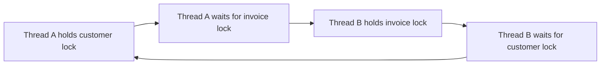
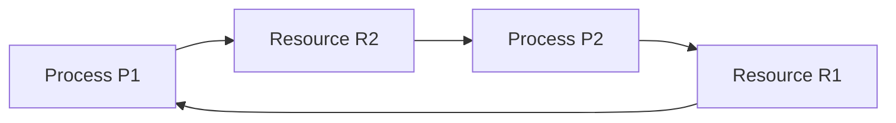
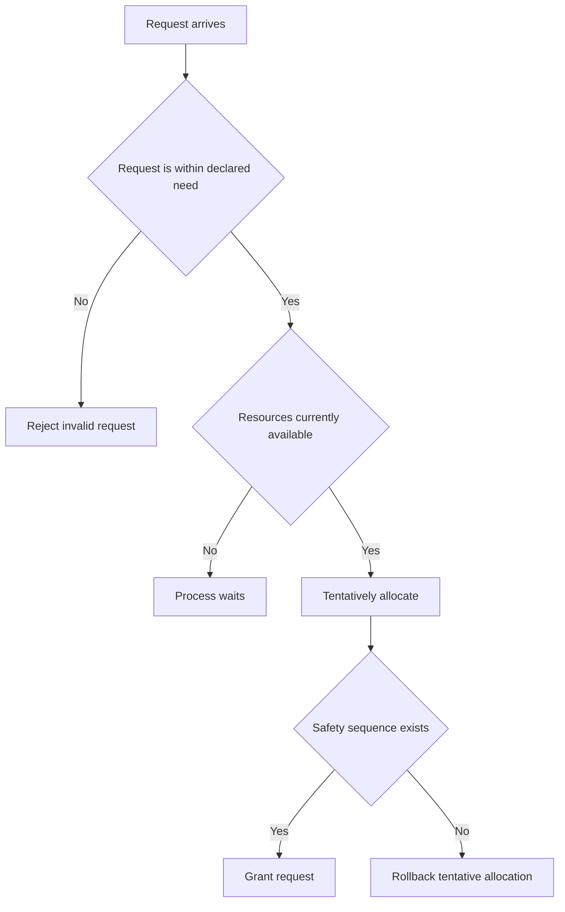
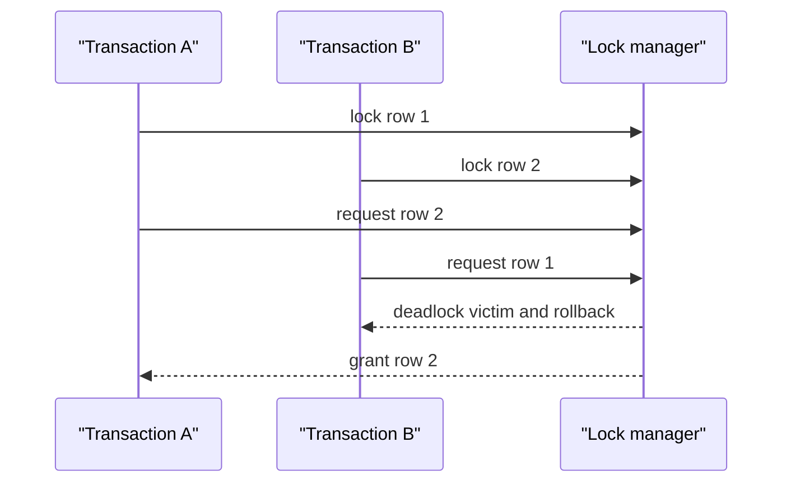

# Deadlocks

A deadlock is a liveness failure in which a set of processes or threads waits forever because each needs an action or resource controlled by another member of the set.
It appears in operating-system locks, database transactions, distributed services, and ordinary application code whenever resource ownership and waiting interact.
Interviewers use deadlocks to test graph reasoning, resource trade-offs, and the difference between preventing a failure and recovering from one.

---

## 🟢 Beginner Level

### Deadlock is permanent waiting within a set

Two threads can each make perfect local progress until they wait for each other.
Suppose thread A holds a customer lock and requests an invoice lock.
At the same time, thread B holds the invoice lock and requests the customer lock.
Neither can continue until the other releases its first lock.



Waiting alone is not a deadlock.
A thread waiting for a database connection may run when another thread returns one.
Deadlock requires a closed waiting relationship where no member can create the event it needs.

Livelock is different.
In a livelock, participants keep running and reacting but still make no useful progress.
Starvation is different again: one participant may wait indefinitely while other work continues.

### The Coffman conditions explain the shape

Four conditions must all hold for a classic resource deadlock.
Removing any one condition guarantees that this form of deadlock cannot occur.

1. **Mutual exclusion** means a resource such as a mutex has one owner at a time.
2. **Hold and wait** means an owner keeps one resource while requesting another.
3. **No preemption** means the system cannot safely take a resource away by force.
4. **Circular wait** means each member waits for the next member in a cycle.

| Condition | Example | Typical way to weaken it |
|---|---|---|
| mutual exclusion | one writer lock | share a read-only resource where possible |
| hold and wait | holds A, waits for B | acquire all needed resources together |
| no preemption | mutex cannot be stolen safely | rollback a transaction and retry |
| circular wait | A waits B, B waits A | acquire resources in global order |

Some resources cannot sensibly be shared, such as an update lock or a printer in the middle of one job.
Some resources cannot safely be preempted, such as a lock protecting an in-memory invariant.
In practice, consistent ordering is often the most usable prevention technique.

### Resource graphs make waiting visible

A resource allocation graph has process nodes and resource nodes.
An edge from a process to a resource is a request.
An edge from a resource to a process is an allocation.



With one instance of every resource, a graph cycle is both necessary and sufficient for deadlock.
With multiple instances, a cycle is necessary but not sufficient because another free instance can break the wait.
A wait-for graph removes resource nodes and connects a waiter directly to the process holding the needed resource.

### Locks are resources with ownership rules

Most application deadlocks involve locks rather than physical devices.
A mutex is exclusive, while a read-write lock may share reads but exclude writes.
Database row locks, file locks, semaphore permits, and connection-pool slots can all participate in a wait cycle.

```java
// Dangerous if another path locks invoice before customer.
synchronized (customer) {
    synchronized (invoice) {
        settle(customer, invoice);
    }
}
```

The code is not deadlocked by itself.
It becomes vulnerable when another execution path acquires the same resources in the opposite order.
Lock order is an API contract and should be documented wherever more than one lock can be held.

---

## 🟡 Intermediate Level

### Deadlocks: prevention, avoidance, detection, and recovery

A deadlock is a permanent wait among participants whose resource dependencies form a closed cycle while all four Coffman conditions hold: mutual exclusion, hold and wait, no preemption, and circular wait.
The four response families act at different times: **prevention** breaks a Coffman condition by design, **avoidance** rejects an allocation that would enter an unsafe state, **detection** searches an allowed allocation for a cycle or unfinished set, and **recovery** aborts, rolls back, or preempts a victim so resources are released.
Banker's Algorithm is the classic avoidance algorithm when every process declares its maximum claim in advance; the later worked example shows its safety check with concrete numbers.
None of these terms should be confused with neighbouring liveness failures: deadlock traps a closed set, starvation denies one participant service while others progress, and livelock keeps participants active but repeatedly prevents useful completion.

Deadlock prevention structurally breaks at least one Coffman condition.
It provides a guarantee, but that guarantee can reduce resource utilization or complicate failure handling.
The right method depends on whether resources are known in advance and whether rollback is possible.

```java
static void transfer(Account left, Account right, long amount) {
    Account first = left.id() < right.id() ? left : right;
    Account second = first == left ? right : left;
    synchronized (first) {
        synchronized (second) {
            debitCredit(left, right, amount);
        }
    }
}
```

Ordering by immutable account ID breaks circular wait.
Every transfer involving the same two accounts uses the same lock order.
Ordering must include a tie-breaker when identifiers can be equal or locks represent different resource classes.

Requesting all locks at once breaks hold and wait.
That can leave resources idle while a task waits for its last requirement.
Using a timeout and backing off breaks indefinite wait but can create livelock without randomized delay or priority policy.

### Avoidance asks whether a state remains safe

Deadlock avoidance allows dynamic requests only when the resulting allocation remains **safe**.
A safe state has some sequence in which every process can obtain its maximum remaining need, finish, and release its allocation.
An unsafe state is not necessarily deadlocked now, but the system no longer has a proven completion sequence.

Banker's algorithm models known maximum claims.
It tracks `Available`, `Max`, `Allocation`, and `Need` matrices.
The relationship is `Need = Max - Allocation` for each process and resource type.



Avoidance is practical only when workloads can state credible maximum demands and resource types are countable.
General-purpose operating systems rarely know this for arbitrary programs.
It is more useful as a reasoning model than as a universal production policy.

### Worked example: run the Banker's safety check

Assume one resource type with 10 total units.
Three processes have the following current allocation and maximum claim.

| Process | Allocation | Max | Need = Max - Allocation |
|---|---:|---:|---:|
| P0 | 3 | 7 | 4 |
| P1 | 2 | 4 | 2 |
| P2 | 2 | 5 | 3 |

Allocated units total $3 + 2 + 2 = 7$.
Therefore available units equal $10 - 7 = 3$.
The initial work value for the safety algorithm is 3.

P1 can finish because its need of 2 is at most the available 3.
When P1 finishes, it releases its allocation of 2, so work becomes $3 + 2 = 5$.
P2 can then finish because it needs 3, releasing 2 and making work 7.
P0 can finally finish because it needs 4, producing the safe sequence `P1, P2, P0`.

If P0 instead requests one more unit immediately, tentative availability becomes 2 and P0's need becomes 3.
P1 still can finish, so this particular request remains safe.
If no unfinished process had `Need <= Work`, the proposed allocation would be unsafe and must not be granted by the algorithm.

The numerical result is not a scheduling promise.
It assumes declared maxima are truthful and each process eventually releases what it holds after completing.
These assumptions often fail for interactive or open-ended workloads.

### Detection lets the system proceed until a cycle forms

Detection permits resource allocation without a safety test.
The system periodically or conditionally searches for a deadlock.
For single-instance resources, build a wait-for graph and find a directed cycle.

```text
T1 waits for T2
T2 waits for T3
T3 waits for T1
```

Depth-first search detects a back edge in $O(V + E)$ for a graph with vertices and edges.
Database lock managers often detect cycles when a lock wait is added rather than waiting for a slow global scan.
For multiple resource instances, an algorithm similar to the safety test identifies processes that can finish with currently available resources.

Detection frequency is a trade-off.
Checking every wait adds overhead but reduces the duration of a deadlock.
Checking rarely reduces overhead but lets blocked work accumulate and consumes held resources longer.

### Recovery chooses a victim and restores progress

After detection, the system must break the cycle.
It can terminate one or more participants, or preempt a resource if rollback makes that safe.
Databases normally abort one transaction, release its locks, and report a retryable deadlock error.

Victim choice can consider priority, work completed, resources held, number of prior rollbacks, and business importance.
Always selecting the cheapest victim can starve a long-running transaction.
Including age or retry count in the cost makes repeated victimization less likely.

Recovery itself needs careful state management.
Killing a process while it owns an in-memory lock can leave a data structure inconsistent unless the runtime has designed robust ownership recovery.
Transaction logs make database rollback far more tractable than arbitrary process rollback.

---

## 🔴 Expert Level

### Database deadlocks are expected and retryable

Two transactions can deadlock even when each statement is valid.
For example, transaction A updates row 1 then row 2, while transaction B updates row 2 then row 1.
The lock manager detects the cycle and chooses a victim to abort.



The application should retry the entire transaction when the operation is idempotent or protected by an idempotency key.
Retrying only a failed SQL statement may be invalid because the transaction's earlier reads and writes were rolled back.
Consistent row ordering reduces deadlocks but cannot remove all cycles involving indexes, foreign keys, and mixed access paths.

### Timeouts are detection policy, not proof of absence

Lock timeouts bound how long a caller waits.
They can release pressure even when no explicit cycle detector exists.
A timeout does not prove a deadlock: the owner may be slow but eventually able to progress.

Short timeouts fail healthy but busy workloads.
Long timeouts increase tail latency and tie up workers during real deadlocks.
Use timeouts with metrics showing wait duration, holder information where available, and retry backoff.
An operation that repeatedly times out may indicate lock contention, an actual cycle, a stalled dependency, or a capacity issue.

### Distributed systems need a defined ownership protocol

Deadlocks can span networked lock services, transactions, or services holding resources while making remote calls.
There may be no cheap global wait-for graph due to partial failure and stale observations.
Distributed designs commonly prevent cycles with ordering, leases, time-bounded locks, or transaction timestamp rules.

In **wait-die**, an older transaction may wait for a younger holder, while a younger requester aborts rather than wait for an older holder.
In **wound-wait**, an older requester aborts the younger holder, while a younger requester waits for an older holder.
Both use age to orient waits so cycles cannot form.

Leases add another failure mode.
If a process pauses past its lease while continuing work, it may believe it owns a lock that has been reassigned.
Fencing tokens or monotonic versions let the protected resource reject stale owners after lease expiration.

### Lock design should make order and scope obvious

Use the narrowest lock scope that protects one invariant.
Never perform slow network calls, user callbacks, or unbounded disk I/O while holding a contended application lock unless the ordering protocol explicitly requires it.
Acquire multiple locks in one documented global order.

In Java, `ReentrantLock.tryLock` can support bounded acquisition with a timeout.
Release every acquired lock in `finally` blocks, including the first lock when acquiring the second fails.
Avoid catch blocks that swallow interruption; interruption is often the cancellation path that lets a waiting thread leave the cycle.

Lock-free data structures trade blocking cycles for other complexity such as compare-and-set retries, ABA issues, memory ordering, and potential starvation.
They are not automatically faster or simpler.
Choose them for measured contention patterns and well-defined operations rather than as a blanket deadlock cure.

### Diagnose deadlocks with evidence, not only timeouts

The first useful artifact is a snapshot of who owns each contested resource and who waits for it.
For a JVM process, a thread dump can show thread states, monitor owners, and stack frames at the attempted acquisition.
For a database, the deadlock report records transaction identifiers, lock modes, objects, and the SQL or query plan involved.

Take more than one sample when the system is merely slow.
Two snapshots several seconds apart with the same closed wait chain are stronger evidence than one blocked stack trace.
If the owners change between samples, the incident may be contention or a long external call rather than a permanent cycle.

Log correlation identifiers beside lock acquisition only where the cost is acceptable.
Instrumentation should record wait duration and resource identity without logging sensitive business payloads.
Metrics such as lock wait percentiles, deadlock victim count, transaction retry count, and queue depth reveal whether a local fix improved the system.

Reproduce known multi-lock paths in tests with controlled barriers.
One test thread can acquire resource A and pause; another can acquire B and pause; then both attempt the second resource.
The test should assert that the designed ordering prevents the cycle or that timeout and recovery release all resources.

```java
CountDownLatch firstLocksHeld = new CountDownLatch(2);
// Each test worker acquires its first lock, counts down, then attempts the second.
// A correct global ordering means the intended production path cannot reach this shape.
```

Do not make production recovery depend on a test-only timeout.
The test exercises a dangerous interleaving, while the fix should remove or bound the real dependency cycle.
Use stress tests for many timing variations, because the scheduler can expose paths that a two-thread test misses.

### Lock scope determines the cost of every strategy

Holding a lock protects an invariant, not a broad section of code that happens to be nearby.
Before acquiring it, prepare immutable request data and perform operations that do not need protection.
After releasing it, perform logging, callbacks, notifications, and remote calls whenever the invariant allows.

A one-millisecond critical section with 100 contenders can still produce significant tail latency.
A 500-millisecond critical section containing a network request amplifies queueing and makes every retry more likely to collide.
Reducing scope therefore improves both deadlock risk and ordinary contention even when no cycle currently exists.

Read-write locks can improve concurrent reads when writes are rare and short.
They may worsen starvation or writer latency when readers constantly arrive, depending on fairness policy.
Stamped optimistic reads and lock-free structures add further options, but every option changes memory-ordering and validation responsibilities.

The safest design is often to avoid sharing mutable state at all.
Partition data by key, use single-writer ownership, exchange immutable messages, or delegate serialization to a database transaction.
These architectural choices remove lock edges rather than trying to manage a larger graph perfectly.
They also simplify failure ownership and reduce the evidence needed during an incident.
Prefer this redesign when contention data shows a shared lock is on a high-volume request path.
Document the remaining lock order in the module that owns the invariant.
Code review should treat a new nested acquisition as an API and operational change.
Small lock-order changes can otherwise reintroduce a cycle months after an initial fix.
Recovery metrics should remain in place after deployment to catch rare paths.

### Common Misconceptions

1. **“A resource-allocation graph cycle always proves deadlock.”** It proves deadlock only when each resource has one instance. With multiple instances, another available unit may still let a process finish and release resources.
2. **“An unsafe Banker state is already deadlocked.”** Unsafe means the algorithm cannot prove a completion sequence given declared maximum claims. The system may still progress if future requests are favourable.
3. **“Timeouts prevent deadlock.”** They bound waiting and can trigger recovery, but a timeout can occur without a cycle and can cause retries to livelock. They need backoff and diagnostics.
4. **“Killing a process is always safe recovery.”** It can release kernel resources, but application state or external side effects may be partially complete. Transactional rollback and idempotent design make victim recovery safer.
5. **“Consistent ordering eliminates every database deadlock.”** It removes a major source of row-lock cycles. Index locks, foreign keys, and mixed query plans can still create conflicts requiring retries.

### Interview Questions

**Q1. What are the four Coffman conditions?** `[easy]`

They are mutual exclusion, hold and wait, no preemption, and circular wait. All four must hold for the classic resource deadlock model. Prevention breaks at least one condition, though each choice has throughput or design costs.

**Q2. What is the difference between deadlock, starvation, and livelock?** `[easy]`

Deadlocked participants wait permanently because of a closed dependency cycle. A starved participant may wait indefinitely while other work continues to make progress. In a livelock, participants keep changing state and consuming CPU but repeatedly avoid useful completion.

**Q3. When does a cycle in a resource allocation graph prove deadlock?** `[easy]`

It proves deadlock when every resource type in the graph has exactly one instance. With multiple instances, a cycle only signals potential deadlock because another instance may satisfy a request. A wait-for graph is particularly convenient for the single-instance case.

**Q4. Why is global lock ordering effective?** `[easy]`

If every participant acquires resources in one strict global order, no request can point from a higher-order resource back to a lower-order one. That makes a circular wait impossible. The rule must cover all code paths and use stable tie-breakers, otherwise one exception reintroduces the cycle.

**Q5. What makes a Banker state safe?** `[medium]`

A state is safe if there is some sequence in which each unfinished process can obtain its remaining declared need, complete, and release its allocation. The algorithm simulates this with a work vector and does not need to choose the actual future schedule. Safety relies on accurate maximum claims and eventual release, which general workloads often cannot provide.

**Q6. How does deadlock detection work for single-instance locks?** `[medium]`

Create a wait-for graph with an edge from each waiter to the current lock holder. A directed cycle means every member waits on another member and none can release first. A depth-first graph search detects such a cycle, while lock managers may run the check when a new wait edge is created.

**Q7. Compare prevention, avoidance, and detection.** `[medium]`

Prevention structurally forbids at least one Coffman condition, such as by resource ordering. Avoidance considers each request and grants it only if the resulting state remains safe, requiring maximum claims. Detection permits allocations freely and later finds cycles, then pays a recovery cost such as rollback or termination.

**Q8. Why can a transaction retry after a database deadlock?** `[medium]`

The database chooses a victim, aborts its transaction, and releases its locks so another transaction can continue. The victim's application can begin a fresh transaction because rollback restores database consistency. The entire unit must be safe to repeat, especially if it also caused external side effects.

**Q9. What is the risk of always aborting the cheapest victim?** `[medium]`

A long-running or low-priority transaction can be selected repeatedly and never finish, which is starvation. Victim policy should account for age, rollback count, business priority, and work already performed. Fairness may cost more recovery work in one incident but prevents permanent loss of progress.

**Q10. What is the difference between wait-die and wound-wait?** `[medium]`

Both use timestamps to orient conflicting transactions and prevent cycles. In wait-die, an older requester waits and a younger requester aborts when it would wait for an older holder. In wound-wait, an older requester aborts the younger holder, while a younger requester waits for an older holder.

**Q11. A payment service times out acquiring two account locks. What do you change first?** `[hard]`

Trace all paths that acquire those account locks and establish one order based on immutable account IDs with a deterministic tie-breaker. Keep the critical section limited to the balance invariant and avoid remote calls while holding either lock. Retain a bounded timeout and retry with jitter as a safety net, but do not treat it as the primary fix for inconsistent order.

**Q12. A nightly database job sees deadlock victims after a new index deployment. How do you investigate?** `[hard]`

Collect the database deadlock graph, transaction SQL, index access paths, row order, and concurrent job schedule rather than simply increasing the lock timeout. The new index may change lock acquisition order or broaden the set of records touched by a plan. Make conflicting updates follow a consistent key order, reduce transaction scope, and retry the idempotent job transaction with bounded backoff.

**Q13. Why is resource preemption difficult for a mutex?** `[hard]`

The holder may be halfway through changing an in-memory invariant, so forcibly removing the mutex can expose corrupted state to another thread. Unlike a database transaction, ordinary memory updates often have no durable undo log. Design cooperative cancellation, rollback points, or ownership transfer protocols instead of treating a mutex as a safely stealable resource.

**Q14. A distributed lock uses leases but still corrupts data after a long garbage-collection pause. What is missing?** `[hard]`

The paused client may resume after its lease expired and continue acting as if it still owns the lock, while a new client has acquired it. Add fencing tokens or monotonically increasing lock versions that the protected database or service rejects when stale. Leases bound ownership in time but require the resource itself to enforce which owner is current.

### Further Reading

- [Linux kernel locking design](https://docs.kernel.org/kernel-hacking/locking.html) explains lock ownership and deadlock avoidance in kernel code.
- [PostgreSQL documentation: explicit locking](https://www.postgresql.org/docs/current/explicit-locking.html) describes row locks and deadlock behaviour.
- [PostgreSQL documentation: transaction isolation](https://www.postgresql.org/docs/current/transaction-iso.html) documents transaction failure and retry considerations.
- [Java `Lock` API](https://docs.oracle.com/en/java/javase/17/docs/api/java.base/java/util/concurrent/locks/Lock.html) documents lock acquisition and `tryLock` behaviour.
