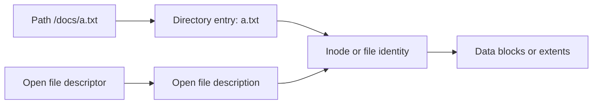
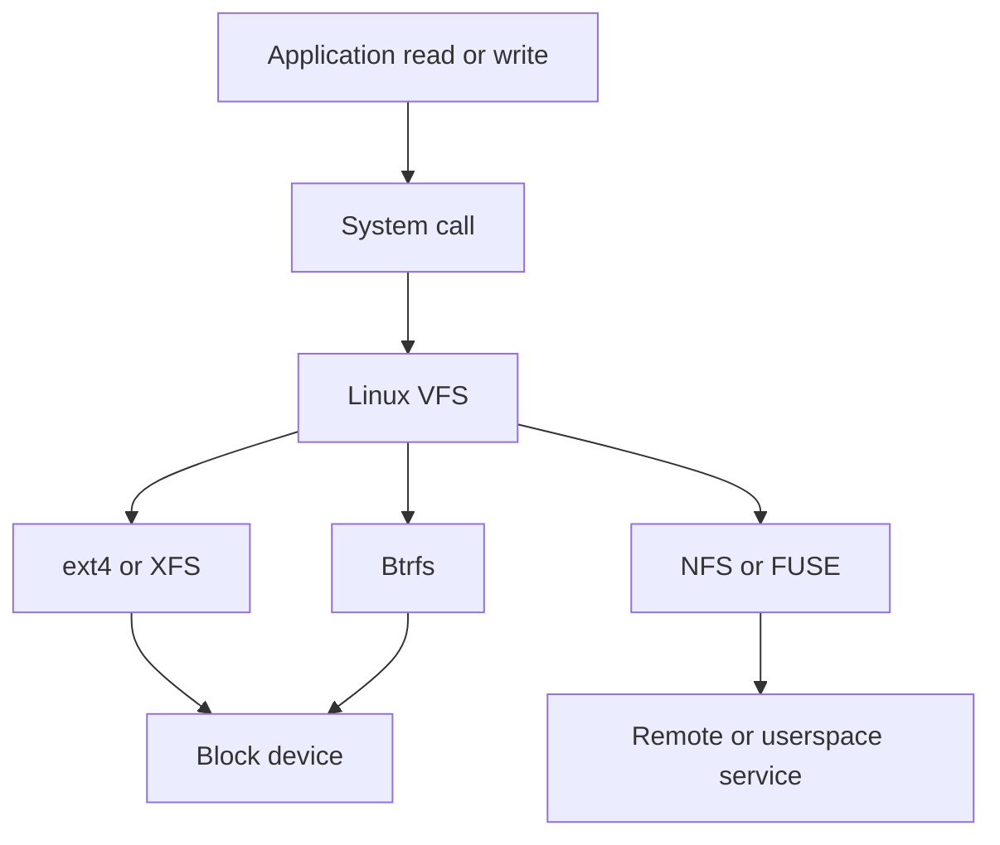
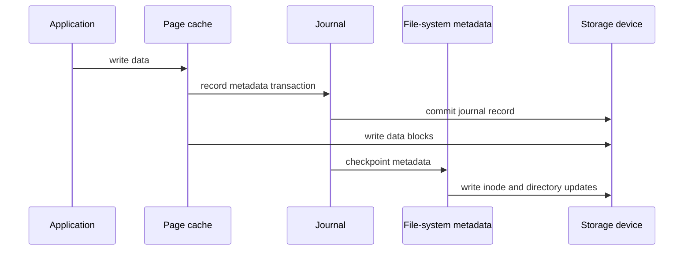

# File Systems, Inodes, Journaling & Copy-on-Write

A file system turns a named byte stream such as `/srv/report.csv` into durable blocks on a storage device while enforcing naming, permissions, allocation, and crash-consistency rules.
It is a layered system: applications use file descriptors, the kernel resolves paths and caches metadata, a file-system implementation maps logical ranges to blocks, and storage eventually acknowledges writes.
Interview questions focus on the gaps between these layers: a name is not an inode, `write` is not necessarily durable, and a snapshot is not a backup unless its retention and recovery properties are understood.

---

## 🟢 Beginner Level

### Files, Names, and Directories

A file is a sequence of bytes plus metadata such as owner, permissions, timestamps, and size.
A directory is a special file-system object that maps human-readable names to file identities.
An absolute path begins at the root directory, while a relative path is interpreted from a current working directory.
The file system resolves path components one at a time rather than treating a path as one flat key.

Opening a file produces a file descriptor in a Unix-like process.
The descriptor refers to an open file description that holds state such as current offset and status flags.
Two descriptors can refer to the same underlying file but have independent offsets if opened separately.
Duplicated descriptors can share one open-file description and thus one offset.

The name and file identity are intentionally separate.
Renaming a file changes directory entries but can leave the inode and its data unchanged.
Deleting a name removes a directory entry; an open file can remain accessible until its link count and open references both reach zero.

### Common File Operations

`open` resolves a path and checks permissions.
`read` copies bytes from the file at a current or supplied offset.
`write` changes cached file data and advances an offset unless positioned I/O is used.
`seek` changes the current offset, while `truncate` changes file length.
`close` releases a descriptor but does not by itself promise that all dirty data reached stable storage.

`fsync` or an equivalent durability boundary asks the kernel to flush relevant file data and metadata to the device according to the operating system and device stack's guarantees.
It is more expensive than ordinary buffered writes because it waits for persistence-related work.
Applications such as databases choose explicit write-ahead logging and fsync strategies because a successful `write` may only mean bytes entered page cache.

### Links Explain Why Names Are Not Files

A hard link is another directory entry for the same inode.
Both names have the same file identity and link count.
Hard links normally cannot cross file-system boundaries and are restricted for directories to avoid cycles.
A symbolic link is a separate small file whose data is a path string to be resolved later.

A symbolic link can cross file systems and can become dangling if its target is removed.
Removing a hard-link name does not remove bytes while another hard link or open reference exists.
The distinction matters during deployments that swap symlink targets versus those that rename a physical file in place.

### The Virtual File System Layer

The Linux Virtual File System, or VFS, provides common objects and operations above specific implementations such as ext4, XFS, Btrfs, NFS, and FUSE file systems.
An application calls `open`, `read`, or `mkdir` without knowing the lower implementation.
VFS dispatches through file, inode, directory-entry, and superblock operations supplied by the mounted file system.
This common layer lets a pathname cross mount points while preserving one system-call interface.

VFS abstraction does not make all mounted file systems equivalent.
Locking, durability, case sensitivity, rename behavior, latency, and snapshot features vary by implementation and mount option.
An application that depends on a specific atomic-rename or locking behavior should document and test it on the deployed storage.

---

## 🟡 Intermediate Level

### Allocation: Blocks, Extents, and Fragmentation

Storage devices present addressable sectors or blocks, while a file system groups them into allocation blocks.
Contiguous allocation stores a file in one continuous run and makes sequential and random access simple.
It suffers external fragmentation and requires space planning when a file grows.
Linked allocation stores a pointer to the next block in every block, avoiding external fragmentation but making random access slow and consuming pointer space.

Indexed allocation stores references in an index structure so a logical file block can be found without walking every predecessor.
Modern file systems commonly use extents: one metadata record describes a consecutive range of logical blocks mapped to consecutive physical blocks.
Extents reduce metadata for large contiguous files and help sequential I/O.
Fragmentation still happens as files grow and free space becomes scattered.

| Allocation style | Random access | Sequential access | Main cost |
|---|---|---|---|
| Contiguous | Excellent | Excellent | Growth and external fragmentation |
| Linked | Poor | Acceptable | Pointer traversal and corruption sensitivity |
| Indexed blocks | Good | Good | Index metadata for small files |
| Extents | Good | Excellent for runs | Fragmentation after incremental growth |

The table describes structural behavior, not a fixed benchmark result.
SSD seek cost differs from a rotating disk, but fragmented extents still increase metadata work and reduce I/O merging opportunities.

### Inodes, Directories, and Path Resolution

An inode stores file metadata and the mapping from logical file offsets to data blocks or extents.
It does not generally store the file's name.
A directory entry, often called a dentry in Linux cache terminology, maps a name within one parent directory to an inode.
The same inode can have multiple dentries through hard links.

To resolve `/home/ana/report.txt`, the kernel starts at the root inode.
It looks up `home` in the root directory, then `ana` in that directory, and finally `report.txt` in Ana's directory.
The dentry cache and inode cache retain recently used components, so repeated path lookup can avoid reading directory blocks again.
Negative dentries can cache a recent “name does not exist” result too.

Permissions are checked during traversal.
Search permission on a directory controls whether a process may traverse through it, while read permission controls listing its names.
This is why a user can sometimes access a known path under a directory without being able to list all its entries.
Mount flags and Linux security modules add more policy beyond basic mode bits.

### Worked Example: Mapping a File Offset

Assume a file system uses 4 KiB blocks and one file has extents mapping logical blocks 0 through 99 to physical blocks 8,000 through 8,099.
An application reads at byte offset 18,500.
The logical block index is $\lfloor 18{,}500 / 4096 \rfloor = 4$.
The in-block offset is $18{,}500 - 4 \times 4096 = 2{,}116$ bytes.

Logical block 4 falls inside the extent beginning at logical block 0.
Its physical block is $8{,}000 + 4 = 8{,}004$.
The file system reads from byte 2,116 within physical block 8,004, subject to page-cache and device behavior.
If the requested read crosses byte 4,096 of that block, the next logical block maps to physical block 8,005 in this extent.

For a fragmented second extent, the arithmetic changes at its boundary but the file offset remains continuous to the application.
That separation is the file system's value: an application sees a byte stream while allocation can evolve underneath it.
It also explains why a file's logical size does not reveal how many physical extents or blocks it consumes.

### Free Space, Delayed Allocation, and Writeback

File systems track free blocks with bitmaps, free-space trees, extent maps, or related structures.
Finding a contiguous run is valuable for future I/O, so allocators often use locality heuristics rather than selecting the first free block.
Delayed allocation waits to choose physical blocks until dirty data is ready for writeback.
By seeing a larger write at once, the allocator can choose a better contiguous extent.

Delayed allocation has a crash trade-off.
Data that appears written to an application may still reside in page cache without final block allocation or device persistence.
An abrupt power loss can leave recently created data absent or stale unless the application establishes an appropriate fsync boundary.
This is not a defect in delayed allocation; it is the consequence of buffering for throughput.

### Buffered I/O, Memory Mapping, and Coherency

Ordinary buffered `read` and `write` use the page cache.
Memory mapping exposes file-backed pages in a process address space, so a load or store can fault and access file content through the same cache.
The kernel tries to preserve coherency between mapped and buffered access, but visibility and durability rules still require care with concurrent writers and `msync` or fsync boundaries.
Direct I/O can bypass or reduce use of page cache under alignment and filesystem-specific constraints.

Direct I/O is not a universal performance switch.
It shifts caching and batching responsibility to the application and can perform worse for small or unaligned I/O.
Databases use it in some configurations because they implement their own buffer pool and need predictable cache ownership.
Measure the complete storage path before choosing it.

### From `write` to Stable Storage

Buffered writing first copies bytes into page-cache pages and marks them dirty.
The system call can return before filesystem allocation, journal commit, device queueing, controller cache flush, and physical media persistence are complete.
Background writeback groups dirty pages for throughput and later writes them to the device.
This pipeline is efficient for ordinary files but means the caller needs an explicit durability protocol for critical records.

`fsync` is normally applied after writing a file whose contents must survive a crash.
For durable creation, replacement, or unlinking, directory metadata can require its own fsync as described by the platform contract.
The file system and storage device also need honest flush behavior; virtualized or network storage may add further acknowledgement layers.
This is why databases and durable queues test crash recovery rather than assuming source-code call order proves persistence.

`fdatasync` can avoid waiting for metadata that is not needed to retrieve file data, subject to its documented behavior.
`sync` starts broader system writeback and is not a targeted replacement for an application-level commit protocol.
Opening with synchronous flags can reduce the gap between write and persistence at a throughput and latency cost.
Choose the narrowest durable boundary that satisfies the business record's recovery requirement.

### Metadata Scaling and Small-File Workloads

Small files can consume disproportionately large metadata and block overhead.
A one-byte file may allocate an inode, directory entry space, one allocation block, journal traffic, and cache entries far larger than its content.
Millions of tiny files stress inode allocation, path lookup, backup enumeration, and deletion more than they stress sequential data bandwidth.
An object store, packed segment format, or database table can be a better model when individual POSIX file semantics are not required.

Directory indexes improve name lookup but do not eliminate global costs of opening and closing millions of files.
Batch operations, prefix sharding, retention policies, and avoiding repeated stat calls can reduce metadata pressure.
Be deliberate about access-time updates, durability settings, and antivirus or indexing sidecars that may touch each file.
Benchmark the expected number of entries and operation mix, not only total gigabytes.

Quotas add another layer of resource control.
User, group, or project quotas can limit blocks and inode counts separately.
A service can fail with quota exhaustion even when the host file system has plenty of unallocated space.
Expose quota-related errors clearly to operators rather than reporting every create failure as an application bug.

### Permissions, ACLs, and Safe Temporary Files

Unix mode bits grant read, write, and execute rights for owner, group, and others.
Directories use write permission to alter names and execute or search permission to traverse entries.
Access control lists can express additional principals where mode bits are insufficient.
Process umask changes the default permissions applied when files and directories are created.

Create sensitive temporary files with secure APIs and restrictive permissions.
Do not construct predictable filenames in a shared writable directory and then open them, because another process can race by creating or replacing that name.
Use a newly created file descriptor, keep operations relative to trusted directory descriptors where supported, and validate ownership when crossing privilege boundaries.
File-system correctness includes these namespace-security properties as well as block allocation.

### Measuring the Storage Contract

Measure separately the time to open, metadata lookup, read or write bytes, fsync, rename, and close.
One aggregate “disk latency” number hides whether an incident is metadata-bound, writeback-bound, or waiting on a remote mount.
Include cold-cache and warm-cache cases because page cache can make a benchmark look faster than a post-restart production request.

Trace file-system errors with the operation, errno, path category, mount identity, and request correlation ID.
Avoid logging full sensitive paths or file contents in shared telemetry.
Capacity dashboards should include bytes, inodes, dirty-page pressure, writeback delay, mount errors, and deleted-but-open files.
These metrics expose different failures that a simple free-space percentage misses.

For critical recovery paths, test abrupt termination between every publish step.
Verify not just that the filesystem remounts, but that readers either see a valid old version or a valid new version according to the promised contract.
This turns durability from an assumption into an executable specification.
Repeat the test on the storage class and mount options that production actually uses.

---

## 🔴 Expert Level

### Journaling and Crash Consistency

A journal records enough intent and commit information to restore file-system metadata consistency after a crash.
Before changing related metadata structures such as a directory entry, inode, and free-space map, a journaling file system records a transaction in its journal.
After the journal transaction is committed, it can apply or checkpoint changes to their ordinary on-disk locations.
On mount after a crash, recovery replays or discards incomplete journal work according to recorded transaction state.

Journaling protects structural consistency, not automatically every application's desired data ordering.
In an ordered-data mode, file data is generally written before metadata that makes it visible, reducing exposure of unrelated stale blocks after a crash.
In a writeback mode, metadata can reach disk before data, which can expose old data after a crash.
Full data journaling can provide stronger ordering at a throughput cost.

The order in the diagram is a conceptual model rather than a claim about every mount mode or device cache setting.
Applications needing a durable “file contents and name are committed” point must use and test `fsync` on the relevant file and, for creation or rename, often the containing directory.
The exact protocol depends on the operating system and file-system documentation.

### Atomic Rename and Durable Publish

Rename within one mounted file system is typically atomic with respect to namespace visibility.
This makes a common publish protocol possible: write a new version to a temporary name, fsync it, rename it over the destination, then fsync the containing directory when crash durability of the name change matters.
Readers see either the old name target or the new one, not a half-written path entry.
Cross-file-system rename is not one atomic operation because it becomes copy plus remove.

Atomic namespace replacement does not make a file's application-level content valid.
The writer must finish and flush the temporary data before publishing it.
If readers hold an old descriptor, they can continue reading the old inode after rename while new path lookups see the replacement.
This is powerful for configuration deployment but must be coordinated with cache invalidation and application reload behavior.

### Copy-on-Write, Snapshots, and Checksums

Copy-on-write file systems such as Btrfs and ZFS write changed blocks to new locations instead of overwriting active blocks in place.
They then update higher-level metadata pointers so a new consistent tree becomes visible.
An existing snapshot retains old roots and therefore sees old block versions without copying all data immediately.
Snapshots are space-efficient until later writes diverge.

Checksums can detect corruption when data is read.
With redundancy, a file system may repair a bad replica from a valid one; without redundancy it can only report the corruption.
Copy-on-write and checksums improve integrity properties but add metadata, write amplification, and operational complexity.
Snapshots on the same failing pool are not an independent backup against device loss, deletion, or credential compromise.

### VFS, Network File Systems, and FUSE

VFS lets the same system call interface reach local and remote file systems.
NFS introduces network latency, server availability, cache-consistency semantics, and recovery behavior that differ from local ext4 or XFS.
Advisory file locks and rename behavior should be validated against the deployed server and client options.
Never assume a local-file-system test proves distributed locking correctness.

FUSE runs file-system logic in a userspace process, useful for tools such as SSHFS, encrypted overlays, and cloud-storage adapters.
It adds kernel-to-userspace crossings and a daemon dependency for operations that a native kernel driver might handle directly.
It is a good extensibility boundary but needs failure, timeout, and caching design appropriate to the remote service.

### Production Failure Modes

Running out of inodes can prevent creation of tiny files even while `df` shows plentiful free blocks.
Check both byte and inode capacity for workloads that create many small objects.
Directory hot spots can cause metadata contention when many threads create or rename under one parent directory.
Sharding names across directories can reduce that pressure when filesystem semantics permit it.

Deleting a large open log does not immediately free its blocks.
The directory name is gone, but the process still holds an open reference to the inode.
Find such files with appropriate open-file inspection tools, rotate or restart the owner safely, and avoid deleting blindly during an incident.
Mounting a remote object store as a POSIX-like path can hide non-POSIX rename, locking, or consistency semantics behind familiar calls.

### Common Misconceptions

1. **"A filename is stored in the inode."**
   *Correction*: A directory entry maps a name in a parent directory to an inode. One inode can have multiple names through hard links.

2. **"`write` means bytes survive a power failure."**
   *Correction*: Buffered writes normally reach page cache first. An application needs an appropriate fsync protocol and awareness of file and directory metadata to establish a durable publish point.

3. **"A snapshot is a backup."**
   *Correction*: A snapshot commonly shares the same pool, credentials, and failure domain as live data. It helps fast rollback but must be replicated or exported for independent disaster recovery.

4. **"Atomic rename makes multi-file updates atomic."**
   *Correction*: Rename protects one namespace transition within a file system. Coordinating several files needs a manifest, journal, or application-level transaction protocol.

5. **"Free disk blocks guarantee new files can be created."**
   *Correction*: Inode exhaustion, quota, permissions, read-only remounts, and metadata errors can still prevent creation. Diagnose the specific resource and filesystem health.

### Interview Questions

**Q1. What is the difference between an inode and a directory entry?** `[easy]`

An inode stores file metadata and block or extent mappings, while a directory entry maps a name inside a directory to an inode. The inode normally does not contain the filename. This separation permits hard links and atomic namespace operations.

**Q2. What is the difference between a hard link and a symbolic link?** `[easy]`

A hard link is another directory entry for the same inode, so it shares data and metadata identity. A symbolic link is a separate object containing a target path that is resolved later. Symbolic links can cross filesystems and can dangle when their target disappears.

**Q3. Why can a deleted file still consume disk space?** `[easy]`

Removing a name decrements its link count but does not remove the inode while a process still has it open. The process can keep reading or writing through its descriptor. Space becomes reclaimable when no directory links and no open references remain.

**Q4. What does VFS provide?** `[easy]`

VFS provides common kernel abstractions and system-call operations above specific filesystem implementations. It lets applications use `open`, `read`, and `write` across local, network, and userspace filesystems. Underlying durability and consistency semantics still vary by mounted implementation.

**Q5. How do extents improve on one pointer per file block?** `[medium]`

An extent records a run of consecutive logical blocks mapped to a consecutive physical run in one metadata entry. Large sequential files need less mapping metadata and can issue more efficient I/O. Fragmentation can still create multiple extents as a file grows or free space becomes scattered.

**Q6. What does journaling protect after a crash?** `[medium]`

Journaling records metadata transactions so recovery can restore structural consistency after an interruption. It prevents a directory, inode, and free-space map from being left in an arbitrary half-updated combination. Its data-ordering guarantee depends on journaling mode, so application durability may still require fsync.

**Q7. Why might durable file creation require fsync on a directory?** `[medium]`

The new file's contents and inode are separate from the parent directory entry that makes its name durable. Fsyncing the file alone may not persist the name addition or rename after a sudden crash. Fsyncing the relevant directory establishes the metadata durability boundary on supported systems.

**Q8. What is delayed allocation and what trade-off does it make?** `[medium]`

Delayed allocation postpones choosing physical blocks until buffered writes are ready for writeback. It improves allocation decisions by seeing larger contiguous write ranges. It also means ordinary successful writes can remain volatile longer, so applications need explicit durability points when required.

**Q9. Why is direct I/O not automatically faster?** `[medium]`

It can bypass page cache but imposes alignment constraints and shifts caching and batching responsibility into application code. Small or irregular I/O can lose useful kernel caching and perform worse. It is appropriate only after measuring a workload whose own buffer management justifies it.

**Q10. How does copy-on-write support snapshots?** `[medium]`

On modification, a copy-on-write filesystem writes new blocks and later points a new metadata root at them. A snapshot retains an older root that still reaches the old blocks. Space is shared until writes diverge, but the snapshot remains in the same failure domain unless replicated.

**Q11. Why can a directory become a performance bottleneck?** `[medium]`

Concurrent creation, deletion, and rename under one directory can contend on metadata structures and locks. Even a scalable directory index has shared coordination and cache pressure. Sharding files by key prefix or tenant can distribute the metadata workload when the application permits it.

**Q12. Scenario: configuration deployments sometimes leave an empty production file after a power loss. What publish protocol do you use?** `[hard]`

Write the full new content to a temporary file in the same filesystem, fsync that file, atomically rename it over the destination, then fsync the containing directory when the name transition must survive a crash. This prevents readers from seeing a partially written target and establishes explicit ordering. Test the protocol on the deployed filesystem because mount and platform details matter.

**Q13. Scenario: `df -h` shows free space but a service cannot create more small files. What do you check?** `[hard]`

Check inode availability, quota, permissions, read-only mount status, and filesystem error logs as well as byte blocks. A filesystem can exhaust its inode supply before data blocks, especially with huge numbers of tiny files. Remedy the actual limiting resource and redesign object storage or retention if the file count is structurally unbounded.

**Q14. Scenario: a process keeps filling disk after its log was deleted. How do you diagnose and fix it safely?** `[hard]`

Look for deleted-but-open files held by processes and correlate them with the application's log descriptors. The pathname is gone but the inode remains allocated until the process closes it. Rotate using the application's supported mechanism or restart it safely, then confirm space release instead of deleting more names.

### Further Reading

- [Linux kernel VFS documentation](https://docs.kernel.org/filesystems/vfs.html) describes the VFS objects and operation interfaces.
- [Linux `fsync(2)` manual page](https://man7.org/linux/man-pages/man2/fsync.2.html) documents file and metadata durability boundaries.
- [ext4 disk layout documentation](https://docs.kernel.org/filesystems/ext4/ondisk/index.html) explains ext4 metadata and on-disk structures.
- [Btrfs documentation](https://btrfs.readthedocs.io/en/latest/) covers copy-on-write, snapshots, checksums, and operational behavior.
