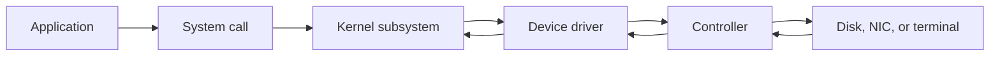
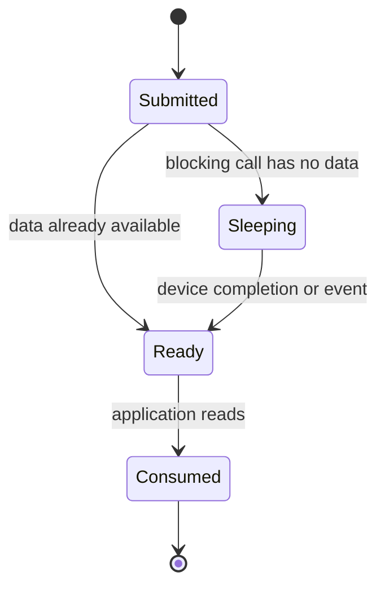
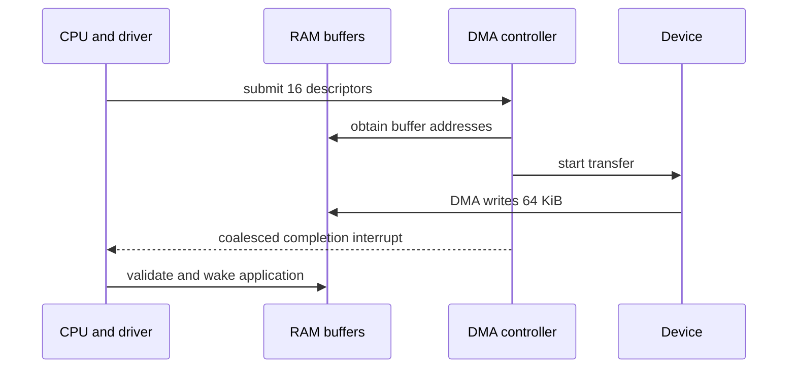
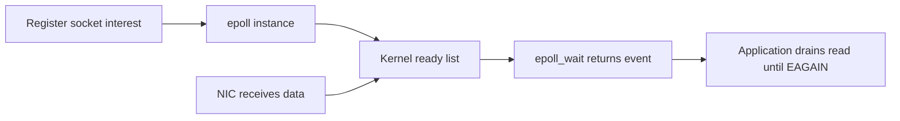
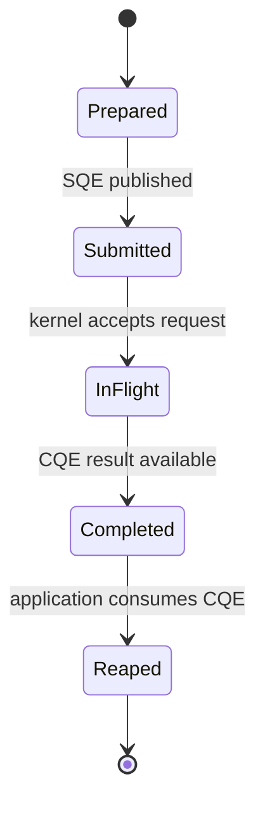

# I/O Systems: Devices, Interrupts, DMA, epoll, and io_uring

I/O systems move data between programs and hardware whose speed, ownership, and completion timing differ radically from the CPU. The operating system turns device-specific operations into files, sockets, requests, buffers, interrupts, and completion events. Interviewers ask about I/O to expose whether a candidate can distinguish waiting for readiness from asynchronous completion and can reason about data movement under load.

---

## 🟢 Beginner Level

### The I/O path

An application normally calls a system interface such as `read`, `write`, `send`, or `recv`.

The kernel validates arguments and routes the request through a subsystem.

A device driver translates generic operations into controller-specific commands.

The controller operates the physical device and reports progress or completion.

A device controller may expose registers, queues, and a DMA engine.

A driver owns the hardware protocol and handles errors, reset, and completion.

The kernel provides common policy around permissions, buffering, scheduling, and blocking.

Applications should use the portable interface rather than controller registers directly.

### Polling, interrupts, and DMA

Polling repeatedly asks whether a device is ready.

It is simple and can be efficient for extremely short predictable waits.

It wastes CPU time when the device is slow or completion is unpredictable.

Interrupt-driven I/O lets the CPU run other work until the device signals an event.

Direct Memory Access lets a controller transfer a block between device and RAM without copying every byte through CPU registers.

| Method | CPU role while device works | Best fit | Main cost |
|---|---|---|---|
| Polling | Repeated status checks | Very short wait or dedicated low-latency core | Busy CPU |
| Interrupt | Starts work, services completion interrupt | General devices and moderate event rate | Interrupt overhead |
| DMA | Programs descriptor, handles completion | Large blocks and high throughput | Setup, coherence, mapping |

DMA does not mean the CPU is uninvolved.

The CPU creates descriptors, grants buffer access, and later processes completion.

It avoids per-byte programmed transfer work.

### Blocking and non-blocking calls

A blocking `read` waits until data, EOF, or an error is available.

The calling thread sleeps and another runnable task can use the CPU.

A non-blocking `read` returns promptly with data, EOF, an error, or a would-block result such as `EAGAIN`.

Non-blocking does not itself tell the application when to retry.

Readiness notification mechanisms answer that question for many descriptors.

File descriptors are handles for files, sockets, pipes, terminals, and some kernel objects.

Their readiness semantics differ by object type.

Always check the result of the actual read or write after a readiness event.

---

## 🟡 Intermediate Level

### Interrupts and deferred work

An interrupt causes the CPU to pause ordinary execution and enter a handler selected by an interrupt vector.

The handler acknowledges the device and performs only urgent minimal work.

Lengthy processing is deferred to a lower-priority context such as a softirq, tasklet, work queue, or kernel thread depending on the subsystem.

This separation avoids blocking other interrupts for too long.

Interrupt coalescing lets a NIC report a batch of packets rather than interrupting for every packet.

Coalescing improves throughput but can add latency for the first packet in a batch.

At high receive rates, Linux NAPI can switch from interrupt notification to polling a device budget.

That prevents interrupt storms from consuming all CPU time.

### Worked example: compare transfer costs

Assume an application receives 64 KiB from a device.

Programmed I/O copies one 4-byte word per CPU operation.

That requires `65,536 / 4 = 16,384` device-data reads, ignoring loop and bus overhead.

With DMA using 4 KiB descriptors, the driver submits `65,536 / 4,096 = 16` descriptors.

Assume descriptor setup costs 2 microseconds each and completion handling costs 20 microseconds total.

DMA CPU overhead is approximately `16 × 2 + 20 = 52 microseconds` before mapping and cache effects.

Now assume the device delivers a completion interrupt for every 4 KiB descriptor at 5 microseconds of handler cost.

Interrupt work adds `16 × 5 = 80 microseconds`.

If the controller coalesces four completions per interrupt, that becomes four interrupts or about 20 microseconds.

The total CPU work is then about 72 microseconds for setup, coalesced completion handling, and bookkeeping.

The numeric comparison illustrates why DMA and batching matter for throughput.

It does not include IOMMU translation, cache invalidation, copy-to-user cost, or queue contention.

### Buffering, caching, and backpressure

Buffers absorb rate mismatch between producers and consumers.

A single buffer alternates filling and draining.

Double buffering lets one buffer fill while another is processed.

Ring buffers provide multiple slots for streaming data.

The page cache keeps file data in RAM and can satisfy reads without storage access.

Buffered writes may complete before physical media persistence.

Use `fsync` or an application durability protocol when an acknowledgement must survive a crash.

Every queue needs a bound and a policy when full.

Backpressure may block the producer, reject work, shed lower-value items, or apply flow control.

An unbounded queue turns overload into memory exhaustion and long tail latency.

### Readiness multiplexing: select, poll, and epoll

`select` and `poll` ask the kernel to inspect a supplied set of descriptors.

Their repeated scanning cost grows with the set size.

`epoll` keeps an interest set in the kernel and returns descriptors whose state changed or is ready.

It avoids rebuilding and scanning a huge user-supplied array every wait in the common large-connection case.

Level-triggered epoll reports readiness while data remains readable or writable.

Edge-triggered epoll reports transitions and requires draining until `EAGAIN`.

Edge-triggered mode can reduce repeated events.

It can also stall a connection if the application reads only one chunk and waits for another edge that never comes.

Use level triggering until measurements justify the more demanding drain discipline.

### Data ownership, copies, and direct I/O

An I/O API must define who owns a buffer until an operation completes.

For a blocking write, a caller can usually reuse the buffer after the call returns its accepted byte count.

For asynchronous submission, the buffer must remain valid until its completion is observed.

Reusing or freeing it early can corrupt a later device transfer.

Kernel buffering commonly copies user bytes into kernel-managed memory before returning.

That copy simplifies isolation and lifetime rules.

It also consumes memory bandwidth for large transfers.

Scatter-gather I/O describes several non-contiguous buffers in one logical request.

It can avoid assembling application fragments into one temporary buffer.

Zero-copy is an overloaded term.

Some paths avoid a user-to-kernel copy.

Other paths still require DMA mapping, page pinning, checksum work, or a copy inside the device.

`O_DIRECT` asks Linux to reduce page-cache use for file I/O.

It usually imposes alignment and size constraints based on filesystem and device requirements.

It can help a database that already manages its own cache.

It can hurt a small-read workload that would benefit from the page cache.

Memory-mapped files make file pages accessible through ordinary memory loads and stores.

Page faults then bring data in lazily.

They can simplify random access but make I/O latency appear as memory-access latency.

The operating system still performs I/O, caching, writeback, and error handling underneath.

---

## 🔴 Expert Level

### Completion-based I/O and io_uring

Readiness says an operation is likely to make progress now.

Completion says a specific submitted operation has finished with a result.

Linux `io_uring` shares submission and completion rings between user space and kernel.

The application writes submission queue entries, submits them, and later reads completion queue entries.

One process can keep many I/O operations in flight without one blocking thread per operation.

Registered buffers and files can reduce repeated setup in suitable workloads.

Polling modes can lower latency at the cost of dedicated CPU activity.

Not every operation is truly asynchronous on every filesystem, driver, or kernel path.

Treat `io_uring` as a completion interface with rich batching, not as a magic zero-copy guarantee.

Validate cancellation, timeout, partial result, and resource-lifetime handling.

### Storage paths and scheduling

HDD access has seek and rotational latency measured in milliseconds.

SSD access removes mechanics but still has internal queues, flash erase behaviour, and firmware scheduling.

NVMe connects over PCIe and supports many hardware queues, reducing host-controller contention relative to older single-queue interfaces.

The Linux block layer can merge, dispatch, and account for requests.

Modern scheduling choices depend on device type, workload, cgroup isolation, and latency goals.

Do not assume a rotational-disk elevator strategy benefits an NVMe device the same way.

Database durability still depends on flush semantics through controller caches and power-loss protection.

### Kernel bypass and its cost

Kernel-bypass frameworks such as DPDK or SPDK can map device queues to user-space polling loops.

They reduce syscall and kernel-network-stack overhead at very high packet or I/O rates.

They also give the application responsibility for polling cores, memory pinning, isolation, security boundaries, and recovery.

Kernel bypass is justified by measured bottlenecks, not by a generic desire for low latency.

For ordinary services, the kernel stack provides portability, observability, fairness, and safer sharing.

### Production failure modes and observability

An I/O-bound service can show low CPU utilisation while request latency is high.

Measure queue depth, device utilisation, await time, IOPS, throughput, socket buffers, and application queue time together.

High interrupt rate can consume a core even when useful application work is low.

Too much interrupt coalescing can raise latency despite good throughput.

Blocked threads can exhaust a thread pool while the real bottleneck is a slow disk or connection pool.

File-descriptor leaks eventually make accept, open, and socket operations fail.

Use resource scopes and monitor descriptor count against process limits.

### Common Misconceptions

1. **"DMA means data reaches the CPU cache with no CPU work."**
   *Correction*: DMA transfers device data to RAM, while the CPU still sets up descriptors, handles completions, and consumes data. Cache coherence, mapping, and copying rules still affect cost.

2. **"Non-blocking I/O is asynchronous I/O."**
   *Correction*: Non-blocking calls return promptly when an operation would wait, while the caller retries after readiness. Asynchronous completion APIs submit a distinct operation and later report its result.

3. **"`epoll` makes a socket read complete."**
   *Correction*: It reports readiness, not a promised byte count. The application must read and handle partial data, EOF, errors, and races.

4. **"Buffered write means data is durable."**
   *Correction*: A buffered write may only reach the page cache or a controller cache. Durable acknowledgement requires the relevant flush semantics and hardware assumptions.

5. **"More queue depth always improves storage performance."**
   *Correction*: Queueing can raise throughput until the device saturates, then increase waiting time and tail latency. Bound concurrency by workload and latency objective.

### Interview Questions

**Q1. What is the difference between polling and interrupts?** `[easy]`

Polling repeatedly checks device state and uses CPU while waiting. Interrupts let the CPU run other work until the device signals attention. Polling can be appropriate for very short predictable waits, but long or sparse waits favour interrupts.

**Q2. What does DMA do?** `[easy]`

DMA lets a controller transfer a block between a device and RAM without the CPU moving each word through registers. The CPU programs descriptors and later handles completion. This reduces per-byte CPU overhead but introduces setup, memory-mapping, and coherence concerns.

**Q3. What is a blocking system call?** `[easy]`

A blocking call sleeps the calling thread until it can return data, completion, EOF, or an error. The scheduler can run another task while the thread waits. This is simple per request but can exhaust a limited thread pool when many operations block.

**Q4. Why must a condition after `epoll_wait` still be checked with `read`?** `[easy]`

Readiness indicates an operation may progress, not that a full application message is ready. Data can be partial, another consumer can race, or the descriptor can report EOF or error. The actual read result defines what happened and must be handled correctly.

**Q5. What is interrupt coalescing?** `[medium]`

Interrupt coalescing batches several device events before signalling the CPU. It reduces interrupt handling overhead and can improve throughput at high rates. The trade-off is extra waiting for the first event in a batch, which may harm latency-sensitive traffic.

**Q6. How do edge-triggered and level-triggered epoll differ?** `[medium]`

Level-triggered epoll continues reporting a descriptor while it remains ready, which is forgiving when the application reads only part of available data. Edge-triggered epoll reports readiness transitions and requires draining until `EAGAIN`. Edge-triggering can reduce wakeups but bugs can leave a descriptor unread indefinitely.

**Q7. Why are bounded buffers important?** `[medium]`

They prevent a faster producer from accumulating unbounded data when a consumer or device slows down. The bound creates a deliberate overload policy such as blocking, rejection, dropping, or flow control. Without one, the system often converts a rate mismatch into memory exhaustion and long latency.

**Q8. What is the difference between readiness and completion?** `[medium]`

Readiness tells a caller that attempting an operation is likely to make progress now. Completion identifies a specific previously submitted operation and its result. Readiness fits event loops, while completion APIs can manage many in-flight operations with explicit result ownership.

**Q9. Why can a page-cache write return before data is durable?** `[medium]`

The kernel can copy the bytes into cached memory and defer device writeback for performance. A crash before the storage stack confirms persistence can lose that data. Use flush operations and a database or application durability protocol when acknowledgement carries a durability promise.

**Q10. What benefit does io_uring provide?** `[medium]`

It provides shared submission and completion queues that let applications batch requests and reap completions efficiently. This can reduce syscall and thread-per-operation overhead in suitable Linux workloads. Its benefit depends on the operation, driver, filesystem, and correct handling of cancellation and partial results.

**Q11. Scenario: a server uses edge-triggered epoll and some connections stop receiving requests until a client sends another packet. What is wrong?** `[hard]`

The event loop likely read only one chunk after the edge instead of draining the non-blocking socket until `EAGAIN`. Because no new readiness transition occurs for data already buffered, it never gets another event. Fix the drain loop, handle partial protocol frames, and add a regression test with multiple writes before one wakeup.

**Q12. Scenario: disk throughput is high but p99 latency grows rapidly as load rises. What do you inspect?** `[hard]`

Inspect queue depth, device saturation, request-size distribution, scheduler policy, fsync rate, and application-level queues. The device may have reached a throughput plateau where each additional request waits longer. Bound outstanding work, separate latency-sensitive traffic, and validate changes with tail latency rather than aggregate bandwidth alone.

**Q13. Why can thread-per-connection fail for blocking I/O?** `[hard]`

Each blocked connection consumes a thread stack, scheduler bookkeeping, and a pool slot even while no CPU work occurs. At high concurrency this creates memory pressure and queueing before the I/O device is saturated. Event-driven readiness or completion-based designs multiplex many waits, but they require explicit state-machine and error handling.

**Q14. When is kernel bypass justified?** `[hard]`

It is justified when profiling demonstrates kernel-path overhead is the limiting cost at high packet or I/O rates and the service can dedicate resources to polling and memory management. Bypass frameworks trade away ordinary kernel scheduling, isolation, and observability conveniences. Most services should first improve batching, socket options, queue bounds, and application architecture.

### Further Reading

- [Linux kernel I/O documentation](https://docs.kernel.org/admin-guide/blockdev/index.html) explains block-device and I/O administration concepts.
- [Linux epoll manual page](https://man7.org/linux/man-pages/man7/epoll.7.html) documents readiness, edge triggering, and drain requirements.
- [io_uring manual pages](https://man7.org/linux/man-pages/man7/io_uring.7.html) describe submission and completion rings.
- [Linux kernel NAPI documentation](https://docs.kernel.org/networking/napi.html) explains interrupt mitigation and polling for network devices.
