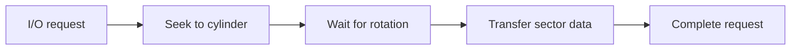
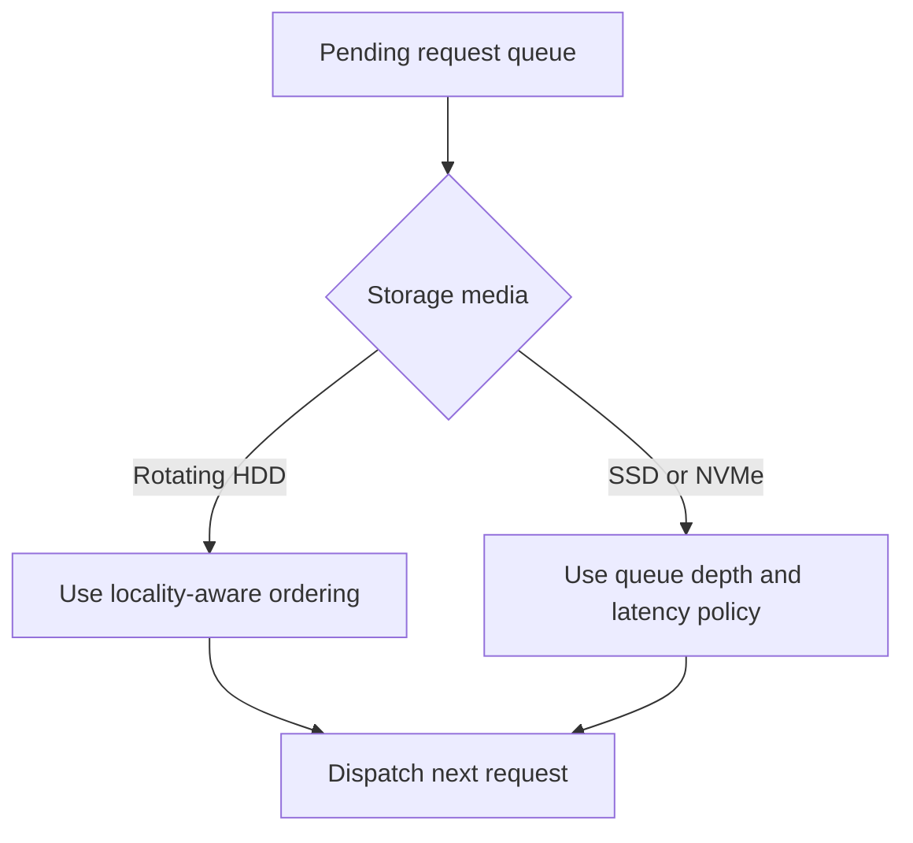
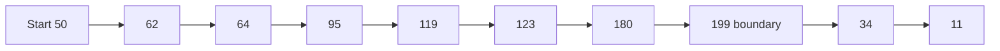
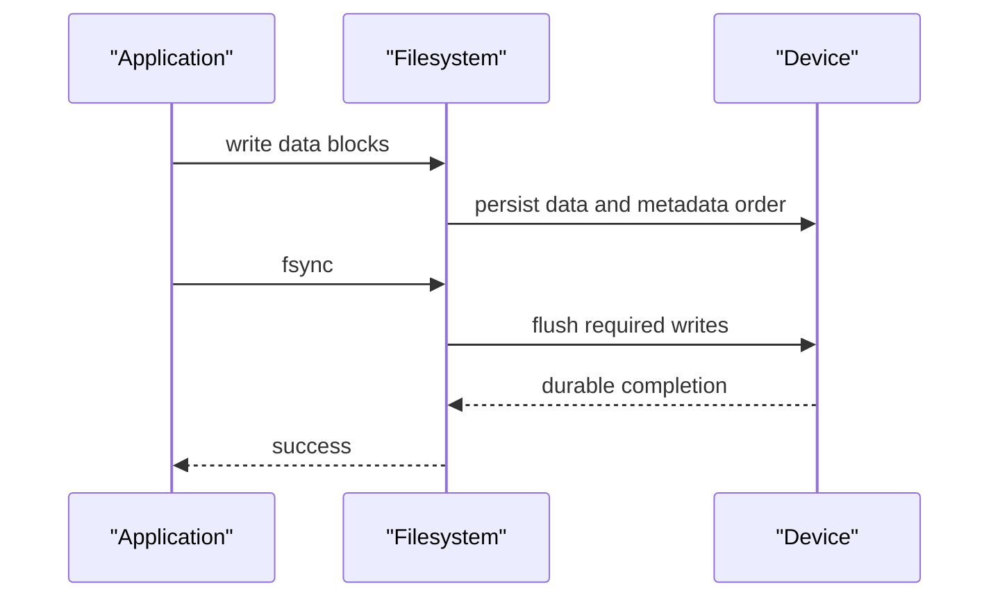

# Disk Scheduling & File Allocation

Disk scheduling orders queued I/O so a storage device can serve requests with acceptable throughput, latency, and fairness, while file allocation decides where a file's blocks live on that device.
The classic algorithms were shaped by rotating hard drives, but their trade-offs still teach queueing, locality, starvation, and the difference between a logical file and physical storage.
Interviewers ask about both topics because an efficient filesystem must coordinate allocation structure with the hardware and workload below it.

---

## 🟢 Beginner Level

### A rotating disk pays for movement and rotation

An HDD stores bits on rotating platters divided into tracks, sectors, and cylinders.
Its read-write head must move to the correct track before the desired sector rotates under it.
The controller then transfers bytes to or from its buffer.



Seek time is the time to move the actuator to the target track.
Rotational latency is the time waiting for the platter sector to arrive under the head.
Transfer time is the time to copy the requested bytes once positioned.

For a 7,200 RPM disk, one rotation takes $60{,}000 / 7{,}200 \approx 8.33$ ms.
Average rotational latency is about half a rotation, roughly 4.17 ms.
Seek time often ranges from a few to more than ten milliseconds depending on distance and hardware.

The operating system cannot always know exact physical placement because modern drives have caches and internal remapping.
It can still order outstanding requests to improve locality and avoid needless head movement.
The device firmware may reorder commands again unless the operating system or application requests ordering guarantees.

### Scheduling chooses the next request

Disk requests arrive from many processes.
The storage scheduler decides which pending request to dispatch next, subject to correctness constraints such as barriers and flushes.
It must balance several goals.

| Goal | Why it matters | Failure if ignored |
|---|---|---|
| throughput | serve more I/O per second | head moves excessively |
| latency | complete one request promptly | interactive stalls |
| fairness | bound request wait time | distant requests starve |
| ordering | preserve durable-write semantics | crash corruption risk |
| device fit | match HDD or SSD behaviour | scheduler adds useless work |

First-come, first-served is easy to explain and fair by arrival order.
Shortest seek time first prefers the closest cylinder.
SCAN and C-SCAN sweep in a direction to provide more predictable service across the disk.



No scheduling algorithm can make an overloaded device fast.
It chooses who waits and how much mechanical work is repeated.
Queue depth, request size, workload locality, and device cache policy matter as much as the named algorithm.

### Files are logical byte streams backed by blocks

Applications use a file as a numbered sequence of bytes.
The filesystem maps file offsets to allocation units such as blocks or extents.
The disk or SSD then maps logical block addresses to its own physical media layout.

```text
file offset -> filesystem block or extent -> logical block address -> device media
```

An allocation policy must support file growth, deletion, sequential reading, random access, and crash recovery.
Contiguous allocation stores a file in adjacent blocks.
Linked allocation stores a pointer to the next block with each block.
Indexed allocation stores a separate index of block pointers, often represented by an inode-style structure.

The physical details can change underneath the filesystem due to bad-block remapping and flash translation layers.
That is why a filesystem reasons in logical blocks rather than assuming a stable platter coordinate.

---

## 🟡 Intermediate Level

### Classic algorithms optimise different waiting patterns

**FCFS** serves requests in arrival order.
It has no starvation caused by reordering, but a random queue can move the head back and forth across the device.
It is often a useful baseline because its behaviour is transparent.

**SSTF** selects the request with the smallest seek distance from the current head position.
It usually lowers average movement under clustered load.
Requests far from a busy region can starve if nearer requests continue arriving.

**SCAN** moves in one direction, serving requests encountered, then reverses at a boundary.
It resembles an elevator and bounds wait by making repeated full sweeps.
**C-SCAN** serves only while moving in one direction, then returns to the start without serving requests, giving more uniform directional wait.

| Algorithm | Next request rule | Strength | Main weakness |
|---|---|---|---|
| FCFS | arrival order | simple and fair by arrival | poor locality |
| SSTF | nearest cylinder | low average seek | distant starvation |
| SCAN | sweep then reverse | bounded broad fairness | travels to boundary |
| C-SCAN | one-direction sweep | uniform service pattern | return travel cost |
| LOOK | reverse at last request | avoids empty edge travel | direction still favours timing |
| C-LOOK | circular between requests | avoids physical edge travel | logical wrap delay |

The formulas measure head movement, not full response time.
Rotational position, controller cache, request merging, and transfer size can change the real result.
Use the numbers to compare policies under identical assumptions, not to predict a production NVMe drive.

### Worked example: calculate a complete schedule

Assume a disk has cylinders numbered 0 through 199.
The head starts at cylinder 50.
The queued requests are `[95, 180, 34, 119, 11, 123, 62, 64]`.
Assume SCAN initially moves toward higher cylinder numbers.

For FCFS, the service path is:

$$
50 \rightarrow 95 \rightarrow 180 \rightarrow 34 \rightarrow 119 \rightarrow 11 \rightarrow 123 \rightarrow 62 \rightarrow 64
$$

The movement is:

$$
45 + 85 + 146 + 85 + 108 + 112 + 61 + 2 = 644\text{ cylinders}
$$

For SSTF, the nearest-first path is:

$$
50 \rightarrow 62 \rightarrow 64 \rightarrow 34 \rightarrow 11 \rightarrow 95 \rightarrow 119 \rightarrow 123 \rightarrow 180
$$

Its movement is:

$$
12 + 2 + 30 + 23 + 84 + 24 + 4 + 57 = 236\text{ cylinders}
$$

For SCAN moving upward, the path serves the high requests, reaches 199, reverses, and serves the low requests:

$$
50 \rightarrow 62 \rightarrow 64 \rightarrow 95 \rightarrow 119 \rightarrow 123 \rightarrow 180 \rightarrow 199 \rightarrow 34 \rightarrow 11
$$

Total movement is $149 + 188 = 337$ cylinders.
The first term is from 50 to the upper boundary; the second is from 199 to the final request at 11.



SSTF has the smallest movement in this finite queue.
It does not guarantee the best response time if requests near 50 continue arriving while cylinder 180 waits.
SCAN deliberately spends extra movement to give the request at 11 a bounded chance to be served.

### LOOK variants avoid travelling to an empty physical edge

SCAN goes to cylinder 0 or the maximum cylinder even if no request exists there.
LOOK reverses at the last pending request in its current direction.
In the example, LOOK goes only as far as 180 before reversing rather than visiting 199.

C-LOOK similarly serves in one direction until the last request.
It then logically jumps to the lowest pending request and begins a new upward sweep.
Whether the return movement counts in a model depends on whether the goal is total head travel or waiting time for serviced requests.

These policies were useful when the operating system had a meaningful view of cylinder geometry.
Modern disks may remap sectors and use firmware schedulers, so the OS sees a less direct relationship between logical block addresses and actuator position.
The conceptual fairness and locality trade-offs remain relevant to request queue design.

### Allocation maps logical file offsets to storage

Contiguous allocation records a start block and length.
Reading a sequential file is efficient because blocks are adjacent.
Growing a file can fail or require relocation when the following blocks are occupied.

Linked allocation stores a next-block pointer in each block.
It grows without requiring a large free run.
Random access is slow because reaching block $n$ requires following earlier links.

Indexed allocation stores pointers in an index block or inode.
It supports direct block lookup and flexible growth.
The index itself consumes space and may need multiple levels for very large files.

| Allocation method | Sequential access | Random access | Growth and fragmentation |
|---|---|---|---|
| contiguous | excellent | direct arithmetic | hard growth, external fragmentation |
| linked | good once started | $O(n)$ traversal | easy growth, pointer overhead |
| indexed | good | direct through index | flexible, metadata overhead |
| extents | excellent for runs | indexed extents | reduces metadata and fragmentation |

Extents are a modern compromise: one metadata record describes a contiguous run of blocks.
Filesystems such as ext4 use extent trees for efficient large-file allocation.
The filesystem may delay allocation to choose larger extents after it knows more about forthcoming writes.

---

## 🔴 Expert Level

### SSDs change the physical meaning of scheduling

SSDs and NVMe devices have no moving heads or rotational delay.
They translate logical block addresses through a flash translation layer, execute work across channels and dies, and manage erase-before-write constraints internally.
Seek-distance algorithms such as SSTF therefore do not model their latency well.

The host still needs I/O scheduling.
It may merge adjacent requests, preserve flush ordering, limit queue depth, isolate latency-sensitive work, and avoid one workload monopolising a device.
NVMe supports many hardware queues, so software often focuses on CPU locality and submission/completion scalability rather than one global elevator queue.

Flash has its own locality trade-offs.
Small random writes can increase write amplification when the controller must erase and rewrite larger erase blocks.
TRIM or discard informs the device that logical ranges are no longer needed, helping garbage collection under the device's policy.
Do not confuse discard with an immediate secure erase or a guaranteed instant performance recovery.

### Filesystem allocation and I/O ordering protect crash consistency

Writing data and metadata in the wrong order can leave a file pointing to uninitialized or stale blocks after a crash.
Journaling, copy-on-write metadata, checksums, and write barriers are different strategies for preserving a recoverable state.
An application `fsync` asks the operating system to make relevant changes durable before reporting success, though exact guarantees depend on the filesystem and hardware stack.



Scheduling must not reorder writes across a durability boundary just because doing so looks faster.
The block layer, filesystem, controller cache, and power-loss protection all affect the final guarantee.
Benchmarking only buffered write throughput can hide the cost of actual durable commits.

### Queuing dominates once a device is saturated

At low queue depth, a single request's device latency is prominent.
At high utilization, waiting in the queue can dominate service time.
This is why a scheduler that maximises throughput can harm tail latency for interactive reads.

Suppose an HDD serves an average request in 8 ms when idle, or about 125 requests per second.
Submitting work at 120 requests per second leaves little slack for bursts, seek variation, and metadata I/O.
At 124 requests per second, small variability can create a long queue even though the average nominal rate is below 125.
Rate limiting, separate queues, and workload priorities can protect latency-sensitive reads from bulk scans.

On an NVMe device, maximum IOPS may be far higher, but contention appears in CPU completion handling, firmware queues, write amplification, or shared PCIe bandwidth.
The same queueing principle applies: measure percentile latency under production-like concurrency, not just single-thread sequential throughput.

### Fragmentation has several layers

External fragmentation means free space exists but is split into small runs, making a large contiguous allocation difficult.
Internal fragmentation means an allocated block has unused tail bytes because allocation units are fixed size.
File fragmentation means one file's logical blocks map to many separate extents, which can hurt HDD sequential access and increase metadata work.

SSDs reduce the mechanical penalty of non-contiguous file extents.
They do not eliminate filesystem metadata overhead, flash write amplification, or the value of large sequential I/O.
Defragmentation can help a badly fragmented HDD workload but also produces heavy I/O and must be scheduled with care.

Monitor free-space distribution, extent count, write patterns, and latency before choosing maintenance work.
Blindly defragmenting a database volume can compete with its own allocation and journaling policy.
Capacity planning and timely deletion often prevent fragmentation better than a late repair operation.

### Measure the storage path before tuning an algorithm

An I/O symptom may originate above or below the scheduler.
Applications can create tiny synchronous writes, a filesystem can serialize metadata, a device can throttle thermal or garbage-collection work, and a shared host can saturate the controller queue.
Changing a named scheduler without locating the queue only changes one hypothesis.

Start with request rate, queue depth, average request size, read/write mix, and percentile latency.
Compare application-visible latency with block-device service time.
A high application wait with low device utilisation can indicate a lock, page-cache writeback throttle, filesystem journal wait, or a connection pool rather than physical media saturation.

On Linux, tools such as `iostat`, `pidstat`, `fio`, and block tracing can provide complementary evidence.
Use production-safe collection and avoid running destructive benchmarks against a live volume.
Benchmark on representative hardware because cloud storage, virtual disks, RAID controllers, and local NVMe expose different queueing behaviour.

Request merging is useful when neighbouring logical block ranges can be handled together.
It reduces command overhead and can improve sequential transfer efficiency.
It must not violate flush, barrier, or application ordering requirements.

Writeback batching changes latency shape.
Buffered writes may return quickly and later cause a burst of dirty-page writeback that competes with reads.
Direct I/O avoids some cache effects but imposes alignment and application-buffer management constraints.
Neither is inherently faster without a workload-specific reason.

RAID and distributed storage add further scheduling layers.
RAID 5 or 6 small writes may incur read-modify-write amplification.
A network block device adds transport queues and replication acknowledgement delays before data is durable.
The host scheduler sees only part of the total service path.

An effective tuning experiment changes one variable, holds workload generation stable, and records throughput plus p50, p95, and p99 latency.
It includes failure semantics in acceptance criteria, especially for databases and filesystems.
A configuration that improves average writes but weakens durable ordering is not a safe performance improvement.

Use capacity headroom for burst absorption.
Operating constantly near maximum queue occupancy makes small workload changes create nonlinear tail-latency growth.
Admission control and workload isolation can produce a better user experience than pushing every request into one saturated storage queue.

Finally, remember that the filesystem cache can hide an I/O problem until memory pressure changes.
Repeat measurements after warm and cold cache conditions where the production workload has both.
Document the device model, firmware, filesystem mount options, kernel version, and queue settings with any benchmark result.
This provenance makes later regressions explainable rather than anecdotal.
It also prevents a benchmark from being copied to an incompatible storage class.
Treat device replacement as a new performance experiment, not a transparent hardware swap.
Validate both steady-state load and recovery behaviour after maintenance or upgrades.
Storage tuning remains a systems property across application, kernel, and hardware layers.

### Common Misconceptions

1. **“SSTF is always the fastest scheduler.”** It often reduces movement for a fixed queue, but it can starve distant requests under a continuing local workload. Tail latency and fairness may matter more than average seek distance.
2. **“Disk scheduling is irrelevant on SSDs.”** Seek ordering is less relevant, but queue depth, flush ordering, request merging, fairness, and device parallelism still need policy. SSD firmware also has its own internal scheduling and garbage collection.
3. **“A file is one contiguous region of disk.”** A filesystem may store its blocks in many extents and the device may remap logical blocks again. The file abstraction intentionally hides those layers.
4. **“`fsync` is just a performance hint.”** It is a request for durable completion at the filesystem interface and is central to crash-consistent applications. The real guarantee depends on the whole storage stack, including write-cache behaviour and power-loss protection.
5. **“Linked allocation has no fragmentation problem.”** It avoids external free-space fragmentation for growth, but a file can still be physically scattered and expensive to traverse. Pointer overhead and poor random access are significant trade-offs.

### Interview Questions

**Q1. What are seek time, rotational latency, and transfer time?** `[easy]`

Seek time moves an HDD head to the target track, rotational latency waits for the desired sector, and transfer time copies data once positioned. On a 7,200 RPM disk, average rotation wait is roughly 4.17 ms. SSDs remove head movement and rotation but retain transfer, queueing, and controller costs.

**Q2. How does FCFS differ from SSTF?** `[easy]`

FCFS serves requests in arrival order, giving simple fairness but potentially large head movement. SSTF chooses the request nearest the current head, often lowering average movement. SSTF can starve a far request when nearer requests continuously arrive.

**Q3. What is the difference between SCAN and C-SCAN?** `[easy]`

SCAN serves requests while sweeping in one direction and then serves requests on the reverse sweep. C-SCAN serves only in one direction and returns to the beginning before starting another service sweep. C-SCAN produces a more uniform direction-based wait pattern but pays a wraparound travel cost.

**Q4. Why does a filesystem need an allocation method?** `[easy]`

Applications address a file by byte offset, but the storage device accepts logical block addresses. The allocation method maps file offsets to blocks or extents and records what belongs to the file. It must support growth, deletion, random access, and recovery after crashes.

**Q5. Why can LOOK outperform SCAN?** `[medium]`

LOOK reverses at the last pending request rather than travelling to a physical disk boundary with no work. That avoids unnecessary seek distance for the current queue. It does not guarantee a lower wait for every future arrival, because workload timing still changes the next sweep.

**Q6. How is total head movement calculated in a scheduling example?** `[medium]`

List the service path from the starting cylinder through every request and sum the absolute difference of adjacent positions. Include boundary travel for SCAN or C-SCAN when the algorithm definition requires it. The result compares mechanical movement, not full latency because rotation and transfer time are excluded.

**Q7. Compare contiguous, linked, and indexed allocation.** `[medium]`

Contiguous allocation makes sequential and random access simple but makes growth and external fragmentation difficult. Linked allocation grows easily but requires traversal for random access and stores pointers with data. Indexed allocation supports direct lookup through metadata but spends space and may need multi-level indexes for very large files.

**Q8. Why are classic cylinder schedulers a poor model for NVMe?** `[medium]`

NVMe has no actuator or rotational position, so nearest-cylinder distance does not predict service time. The device has internal parallelism and a flash translation layer, while the host uses many queues. Queue depth, fairness, write behaviour, CPU locality, and flush semantics are more relevant scheduling concerns.

**Q9. What does `fsync` protect against?** `[medium]`

It asks the operating system to persist relevant file changes before reporting success, reducing the chance that acknowledged data remains only in volatile caches. Correct filesystems and hardware ordering must honour that durability boundary. It does not make an application-level multi-file update atomic unless a higher-level protocol provides that property.

**Q10. What are extents and why do filesystems use them?** `[medium]`

An extent describes a contiguous run of blocks with one metadata record. Extents reduce pointer overhead and make large sequential files efficient while still allowing a file to have several runs. Delayed allocation can help a filesystem choose larger extents, but crash and space-pressure handling must remain correct.

**Q11. A backup job causes interactive reads on an HDD to have severe tail latency. What would you examine?** `[hard]`

Measure queue depth, request sizes, scheduler policy, and the read/write mix to confirm that bulk sequential or random backup I/O is monopolising the device. Separate the workloads by priority or queue, rate-limit the backup, and use an appropriate scheduler or storage tier. Do not rely only on average throughput, because a good bulk rate can coexist with unacceptable interactive wait time.

**Q12. A team chooses SSTF because it has the lowest movement in a test queue. What risk must they address?** `[hard]`

They must address starvation for requests far from the current busy region, especially if work keeps arriving near the head. Add aging, a sweep-based policy, or a maximum wait policy when fairness is required. Re-test under a continuous arrival model, because a finite static queue hides the starvation behaviour.

**Q13. A database claims a transaction committed but loses recent records after power loss. Which storage layers do you investigate?** `[hard]`

Inspect the database's write-ahead log and fsync configuration, filesystem ordering, block-layer flush handling, device volatile write cache, and power-loss protection. An acknowledged commit must cross each relevant durability boundary before failure. Increasing request reordering performance without preserving flush semantics can make the failure more likely, not less.

**Q14. A growing file is slow to read sequentially on an HDD. How can allocation explain it?** `[hard]`

Repeated growth may have scattered the file across many non-adjacent extents, forcing head movement between runs. Inspect extent count, free-space fragmentation, and the write pattern rather than assuming the application read loop is at fault. Preallocation, extent-friendly batching, and carefully scheduled maintenance can improve locality, while an SSD may show a smaller mechanical gain.

### Further Reading

- [Linux kernel block layer documentation](https://docs.kernel.org/block/index.html) introduces the Linux block I/O layer and request handling.
- [Linux `fsync(2)` manual](https://man7.org/linux/man-pages/man2/fsync.2.html) documents durability requests and error handling.
- [Linux kernel ext4 documentation](https://docs.kernel.org/filesystems/ext4/index.html) covers ext4 allocation, journaling, and filesystem design.
- [NVM Express base specification](https://nvmexpress.org/specifications/) provides the primary specification family for NVMe queue-based devices.
